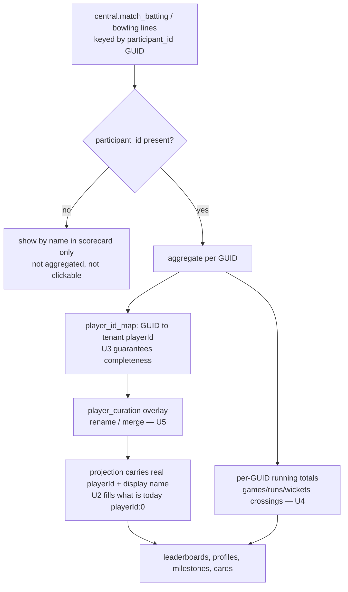

# Central Stats Correctness (Phase 1) - Plan

This plan implements **Phase 1** of the multi-phase overhaul defined in the origin contract (docs/plans/2026-07-01-001-fix-ovation-platform-hardening-plan.md). Phases 2–5 stay in that contract and get their own plans when reached. Product Contract unchanged: this plan advances origin R1–R4.

---

## Goal Capsule

- **Objective:** Make digital-era stats trustworthy for every central-data club — restore correct clickable player identity, stop the impossible-merge bug, extend milestones to career crossings, and give clubs a curation tool to correct identity where the data is ambiguous.
- **Product authority:** Ash (reviews outcomes, approves phases).
- **Execution profile:** Deep. Six units. Central database is READ-ONLY from the app — every fix writes only to app tables. OpenAPI-first: spec change → `pnpm --filter @workspace/api-spec run codegen`, never hand-edit generated files.
- **Stop conditions:** A unit that would write to the central DB, blend juniors with seniors, or read another tenant's curation is a hard stop — surface it, don't work around it.
- **Blocker (non-gating):** U1 (diagnostic) needs Ash to run one read-only query against the central database (only he holds `CENTRAL_DATABASE_URL`). It runs in parallel; only U5's split behavior waits on its result.

---

## Product Contract

### Summary

For central-data clubs, resolve every PlayHQ-ID-backed player to a correct, distinct, clickable career (fixing dead links and the "M Brown" merge), derive career-crossing milestones, and add a per-club curation tool (rename + merge now, split gated on the diagnostic). Halls Head (native data) behavior is unchanged.

### Problem Frame

A code trace confirmed the mechanism behind the broken central-club stats. The central leaderboard query already groups correctly by PlayHQ `participant_id` (GUID), but it hard-codes `playerId: 0` on every row — it never reads the `player_id_map` crosswalk that already exists (`lib/db/src/central-queries.ts` ~line 363–373). Two consequences follow: player links are dead (no real ID to link to), and any consumer or UI that falls back to grouping by display name re-merges different people who share an initial+surname. A single "M Brown" row with 214 innings is therefore either that downstream name-merge, or one GUID that covers several real people in the source data — which only a curation *split* can fix. The crosswalk is minted at provisioning but has no backfill for existing tenants, and central milestones today cover only centuries and five-fors.

### Requirements

Advancing origin R1–R4 (see origin contract for full text):

- R1. Every central club's GUID-backed players resolve to a correct, distinct, clickable career via the crosswalk.
- R2. Aggregation stays keyed on GUID; ID-less lines show by name in scorecards but never roll into a career or become clickable; distinct same-name GUIDs never merge.
- R3. Club admins can rename and merge central players within their own club (split gated on U1); curation is tenant-scoped and writes only to app tables.
- R4. Central clubs get career-crossing milestones (games/runs/wickets) plus centuries and five-fors; debuts and hat-tricks stay native-only; Halls Head keeps its full set.

### Key Decisions

- **Fill `playerId` from the existing crosswalk rather than re-architect identity.** The GUID grouping is already correct; the defect is an unfilled ID. Resolving it is the highest-leverage fix and unblocks links and de-merge together.
- **Guarantee crosswalk completeness before relying on it.** Backfill existing tenants and cover post-provision participants, so no read path meets an unmapped GUID.
- **Curation ships rename + merge first; split is gated on U1.** Rename and merge are tractable against the crosswalk. Split (one GUID → several real people) needs per-match reassignment and only matters if the diagnostic shows source-data merges are common.
- **Central curation writes to a new app-side table, never the central DB.** Central data is read-only; corrections are a tenant-scoped overlay consulted on read.

### Acceptance Examples

- AE1. Covers R1. Given a central club leaderboard, when a GUID-backed player renders, then the row carries a non-zero `playerId` matching `player_id_map` and the profile link resolves.
- AE2. Covers R2. Given two distinct GUIDs both named "M Brown", when the leaderboard renders, then two distinct rows with distinct `playerId`s appear — never one merged 214-innings career.
- AE3. Covers R4. Given a central player reaching their 200th game, then a games career-crossing milestone appears; a hat-trick produces none; centuries and five-fors still appear. Given Halls Head, then the full milestone set is unchanged.
- AE4. Covers R3. Given a club admin renames or merges a central player, then the correction shows across that club's leaderboard, profile, and cards, and no other club is affected.

---

## High-Level Technical Design

Central-read identity resolution pipeline (the seam this plan repairs and extends):

Prose remains authoritative where it and the diagram differ.

---

## Implementation Units

### U1. Diagnose the "M Brown" identity collision

- **Goal:** Quantify, for pilot central clubs (Mandurah #3, White Knights Baldivis #68), whether impossible careers come from one GUID covering many real people, many GUIDs sharing a display name, or NULL-participant lines — to size U5's split work.
- **Requirements:** R2, R3 (sizing)
- **Dependencies:** none
- **Files:** `scripts/src/diagnose-central-identity.ts` (new, read-only)
- **Approach:** Read-only central query grouping `central.match_batting` by `participant_id` for a club id; flag GUIDs with implausible innings counts; separately list GUIDs sharing a `display_name`; count NULL-participant lines. Console/CSV summary. Run by Ash with `CENTRAL_DATABASE_URL`.
- **Patterns to follow:** `lib/db/src/central.ts` (read-only pool, never write); `scripts/src/compare-central-leaderboard.ts` (proof-harness script shape).
- **Execution note:** Run before finalizing U5's split behavior.
- **Test scenarios:** Test expectation: none — read-only investigative script, no app behavior change.
- **Verification:** Report produced; per-club cause classified; split-curation need for U5 sized.

### U2. Fill real player IDs on central reads

- **Goal:** Central-read projections that currently emit `playerId: 0` resolve the tenant's `player_id_map` so every GUID-backed player gets a real, distinct, clickable id.
- **Requirements:** R1, R2
- **Dependencies:** U3
- **Files:** `lib/db/src/central-queries.ts` (centralGradeLeaderboard ~363–373 and any sibling projection returning `playerId: 0`, e.g. centuries/five-for lists); `artifacts/api-server/src/routes/grades.ts`, `artifacts/api-server/src/routes/records.ts` (pass tenant/crosswalk); frontend consumers that group by name (dashboard/leaderboard components under `artifacts/cricket-club/src/`) switch to keying on `playerId`.
- **Approach:** Resolve a GUID→playerId map from `player_id_map` for the tenant (in the query given tenantId, or in the route post-query), populate `playerId`. With U3 guaranteeing coverage, every aggregated GUID maps; treat any unmapped GUID deterministically (surface, not silent 0).
- **Patterns to follow:** `artifacts/api-server/src/routes/players.ts:75-84` and `:264-291` (already map GUID↔int correctly via the crosswalk).
- **Test scenarios:**
  - Covers AE1. A central leaderboard row for a crosswalked GUID returns its `player_id_map` `playerId` (non-zero) and the profile link resolves.
  - Covers AE2. Two distinct GUIDs with display name "M Brown" return two rows with distinct `playerId`s — never merged.
  - Edge: a NULL-participant line stays excluded from leaderboard/career aggregation and is not clickable.
  - Error: a GUID absent from the crosswalk is handled deterministically (mapped via U3 or explicitly flagged), never silently `0`.
- **Verification:** No central read returns `playerId: 0` for a crosswalked player; player links resolve on a central tenant; Halls Head unchanged.

### U3. Crosswalk coverage: backfill and ongoing minting

- **Goal:** Guarantee every central participant a club fielded has a `player_id_map` row — backfill existing tenants and cover participants added after provisioning.
- **Requirements:** R1
- **Dependencies:** none
- **Files:** `scripts/src/backfill-player-id-map.ts` (new); optionally extract the minting loop from `lib/db/src/provision.ts` (~145-163) into a shared helper reused by both.
- **Approach:** Enumerate `centralClubParticipants` per existing central tenant; idempotently insert missing rows, continuing the per-tenant `playerId` sequence. Reuse provisioning's minting logic so both paths agree.
- **Patterns to follow:** `lib/db/src/provision.ts:145-163` (idempotent mint); unique `(tenantId, participantId)` / `(tenantId, playerId)` constraints in `lib/db/src/schema/player_id_map.ts`.
- **Test scenarios:**
  - Backfill on a tenant with no crosswalk rows mints one per participant; re-run is idempotent (zero new rows, no unique-constraint violation).
  - A new participant appearing after provision gets a fresh `playerId` continuing the per-tenant sequence.
  - Integration/isolation: backfilling tenant A never writes tenant B rows.
- **Verification:** After backfill, crosswalk row count for a tenant equals its club's central participant count; re-run mints zero.

### U4. Central career-crossing milestones

- **Goal:** For central tenants, derive games/runs/wickets career crossings alongside the existing centuries and five-fors; debuts and hat-tricks stay native-only.
- **Requirements:** R4
- **Dependencies:** U2, U3
- **Files:** `lib/db/src/central-queries.ts` (extend `centralMilestones` ~1982 to accumulate per-participant running totals over central batting/bowling lines and emit tier crossings); `artifacts/api-server/src/routes/milestones.ts` (`buildCentralMilestones` ~293 wires them in).
- **Approach:** Per participant, order central lines chronologically (season then match), accumulate totals, detect `prev < tier <= running` crossings, emit milestone shapes carrying the crosswalk `playerId`. Reuse existing tier config.
- **Patterns to follow:** native `appendCareerCrossings` (`artifacts/api-server/src/routes/milestones.ts:463-578`); tiers in `milestones.ts:22-24` and `artifacts/api-server/src/lib/milestone-detector.ts:6-11`; `milestoneEventsTable` shape (`lib/db/src/schema/social_cards.ts:331-345`).
- **Test scenarios:**
  - Covers AE3. A central player reaching their 200th game emits a games crossing; a hat-trick emits none; centuries/five-fors still emit.
  - Crossings attribute to the correct match/season (chronological ordering).
  - Tiers honor `milestoneBoardSettings` thresholds.
  - Native (Halls Head) milestones are byte-for-byte unchanged (full set intact).
- **Verification:** Central milestone board shows career crossings + centuries + five-fors, no debut/hat-trick cards; native tenant unchanged.

### U5. Per-club central player curation (rename + merge; split gated on U1)

- **Goal:** A tenant-scoped tool to correct central identity — rename display name and merge multiple GUIDs into one profile; split scoped by U1's finding.
- **Requirements:** R3
- **Dependencies:** U1 (sizes split), U2, U3
- **Files:** `lib/db/src/schema/player_curation.ts` (new: `tenantId`, `participantId`, nullable `overrideDisplayName`, nullable merge target); `lib/api-spec/openapi.yaml` + codegen (new curation operations under the `players` tag); `artifacts/api-server/src/routes/players.ts` or a new curation route (apply curation on central read paths — list, detail, leaderboard, milestones); `artifacts/cricket-club/src/pages/admin-players.tsx` (extend) or new `admin-player-curation.tsx`.
- **Approach:** Central read paths consult the curation overlay: apply display-name override; collapse merged GUIDs onto one keeper `playerId`. Rename = set `overrideDisplayName`. Merge = point several `participantId`s at one crosswalk `playerId`. Split = the hard case; if U1 shows it's material, add a scoped sub-unit for per-season/per-match reassignment; otherwise record as deferred within Phase 1. All writes hit app tables only.
- **Patterns to follow:** `honourBoardOverridesTable` (`lib/db/src/schema/honour_boards.ts:29-49`) for a tenant-scoped per-player overlay; native merge endpoint (`artifacts/api-server/src/routes/players.ts:820-892`) and its `admin-players.tsx` UI for UX parity; `tenantIdColumn()` helper; OpenAPI-first codegen flow.
- **Execution note:** Finalize split behavior only after U1's report.
- **Test scenarios:**
  - Covers AE4. Rename shows the new display name on that club's leaderboard/profile/cards only; other tenants unaffected.
  - Merge: two GUIDs become one profile with combined stats and one clickable `playerId`; the leaderboard shows a single row.
  - Isolation: curation rows are tenant-scoped; tenant B cannot read or edit tenant A curation (extend isolation tests).
  - Invariant: curation never issues a write against the central DB.
  - Split: if in scope per U1, one GUID's lines reassign across profiles correctly; otherwise the deferral is recorded.
- **Verification:** An admin can rename and merge central players, corrections reflect across site and cards, and everything stays scoped to their club.

### U6. Central correctness test coverage

- **Goal:** Add the missing central-vs-local consistency and isolation tests guarding R1–R3.
- **Requirements:** R1, R2, R3
- **Dependencies:** U2, U3, U5
- **Files:** `artifacts/api-server/src/routes/central-stats-consistency.test.ts` (new); extend `artifacts/api-server/src/routes/tenant-isolation.test.ts` for curation.
- **Approach:** On a central-tenant fixture, assert leaderboard rows carry non-zero distinct `playerId`s, two same-name distinct GUIDs stay separate, directory == detail == sum-of-grades for a central player, and curation is tenant-scoped.
- **Patterns to follow:** `artifacts/api-server/src/routes/senior-games-consistency.test.ts`, `player-totals-consistency.test.ts`, `tenant-isolation.test.ts`.
- **Test scenarios:** This unit is the tests — cover AE1, AE2, AE4, plus the directory/detail/grade-sum invariant for a central player.
- **Verification:** Suite passes; violating any invariant fails the run.

---

## Verification Contract

- Typecheck: `pnpm run typecheck`.
- API tests (vitest): `pnpm --filter @workspace/api-server run test` — must stay green, including the new `central-stats-consistency.test.ts` and extended `tenant-isolation.test.ts`.
- After any `openapi.yaml` change (U5): `pnpm --filter @workspace/api-spec run codegen`, then typecheck — generated files are never hand-edited.
- Manual proof: on a central tenant (Mandurah #3 or WK #68), leaderboard player links resolve, no impossible merged career remains for renamed/merged players, and the milestone board shows career crossings.

## Definition of Done

- Origin R1–R4 satisfied for central tenants; Halls Head native behavior unchanged.
- No central read returns `playerId: 0` for a crosswalked player; distinct same-name GUIDs never merge.
- Crosswalk backfill run for existing central tenants; re-run is idempotent.
- Curation (rename + merge) works and is tenant-scoped; split resolved or explicitly deferred per U1.
- New consistency + isolation tests pass; full API suite green; typecheck clean.
- Central DB never written; OpenAPI-first workflow honored.

## Sequencing

U1 (Ash-run, parallel) ‖ U3 → U2 → U4; U5 after U1/U2/U3; U6 after U2/U3/U5.

## Deferred to Follow-Up Work

- Phases 2–5 of the origin contract (brand leaks, isolation gaps, social-studio hardening, UI refresh) — planned separately when approved.
- Split curation beyond what U1 shows is needed, if the source-data merge is rare.
