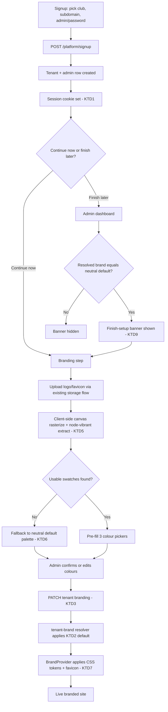

# Tenant Onboarding Branding Wizard & Landing Page Requirements - Plan

## Goal Capsule

- **Objective:** Ship a self-serve branding step in the signup wizard (logo, auto-suggested colours, favicon), enforce Free-vs-Pro custom-domain gating, fix the two bugs blocking the immediate-branding path, and hand Design a structured UI/UX requirements brief for the landing page and new screens.
- **Authority hierarchy:** This Product Contract > repo conventions (`CLAUDE.md`, OpenAPI-first workflow, juniors-isolation and tenant-isolation invariants) > implementer judgment on undocumented details.
- **Stop conditions:** Surface a blocker rather than proceeding if a change would require Stripe/billing work, a multi-admin/invite flow, or touching the one-club-centric `matches` schema — all explicitly deferred.
- **Execution profile:** `code`, Deep depth, two phases (Foundation fixes, then Branding UX + Design handoff). U4 has no dependency on U1-U3 and can land independently, in parallel with either phase, rather than gating on the rest of Phase 1.
- **Tail ownership:** Standard PR-per-phase (or per-unit, at reviewer discretion) landing; no non-standard rollout steps.

---

## Product Contract

### Summary

Self-serve onboarding gains a branding step for volunteer club admins; a Free vs Pro distinction (Pro unlocks custom domain) is enforced through the existing three-tier `free`/`club`/`pro` entitlements system, whose `club` tier is pre-existing and unaffected by this plan. The landing page gains pitch/pricing/proof/differentiation content. Two pre-existing bugs are fixed as prerequisites: signup does not currently authenticate the admin, and a brand-less new tenant currently inherits Halls Head's exact colours instead of a neutral default — the fix for the latter reuses the design and code already written on the unmerged `fix/phase2-brand-leaks` branch (commit `d51b824`) rather than reinventing it; see U2.

### Problem Frame

The existing signup wizard (club picker → subdomain/admin/password → `POST /platform/signup`) already provisions a tenant and its first admin, but stops there — there is no way for that admin to set their own logo or colours short of the super-admin-only console, and the public site they land on silently wears Halls Head's gold-and-brown identity until someone intervenes. This is pre-launch: no external tenant exists yet besides Halls Head, so the stakes are protecting Halls Head's own appearance from regression and closing the gap before the first real dogfooded signup, not undoing live user-facing damage. Given the success criterion is Ash dogfooding a real club (e.g. Halls Head itself, or another PCA club) through the whole flow before any external launch, the plan treats "an unbranded club looking like a different club" as the highest-priority defect to fix, on par with the missing session cookie that blocks the "continue straight into branding" path entirely. That dogfooding pass validates flow correctness (does the wizard work end to end); it does not exercise multi-tenant concurrency, isolation, or abuse resistance — those are covered separately by this plan's own automated test scenarios (U1, U3), not by the single walkthrough. The landing page's job — explaining the pitch, pricing, and differentiation before a volunteer ever reaches signup — is currently unaddressed and is scoped here as content additions plus a requirements handoff, not a rebuild.

### Requirements

**Onboarding & authentication**

- R1. Signing up authenticates the admin immediately, so they can continue straight into branding (or any authenticated screen) without a separate login step.
- R2. After signup, the admin chooses to continue directly into branding or defer it; deferring lands them on the admin dashboard with a visible "finish setting up your club" prompt.

**Branding**

- R3. A club admin sets their own logo, favicon, and three brand colours from a self-service settings screen, separate from the super-admin-only tenant console.
- R4. Uploading a logo auto-suggests all three brand colours; the admin can override any of them before saving.
- R5. A tenant with no brand data set resolves to a neutral platform default, never to Halls Head's colours.
- R6. The tenant's favicon updates in the browser tab once branding is set.

**Tiering**

- R7. Custom domain stays a Pro-tier-only capability, enforced independent of the currently-dormant global billing flag.
- R8. A Free-tier admin who wants a custom domain sees a clear upgrade prompt instead of a silently blocked or broken control.

**Landing page**

- R9. The public landing page states the value proposition, shows Free/Pro pricing, includes a working-example/social-proof reference, and addresses competitive differentiation (copy itself may stay placeholder-level).

### Scope Boundaries

**Deferred for later:** Stripe/billing checkout implementation; multi-admin/invite flow; full landing page structural redesign; path-based slug URLs; server-rendered per-tenant OG/twitter meta tags (a pre-existing, already-documented SSR gap this plan does not change); broader tiered-billing enforcement beyond custom domain.

**Outside this plan:** final visual design of the landing page and branding screens, and the actual competitive-differentiation copy — both are Design/marketing deliverables this plan's UI/UX Requirements section feeds into, not code this plan ships. Per-tenant background image and card-rendering brand defaults are also outside this plan — they're separate, broader scope already implemented (unmerged) on `fix/phase2-brand-leaks`; U2 reuses that branch's neutral-default-brand design but does not pull in its background/card-rendering units.

### Dependencies / Assumptions

- `BILLING_ENABLED` stays off for the pilot; custom-domain gating extends the existing entitlements system via a narrow per-feature override rather than bypassing it (see KTD4). Gating a hosting feature (custom domain) this way is a distinct decision from the scraped-data commercialisation stance in `CLAUDE.md`'s Data Governance section — this plan does not touch data licensing or pricing of the underlying stats/history data.
- Halls Head (tenant id 1) keeps resolving to its existing brand unchanged.
- The `fix/phase2-brand-leaks` branch (commits `d51b824`, `4190153`, `1c05a78`) and its origin plan (`docs/plans/2026-07-01-003-fix-brand-leaks-plan.md`) remain unmerged; U2 reimplements (or cherry-picks) that branch's U1 commit rather than waiting for it to land, since this plan cannot assume it will merge first.

---

## Planning Contract

### Key Technical Decisions

- **KTD1 — Fix signup auto-login as a prerequisite bug, not new scope.** `POST /platform/signup` never sets a session cookie, so the client's redirect to `/admin` lands unauthenticated. Mint the session using the just-inserted admin row's own id — not a tenant id derived from `getTenantId(req)` on the signup request itself, since signup is served from the apex/platform host, which resolves to platform/fallback mode rather than the new tenant's subdomain. Reuse `routes/auth.ts`'s `encodeSession` mechanics, but the cookie itself must be scoped so the browser sends it on the redirect target: `SESSION_COOKIE_OPTS` today sets no `domain`, so a cookie set while responding on the apex host will not be sent on the following navigation to `{slug}.{apex}/admin` — a different host. Set the cookie's `domain` to the shared apex (e.g. `.{PLATFORM_BASE_DOMAIN}`) so it's valid across every `*.{apex}` host, rather than only reusing `SESSION_COOKIE_OPTS` unchanged. Correct the OpenAPI summary text that currently implies session auto-login already happens. Signup also needs its own rate-limit policy: it currently inherits `loginRateLimiter`, whose `skipSuccessfulRequests: true` is tuned for login's failed-attempt threat model, not signup's — every _successful_ signup call provisions a real tenant, admin, and (post-fix) session, so an unbounded number of successful signups from one IP would otherwise go unthrottled. Once auto-login lands, guessing an open club/slug also yields a live authenticated session in one shot rather than just an unbranded tenant, so the two unauthenticated discovery endpoints (`/platform/available-clubs`, `/platform/slug-available`) get the same rate limiter as signup rather than staying unthrottled — this is a small addition to the same unit, not a separately-owned decision left open.
- **KTD2 — Reuse the neutral-default-brand fix already designed and coded on `fix/phase2-brand-leaks` (commit `d51b824`), rather than a new `tenantId === 1` branch.** That branch's approach needs no tenant-id special case at all: `lib/scorecard/src/brand.ts`'s `DEFAULT_BRAND` becomes neutral (a placeholder logo + slate colours), a separate `HALLS_HEAD_BRAND` constant holds Halls Head's real values, and a one-time seed script writes those real values into Halls Head's own `clubs`/`tenants` row. `tenant-brand.ts`'s `buildTenantBrand()` cascade (`club?.X ?? tenant?.X ?? DEFAULT_BRAND.X`) is untouched in shape — it now naturally resolves Halls Head's own real brand from its seeded row, and only a genuinely brand-less tenant reaches the now-neutral `DEFAULT_BRAND`. This avoids inventing a new constant name (there is no collision with the existing `DEFAULT_BRAND`) and avoids threading a tenant-id parameter into a function that today is a pure function of row data only.
- **KTD3 — Extend the existing `tenant.ts` route file with a `PATCH`, not a new file, accepting that this changes the file's character.** `tenant.ts` today holds only public, unauthenticated GET routes — it is not yet a full-CRUD resource file the way `honour-boards.ts`/`awards.ts`/`caps.ts` are, so this decision deliberately turns it into one rather than simply following an existing shape. The alternative (a sibling admin-only file) was considered and rejected because it would split brand-read and brand-write across two files for the same resource; keeping both in `tenant.ts` is still preferred, on that basis, not because the file already looks like this. Gate the new handler with `requireAdmin` + `getTenantId(req)` (mirroring the existing super-admin `platform-admin.ts` PATCH pattern), scoping the `WHERE` clause to `getTenantId(req)`. The request schema must declare **only** the seven cosmetic fields (`name`, `shortName`, `logoUrl`, `faviconUrl`, `primaryColour`, `secondaryColour`, `tertiaryColour`) — `plan` and `customDomain` must not exist as properties on this schema at all (not merely unused), so the generated Zod validator structurally cannot admit them regardless of how the handler is later refactored. The handler must build its `updates` object by naming each allowed field individually, never by spreading `req.body` or the parsed body wholesale (mirroring `platform-admin.ts`'s existing field-by-field construction, not a shortcut). `logoUrl`/`faviconUrl` accept only paths already returned by the existing object-storage upload flow (`useUpload`'s `objectPath`), not arbitrary client-supplied URLs, so no separate URL-allowlist validation is needed beyond what that pipeline already returns.
- **KTD4 — Custom-domain gating extends the existing entitlements system via a per-feature override, not a parallel mechanism.** Building a separate `tenantCanUseCustomDomain(plan)` helper alongside the existing `Feature`/`PLAN_FEATURES`/`requireEntitlement` system would fragment tenant-gating into two competing sources of truth that must be kept in sync by hand. Instead, add a small override set inside `lib/entitlements.ts` (e.g. features that must enforce regardless of the `BILLING_ENABLED` kill-switch) so `entitlementsFor(plan)` resolves `customDomain` from `PLAN_FEATURES[plan]` even while `billingEnabled()` is false, instead of the current unconditional `ALL_ON` bypass. `requireEntitlement`, mounted as router-level middleware the normal way, resolves the tenant's plan from the stored row and cannot see the current request's body — that's sufficient for the common case (customDomain set alone), but not for a request that sets `plan` and `customDomain` together in one call. For that composite case, the write handler (not router middleware) must evaluate entitlement against the _effective_ plan (`updates.plan ?? row.plan`) by calling the same underlying check as a plain function inside the handler, after the body is parsed — one shared, exported check used both ways (as middleware for simple reads, as a direct call for the composite write), not two independent implementations of the rule. `curation`/`socialStudio`/`clubroomTv` stay outside the override set and remain fully dormant behind the global flag as today. Note that `platform-admin.ts`'s existing super-admin PATCH has no entitlement check on `customDomain` at all today — adding one there is a real behavior change to a live endpoint, not a formalization of existing behavior, and must preserve the super-admin's ability to set `plan` and `customDomain` together in one call (the exact composite case above) since that's how a super-admin grants Pro access in practice.
- **KTD5 — Colour extraction runs client-side via `node-vibrant`'s browser build against a canvas-rasterized image.** No server-side image-processing library exists in `api-server` today; rasterizing in the browser (via an off-screen canvas) handles both raster uploads and SVG logos without adding a server dependency or changing the existing upload flow.
- **KTD6 — Graceful fallback when extraction yields no usable swatches.** Monochrome, near-white/near-black, or transparent-background logos can return mostly-null swatches from `node-vibrant`; fall back to the KTD2 neutral palette and tell the admin colours couldn't be detected, rather than passing empty values into the colour pickers.
- **KTD7 — Favicon served via client-side head injection.** Mirrors the existing pattern where `BrandProvider` already sets `document.title`; accepts the same known limitations already documented in the codebase (crawlers and first paint won't see it, pending future SSR).
- **KTD8 — Free→Pro upgrade path is a static "contact us" CTA, not a functioning checkout.** Consistent with `billing.ts`'s existing "inert during the pilot" framing; wiring real checkout is deferred with Stripe.
- **KTD9 — Branding-checklist visibility is computed from the resolved brand, not from raw tenant-row columns.** `tenant-brand.ts`'s cascade gives the `clubs`-register row (via `appClubId`) precedence over the tenant's own columns — a self-serve-provisioned tenant always has `appClubId` null today, but a PCA club whose central record already supplies real colours could, in principle, resolve to real branding while its own tenant-row columns stay null. Compute visibility from whether the _resolved_ brand equals the neutral default (per KTD2), not from "the tenant's own columns are all null" directly, so a tenant that's actually already branded (via any source) never sees a false "finish setting up" prompt. No new schema or dismiss-state either way.
- **KTD10 — Landing-page UI/UX requirements are a structured Design-handoff artifact, not final visuals.** This plan specifies screens, states, and content needs; Design owns the actual visual execution.

### High-Level Technical Design

Custom-domain gating (KTD4) and the upgrade CTA (KTD8) sit off this diagram's happy path: any write attempting to set `customDomain` on a Free-tier tenant is rejected before reaching the tenant row, independent of the flow above.

---

## Implementation Units

### Phase 1 — Foundation Fixes

### U1. Fix signup session authentication

- **Goal:** Signing up leaves the admin authenticated, unblocking the immediate-branding path.
- **Requirements:** R1
- **Dependencies:** none
- **Files:** `artifacts/api-server/src/routes/platform.ts`; `artifacts/api-server/src/middlewares/rate-limit.ts` (new signup-specific limiter); `lib/api-spec/openapi.yaml` (correct the signup endpoint's summary text)
- **Approach:** In the `POST /platform/signup` handler, after the admin row insert, mint and set the session cookie using the same `encodeSession`/`SESSION_COOKIE_OPTS` mechanics as `artifacts/api-server/src/routes/auth.ts`'s login handler, but encode the newly-inserted admin's own id directly rather than re-deriving tenant context from `getTenantId(req)` on the signup request (the signup request itself is served from the apex/platform host, not the new tenant's subdomain). Do not introduce a second session-encoding path. Replace the currently-shared `loginRateLimiter` on this route with a signup-specific limiter that counts successful requests (not `skipSuccessfulRequests: true`), since every successful call has a real provisioning side effect.
- **Patterns to follow:** `artifacts/api-server/src/routes/auth.ts`'s login handler for session mechanics; `artifacts/api-server/src/middlewares/rate-limit.ts`'s existing limiter shape for the new signup limiter.
- **Test scenarios:**
  - Happy path: signup response sets the session cookie; an immediate follow-up request to an authenticated route succeeds without a separate login call.
  - Integration: the session cookie set by signup, when presented on a subsequent request to the new tenant's own subdomain, resolves through `resolveAdmin`'s tenant cross-check without a mismatch (regression guard against the wrong-tenant-binding risk above).
  - Edge case: an unauthenticated request to an admin-only route still rejects (regression guard).
  - Integration: existing login flow (`POST /auth/login`) is unaffected by the shared session-encoding path.
  - Edge case: repeated successful signups from one IP within the rate-limit window are throttled, not just repeated failures.
- **Verification:** `vitest run` in `artifacts/api-server` covers the new cookie-setting behavior; manual check that `/admin` loads without a login prompt right after signup.

### U2. Neutral default brand for unbranded tenants

- **Goal:** A tenant with no brand data resolves to a neutral platform default, not Halls Head's colours, and Halls Head keeps its own real brand without depending on that default.
- **Requirements:** R5
- **Dependencies:** none
- **Files:** `lib/scorecard/src/brand.ts` (make `DEFAULT_BRAND` neutral; add a distinct `HALLS_HEAD_BRAND` constant holding today's real values, used only for seeding); `artifacts/api-server/src/lib/tenant-brand.ts` (its fallback references move from the old Halls-Head-valued `DEFAULT_BRAND` to the new neutral one — the cascade's shape is otherwise unchanged); a neutral placeholder logo asset under the web app's public assets; a one-time seed script writing Halls Head's real brand into its own tenant/clubs row
- **Approach:** Reuse the design and code already written for this exact fix on the unmerged `fix/phase2-brand-leaks` branch (commit `d51b824`) — cherry-pick it if the branch is reachable, or reimplement identically if not. No tenant-id branch is needed anywhere: `buildTenantBrand()` stays a pure function of row data only. Splitting `DEFAULT_BRAND` (now neutral) from a separately-named `HALLS_HEAD_BRAND` (Halls Head's real values, used only by the seed script) means Halls Head's own row supplies its real brand through the existing cascade once seeded, and only a genuinely brand-less tenant ever reaches the neutral default. This also correctly carries forward the existing `tenantSuppliedPrimary` derived-accent branch (a tenant with only a primary colour set derives secondary/tertiary from that same primary, not from either default) without needing separate handling.
- **Patterns to follow:** `d51b824`'s exact diff to `lib/scorecard/src/brand.ts` and `artifacts/api-server/src/lib/tenant-brand.ts`; the existing per-field cascade structure in `buildTenantBrand()`, otherwise unchanged.
- **Test scenarios:**
  - Happy path: a new tenant with no brand columns and no club-register row resolves to the neutral default, not Halls Head's hex values.
  - Edge case: Halls Head (tenant id 1) resolves to its real brand via its seeded row — regression guard confirming it no longer depends on the code-level default.
  - Edge case: a tenant with only a primary colour set (no secondary/tertiary) derives its own accents from that primary, not from the neutral default or Halls Head's.
  - Edge case: a tenant with only `logoUrl` set gets the neutral default for colours but its own logo.
- **Verification:** `vitest run` in `artifacts/api-server` asserting resolved brand per case above; confirm the seed script runs cleanly against a fresh Halls Head row.

### U3. Tenant-scoped self-service branding endpoint

- **Goal:** A club admin updates their own tenant's cosmetic branding fields without super-admin access.
- **Requirements:** R3
- **Dependencies:** U1 (needs a valid session to test against)
- **Files:** `lib/api-spec/openapi.yaml` (new `PATCH /tenant-brand` endpoint + a closed request schema — no `plan`/`customDomain` properties at all); `artifacts/api-server/src/routes/tenant.ts` (extend this existing file with the new handler, following the one-file-per-resource convention used by `honour-boards.ts`/`awards.ts`/`caps.ts` — do not create a separate new route file)
- **Approach:** Add the endpoint to `openapi.yaml` first, with the request schema declaring only the seven cosmetic fields as properties (not merely unused by the handler — absent from the schema entirely, so the generated Zod validator structurally cannot admit `plan`/`customDomain`) — then run codegen (`orval`/`tsc` directly, not via `pnpm run`, per the project's codegen-toolchain convention) before implementing the handler. The handler uses `requireAdmin` + `getTenantId(req)` and builds its `updates` object by naming each allowed field individually (never by spreading the parsed body), then `db.update(tenantsTable).set(updates).where(eq(tenantsTable.id, tenantId))`, mirroring `platform-admin.ts`'s existing field-by-field construction. After a successful write, invalidate `tenant-brand.ts`'s 5-minute per-tenant cache entry for this tenant id — without this, `GET /tenant-brand` (and the admin's own live preview) can keep serving the pre-update brand for up to 5 minutes after save.
- **Patterns to follow:** `artifacts/api-server/src/routes/platform-admin.ts`'s existing tenant PATCH handler for the update shape; `artifacts/api-server/src/middlewares/require-admin.ts` for the auth check.
- **Test scenarios:**
  - Happy path: an authenticated tenant admin updates their own logo and colours; the response reflects the change.
  - Edge case: partial update (only `logoUrl`) leaves other fields untouched.
  - Error path: invalid hex colour value is rejected with a validation error.
  - Error path: unauthenticated request is rejected.
  - Error path: a request body including `plan` or `customDomain` alongside valid fields is rejected by schema validation (or the fields are structurally absent from what the handler can see) — assert the tenant row's `plan`/`customDomain` are unchanged after the call.
  - Integration (security-sensitive): a tenant admin cannot update a different tenant's branding — cross-tenant isolation, consistent with this repo's existing tenant-data-leak fix precedent.
  - Integration (security-sensitive): an authenticated non-Halls-Head admin hitting the endpoint on a host that doesn't resolve to their own tenant (e.g. an unrecognized preview host) is rejected, not silently scoped to the platform's default tenant fallback.
- **Verification:** `vitest run` in `artifacts/api-server`; confirm generated client hooks exist after codegen.

### U4. Independent custom-domain entitlement check

- **Goal:** Custom domain stays Pro-only regardless of the dormant global billing flag, closing a gap that exists in already-shipped code today (the super-admin PATCH currently writes `customDomain` with no entitlement check at all).
- **Requirements:** R7, R8
- **Dependencies:** none — this closes a gap in the existing `platform-admin.ts` endpoint and does not need U3 to exist first; ships independently, and ideally first, rather than waiting on Phase 1 to fully land
- **Files:** `artifacts/api-server/src/lib/entitlements.ts` (add the override set and adjust `entitlementsFor()`'s dormant-flag bypass to respect it); `artifacts/api-server/src/routes/platform-admin.ts` (existing super-admin PATCH — add the check here now); `artifacts/api-server/src/routes/tenant.ts` (U3's new endpoint calls the same check once U3 exists)
- **Approach:** Add a small override set (e.g. features that must enforce regardless of `billingEnabled()`) inside `entitlements.ts`, and change `entitlementsFor(plan)` so that when the global flag is off, features in that set still resolve from `PLAN_FEATURES[plan]` instead of the current unconditional `ALL_ON`. Add the check to `platform-admin.ts`'s existing PATCH first (it has none today), calling the shared check as a plain function inside the handler — evaluating the _effective_ plan for the request (`updates.plan ?? row.plan`) — rather than only as router-level middleware, since router middleware resolves plan from the stored row before the body is parsed and can't see a same-request `plan` change. Once U3 exists, its handler calls the same shared function; U3's own schema structurally excludes `plan` from its body (KTD3), so U3 never needs the composite same-request case itself.
- **Patterns to follow:** `artifacts/api-server/src/middlewares/require-entitlement.ts`'s existing shape and call sites in other feature-gated routes (e.g. `caps.ts`), adapted to a direct function call for this write path rather than pure middleware.
- **Test scenarios:**
  - Happy path: a Pro-tier tenant can set a custom domain via `platform-admin.ts`'s PATCH.
  - Error path: a Free-tier tenant's attempt to set a custom domain via that PATCH is rejected, even with `BILLING_ENABLED` unset.
  - Edge case: a single `platform-admin.ts` PATCH that sets both `plan: "pro"` and `customDomain` in the same request succeeds (effective-plan evaluation, not stale pre-update state) — this is how a super-admin grants Pro access in practice, so it must keep working.
  - Edge case: a single PATCH that sets `customDomain` while leaving a Free tenant's `plan` unset is rejected.
  - Integration: Free-tier access to `curation`/`socialStudio` remains unaffected (regression guard — only `customDomain` joins the override set; the rest of `PLAN_FEATURES` stays governed purely by the dormant global flag as today).
- **Verification:** `vitest run` in `artifacts/api-server`.

---

### Phase 2 — Branding UX & Design Handoff

### U5. Branding step: logo/favicon upload with colour auto-suggestion

- **Goal:** An admin uploads a logo and sees three brand colours auto-suggested, editable before saving.
- **Requirements:** R3, R4, R6 (favicon upload only; display covered by U6)
- **Dependencies:** U3
- **Files:** `artifacts/cricket-club/src/pages/admin-branding.tsx` (new, flat file — there is no `pages/admin/` subfolder in this codebase; every admin page is a flat `admin-<feature>.tsx` file); `artifacts/cricket-club/src/pages/admin-groups.tsx` (register the new tab in `AdminSettingsGroup`'s tab array — U7 does not also touch this file; see U7); `artifacts/cricket-club/src/lib/brand-context.tsx` (export `applyBrandTheme`, currently module-private); new `artifacts/cricket-club/src/lib/color-extraction.ts` utility; `artifacts/cricket-club/package.json` (add `node-vibrant`)
- **Approach:** Reuse `useUpload` from `@workspace/object-storage-web` directly (per-field `<input type="file">` for logo and for favicon, mirroring `admin-players.tsx`'s pattern) rather than the heavier `ObjectUploader` Uppy-dashboard modal, which is better suited to multi-file pickers than a single logo/favicon field. Render the three colour pickers as native `<input type="color">` paired with a hex `<Input>`, matching the existing convention already used in `card-template-builder.tsx` and four other admin files — no new colour-picker dependency. On logo upload, draw the image to an off-screen canvas (rasterizing SVGs the same way), run `node-vibrant`'s browser build against the canvas, and map its Vibrant/Muted/DarkVibrant (or best available) swatches to the three pickers. When extraction yields no usable swatches (KTD6), fall back to the neutral default and show a "couldn't detect colours — pick your own" message. Save with the standard local `useState` (seeded from the generated `useGetTenantBrand` query) plus a generated Orval `useUpdate*` mutation, formatting errors via the existing `handleAdminMutationError` helper (matching `admin-tour-content.tsx`'s pattern rather than hand-rolled error text). Live preview must NOT call `applyBrandTheme()` against `document.documentElement` while editing — that function writes CSS custom properties to the page root, so invoking it mid-edit would reskin the entire admin shell (every open tab, every control) in the in-progress colours, not just a preview area. Scope the preview to an isolated surface instead: either an iframe of the live public site (re-fetched after save) or a container that applies the same CSS custom properties only within its own subtree. Decide which before implementation starts.
- **Patterns to follow:** `artifacts/cricket-club/src/pages/admin-players.tsx`'s `useUpload` integration; `card-template-builder.tsx`'s native colour-input pattern; `admin-tour-content.tsx`'s local-state-plus-mutation form pattern and its use of `handleAdminMutationError`.
- **Test scenarios:**
  - Happy path: uploading a PNG/JPEG logo pre-fills all three colour pickers with extracted values.
  - Edge case: uploading an SVG logo is rasterized before extraction and still produces suggested colours.
  - Edge case: a monochrome or transparent-background logo falls back to the neutral default with the "couldn't detect" message, rather than empty pickers.
  - Happy path: manually overriding any picker after auto-suggestion persists the manual value on save.
  - Integration: editing colours updates the isolated preview surface without changing the rest of the open admin UI's own styling.
- **Verification:** `vitest run` in `artifacts/cricket-club`; manual check against a real logo file and an SVG crest.

### U6. Dynamic favicon serving

- **Goal:** The browser tab favicon reflects the tenant's uploaded favicon once branding is set.
- **Requirements:** R6
- **Dependencies:** U5 (favicon upload path)
- **Files:** `artifacts/cricket-club/src/lib/brand-context.tsx`
- **Approach:** Alongside the existing `document.title` assignment in the brand-resolution effect, set the favicon `<link>` element's `href` from the resolved brand's `faviconUrl`, falling back to the existing static default when unset.
- **Patterns to follow:** The existing `document.title` side effect in the same file.
- **Test scenarios:**
  - Happy path: a tenant with `faviconUrl` set shows the correct favicon after brand resolution.
  - Edge case: a tenant without `faviconUrl` keeps the static default.
- **Verification:** `vitest run` in `artifacts/cricket-club`; manual browser-tab check. Known limitation (documented, not a defect to fix here): first paint before brand resolution, and crawlers, still see the static default.

### U7. Branding admin tab, finish-setup checklist, and wizard fork

- **Goal:** Deferred branding is discoverable from the dashboard, and the post-signup choice between immediate and deferred branding is presented.
- **Requirements:** R2, R9 (checklist is part of the onboarding experience, not the landing page)
- **Dependencies:** U1, U5
- **Files:** `artifacts/cricket-club/src/pages/admin.tsx` (computed checklist banner on `AdminHub`); `artifacts/cricket-club/src/pages/landing/signup-page.tsx` (post-signup fork screen). Does not touch `admin-groups.tsx` — U5 already registers the Branding tab there.
- **Approach:** On `AdminHub`, show the finish-setup banner whenever the resolved brand (per KTD9 — not raw tenant-row nulls) equals the neutral default. After a successful signup, present the immediate-vs-defer choice before redirecting: choosing "now" routes to the branding tab U5 registers (now authenticated per U1); choosing "later" routes to `AdminHub` with the banner visible.
- **Patterns to follow:** Existing `AdminTabGroup`/tab-array pattern in `admin-groups.tsx`.
- **Test scenarios:**
  - Happy path: a brand-less new tenant sees the finish-setup banner on `AdminHub`.
  - Happy path: the banner disappears once any brand field is set.
  - Edge case: an already-branded existing tenant (e.g. Halls Head) never sees the banner.
  - Integration: choosing "continue now" at signup lands the admin on the branding tab already authenticated (depends on U1); choosing "later" lands on `AdminHub` with the banner visible.
- **Verification:** `vitest run` in `artifacts/cricket-club`; manual walkthrough of both signup forks.

### U8. Landing page content additions

- **Goal:** The public landing page communicates pitch, pricing, social proof, and competitive differentiation.
- **Requirements:** R9
- **Dependencies:** none
- **Files:** landing page component(s) under `artifacts/cricket-club/src/pages/landing/`
- **Approach:** Add content sections — value-proposition/pitch, a Free/Pro pricing comparison (reflecting the tiers this plan implements), a social-proof section referencing the live Halls Head site as a working example, and a competitive-differentiation section with placeholder copy — following existing Tailwind/shadcn conventions already used elsewhere on the page. No structural redesign.
- **Patterns to follow:** Existing landing page component structure and styling conventions.
- **Test expectation:** none — static marketing content and layout, no new behavioral logic; verify via manual visual review rather than unit tests.
- **Verification:** Manual review in a running dev server; confirm the page still renders without errors after the additions.

---

## UI/UX Requirements (Design Handoff)

This section is the structured brief for a Design team — screens, states, and content needs, not final visuals or a build spec.

### Screens

- **Landing page** — hero/pitch, Free vs Pro pricing comparison, social-proof section (Halls Head live-site reference), competitive-differentiation section (copy placeholder). No structural change to the page's existing layout, only new content blocks.
- **Signup wizard, post-completion fork** — a new screen presented right after signup completes, offering "set up branding now" vs "I'll finish this later," before landing on either the branding step or the dashboard.
- **Branding settings screen** — logo upload, favicon upload, three colour pickers pre-filled by auto-suggestion, live preview of the site with the in-progress branding applied, save/cancel.
- **Admin dashboard finish-setup banner** — a persistent-until-complete prompt on the existing `AdminHub` tile grid, linking into the branding settings screen.
- **Free→Pro upgrade prompt** — appears wherever a Free-tier admin encounters the custom-domain field; a "contact us" CTA, not a checkout flow.

### States to design

- Branding screen: default (no colours detected yet), auto-suggested (pickers pre-filled), manually overridden, and the "couldn't detect colours — pick your own" fallback state (KTD6). Consider a non-blocking contrast/legibility warning when manually-picked colours clash, since manual override is a first-class path (R4).
- Logo upload: empty, uploading, uploaded, upload-error (trigger: unsupported file type, oversized file, or network failure — recovery: inline retry or re-select, not a dead end).
- Favicon upload: same state set as logo upload (empty, uploading, uploaded, upload-error), as its own independent control.
- Finish-setup banner: visible (incomplete) vs. absent (complete) — no "dismissed but incomplete" state exists (KTD9).
- Custom-domain field: enabled (Pro), disabled-with-upgrade-prompt (Free).

### Content needs

- Pricing-tier copy (Free vs Pro), consistent with what this plan actually implements (Pro = custom domain; other existing tier features — `curation`, `socialStudio`, `clubroomTv` — are pre-existing and not new to this plan, so pricing copy should describe the current feature set accurately rather than only the custom-domain distinction).
- Social-proof copy referencing Halls Head as a live example.
- Competitive-differentiation copy — explicitly placeholder pending further business input; Design should design the section's shape without depending on final wording.
- "Couldn't detect colours" and finish-setup banner microcopy.

### Existing constraints for Design to work within

- Theming is CSS-custom-property-based (`--primary`/`--secondary`/`--tertiary` etc. in `artifacts/cricket-club/src/index.css`), already applied at runtime per-tenant — Design should work within this token system, not invent a parallel one.
- Existing shadcn/Tailwind component conventions are already established across the admin and landing surfaces.
- No SSR exists yet — any design depending on server-rendered meta tags (share-link previews) is out of scope; this is a pre-existing, already-documented gap.
- These new screens (wizard fork, branding settings, landing content) are web-only for this phase — `cricket-mobile` is not touched by any unit in this plan and is out of scope here.

---

## System-Wide Impact

- **Auth-sensitive:** U1 changes session-issuance behavior on a public, unauthenticated endpoint (signup) — must reuse the exact existing session encoding, not a parallel mechanism.
- **Every future signup's first impression:** U2 changes what every new club's public site looks like before branding is complete — Halls Head itself must be verified unaffected.
- **OpenAPI-first workflow:** U3 requires updating `lib/api-spec/openapi.yaml` and running codegen before implementing the handler, per this repo's stated convention; never hand-edit generated files.
- **Entitlements system:** U4 extends the existing `Feature`/`PLAN_FEATURES`/`requireEntitlement` mechanism with a single per-feature override (scoped to `customDomain` only) rather than adding a parallel gating path — `curation`/`socialStudio`/`clubroomTv` stay purely governed by the dormant global flag, unchanged.

## Risks & Dependencies

- **Cross-tenant isolation on U3's new endpoint** is security-sensitive: a bug here would let one club's admin edit another's branding, the same class of issue this repo has fixed before for stats endpoints. Test explicitly, including the fallback-host tenant-resolution edge case (an admin's request landing on a host that resolves to no tenant, or the platform default, rather than their own).
- **Client bundle size:** `node-vibrant` is a new frontend dependency; scope its import to the branding upload flow only, not a global import.
- **Session-encoding drift:** U1 must not introduce a second, subtly different session mechanism alongside `auth.ts`'s existing one; specifically, the session must bind to the newly-created admin's own id, not a tenant id re-derived from the signup request's host, and the cookie's `domain` must be set so it survives the apex-to-subdomain redirect (see KTD1).
- **Colour-extraction input handling:** the uploaded image `node-vibrant` rasterizes is whatever the existing upload flow already accepted (including SVG) — no separate file-size/type validation is added here beyond what that pipeline enforces today; if that's ever found insufficient for the rasterization step specifically, it's a follow-up, not blocking this plan.

---

## Verification Contract

| Scope                          | Command                                                                                               | Applies to         |
| ------------------------------ | ----------------------------------------------------------------------------------------------------- | ------------------ |
| Backend unit/integration tests | `vitest run` (from `artifacts/api-server`)                                                            | U1, U2, U3, U4     |
| Frontend unit tests            | `vitest run --config vitest.config.ts` (from `artifacts/cricket-club`)                                | U5, U6, U7         |
| OpenAPI codegen                | `orval`/`tsc` run directly (not via `pnpm run` — see project codegen-toolchain note)                  | U3                 |
| Manual walkthrough             | Full signup → immediate-branding path, and signup → defer → dashboard-checklist → complete-later path | U1, U2, U5, U6, U7 |
| Manual walkthrough             | Halls Head (tenant id 1) branding and behavior unchanged                                              | U1, U2             |
| Manual visual review           | Landing page renders without errors after content additions                                           | U8                 |

## Definition of Done

- All eight implementation units land with their test scenarios passing.
- Halls Head (tenant id 1) is verified unaffected by U1 and U2 via explicit test, not just inference.
- A brand-less new tenant's public site shows the neutral default, never Halls Head's colours.
- A Free-tier tenant cannot set a custom domain under any code path, with `BILLING_ENABLED` left unset.
- The UI/UX Requirements section is complete enough to hand to a Design team without further engineering input.
- No dead-end or experimental code (e.g. an abandoned server-side colour-extraction attempt) remains in the diff.
