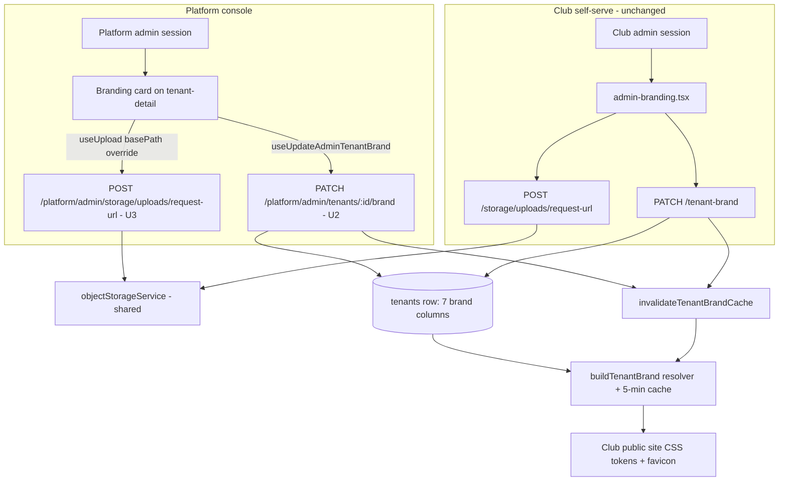

# Concierge Branding Panel - Plan

## Goal Capsule

- **Objective:** Let a platform admin set any club tenant's branding (name, logo, favicon, colours) from the platform-admin console, without a club admin existing, so concierge onboarding no longer depends on seed scripts or waiting on reset-link redemption.
- **Authority hierarchy:** This Product Contract > repo conventions (OpenAPI-first workflow, tenant-isolation invariants, `CLAUDE.md`) > implementer judgment on undocumented details.
- **Open blockers:** none.
- **Execution profile:** `code`, Standard depth, 5 units. U5 is fully independent; U3 has no dependency on U1/U2 but must land before U4 (which depends on U1, U2, and U3).
- **Tail ownership:** Standard single-PR landing; no non-standard rollout steps.

---

## Product Contract

### Summary

Add a branding card to the platform-admin tenant-detail page, backed by a super-admin branding write, mirroring the self-serve club editor's upload and auto-suggest behaviour — plus a free-hex override beyond the club editor's 5-token accent picker. Unbranded clubs default to the Ovation logo as a placeholder.

### Problem Frame

Provisioning writes a club's name and a primary colour from the central register, but favicon, secondary, and tertiary colours land as null and the logo is a one-time snapshot that usually isn't supplied. The only surface that can fix this is the self-serve branding editor, which requires an authenticated club admin — and pilot clubs like Mandurah have zero admins. Today's concierge workarounds are hard-coded logo maps in seed scripts (`scripts/src/seed-mandurah-tenant.ts`) and issuing a reset link then waiting for a volunteer to redeem it. The platform console's tenant PATCH covers only plan and custom domain, so the operator who does the onboarding is the one person who cannot set a club's brand.

### Key Decisions

- **Mirror the club editor, reuse its machinery.** The panel reuses the proven presigned-URL upload flow and the existing client-side palette extraction (`extractBrandPalette`) rather than inventing a second branding pipeline. The self-serve editor at `artifacts/cricket-club/src/pages/admin-branding.tsx` is the reference implementation.
- **Tokens plus free-hex override.** The panel offers the same 5-token accent picker as the club editor by default, with an advanced mode where the concierge sets primary, secondary, and tertiary as true hex values — real clubs have real colours the token set cannot match. The self-serve editor stays token-only; the extra power is justified because the operator is doing bespoke setup.
- **Ovation logo as the unbranded placeholder.** `DEFAULT_BRAND`'s placeholder logo becomes the Ovation logo; neutral slate colours stay. The white-label optics were weighed and accepted: concierge branding makes the default short-lived, and it is a placeholder, not an identity claim.
- **Fetch assist deferred.** The paste-a-URL brand intake (Brandfetch/Facebook scrape) is out of this plan — the endpoint and panel are the real need; the external-API dependency is its own build-vs-buy decision.
- **Background image excluded.** The `backgroundUrl` column exists but background/card-rendering behaviour lives on the unmerged `fix/phase2-brand-leaks` branch; the panel covers the same field set as the self-serve editor to avoid coupling to unmerged work.

### Actors

- A1. Platform admin (concierge) — authenticated with the platform session; brands any tenant from the console.
- A2. Club admin — unaffected; keeps the self-serve editor. Both actors can write the same brand fields; last write wins at column level with no notification (accepted for the pilot, where clubs have 0–1 admins).

### Requirements

**Endpoint & data**

- R1. A platform admin can update a tenant's `name`, `shortName`, `logoUrl`, `faviconUrl`, `primaryColour`, `secondaryColour`, and `tertiaryColour` — the same field set as the self-serve brand write, and no more (`plan`/`customDomain` stay on the existing update; `backgroundUrl` excluded).
- R2. A successful brand write takes effect on the club's public site without waiting out the brand cache (invalidate on write, matching the self-serve endpoint's behaviour).
- R3. The write is platform-session-gated and tenant-targeted: it can brand a tenant with zero club admins.

**Panel UI**

- R4. The tenant-detail page gains a branding card with logo and favicon upload and a live preview scoped to the card (same preview approach as the club editor — never restyling the console itself).
- R5. Uploading a logo auto-suggests colours via the existing palette extraction, with the same graceful fallback when no usable swatches are found.
- R6. Colour selection defaults to the 5-token accent picker; an explicit override mode exposes free-hex inputs for all three colour slots.
- R7. When free-hex values produce poor text contrast against the theme's fixed surfaces, the panel shows a non-blocking warning before save — it never hard-blocks.

**Defaults**

- R8. A tenant with no brand data resolves to the Ovation logo as its placeholder logo; neutral colours are unchanged. The finish-setup banner logic must continue to treat such a tenant as unbranded.

### Key Flows

- F1. Concierge brands a club
  - **Trigger:** Platform admin opens a tenant's detail page during onboarding.
  - **Steps:** Open branding card → upload logo (favicon optional) → palette auto-suggests; accept token or switch to hex override → contrast warning shown if applicable → save → cache invalidated → club's public site reflects the brand immediately.
  - **Outcome:** Club is fully branded with no club admin involved.
  - **Covers:** R1–R7.

### Acceptance Examples

- AE1. **Covers R3.** Given Mandurah has zero club admins, when a platform admin saves a logo and colours from the console, then Mandurah's public site shows them without any club-admin action.
- AE2. **Covers R2.** Given a brand was saved seconds ago, when the club's public site is loaded, then the new brand renders (no 5-minute stale window).
- AE3. **Covers R7.** Given the concierge enters a near-white primary in hex-override mode, when they save, then a contrast warning was shown but the save succeeds.
- AE4. **Covers R8.** Given a freshly provisioned tenant with no logo, when its public site loads, then the Ovation placeholder logo shows — and the admin dashboard still shows the finish-setup prompt.
- AE5. **Covers R1.** Given a request to the concierge brand write including `plan` or `backgroundUrl`, then those fields are structurally absent from what the handler can see (closed schema strips them) — the tenant's plan and background are unchanged.

### Success Criteria

- Mandurah goes from platform defaults to its real logo and colours entirely from the platform console, with zero club admins existing — the current seed-script workaround is no longer needed for branding.

### Scope Boundaries

**Deferred for later:** paste-a-URL brand fetch (Brandfetch / Facebook scrape); background image support; ghost-session impersonation (would let the concierge use the club's own editor — composes with, does not replace, this panel); generated monogram crest default; server-rendered OG/meta branding; mobile app branding.

**Deferred to Follow-Up Work:** `logoUrl`/`faviconUrl` provenance validation (restricting values to object-storage paths) on both the self-serve and platform endpoints — neither validates today; the platform actor is trusted, so hardening both together is a follow-up, not part of this plan. Multi-instance cache invalidation (see KTD7 assumption).

### Dependencies / Assumptions

- The presigned-upload route is gated by tenant-admin auth (`requireAdmin` on `POST /storage/uploads/request-url`, `artifacts/api-server/src/routes/storage.ts:63`); the two session systems are fully independent (`SESSION_COOKIE`+`decodeSession` vs `PLATFORM_SESSION_COOKIE`+`decodePlatformSession`), so a platform session structurally cannot use the existing route — U3 adds a platform-scoped one.
- Object *serving* routes (`GET /storage/public-objects/*`, `GET /storage/objects/*`) are effectively public today, so uploaded logos render on public sites and in the console without auth changes.
- `invalidateTenantBrandCache(tenantId)` is exported and callable from a platform-admin handler (`artifacts/api-server/src/lib/tenant-brand.ts:144`).
- The self-serve accent picker only writes `secondaryColour`; primary/tertiary pass through untouched — the concierge panel writing all three colour slots is additive (`artifacts/cricket-club/src/pages/admin-branding.tsx:166-181`).
- The finish-setup banner computes unbranded-ness by field-by-field comparison of the resolved brand to `DEFAULT_BRAND` (`artifacts/cricket-club/src/pages/admin.tsx:23-31`), so swapping the default's logo asset keeps the comparison correct — provided no tenant row stores the old placeholder path as a literal (U5 audits this).
- OpenAPI-first workflow applies: schema changes go through `lib/api-spec/openapi.yaml`, then codegen via `orval`/`tsc` run directly (not `pnpm run`); generated files are never hand-edited.

---

## Planning Contract

### Key Technical Decisions

- **KTD1 — Separate `PATCH /platform/admin/tenants/{id}/brand` endpoint, not a widened `UpdateAdminTenantBody`.** The existing platform PATCH (`updateAdminTenant`) carries privileged plan/domain writes; brand writes get their own closed schema (`additionalProperties: false`, exactly the seven cosmetic fields — mirroring `UpdateTenantBrandBody` at `lib/api-spec/openapi.yaml:6037-6059`) so `plan`/`customDomain`/`backgroundUrl` are structurally inadmissible regardless of handler refactors, and the two write concerns stay separately reviewable. OperationId `updateAdminTenantBrand`, tag `platformAdmin`, matching existing conventions; codegen yields `useUpdateAdminTenantBrand({id, data})`.
- **KTD2 — Hex colours are schema-validated on the new endpoint.** The three colour fields take `pattern: ^#[0-9a-fA-F]{6}$` (nullable). The self-serve schema has no pattern today; the hex-override mode is the first UI that lets someone type arbitrary text into these fields, and malformed hex breaks CSS tokens and the contrast calc downstream. New code gets the stricter contract; retrofitting self-serve is out of scope.
- **KTD3 — Platform-scoped upload route, not dual-auth on the tenant route.** Add `POST /platform/admin/storage/uploads/request-url` gated by `requirePlatformAdmin`, delegating to the same `objectStorageService` helpers as `storage.ts`. The existing route's threat model stays untouched, and the client wiring is trivial because `useUpload` accepts a `basePath` override (`lib/object-storage-web/src/use-upload.ts:17-18`). Storage routes are plain Express routes today (not in the OpenAPI spec, called by raw fetch inside `useUpload`) — the new route follows that existing convention rather than joining the spec.
- **KTD4 — Colour-mode precedence: the mode active at save time wins.** Saving in token mode writes `ACCENT_HEX[accent]` to `secondaryColour` and passes primary/tertiary through unchanged (exact parity with self-serve save semantics). Saving in hex-override mode writes all three hex inputs. Switching modes never merges: the panel seeds each mode's inputs from the currently-persisted brand, and only the active mode's values are sent.
- **KTD5 — Contrast warning reuses `luminance()` from `lib/scorecard/src/colors.ts:69-80`.** The WCAG relative-luminance formula already exists in the shared package; the panel computes a contrast ratio between each chosen colour and the theme's fixed light/dark surfaces and shows a non-blocking inline warning below the pickers when the ratio falls under 4.5:1. No new dependency, no hard block (R7).
- **KTD6 — Ovation placeholder logo is a new repo asset.** No Ovation logo exists in the repo today (`artifacts/cricket-club/public/` holds only the neutral `placeholder-club-logo.svg`). U5 adds a simple self-contained `ovation-logo.svg` wordmark to public assets and points `DEFAULT_BRAND.logoUrl` at it; a designed brand asset can replace the file later without code changes. Because `isUnbranded` and the brand resolver compare by exact string equality to `DEFAULT_BRAND.logoUrl`, U5 also audits tenant rows for the old literal `/placeholder-club-logo.svg` value and nulls them, so no tenant silently diverges from both defaults after the swap.
- **KTD7 — Cache invalidation stays in-process; single-instance deployment is an explicit assumption.** `invalidateTenantBrandCache` deletes from a per-process `Map`. The pilot deployment is a single API process, so AE2 holds. If the API is ever multi-instance or `GET /tenant-brand` gains a CDN layer, invalidation needs a broadcast/purge mechanism — recorded in Scope Boundaries as follow-up, not built now.
- **KTD8 — Clubs-register precedence can mask tenant-row writes; documented, not fixed.** `buildTenantBrand` resolves `club?.X ?? tenant?.X ?? DEFAULT` — for a tenant with `appClubId` set (only Halls Head today), a non-null club-register value wins over the tenant row the panel writes. Pilot concierge targets all have `appClubId` null, so writes render. U2 carries a test documenting the masking behaviour so it is discovered in CI, not in production; surfacing masked fields in the panel UI is deliberately out of scope.

### High-Level Technical Design

Both auth systems stay independent; the new platform routes are siblings of the self-serve ones, converging only on the shared storage service, the tenants row, and the cache invalidation helper.

---

## Implementation Units

### U1. OpenAPI contract for the platform brand write

- **Goal:** The generated client and Zod validator know `PATCH /platform/admin/tenants/{id}/brand`.
- **Requirements:** R1
- **Dependencies:** none
- **Files:** `lib/api-spec/openapi.yaml` (new path under the platform-admin block at ~4505-4557; new `UpdateAdminTenantBrandBody` schema mirroring `UpdateTenantBrandBody` at 6037-6059 plus KTD2's hex patterns); generated outputs in `lib/api-client-react` and `lib/api-zod` via codegen
- **Approach:** Define the path with operationId `updateAdminTenantBrand`, tag `platformAdmin`, path param `id` (integer). Request schema: `additionalProperties: false`; the seven cosmetic fields, all nullable strings except `name` (optional string — unlike self-serve, name is not required here since partial updates are the norm); colour fields carry `pattern: "^#[0-9a-fA-F]{6}$"`. Run codegen (`orval`/`tsc` directly, not via `pnpm run`) before implementing the handler.
- **Patterns to follow:** The existing `/platform/admin/tenants/{id}` path block and `UpdateTenantBrandBody` schema in `lib/api-spec/openapi.yaml`.
- **Test expectation:** none — contract-only unit; behaviour is tested in U2. Verify generated hook `useUpdateAdminTenantBrand` exists after codegen.
- **Verification:** Codegen completes without diff noise in unrelated files; `tsc` typecheck passes monorepo-wide.

### U2. Platform brand PATCH handler

- **Goal:** A platform admin updates any tenant's brand fields; the change is live immediately.
- **Requirements:** R1, R2, R3
- **Dependencies:** U1
- **Files:** `artifacts/api-server/src/routes/platform-admin.ts` (new handler alongside the existing tenant PATCH at 220-269); `artifacts/api-server/src/routes/platform-admin-brand.test.ts` (new — tests are co-located next to route files)
- **Approach:** `requirePlatformAdmin`-gated. Validate `id` as a positive integer and 404 on a missing tenant (mirroring the existing PATCH's pre-read). Build `updates` field-by-field with `!== undefined` guards (never spreading the body) so `null` clears a field and omission leaves it untouched; 400 on an empty update set, mirroring `tenant.ts:60-63`. Write via `db.update(tenantsTable).set(updates).where(eq(tenantsTable.id, id))`, then call `invalidateTenantBrandCache(id)`. Target the tenant purely by path `id` — no `getTenantId(req)` involvement.
- **Patterns to follow:** `artifacts/api-server/src/routes/tenant.ts:32-82` (field-by-field construction, empty-update guard, cache invalidation); `platform-admin.ts`'s existing id validation and 404 pre-read.
- **Test scenarios:**
  - Happy path: platform session PATCHes logo + colours on a tenant with zero admins; response reflects the change; subsequent `GET /tenant-brand` for that tenant returns the new values (cache invalidated). Covers AE1, AE2.
  - Happy path: partial update (only `logoUrl`) leaves other columns untouched; explicit `null` clears a previously-set field.
  - Error path: no session → 401; a club-admin session (`SESSION_COOKIE`) → 401/403 — the club cookie must not authorize this route.
  - Error path: malformed hex (`#12345`, `red`) → 400 via schema validation. Covers KTD2.
  - Error path: non-integer id, id=0, and well-formed nonexistent id → 400/404 respectively.
  - Error path: empty body → 400.
  - Edge case: body containing `plan`, `customDomain`, or `backgroundUrl` alongside valid fields → 200 with those fields stripped by the closed schema; assert the row's `plan`/`customDomain`/`backgroundUrl` unchanged. Covers AE5.
  - Integration: platform session on a host resolving to a *different* tenant (e.g. `X-Ovation-Host` for tenant A) still brands tenant B by path id — no fallback to request-resolved tenant context.
  - Integration: concierge logo-only save does not clobber a concurrent colour-only save through the self-serve endpoint (column-level last-write-wins).
  - Integration (documents KTD8): a tenant with `appClubId` set and a non-null club-register colour — the PATCH persists to the tenant row but the resolved brand still serves the club-register value; assert and document.
- **Verification:** `vitest run` in `artifacts/api-server` green; manual: brand a dev tenant from curl with a platform cookie and see the public site change.

### U3. Platform-scoped upload route

- **Goal:** A platform session can obtain presigned upload URLs, unblocking logo/favicon upload from the console.
- **Requirements:** R4 (upload half)
- **Dependencies:** none
- **Files:** `artifacts/api-server/src/routes/platform-admin.ts` or a sibling `platform-storage.ts` (implementer's call, following the feature-sliced convention); `artifacts/api-server/src/routes/platform-storage.test.ts` (new — co-located)
- **Approach:** `POST /platform/admin/storage/uploads/request-url`, gated by `requirePlatformAdmin`, delegating to the same `objectStorageService` call the self-serve route uses (`storage.ts:63-106`). Same request/response shape (`{name, size, contentType}` → `{uploadURL, objectPath, metadata}`) so `useUpload` works unchanged with a `basePath` override. Plain Express route, not in the OpenAPI spec, matching the existing storage-route convention (KTD3).
- **Patterns to follow:** `artifacts/api-server/src/routes/storage.ts:63-106` for the delegation shape; `require-platform-admin.ts` for the gate.
- **Test scenarios:**
  - Happy path: platform session gets a well-formed presigned response.
  - Error path: no session → 401; club-admin session → 401/403.
  - Edge case: oversized/typeless request handled the same way the self-serve route handles it (mirror its validation, whatever it enforces).
- **Verification:** `vitest run` in `artifacts/api-server`; manual: upload succeeds from the console in a dev run.

### U4. Branding card on tenant-detail

- **Goal:** The concierge brands a club end-to-end from the tenant-detail page.
- **Requirements:** R4, R5, R6, R7
- **Dependencies:** U1, U2, U3
- **Files:** `artifacts/cricket-club/src/pages/platform-admin/tenant-detail.tsx` (new `BrandingCard` component — extract to a sibling file if it outgrows the page); reuse `artifacts/cricket-club/src/lib/color-extraction.ts` and `@workspace/scorecard` (`ACCENT_HEX`, `snapHexToAccentToken`, `deriveThemeTokens`, `luminance`); `artifacts/cricket-club/src/pages/platform-admin/tenant-detail.test.tsx` or the repo's smoke-test location (new)
- **Approach:** Mirror `admin-branding.tsx`: `useUpload({basePath: "/api/platform/admin/storage"})` for logo and favicon file inputs; on logo upload run `extractBrandPalette` against the local blob and snap the suggestion to an accent token; render the 5-token radio picker as default with an "Advanced: exact colours" toggle exposing three hex `<input type="color">` + text inputs seeded from the persisted brand; live preview via `deriveThemeTokens(previewBrand, mode)` applied as inline style on a scoped container (never `document.documentElement`); compute contrast ratios with `luminance()` and show a non-blocking inline warning under 4.5:1 (KTD5); save through `useUpdateAdminTenantBrand` sending only the active mode's values (KTD4); surface errors with the page's existing inline-destructive-text pattern.
- **Patterns to follow:** `artifacts/cricket-club/src/pages/admin-branding.tsx` (upload, picker, preview, save payload); `tenant-detail.tsx`'s existing `Card` structure, mutation wiring (`useUpdateAdminTenant`), and error mapping.
- **Test scenarios:**
  - Happy path: card renders current brand; token save sends `secondaryColour: ACCENT_HEX[token]` with primary/tertiary passthrough; hex-mode save sends all three hex values. Covers KTD4.
  - Edge case: extraction returning all-null shows the "couldn't detect colours" fallback, pickers stay usable. Covers R5.
  - Edge case: low-contrast hex values render the warning; save button stays enabled. Covers AE3.
  - Edge case: switching token → hex → token discards unsaved hex edits and re-seeds from persisted values (no merged payload).
  - Integration: preview container updates with in-progress colours while the surrounding console styling is unchanged.
- **Verification:** `vitest run` in `artifacts/cricket-club` (hermetic smoke tests, mocked network); manual walkthrough branding a dev tenant.

### U5. Ovation placeholder logo default

- **Goal:** Unbranded tenants show the Ovation logo instead of the grey placeholder, without breaking unbranded detection.
- **Requirements:** R8
- **Dependencies:** none
- **Files:** `artifacts/cricket-club/public/ovation-logo.svg` (new asset); `lib/scorecard/src/brand.ts` (`DEFAULT_BRAND.logoUrl`); a one-time audit in `scripts/src/` or an inline migration nulling tenant rows whose `logoUrl` equals the literal `/placeholder-club-logo.svg`; existing brand tests in `artifacts/api-server` and `artifacts/cricket-club` that assert the default
- **Approach:** Add a simple self-contained Ovation wordmark SVG (replaceable later without code changes — KTD6). Point `DEFAULT_BRAND.logoUrl` at it; keep `/placeholder-club-logo.svg` on disk so any external references don't 404. Audit tenant rows for the old literal value and null them so string-equality comparisons (`isUnbranded`, resolver fallback) stay coherent.
- **Patterns to follow:** The neutral-default split established by the 2026-07-07 plan's U2 (`DEFAULT_BRAND` vs seeded real brands).
- **Test scenarios:**
  - Happy path: a tenant with no brand columns resolves `logoUrl` to the Ovation asset. Covers AE4.
  - Edge case: the finish-setup banner still shows for that tenant (resolved brand equals the new `DEFAULT_BRAND`). Covers AE4.
  - Edge case: Halls Head (tenant 1) still resolves its own seeded brand — regression guard.
  - Edge case: a row stored with the old placeholder literal is nulled by the audit and detected as unbranded afterwards.
- **Verification:** `vitest run` in both workspaces; manual: load an unbranded dev tenant's site and see the Ovation placeholder.

---

## Verification Contract

| Scope | Command | Applies to |
|---|---|---|
| Backend integration tests | `vitest run` (from `artifacts/api-server`) | U2, U3, U5 |
| Frontend smoke tests | `vitest run` (from `artifacts/cricket-club`) | U4, U5 |
| OpenAPI codegen | `orval`/`tsc` run directly (not via `pnpm run` — codegen-toolchain convention) | U1 |
| Monorepo typecheck | `pnpm run typecheck` | all units |
| Manual walkthrough | Brand a zero-admin dev tenant end-to-end from the platform console; confirm public site updates immediately | U2, U3, U4 |
| Manual walkthrough | Halls Head branding unchanged; unbranded tenant shows Ovation placeholder + finish-setup banner | U5 |

## Definition of Done

- All five units land with their test scenarios passing; CI (typecheck, web smoke tests, api-server tests) green.
- AE1–AE5 each hold, demonstrated by the mapped tests.
- A club-admin session cannot call either new platform route; a platform session cannot be blocked by request-host tenant resolution.
- Mandurah (or an equivalent zero-admin tenant) branded end-to-end from the console in a manual walkthrough.
- Product Contract preservation: unchanged from the 2026-07-09 brainstorm except AE5, tightened from "rejected or structurally absent" to the closed-schema strip behaviour (matching self-serve semantics; recorded in KTD1).
