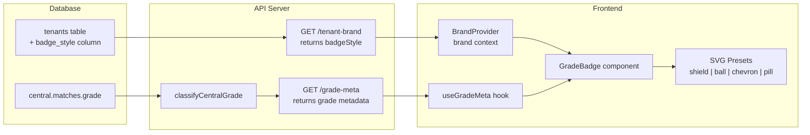

# Grade Badge White-Label Overhaul - Plan

## Goal Capsule

**Objective:** Replace the hardcoded HHCC PNG grade badges with a selectable palette of inline SVG badge presets that fully theme per-tenant, and make grade metadata data-driven so the system works for any association's grade structure — not just PCA's.

**Product authority:** Tenant admin (badge style selection); platform/data layer (grade metadata).

**Open blockers:** None — all dependencies (tenant branding panel, CSS token theming, central DB) already exist.

---

## Product Contract

### Problem

The "Grades Played" badges shown across the player directory, player profiles, match pages, grade pages, records, and honour boards use a single HHCC-branded PNG asset (`HHCC_Icon_Gold_1779853335292.png`). This creates two white-label failures:

1. **Visual branding leak** — the diamond-crest shape and gold colouring are Halls Head's identity. The `drop-shadow` filter tints via `--accent` but the underlying raster image is baked gold, producing a half-themed hybrid on non-HHCC tenants.
2. **Hardcoded grade structure** — the META map knows only PCA grades (A–F Grade, Female A/B, PPL, Colts). Other associations have different grade names, hierarchies, and counts. The 2-char fallback works but produces ugly abbreviated labels.

### Solution

Three changes, delivered together:

**1. SVG badge preset palette (4 styles)**

Replace the PNG with inline SVG components that use CSS custom properties for all colours. Ship 4 preset badge shapes:

- **Shield** — classic sport shield outline, clean at all sizes, universal. Default for new tenants.
- **Cricket ball** — circular badge with a subtle seam-line detail. Instantly cricket, very compact.
- **Chevron** — angled pennant/ribbon shape. Stacks well for multi-grade rows.
- **Pill** — plain rounded rectangle / chip. Minimal, text-forward, no imagery.

Each preset renders identically at the existing three sizes (44px / 68px / 112px). All use `hsl(var(--accent))` — no hardcoded colour values.

**2. Badge style picker in tenant branding settings**

Add a "Badge Style" control to both branding editors (self-serve admin and concierge platform-admin). The admin previews each preset and selects one; the choice persists on the tenant record and applies site-wide.

**3. Data-driven grade metadata**

Grade display names, abbreviations, and sort orders flow from the API (derived from `classifyCentralGrade` on the server) rather than the hardcoded frontend META map. The existing 2-char fallback stays as a safety net for unmapped grades.

### Scope boundaries

**In scope:**
- New SVG badge components (one per preset shape)
- Tenant branding panel: badge style picker with live preview
- `badge_style` column on the `tenants` table
- `badgeStyle` field on the `TenantBrand` API response
- Grade metadata endpoint returning display names, abbreviations, and sort orders
- Removal of the HHCC PNG import and asset reference

**Deferred to follow-up work:**
- Custom badge upload (tenant uploads their own SVG/PNG template) — premium feature.
- Per-grade custom colours or per-grade individual badge shapes.
- Mobile app badge updates (Expo) — follow-on once web is proven.

### Success criteria

- R1. No tenant sees HHCC-branded imagery in grade badges.
- R2. Badge colours match the tenant's brand on both light and dark themes.
- R3. All three badge sizes (sm/md/lg) render cleanly for all 4 presets.
- R4. A tenant admin can change badge style in branding settings and see the change reflected immediately.
- R5. Grades not in the PCA set display with reasonable labels and sort correctly.
- R6. The 15+ existing consumers of `GradeBadge` / `GradeBadgeList` / `GradeBadgeListFromString` require no changes to their call sites.

### Assumptions

- The `GradeBadge` component API (props interface) stays unchanged — the preset selection is resolved internally from brand context, not passed as a prop by every consumer.
- Grade metadata from the API is available alongside the brand response (fetched once on app load, cached in React context).
- Product Contract unchanged.

---

## Planning Contract

### Summary

Replace the HHCC PNG badge with four inline SVG badge presets (shield, cricket ball, chevron, pill) themed via CSS variables. Add `badge_style` to the tenant schema and both brand update APIs. Surface the grade metadata (display names, abbreviations, sort orders) from the server's existing `classifyCentralGrade` mapping as an API endpoint so the frontend META map is data-driven. Wire a badge style picker into both branding editors.

### Key Technical Decisions

**KTD-1. Inline SVG components, not external SVG files or a new PNG set.**
The current PNG cannot be recoloured by CSS — `drop-shadow` tinting is a hack that produces poor results on non-gold palettes. Inline SVGs render at any resolution, accept `currentColor` and CSS custom properties directly, and ship as zero-network-cost React components. Each preset is a separate component file exporting the same props interface.

**KTD-2. Badge style stored on `tenants` table, served via `TenantBrand` response.**
The tenant already carries all cosmetic branding fields (logo, colours, favicon). Badge style is another cosmetic preference. Adding it to `TenantBrand` means the frontend resolves it from the existing `useTenantBrand()` hook with no new API call. The column is a text enum (`shield | ball | chevron | pill`) defaulting to `shield`.

**KTD-3. Grade metadata served from a new `/grade-meta` API endpoint, derived from `classifyCentralGrade`.**
The server already has the `classifyCentralGrade` regex-based mapping that normalises raw central grade labels into canonical app-grade names. A new endpoint returns the distinct grade metadata (canonical name, abbreviation, sort order) for the current tenant's club. This replaces the hardcoded frontend META map. For native-read tenants, the endpoint falls back to the existing META constants. The response is cached — grade metadata changes only when a new season introduces a new grade.

**KTD-4. Frontend resolves badge style from `BrandContext`, grade metadata from a new React Query hook.**
`BrandProvider` already injects brand properties into the app. The `GradeBadge` component reads `badgeStyle` from brand context to select which SVG preset to render. Grade metadata (display name, abbreviation, sort order) comes from a separate `useGradeMeta()` hook backed by the new endpoint, with a stale-while-revalidate cache policy.

---

## High-Level Technical Design



---

## Implementation Units

### U1. Add `badge_style` column to tenants table

**Goal:** Persist the tenant's chosen badge preset in the database.

**Requirements:** R4

**Dependencies:** None

**Files:**
- `lib/db/src/schema/tenants.ts` — add `badgeStyle` column
- `lib/db/src/schema/tenants.ts` — update the `TenantRow` type export

**Approach:** Add a `text` column `badge_style` with a default of `"shield"`. The column stores one of the four preset identifiers: `shield`, `ball`, `chevron`, `pill`. Validation happens at the API layer (Zod/OpenAPI), not as a DB enum — this avoids a migration every time a preset is added. Existing tenant rows get `shield` via the column default.

**Patterns to follow:** The existing `plan` column on `tenants` uses the same pattern — a text column with application-layer validation, not a DB enum.

**Test scenarios:**
- Existing tenants have `badge_style` defaulted to `"shield"` after migration.
- New tenant inserts without specifying `badge_style` get `"shield"`.

**Verification:** Run the migration against the dev database; confirm the column exists with the correct default.

---

### U2. Surface `badgeStyle` in `TenantBrand` API response

**Goal:** Make the badge style available to the frontend via the existing brand endpoint.

**Requirements:** R4

**Dependencies:** U1

**Files:**
- `lib/api-spec/openapi.yaml` — add `badgeStyle` to `TenantBrand` schema, `UpdateTenantBrandBody`, and `UpdateAdminTenantBrandBody`
- `artifacts/api-server/src/lib/tenant-brand.ts` — include `badgeStyle` in `buildTenantBrand` output
- `artifacts/api-server/src/routes/tenant.ts` — accept `badgeStyle` in the self-serve PATCH
- `artifacts/api-server/src/routes/platform-admin.ts` — accept `badgeStyle` in the concierge PATCH
- Run codegen: `lib/api-spec/` → `lib/api-client-react/` and `lib/api-zod/`

**Approach:** Add `badgeStyle` as an optional string property on `TenantBrand` (enum constraint in OpenAPI: `[shield, ball, chevron, pill]`). Add the same field to both update body schemas. In `buildTenantBrand`, read from the tenant row with fallback to `"shield"`. In both PATCH handlers, add the `badgeStyle` field to the `updates` object with the same `!== undefined` guard pattern used for other fields.

**Patterns to follow:** The existing `faviconUrl` field on `TenantBrand` — optional, nullable, served from the tenant row with a default fallback, accepted in both update endpoints.

**Test scenarios:**
- `GET /tenant-brand` returns `badgeStyle: "shield"` for a tenant with no explicit setting.
- `PATCH /tenant-brand` with `{ badgeStyle: "chevron" }` updates the tenant and returns the new value.
- `PATCH /tenant-brand` with `{ badgeStyle: "invalid" }` returns 400.
- `PATCH /platform/admin/tenants/:id/brand` with `{ badgeStyle: "ball" }` updates and returns the new value.
- Omitting `badgeStyle` from a PATCH leaves the existing value unchanged.
- The brand cache is invalidated after a badge style update (existing `invalidateTenantBrandCache` call).

**Verification:** Confirm the generated client types include `badgeStyle`. Confirm the round-trip: set via PATCH, read via GET.

---

### U3. Grade metadata API endpoint

**Goal:** Serve grade display metadata (canonical name, abbreviation, sort order) from the server so the frontend is data-driven.

**Requirements:** R5, R6

**Dependencies:** None (parallel with U1/U2)

**Files:**
- `lib/api-spec/openapi.yaml` — add `GET /grade-meta` endpoint and `GradeMetaItem` schema
- `artifacts/api-server/src/routes/grades.ts` (or new file `grade-meta.ts`) — implement the endpoint
- `lib/db/src/central-queries.ts` — reuse `centralDistinctGradeLabels` for the grade list
- Run codegen

**Approach:** The endpoint returns an array of `{ grade: string, abbr: string, sortOrder: number }` for the current tenant's club. For central-read tenants, call `centralDistinctGradeLabels(clubId)` which returns all distinct grade labels for that club, map each through `classifyCentralGrade` to get the canonical app grade, then derive the abbreviation and sort order using the same logic currently in the frontend META map (moved server-side). For native-read tenants, return the hardcoded PCA META set as a fallback. Cache the response with a long TTL (grades change once per season at most).

Response shape:
```json
[
  { "grade": "A Grade", "abbr": "A GRADE", "sortOrder": 1 },
  { "grade": "Female A Grade", "abbr": "FEM A", "sortOrder": 7 },
  { "grade": "PPL", "abbr": "PPL", "sortOrder": 9 }
]
```

The abbreviation logic (which text to show on the badge at each size) moves from the frontend META map to this endpoint. The `bannerShort` and `bannerLong` distinction is retained as `abbr` (short form) and `grade` (long form) — the component picks based on badge size.

**Patterns to follow:** The existing `GET /grades` endpoint for grade summaries. The `centralDistinctGradeLabels` query already exists and returns exactly the data needed.

**Test scenarios:**
- Central-read tenant returns grade metadata derived from that club's actual match data.
- Native-read tenant returns the default PCA grade set.
- Unknown/unmapped grades get a 2-char abbreviation and sort order 99.
- Response is consistent with the grades returned in player `gradesPlayed` fields.

**Verification:** Compare the endpoint response against the current hardcoded META map for the pilot tenants — the canonical grades should match exactly.

---

### U4. SVG badge preset components

**Goal:** Create four inline SVG badge components that fully theme via CSS variables, replacing the HHCC PNG.

**Requirements:** R1, R2, R3

**Dependencies:** None (parallel with U1–U3)

**Files:**
- `artifacts/cricket-club/src/components/badge-presets/shield-badge.tsx` — shield SVG
- `artifacts/cricket-club/src/components/badge-presets/ball-badge.tsx` — cricket ball SVG
- `artifacts/cricket-club/src/components/badge-presets/chevron-badge.tsx` — chevron/pennant SVG
- `artifacts/cricket-club/src/components/badge-presets/pill-badge.tsx` — pill/chip SVG
- `artifacts/cricket-club/src/components/badge-presets/index.ts` — barrel export + preset registry

**Approach:** Each preset is a React component accepting `{ label: string; size: number; className?: string }`. The SVG uses `currentColor` for strokes/fills, set by the parent's `color: hsl(var(--accent))`. Text is rendered as an SVG `<text>` element (not HTML overlay) so it scales with the viewBox. Each component has a fixed `viewBox` (e.g. `0 0 100 100`) and renders at the pixel size passed via `width`/`height` props.

The barrel export maps preset identifiers to components:
```ts
export const PRESETS = { shield: ShieldBadge, ball: BallBadge, chevron: ChevronBadge, pill: PillBadge };
```

Design constraints for the SVGs:
- Must be legible at 44px (the `sm` size) — no fine details that disappear at small sizes.
- Text must fit labels up to 8 characters (e.g. "FEMALE A") — use font scaling based on label length (same formula as the current component).
- Use `currentColor` for the primary stroke/fill so the badge recolours with one CSS property.
- No external fonts — use the system serif stack (matching the current `font-serif` class).

**Patterns to follow:** The existing `GradeBadge` component's size system and text scaling formula. The `tier-badge.tsx` component for how Lucide SVG icons are used inline.

**Test scenarios:**
- Each preset renders without errors at all three sizes.
- Each preset displays the grade label centred and legible.
- Labels longer than 7 characters scale down (verify "FEMALE A" and "FEMALE B" fit).
- The badge recolours when `--accent` changes (verify with at least amber, purple, and green palettes).
- The SVGs have appropriate `role="img"` and `aria-label` for accessibility.

**Verification:** Visual inspection at all three sizes with multiple accent colours in both light and dark mode.

---

### U5. Rewire `GradeBadge` component to use SVG presets + data-driven metadata

**Goal:** Replace the PNG-based rendering with the new SVG presets and data-driven grade metadata, preserving the existing component API.

**Requirements:** R1, R2, R3, R5, R6

**Dependencies:** U2, U3, U4

**Files:**
- `artifacts/cricket-club/src/components/grade-badge.tsx` — rewrite internals
- `artifacts/cricket-club/src/lib/brand-context.tsx` — expose `badgeStyle` from brand context (if not already surfaced by the generated types)

**Approach:**
1. Remove the HHCC PNG import.
2. Import the `PRESETS` registry from `badge-presets/index.ts`.
3. Read `badgeStyle` from brand context (via `useTenantBrand()` or the brand context provider).
4. Replace the hardcoded `META` map with a `useGradeMeta()` hook that fetches from the `/grade-meta` endpoint. The hook returns a lookup function `getGradeMeta(grade: string) → { abbr, sortOrder }` with a built-in fallback for grades not in the response.
5. The `GradeBadge` component selects the SVG preset component from `PRESETS[badgeStyle]` and passes `label` and `size` props.
6. `GradeBadgeList` and `GradeBadgeListFromString` continue to work unchanged — they delegate to `GradeBadge` which handles the preset selection internally.
7. `sortGradesBySeniority` uses the grade metadata from the hook instead of the hardcoded sort orders.

The component API (`GradeBadgeProps`, `GradeBadgeListProps`, the `GradeBadgeListFromString` interface) does not change. Consumers pass the same props and get themed SVG badges instead of PNG overlays.

**Patterns to follow:** The `BrandProvider` pattern for reading brand context. The existing `useTenantBrand()` hook for accessing brand properties. React Query patterns used elsewhere in the app for data-fetching hooks.

**Test scenarios:**
- `GradeBadge` renders the correct SVG preset for the tenant's badge style setting.
- `GradeBadge` falls back to `shield` when `badgeStyle` is null/undefined.
- `GradeBadgeListFromString` still splits comma-separated grades and filters "CLUB TOTAL".
- `sortGradesBySeniority` sorts by data-driven sort orders, with unknown grades at sort order 99.
- Changing the tenant's badge style (via brand context) immediately updates all visible badges without a page reload.
- The `role="img"` and `aria-label` attributes are preserved for accessibility.

**Verification:** Navigate to the player directory on two different tenants — confirm each shows the correct badge style and accent colour.

---

### U6. Badge style picker in branding editors

**Goal:** Let tenant admins and platform admins select the badge style from the branding settings panel.

**Requirements:** R4

**Dependencies:** U2, U4

**Files:**
- `artifacts/cricket-club/src/pages/admin-branding.tsx` — add badge style picker to self-serve editor
- `artifacts/cricket-club/src/pages/platform-admin/branding-card.tsx` — add badge style picker to concierge editor

**Approach:** Add a "Badge Style" section to both branding editors, below the colour picker. Display the four presets as a visual radio group — each option shows the SVG badge at `md` size (68px) with a sample label (e.g. "A GRADE"), rendered in the currently-selected accent colour. The selected preset has a highlighted border. On selection, the `badgeStyle` field is included in the PATCH payload alongside other brand fields.

In the concierge editor (`branding-card.tsx`), the picker works the same in both "token" and "hex" colour modes — badge style is independent of colour mode.

The live preview panel in `admin-branding.tsx` (lines 313–338) should show a sample badge row using the selected preset so the admin sees the effect before saving.

**Patterns to follow:** The accent colour picker in `admin-branding.tsx` (lines 276–298) — a visual radio group with highlighted selection. The `buildBrandSavePayload` function in `branding-card.tsx` for including new fields in the concierge PATCH.

**Test scenarios:**
- The badge style picker displays all four presets with sample labels.
- Selecting a preset highlights it and includes `badgeStyle` in the save payload.
- Saving with a new badge style updates the tenant and immediately reflects in the preview.
- The picker defaults to the tenant's current badge style on load.
- The picker works correctly in both the self-serve and concierge editors.

**Verification:** Change badge style in the branding panel, save, refresh — confirm the player directory shows the new style.

---

### U7. Clean up HHCC PNG asset reference

**Goal:** Remove the HHCC-branded PNG asset and its import path.

**Requirements:** R1

**Dependencies:** U5

**Files:**
- `attached_assets/HHCC_Icon_Gold_1779853335292.png` — delete
- Verify no other imports reference this asset

**Approach:** After U5 rewires `grade-badge.tsx` to use SVG presets, the PNG import is dead code. Remove the file and confirm the build succeeds. The Vite `@assets` alias and the `attached_assets/` directory remain for other assets.

**Test scenarios:**
- Test expectation: none — pure cleanup, verified by successful build.

**Verification:** `pnpm --filter @workspace/cricket-club run build` succeeds with no missing asset errors.

---

## Scope Boundaries

### Deferred to Follow-Up Work

- **Custom badge upload** — tenant uploads their own SVG/PNG template as a premium feature. Requires a file upload flow, storage, and validation.
- **Per-grade custom colours** — letting tenants assign different colours to different grades.
- **Mobile app (Expo)** — the mobile app has its own badge rendering; update it once the web implementation is proven.
- **Grade metadata admin UI** — letting tenants override grade display names, abbreviations, or sort orders. The current `classifyCentralGrade` mapping handles all PCA grades; this becomes needed when other associations are onboarded.

---

## Verification Contract

1. **Visual correctness** — all four SVG presets render cleanly at sm (44px), md (68px), and lg (112px) sizes with at least three accent colours (amber, purple, green) in both light and dark mode.
2. **API contract** — `GET /tenant-brand` includes `badgeStyle`; `PATCH /tenant-brand` and `PATCH /platform/admin/tenants/:id/brand` accept and persist it; `GET /grade-meta` returns grade metadata matching the tenant's club.
3. **Component compatibility** — all 15+ existing consumers of `GradeBadge` / `GradeBadgeList` / `GradeBadgeListFromString` render correctly without call-site changes.
4. **Brand cache invalidation** — changing badge style via either branding endpoint invalidates the brand cache and reflects immediately on the next page load.
5. **Build clean** — no references to the HHCC PNG remain; the build succeeds.

---

## Definition of Done

- [ ] All four SVG badge presets render at three sizes with multiple accent colours
- [ ] `badge_style` column exists on `tenants` with `"shield"` default
- [ ] `badgeStyle` flows through `TenantBrand` response and both update endpoints
- [ ] `/grade-meta` endpoint returns data-driven grade metadata
- [ ] `GradeBadge` uses SVG presets from brand context + data-driven metadata
- [ ] Badge style picker works in both self-serve and concierge branding editors
- [ ] HHCC PNG asset removed, build clean
- [ ] All existing badge consumers render correctly (visual check on player directory, grades page, records page)

---

## Sources & Research

- `artifacts/cricket-club/src/components/grade-badge.tsx` — current PNG-overlay implementation
- `attached_assets/HHCC_Icon_Gold_1779853335292.png` — the HHCC-branded PNG to replace
- `lib/db/src/schema/tenants.ts` — tenant schema with existing brand columns
- `artifacts/api-server/src/lib/tenant-brand.ts` — brand resolver with three-tier fallback
- `lib/db/src/central-queries.ts:63-161` — `classifyCentralGrade` and `centralDistinctGradeLabels`
- `artifacts/cricket-club/src/lib/brand-context.tsx` — `BrandProvider` and `applyBrandTheme`
- `artifacts/cricket-club/src/lib/theme-tokens.ts` — `deriveThemeTokens` with accent colour system
- `artifacts/cricket-club/src/pages/admin-branding.tsx` — self-serve branding editor
- `artifacts/cricket-club/src/pages/platform-admin/branding-card.tsx` — concierge branding editor
