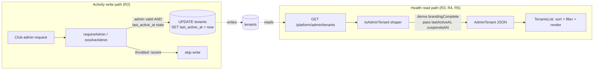

# Tenant Health Dashboard - Plan

## Summary

Give the platform operator at-a-glance visibility into which of the (soon) 27 PCA tenants are set up, active, and healthy. Add `last_active_at` and `suspended_at` columns to the `tenants` table, populate `last_active_at` from authenticated club-admin activity (throttled), surface a computed health picture through the platform-admin tenant list API, and rebuild the tenant list UI with health columns plus client-side sorting and filtering.

**Product Contract preservation:** This plan implements the "Tenant health dashboard" must-build item from the origin requirements plan. Product Contract unchanged — scope is narrowed to the first must-build item; suspension _enforcement_ (the unavailable page and suspend/restore controls) remains the separate "Tenant suspension" item and is deferred here (see Scope Boundaries).

---

## Problem Frame

The Platform Admin tenant list ([tenants-list.tsx](artifacts/cricket-club/src/pages/platform-admin/tenants-list.tsx)) shows club name, address, plan, data source, and admin count. It has no signal for whether a tenant is _healthy_: whether anyone is actively managing it, whether branding was ever configured, or whether it's been suspended. At 2–3 pilot tenants the operator holds this in their head. At 27 clubs — many concierge-provisioned and then left for a club secretary to finish — the operator cannot tell which onboardings stalled, which sites are live and used, and which need a nudge. The list is also unsorted beyond alphabetical and unfilterable beyond a name search.

---

## Requirements

- **R1** — The `tenants` table records when a tenant was last actively managed (`last_active_at`) and whether it is suspended (`suspended_at`).
- **R2** — `last_active_at` advances when an authenticated club admin acts on the tenant, without generating a write on every request.
- **R3** — The platform-admin tenant list returns, per tenant: last-active timestamp, branding-completeness signal, admin count (already present), and suspended state.
- **R4** — The tenant list UI displays these health indicators in a scannable form (relative "last active", a branding-complete indicator, admin count, a suspended badge).
- **R5** — The operator can sort the list by health-relevant columns (name, last active, admins) and filter to health-relevant subsets (e.g. never-active, branding incomplete, suspended).
- **R6** — Existing behavior is preserved: name/slug/central-club search still works; the row still links to tenant detail; a tenant with no activity yet renders cleanly (no crash, an honest "never" state).

---

## Key Technical Decisions

### KTD1 — `last_active_at` tracks authenticated club-admin activity, throttled

The health question the operator most needs answered is "is this club actually being managed?" — the strongest stall signal. Hook the write into the `requireAdmin` middleware's success continuation in [require-admin.ts](artifacts/api-server/src/middlewares/require-admin.ts) — the `.then((admin) => …)` block after `resolveAdmin` returns a valid admin — **not** inside the shared `resolveAdmin` helper itself. `resolveAdmin` is exported and also called on optional-admin _read_ paths (e.g. `social-cards.ts`'s `GET /card-sets`); placing the side effect in the helper would advance `last_active_at` on those reads too, broadening the signal beyond "a club admin acted on the tenant". The middleware `.then` block is reached only on `requireAdmin`-guarded routes, which is exactly the write signal we want.

Throttle with an **in-process recently-touched guard** (a `Map<tenantId, lastWriteMs>`), not a database read: issue the `UPDATE` only when the tenant is absent from the guard or its entry is older than a threshold (default 15 min, `TENANT_ACTIVITY_THROTTLE_MS`, clamped to a sane floor — see below). This needs **no** read of the stored `last_active_at` — the guard alone decides whether to write, and the `getAdminById` row (`adminsTable` only) never carried the tenant's timestamp anyway. On process restart the guard is empty, so the first admin request per tenant writes once and repopulates the guard; negligible. `TENANT_ACTIVITY_THROTTLE_MS` is parsed defensively: coerce to a number, and on `NaN` or a value below a floor (60 s) fall back to the 15-min default, so a misconfiguration can never collapse the throttle into a per-request write.

_Alternative considered:_ update on all tenant-scoped requests including end-user traffic. Rejected as the primary signal — it answers "is the site visited" not "is it being managed", and multiplies writes. End-user-traffic health is a richer future signal (see Future Considerations), not this unit.

_Write-path safety:_ the activity write is best-effort and must never fail or delay the request it rides on — fire it after `next()` semantics or as a non-awaited, error-swallowing side effect, mirroring the existing best-effort patterns in the codebase (e.g. `centralClubNames()` swallowing a missing central DB).

### KTD2 — Branding completeness is derived, not stored

"Branding complete" is computable from columns that already exist: a tenant has meaningful branding when it has a logo (`logo_url` non-null) **and** a primary colour (`primary_colour` non-null). Compute it in the API response shaper ([toAdminTenant](artifacts/api-server/src/routes/platform-admin.ts:95)); do not add a column that can drift from the underlying brand fields. Note: the brand _resolver_ ([tenant-brand.ts](artifacts/api-server/src/lib/tenant-brand.ts)) can fall back to the `clubs` register for a tenant with `appClubId` set, so "branding incomplete" here means "the tenant has set no explicit brand columns", which is exactly the onboarding-stall signal the operator wants — do not reach into the clubs register to mask it.

### KTD3 — Schema change via `drizzle-kit push`, not migration files

This repo has no migrations directory; schema is source-of-truth in [lib/db/src/schema/](lib/db/src/schema/) and applied with `pnpm --filter @workspace/db push` ([drizzle.config.ts](lib/db/drizzle.config.ts)). Both new columns are nullable with no default, so the push is additive and safe on the live table (no backfill, no not-null constraint). `last_active_at IS NULL` is the honest "never active" state.

### KTD4 — Sorting and filtering are client-side

The list already fetches all tenants in one call and filters in-memory ([useMemo](artifacts/cricket-club/src/pages/platform-admin/tenants-list.tsx:23)). At 27 rows — even at several hundred — client-side sort/filter is instant and needs no API change beyond the added fields. Keep the API returning the full set; do the health sort/filter in the component. Revisit only if the tenant count reaches thousands (it won't for PCA).

---

## High-Level Technical Design

The write path and read path are decoupled through the `tenants` table. The write path is a throttled side effect on the existing admin-auth check; the read path enriches the existing list endpoint's response shaper and the existing list component. No new endpoints.

---

## Implementation Units

### U1. Add `last_active_at` and `suspended_at` columns to the tenants schema

**Goal:** The `tenants` table can record last-active time and suspended state.

**Requirements:** R1

**Dependencies:** none

**Files:**

- [lib/db/src/schema/tenants.ts](lib/db/src/schema/tenants.ts) — add two nullable `timestamp({ withTimezone: true })` columns: `lastActiveAt` (`last_active_at`) and `suspendedAt` (`suspended_at`). Extend the doc comment to describe both. `TenantRow` / `InsertTenant` inferred types pick them up automatically.

**Approach:** Mirror the existing `createdAt` column definition but nullable and without `.defaultNow()`. Place them after `plan` / before `createdAt` for readability. Apply with `pnpm --filter @workspace/db push` against the dev database (KTD3). Both columns nullable → additive, no backfill.

**Patterns to follow:** the existing `createdAt` timestamp column in the same file; nullable text columns already present (`shortName`, `customDomain`).

**Test scenarios:** `Test expectation: none — pure additive schema change, no behavioral logic. Verified by U2/U3 tests reading and writing the columns, and by a successful `push` with the columns present in the resulting table.`

**Verification:** `push` applies cleanly; `\d tenants` (or a Drizzle select) shows both columns as nullable `timestamptz`.

---

### U2. Advance `last_active_at` on authenticated club-admin activity, throttled

**Goal:** A club admin acting on their tenant advances `last_active_at`, at most once per throttle window, without slowing or failing the request.

**Requirements:** R2

**Dependencies:** U1

**Files:**

- [artifacts/api-server/src/middlewares/require-admin.ts](artifacts/api-server/src/middlewares/require-admin.ts) — in the `requireAdmin` handler's `.then((admin) => …)` success block (not the shared `resolveAdmin` helper — KTD1), trigger a throttled, best-effort `last_active_at` write for `admin.tenantId`.
- `artifacts/api-server/src/lib/tenant-activity.ts` (new) — house the throttled-write helper and its in-process guard so the middleware stays thin and the throttle logic is unit-testable in isolation.
- `artifacts/api-server/src/lib/tenant-activity.test.ts` (new) — unit tests for the throttle decision and env parsing.

**Approach:** Add `touchTenantActivity(tenantId)` to the new lib module, backed by a module-level `Map<number, number>` (tenantId → last-write epoch ms) — the in-process recently-touched guard (KTD1). The throttle decision is pure over `(guardEntry, now, threshold)`: write when the guard has no entry for the tenant or its entry is older than the resolved threshold. It reads no database row — `getAdminById` loads `adminsTable` only and never carried the tenant's `last_active_at`, and the guard alone suppresses re-writes. On a decision to write, issue a non-awaited `UPDATE tenants SET last_active_at = now WHERE id = tenantId` that swallows errors (KTD1 write-path safety) and update the guard entry; the auth request never blocks on it and never 500s because of it. Resolve the threshold from `TENANT_ACTIVITY_THROTTLE_MS` with defensive parsing: coerce to number, and on `NaN` or a value below the 60 s floor fall back to the 15-min default (never 0/negative, which would disable throttling).

**Execution note:** Implement the pure throttle-decision and env-parse functions test-first — they are the correctness core of this unit (inputs: guard entry, now, threshold / raw env string; outputs: write-or-skip / resolved ms).

**Patterns to follow:** the best-effort/error-swallowing style of `centralClubNames()` in [platform-admin.ts](artifacts/api-server/src/routes/platform-admin.ts:78); the in-process TTL cache pattern in [tenant-brand.ts](artifacts/api-server/src/lib/tenant-brand.ts:34) and the directory cache in [tenant-context.ts](artifacts/api-server/src/middlewares/tenant-context.ts:68).

**Test scenarios:**

- `shouldWrite` returns true when the guard has no entry for the tenant (first request this process / after restart). Covers R2.
- `shouldWrite` returns true when the guard entry is older than the threshold.
- `shouldWrite` returns false when the guard entry is within the threshold window.
- Concurrent calls within the window: only the first triggers a write — assert the write side effect is invoked once given several rapid `touchTenantActivity` calls for the same tenant.
- The threshold resolves from `TENANT_ACTIVITY_THROTTLE_MS` when it is a valid number ≥ 60 s, else the 15-min default.
- A bogus, zero, negative, or `NaN` `TENANT_ACTIVITY_THROTTLE_MS` falls back to the 15-min default rather than disabling throttling.
- A write that rejects does not throw out of `touchTenantActivity` (error swallowed) — the caller's promise still resolves.
- The write is placed so it does not fire on `resolveAdmin`'s optional-admin read callers: assert (or note for the integration check) that an optional-admin read path invoking `resolveAdmin` does not advance `last_active_at`.

**Verification:** With a short throttle, an authenticated admin request advances `last_active_at`; a second request immediately after does not re-write; after the window a request writes again. An admin request still succeeds (and stays fast) when the activity write fails.

---

### U3. Surface health fields through the AdminTenant API

**Goal:** The tenant list endpoint returns `lastActiveAt`, `suspendedAt`, and a derived `brandingComplete` per tenant.

**Requirements:** R3

**Dependencies:** U1

**Files:**

- [lib/api-spec/openapi.yaml](lib/api-spec/openapi.yaml) — extend the `AdminTenant` schema (line 6281) with `lastActiveAt` (`["string","null"]`), `suspendedAt` (`["string","null"]`), and `brandingComplete` (`boolean`, required). Then regenerate clients.
- [artifacts/api-server/src/routes/platform-admin.ts](artifacts/api-server/src/routes/platform-admin.ts) — extend `toAdminTenant` (line 95) to emit the three fields: pass through `last_active_at`/`suspended_at` as ISO strings (same `instanceof Date` guard used for `createdAt` at line 109), and derive `brandingComplete = logoUrl != null && primaryColour != null` (KTD2).
- Generated clients (do not hand-edit): `lib/api-client-react/src/generated/*`, `lib/api-zod/src/generated/*` — regenerated by codegen.

**Approach:** OpenAPI-first (see [CLAUDE.md](CLAUDE.md) "Do not break"): edit `openapi.yaml`, then run `pnpm --filter @workspace/api-spec run codegen`. `brandingComplete` is required (always computable); the two timestamps are nullable. Both the list handler (line 170) and the detail handler (line 192) call `toAdminTenant`, so both surfaces gain the fields with one shaper change.

**Execution note:** After editing the spec, run codegen before touching TypeScript that references the new fields — the generated types gate compilation.

**Patterns to follow:** the existing `createdAt` ISO-serialization guard in `toAdminTenant`; the nullable-field style already in the `AdminTenant` schema (`centralClubName`, `customDomain`).

**Test scenarios:**

- `toAdminTenant` sets `brandingComplete: true` when both `logoUrl` and `primaryColour` are present.
- `toAdminTenant` sets `brandingComplete: false` when `logoUrl` is null (colour present) and when `primaryColour` is null (logo present) and when both are null.
- `toAdminTenant` serializes a `Date` `lastActiveAt` to an ISO string and passes a null through as null.
- `toAdminTenant` serializes `suspendedAt` the same way.
- Covers R3: `GET /platform/admin/tenants` response includes the three new fields for each tenant (route-level test if the suite exercises the handler with a DB; otherwise assert at the shaper level).

**Verification:** `pnpm --filter @workspace/api-spec run codegen` produces no diff beyond the three new fields; the API returns them; `tsc` passes across the workspace with the regenerated types.

---

### U4. Rebuild the tenant list with health columns, sorting, and filtering

**Goal:** The operator sees health at a glance and can sort/filter by it.

**Requirements:** R4, R5, R6

**Dependencies:** U3

**Files:**

- [artifacts/cricket-club/src/pages/platform-admin/tenants-list.tsx](artifacts/cricket-club/src/pages/platform-admin/tenants-list.tsx) — add "Last active" and "Branding" columns; add a suspended badge next to the club name; add sortable column headers (name, last active, admins) and a health filter control; keep the existing search, links, plan/data-source columns.
- `artifacts/cricket-club/src/pages/platform-admin/tenants-list.test.tsx` (new, if the web package has a component-test setup) — sorting/filtering logic tests. If no component-test harness exists in this package, extract the pure sort/filter/format helpers into a sibling module and unit-test those instead.

**Approach:** Render "Last active" as a relative string ("2 days ago", "never" when null) — reuse an existing relative-time formatter if the web package has one, else a small local helper. Render "Branding" as a check/dash from `brandingComplete`. Show a "Suspended" `StatusPill` (reuse [StatusPill](artifacts/cricket-club/src/components/ui/stat-badge.tsx)) beside the name when `suspendedAt != null`. Add a filter control (segmented buttons or a select) for: All, Never active, Branding incomplete, Suspended. Compose filter + search + sort in the memo. `null` `lastActiveAt` sorts as oldest (stalest first when sorting by last-active ascending) so stalled tenants surface at the top — the operator's primary need.

_Sorting and its affordances (design review):_

- **Default sort on load is last-active ascending** (never-active first, then oldest→newest), so the operator's primary signal — which onboardings stalled — is visible on first paint without any interaction. This is a behavior change from today's component (which does no sorting); do not fall back to API return order.
- The **sortable columns are name, last active, and admins**; Address, Plan, Data source, and Branding are static. Sort state is `{ column, direction }` driving the existing `useMemo`; clicking a sortable header toggles direction (and switches column).
- Show the **active sort visibly**: a direction caret (▲/▼) on the active header plus active-header styling, so the operator can tell what the list is ordered by and that a direction-only toggle did something.
- Render sortable headers as **focusable buttons with `aria-sort`** reflecting the current state, so sort is keyboard-reachable and announced (this is an internal operator console, so this is a light requirement, not a blocker).

_Empty states (two distinct cases):_ keep the existing zero-search-results copy for a non-matching search, and add a **distinct filtered-to-empty state** for when an active health filter yields no rows (e.g. "Suspended" with no suspended tenants) — a neutral "No tenants match the current filter" with a clear-filter affordance, never the search-keyed `No tenants match "{q}"` copy (which renders a misleading empty-quote message when only a filter is active).

**Patterns to follow:** the existing `useMemo` filter and `StatusPill`/`PlanBadge` usage already in the file; the table markup already present (extend, don't replace).

**Test scenarios:**

- On initial load (no interaction), the list is sorted last-active ascending — a never-active tenant appears above an active one. Covers R5.
- Sort by last-active ascending places `null` (never active) rows first, then oldest→newest. Covers R5.
- Sort by admins descending orders by `adminCount`; sort by name preserves the existing alphabetical behavior as one selectable mode.
- Clicking the active sort header toggles direction and the direction indicator (▲/▼) reflects the current state; only sortable headers (name, last active, admins) are interactive.
- Filter "Never active" shows only tenants with null `lastActiveAt`; "Branding incomplete" shows only `brandingComplete === false`; "Suspended" shows only `suspendedAt != null`.
- A filter that matches zero tenants renders the filtered-empty state ("No tenants match the current filter"), not the search-empty `No tenants match "{q}"` copy. Covers R6.
- Filter composes with the name search (both applied).
- Relative-time formatter renders "never" for null and a sane relative string for a recent and an old timestamp.
- A tenant with null `lastActiveAt` and incomplete branding renders without error (empty/"never"/dash states). Covers R6.
- Existing behavior preserved: clicking a row still navigates to `/platform-admin/tenants/:id`; the central-club-name subline still shows. Covers R6.

**Verification:** The list shows last-active, branding, admins, and a suspended badge; headers sort; the filter narrows the set; search still works; a fresh never-active tenant renders cleanly and sorts to the top under last-active-ascending.

---

## Scope Boundaries

### In scope

- `last_active_at` and `suspended_at` columns; throttled activity write; health fields on the tenant list API; health columns + sort/filter in the tenant list UI.

### Deferred to Follow-Up Work

- **Suspension enforcement** — the "temporarily unavailable" page for a suspended tenant and the suspend/restore controls on tenant detail. This plan lands the `suspended_at` column and _displays_ suspended state; acting on it is the separate "Tenant suspension" must-build item in the [origin plan](docs/plans/2026-07-15-001-feat-platform-admin-saas-features-plan.md).
- **End-user-traffic health** — a richer "site is being visited" signal distinct from admin activity (see Future Considerations).
- **Server-side sort/filter/pagination** — unnecessary at PCA scale (KTD4).

### Out of scope

- Email onboarding, audit log, bulk provisioning, entitlements, billing — separate items in the origin plan.

---

## System-Wide Impact

- **Database:** two additive nullable columns on `tenants`; no backfill, no constraint change. Applied via `drizzle-kit push`.
- **API contract:** `AdminTenant` gains three fields (`brandingComplete` required; two nullable timestamps). Additive — existing consumers ignore unknown fields; the detail endpoint gains them too via the shared shaper.
- **Write volume:** one throttled `UPDATE` per active tenant per ~15-min window on the admin path; negligible.
- **Central DB has no secondary indexes** (per project memory) — but these reads/writes are against the app's own `tenants` table (tiny, PK-indexed), not central, so no perf concern.

---

## Risks & Dependencies

- **Write amplification if the throttle is mis-wired** — mitigated by the pure, test-first throttle decision (U2) plus the in-process recently-touched guard. The write is also best-effort and non-blocking, so worst case is redundant writes, never request failure.
- **Codegen drift** — editing `openapi.yaml` requires running codegen and committing the generated output; never hand-edit generated files ([CLAUDE.md](CLAUDE.md)). Verified by a clean `tsc` across the workspace.
- **Web component-test harness may be absent** — U4 falls back to unit-testing extracted pure helpers if the package has no component-render test setup; the sort/filter/format logic is the part worth covering regardless.
- **`drizzle-kit push` diffs the whole schema** — if the dev database has drifted from [lib/db/src/schema/](lib/db/src/schema/), the additive push (U1) may surface unrelated destructive prompts; review the diff and only accept the two additive column adds. The columns themselves are additive-nullable and safe.

---

## Definition of Done

- Both columns exist on `tenants` (nullable `timestamptz`), applied via `push`.
- An authenticated club-admin request advances `last_active_at`, throttled, best-effort, without blocking or failing the request; the throttle decision is unit-tested.
- `GET /platform/admin/tenants` returns `lastActiveAt`, `suspendedAt`, and `brandingComplete` per tenant; spec updated and clients regenerated; `tsc` passes.
- The tenant list shows last-active (relative, "never" for null), branding-complete, admin count, and a suspended badge; supports sorting by name/last-active/admins and filtering by never-active/branding-incomplete/suspended; existing search and row-linking preserved.
- All new tests pass; the existing platform-admin and tenant-brand suites stay green.

---

## Future Considerations

- **End-user-traffic health** — a lightweight per-tenant request counter or last-seen from the tenant-context path would answer "is the site visited", complementing "is it managed". Deliberately deferred to avoid a per-request write on end-user traffic.
- **Health rollup on the console home** — once suspension enforcement lands, a small summary ("22 active · 3 branding incomplete · 1 suspended · 1 never active") would give the operator a one-glance rollout status.
