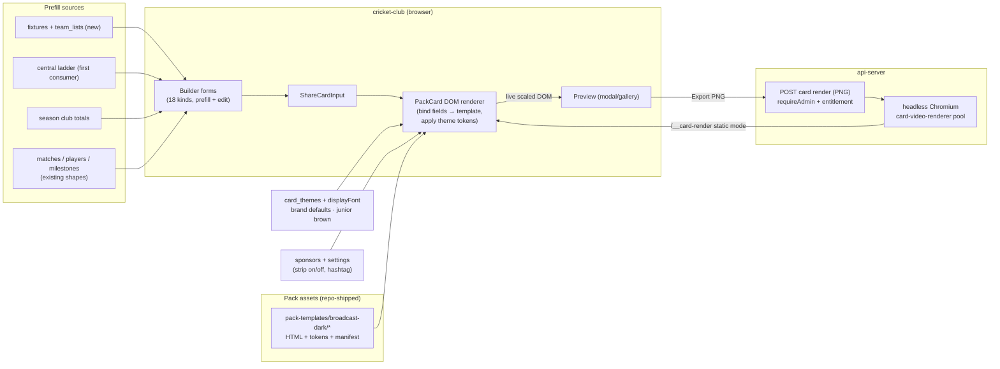

# Pack A Broadcast Dark Social Templates - Plan

## Goal Capsule

- **Objective:** Pack A "Broadcast Dark" (20 designs × story/portrait/square from the Claude Design bundle) becomes the Social Studio's standard card catalogue, rendered pixel-true through a new HTML-template pipeline. The old built-in canvas card visuals and the matchSummary-v1 pack are deleted. A fixtures + team-list store (admin-entered) feeds the fixture-driven cards.
- **Product authority:** Ash. Product Contract decisions below are settled; do not re-litigate during execution.
- **Execution profile:** Deep. Touches the web renderer, api-server routes, DB schema (new tables + theme column), OpenAPI spec + codegen, and deletes ~2,000+ lines of canvas renderer code.
- **Stop conditions:** (1) BYO background/layers templates keep working unchanged. (2) Junior isolation and brown palette forced for junior cards. (3) Fill-in exclusion (`playerId >= 90000`) preserved. (4) OpenAPI-first — never hand-edit generated files. (5) Entitlement gate (`socialStudio`) on every new admin surface. (6) No new external dependencies beyond what the repo already ships (puppeteer-core, ffmpeg already present).
- **Product Contract preservation:** unchanged from the ce-brainstorm version except Outstanding Questions — all five deferred-to-planning questions are now resolved in the Planning Contract.

---

## Product Contract

### Summary

Replace every standard social card visual with Pack A "Broadcast Dark": 20 card designs, each natively composed for story (1080×1920), portrait (1080×1350), and square (1080×1080), rendered as HTML templates so the Claude Design bundle is reproduced exactly and packs B–E become cheap to add. Ship curated style-token controls, DB-prefilled + admin-editable data for all kinds, and new fixtures/team-list tables with manual entry.

### Problem Frame

The Social Studio's card visuals are hand-drawn canvas code — 10 card kinds across a 4,161-line renderer, plus one Figma-derived pack. Each new design or pack means re-authoring layouts in drawing code, which drifts from the design source and doesn't scale to the five-pack template catalogue Ovation wants to offer tenants. The design team has now delivered a complete 20-card pack as structured HTML with an explicit import contract (`data-card-kind` / `data-field` bindings, theme tokens, three native sizes); the app has no way to consume it, and eight of its card types (fixtures, ladder, team lists, club leaderboards, announcements) have no data plumbing at all.

### Key Decisions

1. **HTML-template render pipeline, not canvas hand-porting.** Pack designs stay as HTML with their data-field bindings; the studio renders them in the DOM and rasterizes into the existing export flow. Pixel-true by construction; a new pack becomes content, not code. Aligns with the existing server-side headless-Chromium video renderer.
2. **Hard replacement.** The 10 built-in canvas card renderers and the matchSummary-v1 pack are deleted, not kept as a "Classic" fallback. Existing per-kind defaults and queued drafts migrate onto Pack A rendering. Admin-uploaded BYO templates (`background`/`layers` sources) are untouched.
3. **Pack A is pack 1 of 5.** The pack picker and pack registration must anticipate four more packs (B Gold Foil, C Bold Type, D Neon Night, E Sunset ship later from the same bundle); only Pack A ships now.
4. **Static first, animation later.** Pack A imports as static compositions exactly as designed. Animated variants are a later update; the motion pipeline is not extended in this scope.
5. **DB prefill + editable everywhere.** Every field derivable from the database prefills the card; every text field remains admin-editable in the builder before export. Inherently editorial content (Big Moment, New Signing, promo lines) is admin-entered.
6. **Style customization = curated token controls.** The retired layout-editor surface is replaced at the style level: a studio panel exposing the pack's theme tokens (accent colour, panel colour, display font from a curated list, sponsor strip on/off, hashtag line), savable as named themes, applied per-card or as tenant default. Tokens default from tenant brand; juniors force the brown palette. Per-element style overrides are a possible later update, out of scope now.
7. **Fixtures and team lists: tables + manual entry now, PlayHQ ingest next.** This scope ships the fixtures and team-list stores, admin CRUD, and card prefill wiring. The PlayHQ scrape/API ingest is the next scoped task after this one and fills the same tables; manual entry remains the permanent fallback.

### Requirements

**Pack rendering and fidelity**

- R1. All 20 Pack A designs are available in the studio: Match Result, Match Day, Player Spotlight, Team List, Milestone, Weekend Wrap, Ladder, Big Moment, New Signing, Countdown, A-Grade Debut, Record, Runs Leaderboard, Premiership, New Cap, Century, Five-For, Wicket Leaderboard, Club Runs, Club Wickets.
- R2. Each design renders natively in all three sizes — story 1080×1920, portrait 1080×1350, square 1080×1080 — reflowed per the bundle's per-size compositions, never cropped or scaled from another size.
- R3. Rendered output is visually faithful to the bundle, including the sponsor-strip-on and sponsor-strip-off variants of each card (sponsor strip honours the existing sponsors table and per-card-kind gating).
- R4. Pack cards export through the existing flows: PNG export in the studio and the server-side render route both produce Pack A output.
- R5. Pack theme tokens default from the tenant's brand (accent, panel, inks, logo); junior cards force the junior brown palette regardless of theme.

**Replacement and migration**

- R6. The 10 built-in canvas card renderers and the matchSummary-v1 pack are removed; Pack A is the default design source for every card kind.
- R7. Existing queued drafts and per-kind template defaults render via Pack A after the switch; no draft is lost or errors on open.
- R8. The per-kind custom layout feature and element-override layers (which targeted the deleted built-ins) are retired; the auto-draft engine, drafts queue, carousels, sponsors, captions, and settings continue to work unchanged.
- R9. Admin-created BYO templates (background and layer sources) continue to work exactly as before.

**Data wiring**

- R10. The 12 designs matching existing card kinds consume the existing card-input data shapes; matchSummary keeps its auto-draft flow.
- R11. The 8 new card kinds get data shapes, builder forms, and API coverage (OpenAPI-first) so admins can create them on demand; no auto-draft engines for new kinds.
- R12. The Ladder card reads standings from the central ladder data filtered to the tenant's competition/grade (its first consumer).
- R13. Club Runs and Club Wickets cards read season-scoped club aggregate totals for the tenant.
- R14. Every DB-derivable field prefills; every text field is admin-editable before export.

**Fixtures and team lists**

- R15. A fixtures store holds upcoming matches (opponent, grade/round, venue, date-time) with admin create/edit/delete; Match Day and Countdown prefill from it.
- R16. A team-list store holds a named XI per fixture (with captain/keeper marks), selectable from the player register or free-typed; the Team List card prefills from it.
- R17. Countdown derives its target from the season's earliest fixture, with a manual season-start date override.
- R18. Fixtures and team-list schemas are designed so the follow-up PlayHQ ingest can populate the same tables without card-side changes; every ingested value stays admin-overridable.

**Style controls**

- R19. A studio style panel exposes pack theme tokens (accent colour, panel colour, display font from a curated list, sponsor strip toggle, hashtag line), savable as named themes, applied per-card or as tenant default.

**Platform invariants**

- R20. Junior isolation holds: junior cards use junior data paths only and force the brown palette; senior/junior never blend.
- R21. Fill-in exclusion (`playerId >= 90000`), tenant scoping on all new tables and endpoints, the socialStudio entitlement gate, and OpenAPI-first codegen all hold for every new surface.

### Scope Boundaries

- Packs B–E: ship later from the same bundle; only the picker/registration architecture anticipates them.
- Animated card variants and any motion-pipeline work — later update.
- PlayHQ fixtures/team-list ingest (scrape or API) — the next scoped task after this one.
- Auto-draft engines for the 8 new kinds — on-demand creation only.
- Auto-publish to social platforms; mobile-app cards; per-element style editing; RLS rollout.

### Sources

- Design bundle: `Social media templates for Ovation Studio-handoff.zip` — primary file `Pack A - Broadcast Dark.dc.html` (cards at lines 44–1127; packs B–E in sibling files). Import contract: `data-card-kind`/`data-field`, theme tokens `--gold`/`--panel`/`--ink`/`--disp`, sponsor on/off variants. `Match Result - Sizes.dc.html` is a superseded single-card size exploration; `support.js`/`image-slot.js` are Claude Design preview shims, irrelevant to production.
- Prior art: `docs/plans/2026-07-20-001-feat-design-packs-auto-draft-plan.md` (implemented — pack registration, auto-draft engine, clubs top-up) and `docs/residual-review-findings/feat-design-packs-auto-draft.md` (open issues #34–#43).
- Verified repo facts: built-in renderers cover exactly 10 kinds (`artifacts/cricket-club/src/lib/share-card.ts:192-202`); server-side rendering exists via headless Chromium against `/__card-render` (`artifacts/api-server/src/lib/card-video-renderer.ts`); central ladder table exists with zero consumers (`lib/db/src/central-schema/ladder.ts`); club totals aggregate exists but is all-time scope (`lib/db/src/central-queries.ts:719-799`); no fixtures/upcoming-match data or team-sheet feature exists anywhere; layout editor element layers target only built-in renderers (`lib/db/src/schema/social_cards.ts:159-168,211-227`); template picker already handles multiple packs generically.

---

## Planning Contract

### Key Technical Decisions

1. **KTD1 — Pack templates are repo-shipped HTML template modules with a binding manifest.** Each of the 20 designs converts from `Pack A - Broadcast Dark.dc.html` into a template asset under `artifacts/cricket-club/src/lib/pack-templates/broadcast-dark/`: HTML markup with `{{field}}` placeholders, `data-repeat` row groups (ladder rows, team-list rows, wrap blocks, leaderboard rows), per-format sections (story + shared non-story; A1 Match Result keeps distinct portrait and square variants — it is the only card that has them in the bundle), sponsor-on/off blocks, and theme-token CSS custom properties. A per-card manifest declares kind, fields with types (text/photo/logo/repeat), and default sample values. The Claude Design runtime constructs (`<sc-if>`, `{{ }}` refs, `<image-slot>`, `support.js`) are compiled away during conversion — production templates are plain HTML + tokens.
2. **KTD2 — Binding contract completion.** Nine cards (Match Day, Team List, Weekend Wrap, Ladder, Big Moment, New Signing, Countdown, Club Runs, Club Wickets) have no `data-field` bindings in the bundle beyond `clubLogo`; every visible sample string becomes a bound field per the extraction manifest (see Appendix). Fixes folded in: A11 Debut's `opponent` binding un-nests into `tributeLine` + structured opponent/round; `capNumber` binds the number only ("CAP " prefix stays in template); the "HALLS HEAD / CRICKET CLUB · EST 1991" header binds to `clubName`/`clubTagline`; hashtag footers bind to the settings hashtag; sponsor names in "presented by" lines bind to the sponsors table.
3. **KTD3 — Kind collapse: 18 card kinds, 20 designs.** A13/A18 are both `gradeLeader` (category presets "Runs"/"Wickets"); A19/A20 are one new `clubLeaderboard` kind (category presets). New `ShareCardInput` kinds: `matchDay`, `teamList`, `weekendWrap`, `ladder`, `bigMoment`, `newSigning`, `countdown`, `clubLeaderboard` — defined alongside the existing 10 in `share-card.ts`.
4. **KTD4 — Preview is live DOM; PNG export is server-rendered.** The builder/modal previews pack cards as a live scaled DOM subtree (transform-scale, exactly the bundle's own preview technique). PNG export calls a new admin endpoint that drives the existing headless-Chromium harness in a new static mode (navigate `/__card-render`, init with `{input, options, still: true}`, capture one frame / `page.screenshot` of the card element). Client-side DOM→canvas rasterization (SVG foreignObject) was rejected: web-font embedding and cross-origin logo tainting make it unreliable. The existing client-side canvas PNG path remains only for BYO templates.
5. **KTD5 — Pack registration extends the shipped registry.** `design-packs.ts` gains pack `broadcast-dark-v1` with three variants (square/portrait/story) whose `cardKinds` cover all 18 kinds; `ensurePackTemplates` seeds rows as today. The matchSummary-v1 pack definition and its canvas renderers are removed; a migration deletes its `card_templates` rows (`source='pack' AND pack_id='matchSummary-v1'`) and all `card_layouts` rows. The template picker's null/"Built-in" option now renders Pack A (label "Standard — Broadcast Dark").
6. **KTD6 — Style tokens ride the existing `card_themes` table.** Existing columns map onto tokens: `accent`→`--gold`, `bgPanel`→`--panel`, `bgDark`→`--ink`, `textLight`→text colour. One new column `displayFont` (curated list: anton, bebas, oswald, teko, archivo) maps to `--disp`. Brand-derived default theme comes from the existing `themeFromBrand` mapping; junior cards force the brown palette (`#42342B` panel) regardless of theme. Sponsor strip toggle and hashtag stay on `social_settings` where they already live.
7. **KTD7 — Layer editor retires wholesale for standard cards.** Element-override layers, per-kind `card_layouts`, and sticker/text layer editing on standard cards are removed with the canvas renderers they targeted (`share-card.ts:1067` already ignores layouts for matchSummary; pack cards extend that to all kinds). BYO `background`+slots templates and their canvas render path stay untouched (R9). Carousel (`card_sets`) slides keep their stored `cardInput` and render via Pack A; slide-level element layers are dropped by the same migration.
8. **KTD8 — Fixtures and team lists are two tenant-scoped tables.** `fixtures`: grade, round label, opponent (name + optional club ref + logo URL), venue, `startAt`, home/away, notes, `source` (`manual` now, `playhq` later — R18). `team_lists`: FK to fixture, ordered players jsonb (`{order, playerId?, displayName, role?}` where role ∈ C/WK), publish state. Season-start override is a new `seasonStartDate` column on `social_settings`. Tenant column + conventions per `lib/db/src/schema/_tenant.ts`.
9. **KTD9 — New central/stats reads funnel through `central-queries.ts`.** Ladder: new query over `centralLadderTable` (its first consumer) filtered by season/grade + tenant club mapping, exposed via a new API endpoint. Club leaderboards: season-scoped variant of `centralClubTotals` (`lib/db/src/central-queries.ts:719-799`, currently all-time) grouped per grade. Weekend Wrap prefills from existing per-grade completed-match queries.
10. **KTD10 — MP4/story-video export hides for pack cards.** Pack templates register `motionPreset: "none"`, `backgroundKind: "image"`, so `isAnimatedCard` stays false and the MP4/GIF options disappear naturally. No animation-pipeline changes.
11. **KTD11 — Toolchain constraints.** Codegen runs orval/tsc directly (not `pnpm run` wrappers) per the repo's Windows toolchain quirks; api-server DB tests are CI-only (no local Postgres) — verification for server units is typecheck + CI; the web suite has ~15 known local-only failures, so local test runs target changed files only.

### High-Level Technical Design

Data flow for export: builder assembles `ShareCardInput` → preview binds it into the template DOM live → "Download PNG" posts `{input, options}` to the render endpoint → server drives the harness page, which renders the same PackCard DOM at native 1080-width and screenshots it → PNG returns to the browser.

### Assumptions

- The design bundle's fonts (Anton, Bebas Neue, Oswald, Teko, Archivo Black; Kaushan Script appears only in other packs) are served from Google Fonts like the existing card fonts; no licensing change.
- Existing drafts' stored `cardInput` JSON for the 10 existing kinds binds onto Pack A templates without data migration (field names preserved; missing optional fields render placeholders).
- The tenant's club-side data (brand, logos, sponsors) is already resolvable via the social-settings bundle used by the current renderer.

---

## Implementation Units

Unit index:

| U-ID | Title                                              | Key files                                                                                     | Depends on         |
| ---- | -------------------------------------------------- | --------------------------------------------------------------------------------------------- | ------------------ |
| U1   | Pack A template assets + binding manifest          | `artifacts/cricket-club/src/lib/pack-templates/broadcast-dark/*`                              | —                  |
| U2   | New card-kind input shapes + samples               | `share-card.ts`, `sample-card-inputs.ts`, `card-template.ts`                                  | —                  |
| U3   | PackCard DOM renderer + live preview               | `pack-card.tsx` (new), `share-card-modal.tsx`, `admin-social-studio.tsx`                      | U1, U2             |
| U4   | Server-side static PNG export                      | `card-render-harness.tsx`, `card-video-renderer.ts`, `routes/social-cards.ts`, `openapi.yaml` | U3                 |
| U5   | Pack registration + old-pack/layouts migration     | `design-packs.ts`, `social_cards.ts` schema, migration                                        | U1, U2             |
| U6   | Fixtures + team-list store (schema, API, admin UI) | `lib/db/src/schema/fixtures.ts` (new), routes, admin page                                     | —                  |
| U7   | Prefill data services (ladder, club totals, wrap)  | `central-queries.ts`, `routes/*`, `openapi.yaml`                                              | —                  |
| U8   | Builder forms for all 18 kinds                     | `admin-social-create.tsx`, new form components                                                | U2, U3, U6, U7     |
| U9   | Style token panel + themes extension               | `social_cards.ts`, `routes/social-cards.ts`, modal/studio UI                                  | U3                 |
| U10  | Retire canvas renderers + layout editor            | `share-card.ts`, `card-layout-editor.tsx`, routes, `admin-social-studio.tsx`                  | U3, U4, U5, U8, U9 |
| U11  | Consistency sweep + invariants audit               | tests across packages                                                                         | U10                |

### U1. Pack A template assets + binding manifest

**Goal:** Convert all 20 bundle designs into production template assets with a complete binding contract.
**Requirements:** R1, R2, R3 (structure), KTD1, KTD2.
**Files:** create `artifacts/cricket-club/src/lib/pack-templates/broadcast-dark/` — one module per card (e.g. `match-result.ts`, `match-day.ts`, …) exporting `{kind, formats: {story, portrait, square} | {story, shared}, html, fields, repeats, sponsorVariants}`; `index.ts` pack manifest; `artifacts/cricket-club/src/lib/pack-templates/types.ts`; test `artifacts/cricket-club/src/lib/pack-templates/broadcast-dark.test.ts`.
**Approach:** Transcribe each card's three format sections from the bundle (source of truth: the `.dc.html` sections listed in Sources), replacing `<sc-if>` blocks with named format/sponsor sections, `<image-slot>` with photo/logo field placeholders, and hard-coded sample data with `{{field}}` bindings per the Appendix manifest. Keep the bundle's inline styles and token vars (`--gold`, `--panel`, `--ink`, `--disp`, surface tokens) verbatim — fidelity comes from not rewriting the CSS. Repeated rows (team list ×12, ladder ×7, wrap ×4, club leaderboard ×4) become `data-repeat` groups with per-row bindings.
**Patterns to follow:** the bundle's own markup; existing pack variant metadata in `artifacts/api-server/src/lib/design-packs.ts:31-65`.
**Test scenarios:** manifest lint — every card exposes story+non-story (A1: story+portrait+square) markup; every `{{field}}` in html is declared in `fields`; every declared field appears in at least one format's html; repeat groups declare row shape; no `<sc-if>`/`<image-slot>`/`{{ }}`-runtime constructs survive; the 18-kind × 20-design mapping matches KTD3 (gradeLeader and clubLeaderboard each map two designs).
**Verification:** template lint test green locally (`vitest run` on the new test file).

### U2. New card-kind input shapes + samples

**Goal:** Extend the card-input model to 18 kinds and give every kind gallery samples and field-catalog entries.
**Requirements:** R10, R11 (shapes half), KTD3.
**Files:** modify `artifacts/cricket-club/src/lib/share-card.ts` (ShareCardInput union + CARD_KINDS), `artifacts/cricket-club/src/lib/sample-card-inputs.ts`, `artifacts/cricket-club/src/lib/card-template.ts` (CARD_FIELD_CATALOG + resolveTextField), `artifacts/cricket-club/src/components/card-kind-picker.tsx`; test `artifacts/cricket-club/src/lib/card-template.test.ts` (extend).
**Approach:** Add the 8 new kind interfaces per the Appendix field manifest (e.g. `ladder: {competitionName, gradeLabel, asOfLabel, rows[]}`, `teamList: {gradeRound, competitionLine, venueDateTime, players[]}` …). Existing 10 kinds unchanged (R10). Junior flag carried where kinds can be junior (weekendWrap rows, clubLeaderboard rows tag junior grades for display only — data stays from junior paths per R20).
**Test scenarios:** resolveTextField resolves every catalogued field for every kind against its sample input; samples exist for all 18 kinds; existing 10 kinds' samples unchanged shape-wise (snapshot).
**Verification:** targeted vitest green; `tsc` typecheck of cricket-club passes (direct invocation per KTD11).

### U3. PackCard DOM renderer + live preview

**Goal:** Render any ShareCardInput through its pack template as a live DOM card, in modal preview and studio gallery.
**Requirements:** R1, R2, R3, R5 (token application), R14 (edited input renders).
**Files:** create `artifacts/cricket-club/src/components/pack-card.tsx` + `artifacts/cricket-club/src/lib/pack-render.ts` (bind input→template html, token style computation, sponsor-variant selection); modify `artifacts/cricket-club/src/components/share-card-modal.tsx` (pack preview replaces canvas preview for standard cards), `artifacts/cricket-club/src/pages/admin-social-studio.tsx` (gallery thumbs via PackCard), `artifacts/cricket-club/src/lib/card-fonts.ts` (add Anton, Bebas Neue, Teko, Archivo Black); tests `artifacts/cricket-club/src/lib/pack-render.test.ts`.
**Approach:** `pack-render.ts` produces bound HTML per (kind, size, sponsorsOn, theme tokens, junior): pick format section (A1 has three; others story/shared), substitute fields (escape user text), expand repeats, apply tokens as inline CSS vars on the root, resolve logo/photo/sponsor slots to URLs with placeholder fallbacks. `PackCard` mounts it scaled via `transform: scale()` exactly like the bundle preview (`--cscale`). Size toggle in the modal switches format natively (R2 — no cropping).
**Patterns to follow:** modal option assembly `share-card-modal.tsx:305-321` (`buildOpts`); junior force `share-card-modal.tsx:109-114`; theme select wiring `748-767`.
**Test scenarios:** binds a full matchSummary input into all three sizes without unresolved `{{`; sponsor off → hashtag variant markup; junior input forces brown panel token; missing photo/logo yields placeholder not broken img; malicious text input is escaped; ladder repeat renders exactly rows given (1..10 rows); club/opposition swap (isClub highlight) correct for A7 ladder row.
**Verification:** targeted vitest green; manual: studio gallery shows Pack A thumbs for all 18 kinds at three sizes.

### U4. Server-side static PNG export

**Goal:** Pack cards export as PNG via the headless-Chromium harness; modal export wires to it.
**Requirements:** R4, KTD4.
**Files:** modify `artifacts/cricket-club/src/pages/card-render-harness.tsx` (static pack mode: init renders PackCard at native size, exposes ready + element handle), `artifacts/api-server/src/lib/card-video-renderer.ts` (add `renderCardStill` using the shared browser pool + `page.screenshot` of the card element), `artifacts/api-server/src/routes/social-cards.ts` (new `POST /card-renders/still`, requireAdmin + requireEntitlement), `lib/api-spec/openapi.yaml` (+codegen), `artifacts/cricket-club/src/components/share-card-modal.tsx` (pack cards' Download/Download-all call the endpoint; BYO keeps client canvas path; MP4/GIF hidden for pack cards per KTD10); test `artifacts/api-server/src/lib/card-video-renderer.test.ts` (extend, CI-only).
**Approach:** Reuse `harnessUrl()` + browser pool (`card-video-renderer.ts:16-76`); static mode bypasses `prepareAnimation` — the harness mounts PackCard unscaled at native px and signals ready; server screenshots the element clip. Response streams `image/png`.
**Execution note:** verify with a runtime smoke (render one known input to PNG, assert dimensions + non-empty) rather than pixel assertions.
**Test scenarios:** still render returns 1080×1920/1350/1080 per size; endpoint 403 without admin; entitlement gate enforced; BYO template card still exports client-side; zip-all bundles pack PNGs for enabled sizes only.
**Verification:** typecheck + CI suite; manual smoke in dev (one export per size).

### U5. Pack registration + old-pack/layouts migration

**Goal:** Register broadcast-dark-v1 as the standard pack and clear out matchSummary-v1 and card_layouts.
**Requirements:** R6 (registration half), R7, KTD5, KTD7 (data half).
**Files:** modify `artifacts/api-server/src/lib/design-packs.ts` (PACKS: broadcast-dark-v1, 3 variants, cardKinds = all 18; remove matchSummary-v1), `lib/db/src/schema/social_cards.ts` (document new pack id; no new columns needed), Drizzle migration (delete old pack template rows + all `card_layouts` rows), `lib/api-spec/openapi.yaml` (CardKind enums where card kinds are enumerated); tests `artifacts/api-server/src/lib/design-packs.test.ts` (update).
**Approach:** `ensurePackTemplates` unchanged mechanically; seeding now yields 3 broadcast-dark rows per tenant. Picker default: template null → Pack A (label "Standard — Broadcast Dark") — the web falls back to pack rendering when no explicit template picked (R6/R7: existing drafts with null template render via pack automatically).
**Test scenarios:** ensure seeds 3 rows idempotently; old matchSummary-v1 rows removed by migration; a draft with template=null and kind=milestone renders via pack (web-side integration covered in U3 tests); dismissed/pending drafts untouched by migration.
**Verification:** design-packs tests green in CI; migration runs clean on a copy of dev data.

### U6. Fixtures + team-list store

**Goal:** Admin-managed upcoming fixtures and team lists, ready for card prefill and future PlayHQ ingest.
**Requirements:** R15, R16, R17, R18, R21, KTD8.
**Files:** create `lib/db/src/schema/fixtures.ts` (fixturesTable, teamListsTable) + export in schema index; migration; `lib/api-spec/openapi.yaml` (fixtures + team-lists CRUD paths/schemas, socialSettings + `seasonStartDate`); codegen; `artifacts/api-server/src/routes/fixtures.ts` (new, requireAdmin + entitlement on writes; GET list for builder prefill), mount in `app.ts`; `artifacts/cricket-club/src/pages/admin-fixtures.tsx` (new: fixtures CRUD + team-list XI picker using `player-typeahead`), route + admin nav entry; `lib/db/src/schema/_tenant.ts` inventory doc update; tests `artifacts/api-server/src/routes/fixtures.test.ts` (CI).
**Approach:** Schema per KTD8; `source` column defaults `manual`. Team-list players jsonb keeps optional `playerId` (register-linked) or free-typed `displayName` (R16). Countdown target resolution: min(startAt) for current season, overridden by `social_settings.seasonStartDate` when set (R17).
**Test scenarios:** CRUD round-trip tenant-scoped (tenant A cannot read B's fixtures); create fixture validates startAt; team list stores C/WK roles and preserves order; free-typed player without playerId accepted; fill-in playerIds (>=90000) rejected from team lists (R21); seasonStartDate override wins over earliest fixture.
**Verification:** typecheck local; route tests in CI; manual: create fixture + XI in dev UI.

### U7. Prefill data services

**Goal:** Ladder, club-leaderboard, and weekend-wrap data available to the builder.
**Requirements:** R12, R13, KTD9; weekend-wrap prefill (R14).
**Files:** modify `lib/db/src/central-queries.ts` (add `centralLadder(clubId, season, grade)` — first consumer of `centralLadderTable`; add `centralClubTotalsBySeason(clubId, season)` grouped per grade), `artifacts/api-server/src/routes/stats.ts` or nearest stats route module (two new GET endpoints), `lib/api-spec/openapi.yaml` + codegen; weekend-wrap prefill endpoint or client helper over existing per-grade recent-results queries; tests `lib/db/src/central-queries.test.ts` (extend, CI) + `scripts/src/compare-central-leaderboard.ts`-style spot check if cheap.
**Approach:** Ladder rows map to the card's `{pos, team, played, won, lost, points, isClub}`; club mapping via tenant's central `club_id` (existing tenant-brand plumbing). Club totals: sum runs/wickets per grade for the season, top scorer/taker per grade for the four-row card. All reads stay in `central-queries.ts` (repo invariant).
**Test scenarios:** ladder query filters season+grade and marks the tenant club row; empty ladder (no rows for grade) returns [] not error; season totals exclude fill-ins (inherited upstream — assert passthrough); junior grades excluded from senior club-leaderboard prefill (R20) and sourced via junior paths when junior selected.
**Verification:** CI query tests; manual dev check of one known grade's ladder against PlayHQ.

### U8. Builder forms for all 18 kinds

**Goal:** Admins create any Pack A card on demand: pick kind → prefill from data → edit anything → preview.
**Requirements:** R11 (forms half), R14; junior paths R20.
**Files:** modify `artifacts/cricket-club/src/pages/admin-social-create.tsx` (kind picker via `card-kind-picker`, per-kind form sections, prefill actions), create `artifacts/cricket-club/src/components/card-forms/` (small per-kind form components; shared field primitives); tests: form→input assembly unit tests `card-forms/forms.test.ts`.
**Approach:** Generalize the existing matchSummary two-tab pattern (`admin-social-create.tsx:86-369`): each kind gets a prefill source ("From a match" for result/century/five-for/POTM…, "From a fixture" for matchDay/teamList/countdown, "From stats" for ladder/leaders/club totals, "From milestones" where applicable) plus full manual editing. Editorial kinds (bigMoment, newSigning) are form-only. Every prefetched value lands in editable fields (R14).
**Patterns to follow:** `FromMatch` prefill via generated hooks (`useListMatches`/`useGetMatch`); `player-typeahead.tsx` for player picks; junior variants use junior hooks (R20).
**Test scenarios:** per kind — prefill produces a valid input rendering without unresolved fields; editing a prefilled field flows to preview; ladder form caps rows at template max; team-list form enforces ≤12 rows; junior toggle switches data source and forces brown preview.
**Verification:** targeted vitest green; manual golden-path per kind in dev.

### U9. Style token panel + themes extension

**Goal:** Curated style controls (tokens) savable as named themes; brand default; junior force.
**Requirements:** R19, R5, KTD6.
**Files:** modify `lib/db/src/schema/social_cards.ts` (`cardThemesTable` + `displayFont`), migration, `lib/api-spec/openapi.yaml` (+codegen), `artifacts/api-server/src/routes/social-cards.ts` (theme CRUD accepts displayFont), `artifacts/cricket-club/src/components/share-card-modal.tsx` (style panel: accent/panel pickers, display-font select, sponsor toggle, hashtag preview; save-as-theme), `artifacts/cricket-club/src/lib/pack-render.ts` (token resolution order: junior-force > per-card override > selected theme > brand default); tests extend `pack-render.test.ts`.
**Approach:** Reuse theme select + default-theme plumbing (`share-card-modal.tsx:96-114,748-767`; routes `social-cards.ts:218-336`). Display font list: anton (default), bebas, oswald, teko, archivo.
**Test scenarios:** token resolution order as specified; junior ignores theme entirely; displayFont persists round-trip; brand-derived default used when no theme rows.
**Verification:** targeted vitest; manual theme save/apply in dev.

### U10. Retire canvas renderers + layout editor

**Goal:** Delete the old visual system; Pack A is the only standard rendering.
**Requirements:** R6, R7, R8, R9, KTD7, KTD10.
**Files:** modify `artifacts/cricket-club/src/lib/share-card.ts` (delete the 10 built-in kind renderers + pack matchSummary canvas renderers + dispatch; keep BYO background/slot rendering, fonts, brand/theme helpers, export helpers used by BYO), `artifacts/cricket-club/src/components/card-layout-editor.tsx` (remove element-layer/standard-card editing; keep only what BYO template building and carousel slide text/photo need — if nothing, delete and update carousel editor), `artifacts/api-server/src/routes/social-cards.ts` (remove `/card-layouts` routes), `lib/api-spec/openapi.yaml` (+codegen), `artifacts/cricket-club/src/pages/admin-social-studio.tsx` (remove layout-editor entry points; gallery already pack-based from U3), `artifacts/cricket-club/src/lib/share-card-animation.ts` (drop presets only used by deleted renderers if now dead).
**Approach:** Deletion proceeds only after U3/U4/U5/U8/U9 prove pack rendering end-to-end. Grep-driven: every reference to deleted symbols resolved; `renderShareCard` remains as the BYO-only canvas entry.
**Execution note:** characterize first — before deleting, run the existing share-card tests and record which cover BYO vs built-ins; keep BYO coverage green throughout.
**Test scenarios:** BYO background template card renders + exports exactly as before (regression suite); opening an old queued draft (each engine kind) shows Pack A preview without error (R7); `/card-layouts` endpoints removed from spec and server; no orphan imports (typecheck).
**Verification:** full cricket-club typecheck; targeted web tests green; CI suite green.

### U11. Consistency sweep + invariants audit

**Goal:** Prove the platform invariants and leave no half-migrated surface.
**Requirements:** R20, R21; catches R7/R8/R9 residuals.
**Files:** tests only (extend existing isolation/consistency suites where they live), plus small fixes it surfaces.
**Test scenarios:** tenant isolation on fixtures/team-lists/themes (extend `tenant-isolation.test.ts` pattern); entitlement gate on every new endpoint; junior draft renders brown via pack; fill-in exclusion asserted on team lists and leaderboard prefill; OpenAPI spec ↔ routes drift check (`pnpm --filter @workspace/api-spec` codegen produces no diff).
**Verification:** CI green across packages; codegen no-diff.

---

## Verification Contract

- **Codegen:** after any `lib/api-spec/openapi.yaml` change run Orval + tsc directly (not `pnpm run` wrappers — Windows esbuild quirk, see KTD11); commit generated output; a clean re-run must produce no diff.
- **Web:** `vitest run <changed test files>` locally (full local suite has ~15 known unrelated failures — do not gate on it); full suite in CI. Typecheck via direct `tsc -p artifacts/cricket-club`.
- **API server:** DB-backed tests run in CI only (no local Postgres). Locally: typecheck + route-shape tests that don't hit the DB.
- **Manual golden path (dev):** for each of the 18 kinds — create via builder, preview all three sizes, export PNG; one junior card renders brown; one BYO template card renders unchanged; one old queued draft opens correctly.
- **Fidelity check:** side-by-side of exported PNGs vs the bundle's cards for A1 (all three sizes), A7 ladder, A4 team list, and one photo card — layout, tokens, and type must match the bundle composition.

## Definition of Done

- All R1–R21 satisfied; every unit's Verification met.
- Old renderers, matchSummary-v1 pack, and card_layouts fully removed — no dead code, no orphaned routes/spec entries, no unused motion presets left behind by the deletion.
- Existing drafts, carousels, BYO templates, sponsors, captions, settings all function on Pack A rendering.
- CI green; codegen no-diff; migration applied cleanly.
- Abandoned experimental code from the implementation is removed.

---

## Appendix — Pack A binding manifest (extraction)

Per-card fields distilled from `Pack A - Broadcast Dark.dc.html` (A1–A20). Cards marked ⨯ had no bundle bindings; all their fields are new per KTD2.

- A1 matchSummary: matchTitle, result, resultVerb, club{name, score, oversLabel, performers}, opposition{same}, potm{name, figures, detail}, sponsors ×3. Only card with distinct story/portrait/square layouts.
- A2 matchDay ⨯: roundLabel, opposition{name, logo}, homeAway, venue, date, startTime, note{title, body}.
- A3 player: playerName, season, stat1–3{value,label}, headline, photo.
- A4 teamList ⨯: gradeRound, competitionLine, venueDateTime, players[≤12]{number, surname, role C/WK}, squadPhoto.
- A5 milestone: tierLabel, currentValue, milestoneLabel, playerName, headline, photo.
- A6 weekendWrap ⨯: roundLabel, dateRange, matches[4]{gradeLabel, resultLine, performers, outcome WON/LOST}.
- A7 ladder ⨯: competitionName, gradeLabel, asOfLabel, rows[≤7]{pos, team, played, won, lost, points, isClub}.
- A8 bigMoment ⨯: momentLabel, playerName, runs, balls, boundaryDetail, oppositionName, inningsLabel, liveScore, oversChaseLine, equation.
- A9 newSigning ⨯: playerFirstName, playerLastName, role, formerClub, headline, season, photo.
- A10 countdown ⨯: daysToGo, eventLabel, hypeLine1, hypeLine2, dateVenue, fixtureLine.
- A11 debut: playerName, grade, season, capNumber (number only), opponent, round, tributeLine (fixes bundle mis-scope).
- A12 record: title, value, playerName, grade, photo.
- A13/A18 gradeLeader: grade, category (Runs|Wickets preset), value, playerName, season, photo.
- A14 premiership: grade, season, competition, result, mom, teamPhoto.
- A15 newCap: playerName, grade, capNumber, season, photo.
- A16 century: playerName, grade, runs, balls, opponent, round, photo.
- A17 fiveFor: playerName, grade, wickets, figures, overs, opponent, round, photo.
- A19/A20 clubLeaderboard ⨯: title, subtitle, season, category (Runs|Wickets preset), leaders[4]{gradeLabel, playerName, value}.
- Global (every card): clubName, clubTagline, clubLogo, hashtags (settings), sponsor slots + names (sponsors table). Sponsor-off variants show hashtag footer; A3/A5/A9 have no sponsor-off variant in the bundle (sponsor footer always renders — honour as designed).
