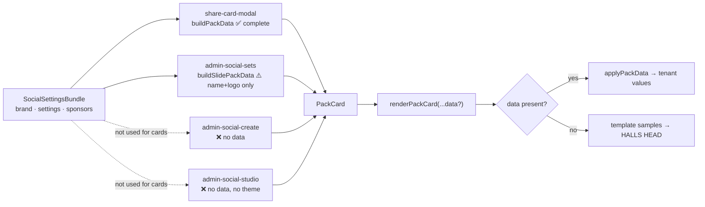
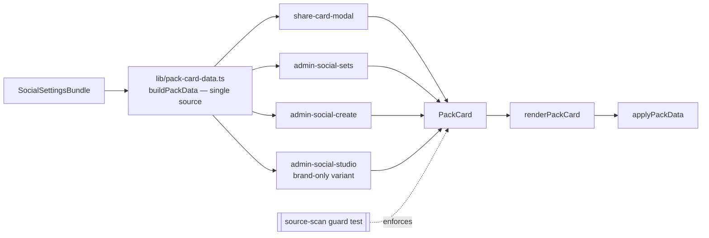

# fix: Social Studio tenant branding — stop Halls Head leaking into every tenant's cards

**Phase 1 of a sequenced 3-phase effort.** This plan covers Phase 1 only. Phases 2–3
(multi-pack renderer refactor, Packs B–E) are documented under
[Deferred to Follow-Up Work](#deferred-to-follow-up-work) and are explicitly out of scope here.

---

## Goal Capsule

A Mandurah admin opens the Social Media Studio and sees **Mandurah's** logo, name, hashtag,
sponsor and colours on every card preview and every gallery thumbnail — not Halls Head's.
The leak class is closed by a guard test so it cannot silently return, and the
Broadcast-Dark template samples stop shipping another club's identity as their default.

Halls Head (tenant #1, the demo) must render byte-identical to today.

---

## Problem Frame

The pack renderer has a working tenant-data seam. Most call sites use it. Two do not, and a
third uses it incompletely — so tenants see Halls Head branding across the Studio.

`renderPackCard()` (`artifacts/cricket-club/src/lib/pack-render.ts`) accepts an optional
`data?: PackCardData` argument and applies it via `applyPackData()`:

```
if (data) applyPackData(bound, data, input.kind);
```

When `data` is absent the overlay never runs and the template's `textField(...)` **sample
defaults** survive into the rendered card. Those samples are Halls Head's real identity —
`"HALLS HEAD"`, `"#HALLSHEAD"`, `"CRICKET CLUB · EST 1991"`, `"eSA Sport"`. Separately,
`PackCard` derives its default token palette from `data.brand` via `brandDefaultTokens()`;
with no `data` it falls back to the hard-coded Broadcast-Dark palette, so the tenant also
loses its colours.

### The three defects

| # | Site | Defect | Symptom |
|---|------|--------|---------|
| D1 | `artifacts/cricket-club/src/pages/admin-social-create.tsx` (`<PackCard>` mount, ~line 156) | No `data` prop; `theme={null}` | **The reported screenshot.** Composer preview shows `HALLS HEAD` / `#HALLSHEAD` / `recruitment by eSA Sport` in Broadcast-Dark gold |
| D2 | `artifacts/cricket-club/src/pages/admin-social-studio.tsx` (`<PackCard>` mount, ~line 290) | No `data`, no `theme` | All 20 card-kind gallery thumbnails show Halls Head branding for every tenant |
| D3 | `artifacts/cricket-club/src/pages/admin-social-sets.tsx` (`buildSlidePackData`, ~line 399) | Brand narrowed to `{ name, logoUrl }` | Carousel slides drop `tagline`, `primaryColour`, `backgroundColour`, `juniorsColour` → slides render in **Halls Head gold**, not the tenant accent |

D3 was not in the original report. It is the same root cause seen from a different angle:
each call site hand-rolls its own `PackCardData`, so they drift.

### Reference implementations (already correct — do not regress)

- `artifacts/cricket-club/src/components/share-card-modal.tsx` — `buildPackData(transform)`
  (~line 478) is the canonical, complete builder; used by the live preview mount (~line 744)
  and by `stillOptions()` (~line 388) for server export.
- `artifacts/cricket-club/src/pages/card-render-harness.tsx` — passes `data` straight through
  (~line 184).

### Why this is a wiring fix, not new plumbing

Every input the fix needs is already resolved next to the broken call sites:
`admin-social-create.tsx` already calls `useBrand()`; `admin-social-studio.tsx` already holds
the `SocialSettingsBundle` as `bundle` (~line 123) and already reads `bundle?.brand` (~line 139).

---

## Product Contract

| ID | Requirement |
|----|-------------|
| R1 | The Studio composer preview renders the signed-in tenant's logo, club name, tagline, hashtag, sponsors, presenting sponsor and brand colours — never another tenant's |
| R2 | The Studio card-type gallery thumbnails render the signed-in tenant's branding, so the gallery previews the tenant's own look |
| R3 | Carousel slides carry the tenant's full brand (including colours and tagline), matching single-card renders |
| R4 | All `PackCardData` construction flows through one shared builder, so no call site can silently omit fields |
| R5 | A tenant with no configured hashtag / tagline / presenting sponsor gets an **empty** value, never a fallback to another club's literal |
| R6 | Broadcast-Dark template sample defaults contain no club-identifying literals — no "Halls Head", "#HALLSHEAD", "EST 1991", or "eSA Sport" |
| R7 | A regression guard fails the build if a `PackCard` mount omits tenant data, or if a data-bearing render emits a known Halls Head literal |
| R8 | Halls Head (tenant #1) **real card** output is unchanged — pixel-identical across all kinds, sizes and sponsor states. Scoped deliberately: U3 neutralises sample *content* fields that `applyPackData` does not overlay (`role`, `formerClub`, `headline`, `inningsLabel`, `resultLine`, ladder team names), so Halls Head's **gallery thumbnails** will show neutral placeholder copy instead of Halls Head prose. That is intended. The invariant is on data-bearing renders, not sample previews |

---

## Key Technical Decisions

**KTD1 — One shared `buildPackData` module, not four hand-rolled copies.**
Extract the modal's builder into `artifacts/cricket-club/src/lib/pack-card-data.ts` as a pure
function taking the already-resolved bundle/sponsors/photo inputs. D3 exists precisely because
the sets page wrote its own narrower version; a single builder makes the omission class
impossible. Keep it a plain function (not a hook) so the server harness path and tests can call
it without React.

**KTD2 — The gallery renders tenant brand but keeps sample *content*.**
The gallery's job is "what does a Match Result card look like *for us*". So it passes brand,
hashtag and colours, but keeps `sampleCardInput(kind)`'s placeholder stats and names — a
gallery thumbnail is not a real card. This reverses the current `applyPackData` docstring,
which names "gallery previews" as an intentional sample-default case; that comment must be
updated in the same change or it will mislead the next reader.

**KTD3 — Neutral samples, not empty samples.**
Replace Halls Head literals with neutral placeholders (`"YOUR CLUB"`, `"#YOURCLUB"`,
`"Your Sponsor"`, `"CRICKET CLUB"`) rather than empty strings. Empty samples would collapse
template layout in the no-data path and make the gallery look broken. This is a **sample-only**
change — it cannot affect a data-bearing render, which is what protects R8.

**KTD4 — Guard at the source level, not only the render level.**
A render-level test cannot catch "someone added a sixth `<PackCard>` mount without `data`".
Add a source-scan test over `artifacts/cricket-club/src/**` asserting every `<PackCard`
JSX mount includes a `data` prop, with an explicit allowlist (currently empty) for any
deliberate sample-only mount. Pair it with the existing render-level leak assertions.

**KTD5 — No API change.**
`CardRenderStillInput.options` is already `additionalProperties: true` in
`lib/api-spec/openapi.yaml`, so richer `data` flows to the server harness with no spec edit
and no codegen run.

---

## High-Level Technical Design

Current state — the seam exists but three paths bypass or narrow it:



Target state — one builder feeds every mount:



Resolution order inside `applyPackData` is unchanged: `imagesOverride > input > bind`, with
brand/sponsor/photo overlays between. Token precedence stays `junior > override > theme > brand`.

---

## Implementation Units

### U1. Extract the shared `buildPackData` builder

**Goal:** One module that builds a complete `PackCardData` from resolved tenant inputs, so no
call site can omit a field.

**Requirements:** R4 (enables R1, R2, R3)

**Dependencies:** none

**Files:**
- `artifacts/cricket-club/src/lib/pack-card-data.ts` (new)
- `artifacts/cricket-club/src/lib/pack-card-data.test.ts` (new)
- `artifacts/cricket-club/src/components/share-card-modal.tsx` (modify — delegate to the new builder)

**Approach:** Move the body of the modal's `buildPackData` (~line 478) into a pure exported
function. Signature should take an options object of already-resolved values — bundle/brand,
hashtag, sponsors, presenting sponsor name, photo url, photo transform, photo placement,
image overrides — all optional except brand, and return a fully-populated `PackCardData`.
Provide a narrow convenience wrapper (or default args) for the brand-only case U2 needs.
Behaviour must be identical to today's modal builder: the modal is the reference, and its
output must not change.

**Patterns to follow:** the existing modal builder is the contract, including its comments
about which colours seed which token. Keep the `photoPlacement === "feature" ? "fullBleed" : "contained"`
mapping and the `imagesOverride` "only when non-empty" rule — both exist to keep renders
byte-identical.

**Test scenarios** (`pack-card-data.test.ts`):
- Given a full bundle, returns every `PackCardData` field populated from it (brand name,
  tagline, logoUrl, primaryColour, backgroundColour, juniorsColour, hashtag, sponsors,
  presentingSponsorName, photoUrl, photoTransform, photoPlacement)
- Given `brand: null`, returns `brand: null` without throwing
- Given no hashtag configured, returns `hashtag` as empty/nullish — never a fallback literal (R5)
- Given an empty `imageOverrides` map, omits `imagesOverride` entirely (byte-identical render guarantee)
- Given a non-empty `imageOverrides` map, passes it through unchanged
- `photoPlacement: "feature"` maps to `"fullBleed"`; anything else maps to `"contained"`
- Brand-only variant returns the full colour set, not just `{name, logoUrl}` (the D3 regression)

**Verification:** the modal's rendered output is unchanged — existing `pack-render.test.ts`
and any modal tests still pass with no assertion edits.

---

### U2. Wire the two unwired mounts + fix the narrowed one

**Goal:** Close D1, D2 and D3 — every `PackCard` mount receives complete tenant data.

**Requirements:** R1, R2, R3

**Dependencies:** U1

**Files:**
- `artifacts/cricket-club/src/pages/admin-social-create.tsx` (modify)
- `artifacts/cricket-club/src/pages/admin-social-studio.tsx` (modify)
- `artifacts/cricket-club/src/pages/admin-social-sets.tsx` (modify)
- `artifacts/cricket-club/src/lib/pack-render.ts` (modify — docstring only)

**Approach:**
- **D1 / create page:** the page currently has only `useBrand()`. It needs the social-settings
  bundle for hashtag + sponsors, matching what the modal reads. Load it with the same
  `useGetSocialSettings()` hook the modal (~line 99), studio (~line 122) and sets page
  (~line 299) already use, cast to `SocialSettingsBundle`, pass it through the U1 builder,
  and supply the tenant's effective theme instead of `theme={null}`. Sponsors must be
  kind-filtered the same way the modal does (via the existing `useSponsors` hook in
  `artifacts/cricket-club/src/components/share-card-modal/use-sponsors.ts`) so a sponsor
  configured for other kinds does not appear here.
- **D2 / studio gallery:** `bundle` is already in scope (~line 123). Pass a brand-derived
  `PackCardData` (KTD2 — brand/hashtag/colours yes, sample card content retained) and the
  tenant's default theme so thumbnails match what the composer will produce.
- **D3 / sets page:** replace the hand-rolled `buildSlidePackData` brand narrowing with the
  U1 builder so slides carry the full colour set and tagline. Keep the existing per-slide
  sponsor filtering (`slideSponsors(slide)`) and per-slide theme.
- **Docstrings:** update `applyPackData`'s comment in `pack-render.ts` (~line 1030–1036) — it
  currently cites "gallery previews" as an intentional sample-default case, which KTD2 reverses.
  Also update `PackCardData`'s interface docstring (~line 72–83) if it repeats the claim.

**Patterns to follow:** `share-card-modal.tsx` for how bundle → hashtag → sponsors →
`buildPackData` is assembled; `admin-social-sets.tsx` for the per-slide theme pattern.

**Test scenarios:**
- Composer preview for a tenant whose brand is *not* Halls Head renders that tenant's club
  name and hashtag, and contains none of `HALLS HEAD` / `#HALLSHEAD` / `EST 1991` / `eSA Sport`
- Composer preview applies the tenant's `primaryColour` as the pack accent (not Broadcast-Dark gold)
- Gallery thumbnail for a non-Halls-Head tenant renders that tenant's club name and accent
- Gallery thumbnail still renders sample card *content* (placeholder stats/names present) — KTD2
- Carousel slide render includes the tenant's `primaryColour`-derived accent (the D3 regression:
  assert a slide built through the new path differs from one built with `{name, logoUrl}` only)
- A tenant with no configured hashtag renders no hashtag rather than another club's (R5)
- Sponsors on the composer preview are kind-filtered — a sponsor scoped to other kinds is absent

**Verification:** loading the Studio as a non-Halls-Head tenant shows that tenant's branding in
both the composer preview and every gallery thumbnail.

---

### U3. Neutralise the Broadcast-Dark template samples

**Goal:** Template sample defaults stop shipping Halls Head's identity, so the no-data path is
safe by construction (defence in depth behind U2).

**Requirements:** R6

**Dependencies:** none (independent of U1/U2 — but land after U2 so any behaviour change is
attributable)

**Files** (all under `artifacts/cricket-club/src/lib/pack-templates/broadcast-dark/`):
- `fragments.ts` — `clubName` ("HALLS HEAD"), `clubTagline` ("CRICKET CLUB · EST 1991")
- `new-signing.ts`, `big-moment.ts`, `century.ts`, `debut.ts`, `five-for.ts`, `record.ts`,
  `milestone.ts`, `new-cap.ts`, `premiership.ts`, `weekend-wrap.ts`, `countdown.ts`,
  `ladder.ts`, `match-day.ts`, `match-result.ts`, `team-list.ts`, `player-spotlight.ts`,
  `grade-leader-runs.ts`, `grade-leader-wickets.ts`, `club-leaderboard-runs.ts`,
  `club-leaderboard-wickets.ts` — `clubHashtag`, `hashtags`, `hashtagsExtra`, `sponsorPresentedBy`

Also prose samples naming Halls Head:
- `milestone.ts` (~line 75), `weekend-wrap.ts` (~line 104), `ladder.ts` (~line 106),
  `match-result.ts` (~lines 119, 122), `big-moment.ts` (~line 74)
- `artifacts/cricket-club/src/lib/sample-card-inputs.ts` (~line 211 — ladder row team name)

Tests to update:
- `artifacts/cricket-club/src/lib/pack-render.test.ts` (~lines 69, 300–301, 361–363 assert the
  Halls Head samples ARE present — these must flip to the neutral placeholders)
- `artifacts/cricket-club/src/lib/pack-templates/broadcast-dark.test.ts` (check for sample assertions)

**Approach:** Mechanical substitution to neutral placeholders per KTD3. Keep string *shape*
(length, separators like `·`) close to the originals so layouts that were tuned against them
do not reflow in the gallery. Do not touch the HTML layout strings — only `textField(...)`
sample arguments and `sample-card-inputs.ts` data.

**Execution note:** This unit is the one that can break the Halls Head parity invariant if done
carelessly. Run the parity test (`pack-render.test.ts` ~line 463, "leaves Halls Head visually
identical") before and after and confirm it is untouched; HH renders through real data, so a
sample-only change must not move it.

**Test scenarios:**
- Every template's sample defaults contain none of: `Halls Head`, `HALLS HEAD`, `HALLSHEAD`,
  `EST 1991`, `eSA Sport`, `PEELPREMIERLEAGUE` (assert across the whole pack manifest, so a
  future template cannot reintroduce one)
- A no-`data` render (the gallery path) emits the neutral placeholder, not a club literal
- The Halls Head visual-parity test still passes unchanged
- Templates whose layout depends on sample length still render without overflow at all three
  sizes (square, portrait, story)

**Verification:** grepping `artifacts/cricket-club/src/lib/pack-templates/` for the Halls Head
literal set returns only comments, never `textField` samples.

---

### U4. Regression guard

**Goal:** This leak class cannot return silently.

**Requirements:** R7

**Dependencies:** U2, U3

**Files:**
- `artifacts/cricket-club/src/lib/pack-card-mounts.test.ts` (new — source-scan guard)
- `artifacts/cricket-club/src/lib/pack-render.test.ts` (extend)

**Approach:**
- **Source-scan test (KTD4):** scan `artifacts/cricket-club/src/**` for `<PackCard` JSX mounts
  and assert each includes a `data` prop. Maintain an explicit, empty-by-default allowlist so a
  deliberate sample-only mount must be justified in code review rather than slipping through.
  Report the offending file and line on failure so the message is actionable.
- **Render-level:** extend the existing leak assertions so they also cover the **no-`data`**
  path (now safe because U3 neutralised the samples). Today those assertions only run on
  data-bearing renders.

**Test scenarios:**
- Guard fails (with the file path in the message) when given a fixture mount missing `data`
- Guard passes against the real `src/` tree after U2 lands
- Guard's allowlist mechanism works — an allowlisted path does not fail
- No-`data` render of every card kind at every size emits none of the Halls Head literal set
- Data-bearing render with a brand-less tenant emits empty values, not sample literals (R5)

**Verification:** deliberately removing the `data` prop from any one mount makes the suite fail.

---

## Scope Boundaries

### In scope
- Wiring tenant data into the two unwired and one narrowed `PackCard` call sites
- Extracting the shared `PackCardData` builder
- Neutralising Broadcast-Dark template sample literals
- The regression guard

### Non-goals
- Any change to `applyPackData`'s resolution semantics (`override > input > bind`) or token
  precedence (`junior > override > theme > brand`)
- Any change to Halls Head's rendered output
- Any OpenAPI/spec change (KTD5)
- Juniors isolation or the forced `JUNIOR_PANEL` (`#42342B`) behaviour
- The canvas (BYO) renderer path — already brand-wired

### Deferred to Follow-Up Work

**Phase 2 — Multi-pack renderer refactor + Pack B (Gold Foil) as the proving pack.**
The Pack A follow-ups doc states packs are drop-in ("template assets plus a `design-packs.ts`
registration entry, no renderer changes"). **That is not accurate and should be corrected there.**
`pack-render.ts` imports `BROADCAST_DARK_PACK` directly and builds a module-level
`DESIGN_BY_KIND` map from that single pack; `renderPackCard()` has no `packId` parameter. Phase 2
needs a pack registry keyed by `packId`, and `packId` threaded from the tenant's selected
`card_templates` row (`source="pack"`, `packId`/`packVariant`, materialised by
`ensurePackTemplates` in `artifacts/api-server/src/lib/design-packs.ts`) through
`PackCard` → `renderPackCard` → `stillOptions` → carousel slides → the render harness, plus a
`PACKS` entry per pack.

**Phase 3 — Packs C (Bold Type), D (Neon Night), E (Sunset).**

Source bundles are extracted at
`C:\ovho\social-media-templates-for-ovation-studio\project\`
(`Pack B - Gold Foil.dc.html`, `Pack C - Bold Type.dc.html`, `Pack D - Neon Night.dc.html`,
`Pack E - Sunset.dc.html`, plus `support.js`, `image-slot.js`, and the `_ds/` design-system
bundle). Verified during planning: all four contain exactly the same 20 designs and the same
`data-card-kind` mapping as Pack A, and ship the **story format only** (1080×1920) — Pack A's
portrait/square `shared` layouts were authored in-repo during the original U1, so B–E each need
~20 story transcriptions **plus** ~20 authored reflow layouts. Sizing the migration from the
follow-ups doc's "mostly transcription" estimate will under-count by roughly half.

`Pack A - Broadcastlight.dc.html` (a light-mode Pack A variant) is present in the bundle but
explicitly out of scope per the user.

---

## Risks & Dependencies

| Risk | Impact | Mitigation |
|------|--------|------------|
| U3 accidentally shifts Halls Head's render (R8 breach) | High — HH is the demo tenant | Sample-only edits; HH renders through real data. Run the existing parity test before and after; it must stay green with no assertion edits |
| Neutral samples reflow gallery layouts tuned to Halls Head string lengths | Medium — cosmetic | KTD3 keeps placeholder shape/length close to the originals; U3 test scenarios check all three sizes for overflow |
| The create page needs the settings bundle it does not currently load | Medium — could add a loading state to a page that had none | Reuse the exact query the modal and sets page already use; render the preview with brand-only data until the bundle resolves rather than flashing sample literals |
| Source-scan guard is brittle against formatting (multi-line JSX, prop spreading) | Low — false failures | Match on the mount element across lines rather than a single-line regex; allowlist escape hatch exists |
| Gallery now issues per-thumbnail brand-aware renders | Low — 20 thumbnails | Tokens are memoised in `PackCard`; brand object is stable per tenant. Watch for a new render loop if the builder returns a fresh object identity each render — memoise the builder result |

**Note:** the last row is a real trap. `PackCard`'s `html` memo depends on `data`; a builder
returning a new object every render will defeat it. Memoise the built `PackCardData` at each
call site.

---

## Verification Contract

1. `pnpm run typecheck` passes
2. `pnpm --filter @workspace/cricket-club run test` passes, including:
   - the new `pack-card-data.test.ts`
   - the new `pack-card-mounts.test.ts` guard
   - the existing Halls Head visual-parity test, **unchanged**
   - the existing preview/harness determinism test (`pack-render.test.ts` ~line 665), unchanged
3. Manual: sign in as a non-Halls-Head tenant (Mandurah) and confirm the composer preview and
   all gallery thumbnails show that tenant's logo, name, hashtag, sponsor and colours
4. Manual: sign in as Halls Head and confirm cards look exactly as before

**Local test caveat** (from the Pack A follow-ups doc, still current): `pnpm-workspace.yaml`
strips native win32 binaries via `overrides: '-'`, so `vitest` may not run locally on Windows
without reinstating the `@rollup/*` and `@esbuild/*` win32 binaries. Full-package `tsc -p` is
also polluted by pre-existing `TS6305`/`TS7006` noise. CI is the authoritative gate.

---

## Definition of Done

- [ ] R1 — composer preview renders the signed-in tenant's branding
- [ ] R2 — gallery thumbnails render the signed-in tenant's branding
- [ ] R3 — carousel slides carry the full brand including colours and tagline
- [ ] R4 — all `PackCardData` construction flows through the shared builder
- [ ] R5 — unset hashtag/tagline/presenting sponsor render empty, never another club's literal
- [ ] R6 — no Halls Head literals remain in template sample defaults
- [ ] R7 — guard test fails when a mount omits `data`
- [ ] R8 — Halls Head parity test green and unedited
- [ ] `applyPackData` / `PackCardData` docstrings updated to match KTD2
- [ ] Follow-ups doc corrected: Packs B–E are not drop-in (renderer is single-pack; bundles are story-only)

---

## Open Questions

**Q1 — Do the create page and gallery have sensible loading states?** The create page does not
currently load the settings bundle. If it renders before the bundle resolves, the preview should
fall back to brand-only data (available synchronously from `useBrand()`) rather than flashing
sample literals. The studio gallery already loads `bundle` but currently renders thumbnails
without waiting on it — after U2 the 20 thumbnails must not flash neutral placeholders before
brand arrives. Resolve both during U2 by observing actual load behaviour.

**Q2 — Should the gallery thumbnail use the tenant's *default* theme or no theme?** KTD2 says
pass the tenant's default so thumbnails predict the composer output. If no default theme is
configured, brand-derived tokens are the baseline. Confirm during U2 that `defaultByKind`
(already computed in the studio page) is the right source.

**Q3 — Exact neutral placeholder wording.** KTD3 proposes `"YOUR CLUB"` / `"#YOURCLUB"` /
`"Your Sponsor"` / `"CRICKET CLUB"`. Low-stakes; implementer's call if a better fit emerges,
provided no club-identifying literal is introduced.

---

## Sources & Research

- [Pack A social templates follow-ups](../follow-ups/2026-07-23-pack-a-social-templates-follow-ups.md)
  — origin of themes A1–A9/B1–B3/C1–C4, all marked shipped. This plan closes the call sites
  those items missed.
- [PR #67](https://github.com/AWyborn2/Ovation/pull/67) — merged 2026-07-23, docs-only.
- [Card & social enhancements plan](2026-07-24-001-card-social-enhancements-plan.md) — A7/A9
  context for `sponsorPresentedBy` and `clubTagline`.
- `AGENTS.md` — OpenAPI-first constraint, pnpm-only, repo topology.
- `CLAUDE.md` — white-label transition context; curated club content is the moat.
- Bundle inspection (this session): all five packs carry the same 20 `data-card-kind` designs;
  B–E ship story format only; Pack A has ~110 `sc-if` sponsor branches vs ~45 in B/E.
