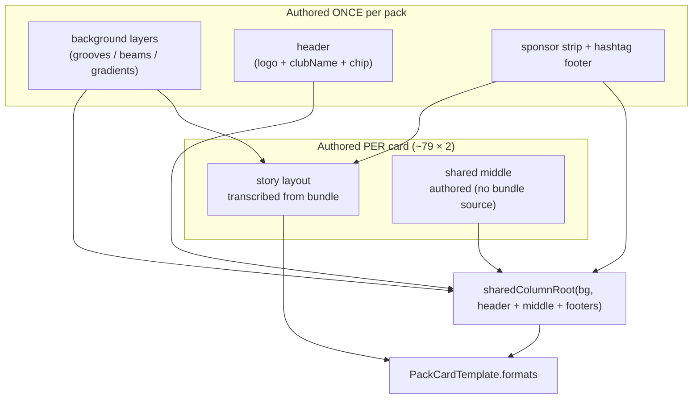
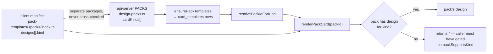

# feat: Complete the design-pack catalogue — Packs B–E, all cards, all sizes

**This is a multi-session programme, not a single PR.** ~79 card designs remain, each
needing a story layout plus a portrait/square layout. The plan's job is to make every
intermediate state shippable and to put the correctness guardrails in place *before*
the bulk transcription starts.

---

## Goal Capsule

A tenant can pick any of the five design packs and get every card kind, in all three
formats (story 1080×1920, portrait 1080×1350, square 1080×1080), rendered in that
pack's design with their own branding.

Until a pack is complete, it offers only the kinds it can actually render, and the rest
fall back to Broadcast Dark. No state of this programme ever shows a tenant a blank or
half-rendered card.

---

## Problem Frame

Phases 2a/2b made the renderer multi-pack and landed the first Gold Foil card. What
remains is bulk: transcribing 79 card designs from the Claude Design bundles and
authoring the portrait/square layouts the bundles don't provide.

### What is actually left, measured

Each bundle contains 20 designs on the same `data-card-kind` mapping as Pack A
(18 distinct kinds; `gradeLeader` and `clubLeaderboard` carry two category-preset
designs each). Format coverage, from parsing each card wrapper for
`<sc-if value="{{ isNotStory }}">`:

| Pack | Cards | Have a non-story branch | Story transcriptions left | Portrait/square to author |
|---|---|---|---|---|
| A — Broadcast Dark | 20 | 20 | 0 (complete) | 0 |
| B — Gold Foil | 20 | 2 | 19 | 18 |
| C — Bold Type | 20 | 2 | 20 | 18 |
| D — Neon Night | 20 | 2 | 20 | 18 |
| E — Sunset | 20 | 2 | 20 | 18 |

**≈79 story transcriptions, ≈7 non-story transcriptions, ≈72 portrait/square layouts to
author.**

### The packs are not reskins of one another

A positional fingerprint over layout-bearing signals (position/flex/slot/repeat/sponsor
markers), each pack's card against Pack A's same-slot card:

- **story: ~0.01** average similarity. `b-result` is the outlier at 0.25; every other
  card scores 0.00.
- **non-story: ~0.50**, across only the 2 cards per pack that have one.

So each pack's story layout is a genuinely distinct composition. Any approach that
derives Packs B–E from Pack A by recolouring is not supported by the evidence and must
not be assumed. This corrects an earlier working assumption in the follow-ups doc.

### Why the missing layouts must be authored, not skipped

`PackTemplateFormats` (`artifacts/cricket-club/src/lib/pack-templates/types.ts`) is
`{story, portrait, square} | {story, shared}`. **A story-only pack is not expressible.**
Shipping packs story-only would require a new type arm, renderer handling in
`selectFormatHtml`, and per-pack size gating in the UI — a renderer change to avoid
design work, which trades a bounded authoring task for an unbounded correctness one.

The mitigation is structural, not a shortcut: Pack A's cards compose their non-story
layout as `sharedColumnRoot(backgroundLayers, header + middle + footers)`. Header,
background and footers are pack-level fragments authored **once per pack**; only the
`middle` differs per card. Gold Foil's `fragments.ts` already follows this shape. So the
per-card unit of work is "author the shared middle", not "author a whole layout".

---

## Product Contract

| ID | Requirement |
|----|-------------|
| R1 | Every registered pack renders every kind it declares, at all three sizes, with no unresolved `{{placeholders}}` |
| R2 | A pack only ever declares kinds it can actually render; undeclared kinds fall back to Broadcast Dark |
| R3 | The client manifest and the api-server `PACKS[].cardKinds` agree on coverage, enforced by a test rather than by discipline |
| R4 | Every pack's design for a kind uses the same field keys as Broadcast Dark's design for that kind |
| R5 | No pack ships a club-identity literal in a sample default or in hard-coded markup |
| R6 | Pack A output stays byte-identical throughout |
| R7 | Each pack's visual identity is preserved — a pack's cards are recognisably that pack, not Broadcast Dark recoloured |
| R8 | Every intermediate state is shippable: partial coverage never produces a blank or half-rendered card |

---

## Key Technical Decisions

**KTD1 — Author the portrait/square layouts; do not add a story-only pack arm.**
Rationale in the Problem Frame: story-only isn't expressible without a renderer change,
and that change would introduce per-pack size gating across the modal, carousel and
harness. Authoring is bounded work with a known shape; the renderer change is not.

**KTD2 — Per-card work is a story transcription plus a shared *middle*.**
Pack-level fragments (background layers, header, sponsor strip, hashtag footer) are
authored once per pack, as Gold Foil's `fragments.ts` already does. This is what makes
~72 layouts tractable.

**KTD3 — Coverage grows card by card; the two manifests are the contract.**
`packSupportsKind(kind, packId)` already gates rendering and `renderPackCard` returns
`""` for an unknown kind, so partial coverage is safe today. The risk is *drift between
the two registries*, which U1 converts from a convention into a test.

**KTD4 — Field-key parity is a test, not a review item.**
`bindInput` maps a `ShareCardInput` onto placeholder keys per card **kind**, not per
pack. A pack that renames a key renders sample defaults on real data — silently, and
only for that pack's tenants. `gold-foil.test.ts` pins this for one kind; U2 generalises
it to every pack × kind pair. This is the single highest-value guardrail in the plan,
because the failure is invisible in review and invisible in a gallery preview.

**KTD5 — One PR per pack, landed as per-card commits.**
A pack is a coherent review unit; 20 cards in one commit is not. Each commit adds one
card to both manifests, keeping every commit shippable.

---

## High-Level Technical Design

### Per-card composition — where the work actually goes

### Coverage contract — the drift U1 closes

The failure mode: a kind declared **server-side only** materialises a `card_templates`
row, so `resolvePackIdForKind` can select that pack for the kind — but the client
manifest has no design, so `packSupportsKind` is false and the card silently falls back.
The tenant chose Gold Foil and got Broadcast Dark.

---

## Implementation Units

**U1, U2, U7 and U8 are ordinary commit-sized units. U3–U6 are deliberately batch
units** — one per pack, ~20 cards each — because a per-card unit list would run to 79
entries and say the same thing 79 times. Each is landed as per-card commits (see each
unit's execution note); the unit boundary is the PR, not the commit.

### U1. Coverage-contract parity test

**Goal:** Make client/server pack coverage disagreement a test failure.

**Requirements:** R3, R8

**Dependencies:** none

**Files:**
- `artifacts/api-server/src/lib/design-packs.test.ts` (modify), or a new shared test —
  see Approach
- `artifacts/cricket-club/src/lib/pack-templates/registry.test.ts` (modify)

**Approach:** The two registries live in different packages, so neither can import the
other directly. Two workable shapes, implementer's call:
(a) a test in one package that reads the other's source and extracts the declared kinds;
(b) a small shared constant module both import.
Prefer (b) if a natural home exists; (a) is acceptable and avoids a new workspace edge.
Whichever is chosen, the assertion is: for every pack id present in both registries, the
declared kind sets are equal; and every pack id appears in both.

**Test scenarios:**
- Every registered client pack id has a matching api-server `PACKS` entry, and vice versa
- For each pack, client `designs[].kind` set equals server `cardKinds` set
- A pack declared server-side with a kind the client lacks fails with both the pack id
  and the offending kind named
- The reverse (client-only kind) also fails
- Passes against the current tree (Pack A full, Gold Foil `matchSummary` only)

**Verification:** deliberately adding a kind to one registry only turns the suite red.

---

### U2. Field-key parity test across packs

**Goal:** Guarantee every pack's design for a kind binds the same keys as Broadcast
Dark's, so real data never silently renders as samples.

**Requirements:** R4

**Dependencies:** none

**Files:**
- `artifacts/cricket-club/src/lib/pack-templates/pack-lint.test.ts` (modify)
- `artifacts/cricket-club/src/lib/pack-templates/gold-foil.test.ts` (modify — fold its
  one-kind version into the general check)

**Approach:** For each registered pack and each of its designs, compare the template's
declared field keys against Broadcast Dark's design for the same kind (and same
`categoryPreset` where the kind carries two). Broadcast Dark is the reference because
`bindInput` was written against it.

**Direction matters — get this the right way round.** The naive assertion "every Pack A
key must appear in the pack" is **wrong** and would contradict the existing lint: a pack
whose design genuinely has no POTM photo would be forced to declare an unused field, and
`pack-lint.test.ts` already fails any declared field that appears in no format html.

The correct, mechanically testable assertion is the other direction:

> every key a pack declares for a kind must **either** exist in Pack A's design for that
> kind, **or** be on a small explicit allowlist of pack-specific extras.

That catches the failure that actually matters — a **rename** (`potmName` for
`potm.name`), which lands in neither set — without forcing a pack to declare fields its
design does not use. Gold Foil's `photo` and `clubHashtag` are the current allowlist
entries; keep the allowlist per-pack-per-kind and small, so adding to it is a visible
review decision rather than a silent escape hatch.

Derive Pack A's reference set from its declared fields; do not hand-maintain it.

**Execution note:** Write this as a failing test first by temporarily renaming a key in
Gold Foil's match-result — confirm it fails and names the pack, kind and key — then
revert. A parity test that cannot fail is worse than none.

**Test scenarios:**
- Every pack × kind pair passes against the current tree
- Renaming a key in a non-Pack-A design fails, naming pack, kind and key
- A pack declaring a key that is neither in Pack A's design nor allowlisted fails
- A pack **omitting** a Pack A key its design does not use **passes** (this is the case
  the naive direction would wrongly fail)
- Allowlisted extras (Gold Foil `photo`, `clubHashtag`) pass
- Kinds with two category-preset designs are compared against the matching preset

**Verification:** the temporary-rename experiment above fails, then passes on revert.

---

### U3. Pack B (Gold Foil) — remaining 19 cards

**Goal:** Gold Foil covers all 18 kinds at all three sizes.

**Requirements:** R1, R2, R5, R7, R8

**Dependencies:** U1, U2

**Files:**
- `artifacts/cricket-club/src/lib/pack-templates/gold-foil/*.ts` (19 new card modules)
- `artifacts/cricket-club/src/lib/pack-templates/gold-foil/fragments.ts` (extend as
  shared shapes emerge)
- `artifacts/cricket-club/src/lib/pack-templates/gold-foil/index.ts` (grow `designs`)
- `artifacts/api-server/src/lib/design-packs.ts` (grow `cardKinds` in lockstep)

**Approach:** Per card: transcribe the story layout from `b-*` in the bundle, then author
the shared middle. `b-clubwkts` has a real non-story branch in the bundle — transcribe
it rather than authoring, and use it as the reference for what a Gold Foil shared layout
should look like. Mirror Broadcast Dark's module structure so the two packs read
alike. Compile `<sc-if>` → `data-sponsors`, `<image-slot>` → `data-slot`, and bind every
hard-coded club literal to the matching placeholder.

**Execution note:** Land one card per commit, growing both manifests together. Run the
pack lint after each card — it is the fast signal for a bad transcription.

**Test scenarios** (per card, via the existing generalised lint — no new per-card test file):
- `pack-lint.test.ts` passes for the card: no runtime constructs survive, every
  placeholder declared, every declared field used, sponsor variants match markup, no
  club-identity literal, renders non-empty with no unresolved placeholders at all three
  sizes and both sponsor states
- U2's field-key parity passes for the card's kind
- U1's coverage parity passes after both manifests are updated
- Repeat-bearing kinds (ladder, team-list, weekend-wrap, club-leaderboard) expand their
  `data-repeat` group and degrade correctly with fewer rows than the layout allows
- Junior-capable kinds still force the brown panel

**Verification:** Gold Foil declares all 18 kinds in both registries; the full pack lint
passes; Pack A parity unchanged.

---

### U4. Pack C (Bold Type) — fragments + 20 cards

**Goal:** Bold Type covers all 18 kinds at all three sizes.

**Requirements:** R1, R2, R5, R7, R8

**Dependencies:** U1, U2 (U3 only as a worked example, not a blocker)

**Files:**
- `artifacts/cricket-club/src/lib/pack-templates/bold-type/` (new: `fragments.ts`,
  20 card modules, `index.ts`)
- `artifacts/cricket-club/src/lib/pack-templates/registry.ts` (register)
- `artifacts/api-server/src/lib/design-packs.ts` (register)

**Approach:** Start by transcribing the pack's own fragments — background layers, header,
sponsor strip, hashtag footer — from its two dual-format cards (`c-result`,
`c-clubwkts`), because those are the only places the bundle shows this pack's non-story
chrome. Then per card as in U3.

**Test scenarios:** as U3, plus:
- The pack renders differently from both Pack A and Gold Foil at every size (the control
  that proves `packId` selection is real for a third pack)
- Registering the pack does not change Pack A or Gold Foil output

**Verification:** as U3, for Bold Type.

---

### U5. Pack D (Neon Night) — fragments + 20 cards

**Goal:** Neon Night covers all 18 kinds at all three sizes.

**Requirements:** R1, R2, R5, R7, R8

**Dependencies:** U1, U2

**Files:** `artifacts/cricket-club/src/lib/pack-templates/neon-night/` (+ both registries)

**Approach / Test scenarios / Verification:** as U4.

---

### U6. Pack E (Sunset) — fragments + 20 cards

**Goal:** Sunset covers all 18 kinds at all three sizes.

**Requirements:** R1, R2, R5, R7, R8

**Dependencies:** U1, U2

**Files:** `artifacts/cricket-club/src/lib/pack-templates/sunset/` (+ both registries)

**Approach / Test scenarios / Verification:** as U4.

---

### U7. Pack picker in the Studio

**Goal:** A tenant can actually choose a pack without hand-editing `card_templates`.

**Requirements:** R2

**Dependencies:** U3 (worth building once a second pack is complete enough to choose)

**Files:**
- `artifacts/cricket-club/src/pages/admin-social-studio.tsx` (modify)
- `artifacts/cricket-club/src/pages/admin-social-studio.test.tsx` (new, if a testable
  seam exists — otherwise cover the selection logic at the helper level)

**Approach:** Today a pack is selected by marking one of its `source: "pack"`
`card_templates` rows as default for a kind — real but undiscoverable. Surface the
registered packs in the Studio and let an admin set a pack per kind (or for all kinds),
writing through the existing `defaultForKinds` mechanism. No new persistence.

Only offer a pack for kinds it declares, so the picker can't select a fallback.

**Test scenarios:**
- Packs list reflects the registry; a pack is offered only for kinds it declares
- Selecting a pack for a kind sets `defaultForKinds` on that pack's row and clears the
  previous pack's claim on that kind
- `resolvePackIdForKind` returns the newly chosen pack for that kind afterwards
- Choosing "all kinds" only applies to kinds the pack declares
- A tenant with no selection still resolves to the default pack

**Verification:** an admin can switch a kind to Gold Foil in the UI and the composer
preview changes.

---

### U8. Correct the follow-ups doc and record the measurements

**Goal:** Stop the stale estimate misleading the next reader.

**Requirements:** —

**Dependencies:** none

**Files:** `docs/follow-ups/2026-07-23-pack-a-social-templates-follow-ups.md` (modify)

**Approach:** The Packs B–E section has now been wrong twice (drop-in; story-only).
Replace the estimate with the measured coverage table and the similarity finding, and
link this plan. State plainly that the packs are not reskins.

**Test expectation:** none — documentation only.

**Verification:** the doc's estimate matches this plan's Problem Frame.

---

## Scope Boundaries

### In scope
- Packs B, C, D, E: all 20 designs each, all three formats
- Coverage-contract and field-key parity tests
- A Studio pack picker (U7)
- Correcting the follow-ups doc

### Non-goals
- Any change to `PackTemplateFormats`, `selectFormatHtml`, or the token pipeline
- Animated/MP4 card variants — packs stay `motionPreset: "none"`
- Re-authoring Pack A
- Per-element style overrides (still deferred from the Pack A work)

### Deferred to Follow-Up Work
- **`Pack A - Broadcastlight.dc.html`** — a light-mode Pack A variant present in the
  bundle, never scoped. Would follow the same shape as U4–U6.
- **Visual verification.** No pack has been checked by eye. Structural tests prove
  binding and absence of leaks; they cannot prove a layout looks right. A visual pass
  per pack is worth its own task — see Risks.

---

## Risks & Dependencies

| Risk | Impact | Mitigation |
|------|--------|------------|
| **Silent field-key drift** — a pack renames a key and renders samples on real data for its tenants only | High; invisible in review and in gallery previews (samples look correct by definition) | U2, built test-first against a deliberate break |
| **Coverage drift between registries** — a tenant picks a pack and silently gets Broadcast Dark | High; looks like the pack "doesn't work" | U1 |
| **No visual verification** — every check is structural | Medium-high; a layout can pass every test and still be broken | Explicit follow-up task; consider a screenshot pass via the existing `/__card-render` harness before offering a pack to tenants |
| **Transcription fatigue across ~158 blocks** | Medium; late cards get less care than early ones | Per-card commits and a lint that runs per card; batch by pack, not by kind |
| **Club-identity literals with no `data-field`** — as found in Gold Foil's story wordmark | Medium; a brand leak that the bundle gives no binding hint for | The R6 lint already fails on the known literal set; treat every hard-coded string in a transcription as suspect |
| **Repeat-bearing kinds are the most error-prone** (ladder, team-list, weekend-wrap, club-leaderboard) | Medium | Named explicitly in U3's test scenarios; transcribe these when fresh, not last |

---

## Verification Contract

1. `pnpm run typecheck` passes (build workspace libs first, or output is swamped by `TS6305`)
2. `artifacts/cricket-club` suite passes, including:
   - `pack-lint.test.ts` over every registered pack
   - U1 coverage parity, U2 field-key parity
   - `registry.test.ts` Pack A byte-identical parity, **unedited**
3. `artifacts/api-server` `design-packs.test.ts` passes
4. For each completed pack: it declares all 18 kinds in both registries and renders every
   kind at all three sizes

**Local caveat:** 29 React-render tests fail locally with `React.act is not a function`,
and tests importing `node:` fail to collect under jsdom. Both pass in CI; CI is the gate.

---

## Definition of Done

- [ ] R1 — every registered pack renders every declared kind at all three sizes, no unresolved placeholders
- [ ] R2 — packs declare only what they can render; undeclared kinds fall back
- [ ] R3 — coverage parity enforced by test
- [ ] R4 — field-key parity enforced by test across every pack × kind
- [ ] R5 — no club-identity literals in any pack
- [ ] R6 — Pack A parity test green and unedited
- [ ] R7 — each pack renders differently from every other at every size
- [ ] R8 — every commit leaves a shippable state
- [ ] Follow-ups doc corrected

---

## Open Questions

**Q1 — Where does the shared coverage constant live, if U1 takes that route?** The client
manifest and api-server `PACKS` are in different workspace packages. A shared constant
needs a home (`lib/` package, or one side importing the other's source). Resolve in U1 by
looking at what the workspace already allows; the source-reading variant is the fallback
that needs no new dependency edge.

**Q2 — Does the Studio picker set a pack per kind or per tenant?** U7 assumes per kind,
because `defaultForKinds` is per kind and partial packs need per-kind granularity. A
per-tenant "use Gold Foil everywhere" control may be the better UX once packs are
complete. Revisit when the first pack reaches full coverage.

**Q3 — Is a screenshot-based visual check worth automating?** The `/__card-render`
harness already produces PNGs server-side. Whether that becomes a review artifact or
stays a manual pass is a judgement call best made after one full pack is visually
checked by hand.

---

## Sources & Research

- Bundles: `Pack B - Gold Foil.dc.html`, `Pack C - Bold Type.dc.html`,
  `Pack D - Neon Night.dc.html`, `Pack E - Sunset.dc.html` (extracted from the handoff zip).
- Coverage and similarity figures measured this session by parsing each card wrapper for
  `isNotStory` and fingerprinting layout-bearing signals per card.
- [PR #102](https://github.com/AWyborn2/Ovation/pull/102) — packId refactor.
- [PR #103](https://github.com/AWyborn2/Ovation/pull/103) — `shared.ts`, Gold Foil
  Match Result, `pack-lint.test.ts`.
- [Pack A follow-ups](../follow-ups/2026-07-23-pack-a-social-templates-follow-ups.md) —
  contains the superseded estimate U8 corrects.
- `AGENTS.md` — OpenAPI-first, pnpm-only. No spec change needed here.
