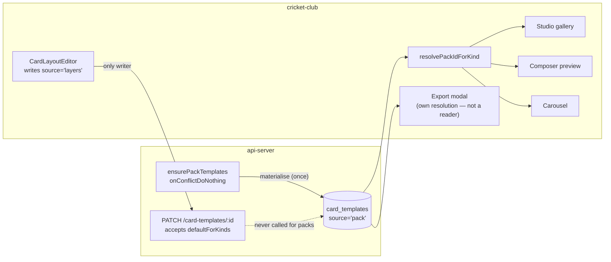
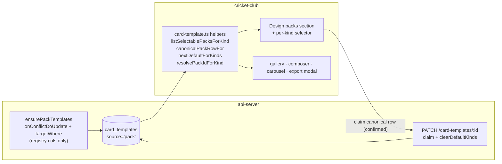
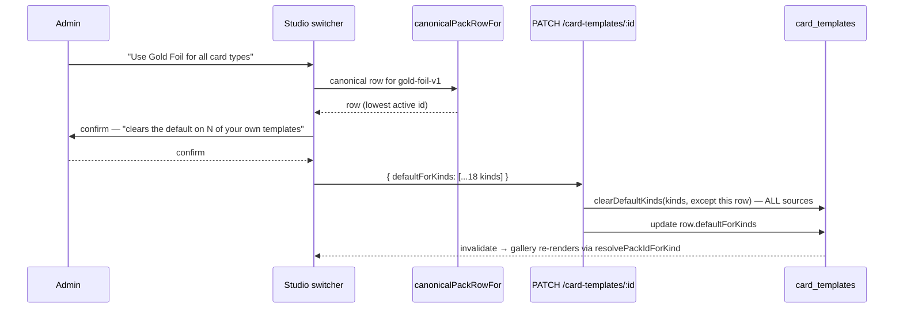

# feat: Design-pack switcher + pack-template editing review

**Depth:** Standard · **Plan type:** feat

---

## Summary

The catalogue now ships five design packs (Broadcast Dark, Gold Foil, Bold Type, Neon Night, Sunset), each covering all 18 card kinds in three formats. Tenants can see them in the Social Studio but **cannot select one** — no UI writes the `card_templates.defaultForKinds` claim that `resolvePackIdForKind` reads. The packs surface only as unlabelled rows in a "Background templates (upload-based)" list whose sole affordance is Delete.

This plan ships the switcher, fixes the stale-pack-row defect that would silently narrow it, contains the blast radius of writing pack claims into a column shared with tenant-authored templates, and delivers the requested written review of how the existing "edit card" / "new template" surfaces should be replaced by editing the pack templates themselves.

---

## Problem Frame

Four problems, verified against the code:

1. **No write path.** `resolvePackIdForKind` (`artifacts/cricket-club/src/lib/card-template.ts:250`) resolves a kind's pack by finding the `source: "pack"` row whose `defaultForKinds` includes that kind. Three call sites honour it — the Studio gallery (`admin-social-studio.tsx:347`), the composer preview (`admin-social-create.tsx:119`) and the carousel (`admin-social-sets.tsx:398`). The only code that _writes_ `defaultForKinds` is the layer editor's save handler (`card-layout-editor.tsx:536`), which always writes `source: "layers"`. So a pack row can never claim a kind.

2. **Pack rows go stale.** `ensurePackTemplates` (`artifacts/api-server/src/lib/design-packs.ts`) inserts pack rows with `onConflictDoNothing` against the `card_templates_pack_unique` index, and caches per-process in `ensuredTenants`. Existing rows are therefore **never updated**. Every pack's `cardKinds` grew during the catalogue build (Sunset shipped at 1 kind and finished at 18), so any tenant whose rows were materialised mid-build holds rows claiming fewer kinds than the pack now renders. `templateAppliesToKind` gates on exactly that column, so the switcher would offer Sunset for `matchSummary` only — a correct-looking UI over stale data.

3. **`defaultForKinds` is one namespace shared with tenant-authored templates.** `clearDefaultKinds` (`artifacts/api-server/src/lib/social-cards-helpers.ts:127-149`) filters on `tenantId` and array overlap only — it is **source-agnostic**. Writing a pack claim therefore strips that kind's default from the tenant's own `layers` and `background` templates. That is not a cosmetic reset: a `layers` default changes which _renderer_ runs (`slideRendersViaPack` returns false when a layout exists, `carousel-slide-render.ts:32`; `isPackCard` is false when a BYO template is selected, `share-card-modal.tsx:394`). Bulk-claiming 18 kinds would silently discard every BYO per-kind assignment a tenant has made.

4. **The packs are presented as something they aren't.** `bgTemplates = templates.filter(t => t.source !== "layers")` (`admin-social-studio.tsx:308`) sweeps pack rows into the BYO background list. They render "No background" (packs are code-rendered, they carry no `backgroundImageUrl`), sit under a label telling the user to edit them in the Cards tab (they can't be), and expose Delete — which is not durable, since `ensurePackTemplates` re-creates the row on the next server process.

**Out of frame:** the deferred per-element style editor (see U4 and Scope Boundaries).

---

## Requirements

| ID  | Requirement                                                                                                                                                                                                                                                    |
| --- | -------------------------------------------------------------------------------------------------------------------------------------------------------------------------------------------------------------------------------------------------------------- |
| R1  | An admin can choose which design pack a card kind uses, from the Social Studio, and see the choice truthfully reflected in that kind's gallery thumbnail — including when a BYO template overrides the pack.                                                   |
| R2  | An admin can apply one pack to every card kind in a single action (the common case), without stepping through 18 selectors.                                                                                                                                    |
| R3  | A pack is only offered for a kind it can actually render.                                                                                                                                                                                                      |
| R4  | Selection survives a server restart and a pack's coverage growing — pack rows reconcile to the registry instead of ossifying at first materialisation.                                                                                                         |
| R5  | Pack rows stop appearing as uploaded background templates, and stop offering Delete.                                                                                                                                                                           |
| R6  | Exactly one code path decides which pack a kind uses; the switcher writes the claim, `resolvePackIdForKind` stays the only reader.                                                                                                                             |
| R7  | Writing a pack claim never silently discards a tenant's curated per-kind template assignment — the cost is stated before it lands.                                                                                                                             |
| R8  | The follow-ups documentation carries a written review of replacing the existing edit/create-card surfaces with editing pack templates, grounded in current code, with a recommendation, and marks the follow-ups entries this work has superseded as resolved. |

---

## Key Technical Decisions

**KTD1 — Two switcher surfaces, one write path.** A "Design packs" section (pack-level, "Use for all card types") satisfies R2; a per-kind selector on each gallery card satisfies R1 and handles the override case. Both call the same helper and the same existing `updateMut`. The Design packs section is placed **above the Card types gallery** so the bulk path is met first in scroll order — placing it below would put 18 per-kind selectors ahead of the action built for the common case.

**KTD2 — Claim on one canonical row per pack.** A pack materialises three rows (square/portrait/story). `resolvePackIdForKind` only reads `packId`, so any row works — but writing to several is wrong: `clearDefaultKinds` strips the kind from every _other_ row on each PATCH, so three sequential writes would leave only the last. The UI claims exactly one deterministic row per pack (the lowest-id active row for that `packId`), chosen by a shared helper so any future caller agrees.

**KTD3 — Selecting a pack is always an explicit claim, including Broadcast Dark.** `resolvePackIdForKind` returns `null` only when no pack row claims the kind **and** no pack row carries the legacy `isDefault` flag (`card-template.ts:258-261`). Nothing sets `isDefault` on a pack row today, but the fallback exists, so U1's `set` clause must leave `isDefault` alone too (KTD4). The switcher always writes a claim to the chosen pack's canonical row; the server clears the kind from the others. The selector renders an explicit leading option for the default pack so the control never holds a value absent from its own option list.

**KTD4 — Reconcile pack rows on ensure, but never clobber tenant state.** Change the insert to `onConflictDoUpdate`, updating only registry-owned columns (`cardKinds`, `name`, `bgWidth`, `bgHeight`, `backgroundKind`, `motionPreset`). `defaultForKinds`, `isActive`, `displayOrder` and `isDefault` are tenant-owned state and must be excluded — a blanket update would reset every tenant's pack choice on every server restart.

**The conflict target must carry `targetWhere`.** `card_templates_pack_unique` is a **partial** index (`.where(sql\`source = 'pack'\`)`, `lib/db/src/schema/social_cards.ts:170-172`). Postgres will not infer a partial index as an ON CONFLICT arbiter from a bare column list — it raises `42P10`. The current bare `onConflictDoNothing()` gets away with it because DO NOTHING needs no arbiter, so this is **not a drop-in swap**. The upsert must be:

```
onConflictDoUpdate({
  target: [tenantId, source, packId, packVariant],
  targetWhere: sql`source = 'pack'`,
  set: { /* registry-owned columns only */ },
})
```

`targetWhere` is supported in the pinned drizzle-orm 0.45.2 (`pnpm-workspace.yaml` catalog; verified in the installed typings). Getting this wrong fails **silently**: `GET /card-templates` wraps the call in `try { … } catch { /* best-effort */ }` (`social-cards.ts:426-428`), so a 42P10 produces no error, no log, and symptoms identical to the stale-row defect U1 exists to fix.

**KTD5 — No OpenAPI change.** `CardTemplateUpdate` (`lib/api-spec/openapi.yaml:9580`) has all-optional properties including `defaultForKinds`, and `PATCH /card-templates/:id` already handles the claim-and-clear transaction with `requireAdmin` + `requireEntitlement` and a tenant-scoped `where`. The switcher is a UI-only change against a complete contract.

**KTD6 — Branching logic in `card-template.ts`; U3 gets a mount test.** Selection logic lands as pure functions next to `resolvePackIdForKind` so the page stays thin. `artifacts/cricket-club` **already has a jsdom component-test harness** — `@testing-library/react`, `src/test/render.tsx` (`renderAt`), `src/test/mock-api.ts` (`installApiMock`), `src/test/setup.ts`, and four existing `.test.tsx` suites (`src/__tests__/smoke.test.tsx`, `brand-leaks.test.tsx`, `card-render-harness-route.test.tsx`, `src/lib/theme-context.test.tsx`). U3 therefore adds a mount test for the state round-trips; the manual render check stays for visual confirmation only.

**KTD7 — Bulk apply is a destructive action and is gated.** Because `defaultForKinds` is a shared namespace (Problem 3), "Use for all card types" is routed through the page's existing `useConfirm` (`admin-social-studio.tsx:243-254`, already used for the far cheaper single-template delete), and the dialog names how many non-pack templates will lose their per-kind default. This is R7.

---

## High-Level Technical Design

Current state — reads resolve, nothing writes:



After this plan — the switcher closes the write loop, reconciliation keeps rows current, and the modal is repointed so R6 is true:



Selection write sequence, including the shared-namespace cost:



---

## Implementation Units

### U1. Reconcile pack rows against the registry

**Goal:** A pack row's registry-owned columns track the code, so a pack whose coverage grew is offered for every kind it now renders (R3, R4).

**Requirements:** R3, R4

**Dependencies:** none

**Files:**

- `artifacts/api-server/src/lib/design-packs.ts` (modify)
- `artifacts/api-server/src/lib/design-packs.test.ts` (modify — call-shape assertions only)
- `artifacts/api-server/src/routes/pack-reconcile-integration.test.ts` (create — real-DB reconciliation)

**Approach:** Replace `onConflictDoNothing()` with the `onConflictDoUpdate({ target, targetWhere, set })` form specified in KTD4. The `targetWhere` predicate is mandatory, not optional polish — without it the statement raises 42P10 and the caller swallows it. The `set` clause carries registry-owned columns only; comment why the exclusion list is load-bearing (those columns are tenant selection state).

The per-process `ensuredTenants` cache **stays as-is**. `PACKS` is compile-time data, so a coverage change always arrives with a new process and the cache can never hide one — reconciliation on first-touch-per-process satisfies R4.

**Execution note:** Split the coverage deliberately, because the existing suite cannot prove this change. `design-packs.test.ts` mocks `@workspace/db` with a stub whose insert chain has no `onConflictDoUpdate`, no notion of a pre-existing row, and no conflict semantics — every scenario that turns on "a row already exists" would mean hand-coding upsert behaviour into the mock and then asserting the mock. Keep that suite for the emitted call shape, and put the reconciliation semantics in a real-DB integration test following the existing `artifacts/api-server/src/routes/tenant-isolation.test.ts` pattern (seeds a synthetic tenant against `DATABASE_URL`). Only a real database exercises partial-index inference — the exact defect class this unit is most likely to hit.

**Patterns to follow:** `routes/tenant-isolation.test.ts` for real-DB seeding/teardown; the partial-index definition at `lib/db/src/schema/social_cards.ts:170`.

**Test scenarios — `design-packs.test.ts` (call shape):**

- The insert call supplies `target`, a `targetWhere` predicate, and a `set` whose keys are exactly `cardKinds`, `name`, `bgWidth`, `bgHeight`, `backgroundKind`, `motionPreset` — no tenant-owned column appears.
- The per-process `ensuredTenants` cache still short-circuits a repeat call for the same tenant.

**Test scenarios — integration (real DB):**

- A tenant with no pack rows gets one row per pack per variant, with `cardKinds` matching the registry entry.
- A tenant whose existing Sunset rows carry `cardKinds: ["matchSummary"]` ends with all 18 kinds after ensure runs — the reconciliation case that unblocks the switcher.
- A row whose `defaultForKinds` holds `["matchSummary"]` still holds it after reconciliation.
- A row the tenant deactivated (`isActive: false`) stays inactive after reconciliation.
- A row with a non-default `displayOrder` keeps that value — the third tenant-owned column KTD4 excludes.
- A row with `isDefault: true` keeps it — the fourth excluded column, which `resolvePackIdForKind` still reads as a fallback.
- Running ensure twice produces no duplicate rows and no column churn on the second pass — proves the partial-index arbiter actually resolved rather than erroring into the caller's catch.

**Verification:** Both suites green. The idempotence scenario is the one that would have caught a missing `targetWhere`; confirm it fails when `targetWhere` is removed before trusting it.

---

### U2. Pack-selection helpers in `card-template.ts`

**Goal:** One tested place that answers "which packs can this kind use" and "which row carries a pack's claim", so the UI stays thin and no second selection reader appears (R3, R6).

**Requirements:** R3, R6

**Dependencies:** none

**Files:**

- `artifacts/cricket-club/src/lib/card-template.ts` (modify)
- `artifacts/cricket-club/src/lib/card-template.test.ts` (modify — already has a `resolvePackIdForKind` describe block to sit beside)
- `artifacts/cricket-club/src/lib/pack-templates/registry.ts` (read-only reference)

**Approach:** Add pure functions next to `resolvePackIdForKind`, sharing its filtering semantics via `templateAppliesToKind`:

- `listSelectablePacksForKind(templates, kind)` → the distinct `packId`s with an active pack row applying to that kind, ordered by `listPackManifests()` from `pack-templates/registry.ts` (registration order), with any unregistered pack row appended by lowest row id.
- `canonicalPackRowFor(templates, packId)` → the single row a claim is written to (KTD2: lowest-id active row for that `packId`), or `null`.
- `nextDefaultForKinds(row, kind)` → the row's `defaultForKinds` with `kind` added idempotently.
- `byoDefaultsClearedBy(templates, kinds)` → the non-pack templates that currently hold a default for any of `kinds`, so U3's confirm dialog can name the cost (R7) without the page re-deriving it.

Keep `resolvePackIdForKind` untouched — these helpers surround it, they do not duplicate it.

**Patterns to follow:** the existing `resolvePackIdForKind` / `templateAppliesToKind` pair and their doc-comment style (`card-template.ts:231-262`); `DEFAULT_PACK_ID` and `listPackManifests()` from `pack-templates/registry.ts`.

**Test scenarios:**

- `listSelectablePacksForKind` returns only `source: "pack"` rows — a `layers` or `background` row claiming the kind is never offered as a pack.
- A pack with three variant rows appears exactly once.
- A pack whose rows are scoped to other kinds is not offered; an inactive pack row is not offered.
- Ordering follows `listPackManifests()` registration order and is stable across calls.
- A pack row whose `packId` is not in the registry still appears, ordered last.
- `canonicalPackRowFor` returns the lowest-id active row when several variants exist, and the same row on repeat calls.
- `canonicalPackRowFor` returns `null` for an unknown `packId` and for one whose only rows are inactive.
- `nextDefaultForKinds` adds the kind when absent and is a no-op when already claimed (no duplicates).
- `byoDefaultsClearedBy` returns a `layers` template defaulted for a claimed kind, and excludes pack rows and templates defaulted only for unclaimed kinds.
- Empty/undefined/null template lists return empty results rather than throwing.

**Verification:** `card-template.test.ts` passes; helper filtering matches `resolvePackIdForKind` on the shared cases.

---

### U3. Studio pack switcher

**Goal:** The admin can pick a pack per kind and apply one pack to everything, with the cost of the bulk action stated up front, and pack rows stop masquerading as uploaded backgrounds (R1, R2, R5, R7).

**Requirements:** R1, R2, R5, R7

**Dependencies:** U1, U2 — **U1 must land first.** `listSelectablePacksForKind` reads the DB row's `cardKinds` column, so shipping U3 against unreconciled rows delivers a switcher that offers each pack only for its stale subset, and U3's own bulk-apply scenario cannot pass.

**Files:**

- `artifacts/cricket-club/src/pages/admin-social-studio.tsx` (modify)
- `artifacts/cricket-club/src/pages/admin-social-studio.test.tsx` (create — uses `src/test/render.tsx` + `src/test/mock-api.ts`)

**Approach:** Five edits to the one page:

1. **New "Design packs" section, above the Card types gallery** (before the `<section>` at line 326). One card per registered pack with an active row, showing a real rendered preview — mount `PackCard` with `matchSummary`, the tenant's `galleryTheme`/`galleryDataByKind` payload and that pack's `packId`. Each card carries "Use for all card types" plus a count of the kinds it currently owns, and an `aria-label` naming the pack so the repeated buttons are distinguishable.
2. **Bulk apply is confirmed (KTD7, R7).** Route the action through the page's existing `useConfirm`, with a description naming the kind count and — from `byoDefaultsClearedBy` — how many of the tenant's own templates will lose their per-kind default. Kinds the pack does not cover are named as untouched rather than silently skipped.
3. **Per-kind selector** in each gallery card: options from `listSelectablePacksForKind`, value from `resolvePackIdForKind`, plus an explicit leading option (value `""`, labelled from `DEFAULT_PACK_ID`'s manifest) selected when the resolver returns `null`, so the control never holds a value absent from its options. Choosing it writes the explicit default-pack claim per KTD3. Each selector carries `aria-label={`Design pack for ${o.label}`}`. While a write for that kind is pending, disable the selector and show the already-imported `Loader2`; on error clear the pending kind so the control visibly reverts alongside the existing banner. When `defaultByKind` holds a `source: "layers"` template for the kind, render a muted "Overridden by template: {name}" line under the selector, reusing the existing `text-[11px] text-muted-foreground` style at line 354 — without it the thumbnail confirms a pack the shipped card ignores, and R1 is not truthful.
4. **Keep "Default template" meaning what it means.** Restrict the `defaultByKind` map build (lines 144-147) to `t.source !== "pack"`. It currently iterates all templates with no source filter, so once packs carry claims every gallery card would caption "Default template: Gold Foil — Square (1080×1080)" — a second surface reporting the pack decision, contradicting R6 and re-introducing exactly the masquerade R5 removes.
5. **Stop rendering pack rows as backgrounds.** Narrow `bgTemplates` to `t.source === "background"`, which also removes the pack rows' Delete affordance.

Both write paths reuse the existing `updateMut` (line 206); its `onSuccess` already invalidates the template list.

**Execution note:** The state round-trips are automated (below); the _visual_ result is not. Load the Studio for a real tenant and look at it — every layout defect in this codebase's card work was caught by looking at output, never by an assertion.

**Test scenarios — `admin-social-studio.test.tsx` (mount, mocked API):**

- Changing a kind's selector issues one PATCH to that pack's canonical row with the kind added to `defaultForKinds`.
- Selecting a different pack for the same kind produces exactly one claim, not two.
- Selecting the leading default option writes an explicit Broadcast Dark claim (KTD3), not an empty body.
- A kind with no claim renders the selector on the default option, not blank.
- A kind whose `defaultByKind` entry is a `layers` template renders the override warning.
- The Background templates section renders no `source: "pack"` row and no Delete for one.
- No gallery card shows a "Default template:" caption naming a pack row.
- Bulk apply opens the confirm dialog; cancelling issues no PATCH and leaves every claim untouched.
- Bulk apply confirmed with a tenant holding a `layers` default names that template in the dialog description.

**Manual verification:** selecting a pack changes that kind's thumbnail and survives reload; bulk apply moves all 18; the Design packs section appears above the gallery.

---

### U4. Repoint the export modal's default-layout effect

**Goal:** Writing pack claims does not change which template the export modal pre-selects, and `resolvePackIdForKind` becomes the only reader of the pack decision (R6).

**Requirements:** R6

**Dependencies:** U2. **Must ship in the same PR as U3** — U3's writes are what trigger the regression this unit prevents.

**Files:**

- `artifacts/cricket-club/src/components/share-card-modal.tsx` (modify)
- `artifacts/cricket-club/src/lib/card-template.test.ts` (modify — extend if the skip predicate lands as a helper)

**Approach:** The modal does **not** import `resolvePackIdForKind`; it runs its own default-layout resolution at lines 243-250 (`applicableTemplates.find(t => t.defaultForKinds?.includes(input.kind)) ?? find(t => t.isDefault)`) and derives `packId` from the selected row at line 280. Today no pack row carries a claim, so that effect never selects one. After U3 it fires for **every** kind, pre-selecting a pack variant row — always the canonical square one, whatever size is being exported — as though the admin had chosen a BYO layout.

Exclude `source === "pack"` rows from that effect's candidate list so the modal keeps defaulting to built-in, and let its pack come from `resolvePackIdForKind` as the other three call sites do.

**Test scenarios:**

- With a pack row claiming the card's kind, the modal's pre-selected layout stays built-in rather than the pack variant row.
- With a `layers` template claiming the kind, the modal still pre-selects it (existing behaviour preserved).
- The legacy `isDefault` fallback still selects a non-pack template when one is flagged.

**Verification:** Open the export modal for a kind whose pack was just switched; the layout control reads built-in, and the rendered card uses the selected pack.

---

### U5. Review: replacing the edit / create-card surfaces with pack-template editing

**Goal:** Deliver the requested written review — what the follow-ups doc currently says about editing pack cards, what is now true in code, and a recommendation (R8).

**Requirements:** R8

**Dependencies:** none (documentation; independent of U1–U4)

**Files:**

- `docs/follow-ups/2026-07-23-pack-a-social-templates-follow-ups.md` (modify)

**Approach:** Add a dated review section and correct the entries this work overtook. Ground it in these verified findings:

- **The doc's only entry on this is "Per-element style overrides (\"C later\")"** under _Deferred product features_ — deferred with "needs its own scoping". Curated token themes (`card_themes`: `bgDark`, `bgPanel`, `accent`, `textLight`, `displayFont`, `backgroundImageUrl`, `logoUrl`) shipped as the "B now" half and are edited in the Cards tab. So **appearance** of pack cards is already editable; **structure** is not editable at all.
- **The existing edit/create surfaces do not edit packs — they replace them.** `CardLayoutEditor` writes `source: "layers"`, and a layer template with layers causes the card to bypass the pack entirely (`carousel-slide-render.ts:32`; `share-card-modal.tsx:394`). "New template" and "+ Template" build a parallel design system competing with the catalogue rather than customising it.
- **The "Packs B–E" roadmap entry is complete** — the four remaining packs shipped across PRs #103–#108, completing the five-pack catalogue alongside the pre-existing Pack A. Mark its two correction notes resolved.
- **Correct the entry's per-pack table explicitly, don't silently contradict it.** That table claims B–E each had two cards with a non-story branch (Match Result, Club Leaderboard·Wickets). Transcription found only Match Result carries real per-format markup branches; Club Leaderboard·Wickets' apparent branch is script-side (`isNotStory` in the DC runtime), not markup. Record the correction against the table so the arithmetic beside it ("~20 story transcriptions plus ~18 authored reflows") is updated with it rather than left contradicting the prose.
- **Recommendation:** replace the layer-editor entry points with pack-template editing in two layers — (a) _pack selection_, shipped by U1–U4 here; (b) _pack customisation_ via the existing token-theme surface promoted into the Studio beside the switcher, so "edit this card" means "re-token this pack" rather than "author a competing layout". Per-element structural overrides stay deferred, with a now-stronger rationale: five packs × 20 designs × 3 formats is a far larger surface for a free-form editor to break, and the `pack-lint` contract has no equivalent for user-authored layouts.
- **Gate the removal recommendation on evidence, not maintenance cost.** Report the current count of `source: "layers"` templates across live tenants and what they were authored for. Retiring the entry points is only low-risk cleanup if that number is small; if tenants rely on custom layouts, removal is a capability withdrawal and the recommendation must say so. Record the migration question (what happens to saved `layers` templates) as open rather than deciding it.

**Test scenarios:** `Test expectation: none -- documentation-only unit; no behaviour changes.`

**Verification:** The review states the current code position with file references, marks superseded entries, reports the layers-template count, lands a recommendation, and records the open migration question.

---

## Scope Boundaries

**In scope:** pack selection (per kind and bulk, with the destructive cost surfaced), pack-row reconciliation, the export-modal regression guard, removing the misleading background-list presentation, and the written review.

**Out of scope (true non-goals):**

- **Hiding or deactivating a pack per tenant.** The catalogue is five packs; showing it in full is correct, and the removed Delete was never durable. `isActive` stays preserved by KTD4 as forward-compatibility, not as a control this plan ships.
- Per-element structural editing of pack cards — remains deferred; U5 records why.
- Any change to the pack templates themselves, the renderer, or the pack registry.
- OpenAPI or generated-client changes — the contract already covers this (KTD5).

**Clarification:** a fixed-kind (`matchSummary`) preview on each Design packs card **is** in scope for U3. Only previewing an _arbitrary_ kind before selecting is deferred.

### Deferred to Follow-Up Work

- **Promoting the token-theme editor into the Studio** beside the switcher (the "(b)" half of U5's recommendation). Recommended next; a UI relocation plus copy, not new capability.
- **Retiring or migrating `source: "layers"` templates** — open question in U5, pending the usage count.
- **Per-kind pack preview** of an arbitrary kind before selecting.
- **Reconciliation observability** — `ensurePackTemplates` runs behind a swallowed catch with no logging, so there is no way to confirm from production that it ran or how many rows it touched.

---

## Open Questions

- Has anyone queried a live tenant's `card_templates` rows to confirm stale `cardKinds` actually exist? U1 is worth doing for R4 either way, but the answer decides whether it is a defect fix or forward-looking hardening.
- Is per-kind pack mixing a capability clubs asked for, or an artefact of `defaultForKinds` being per-kind in the schema? The answer decides whether R1 or R2 is the primary surface.
- Should `ensurePackTemplates` run for all tenants on server start rather than lazily on first `GET /card-templates`? Today a tenant nobody visits after a deploy is never reconciled.
- `defaultForKinds` claims are never reconciled against `cardKinds`. Coverage has only grown so far; if a kind is ever removed from a pack, the orphaned claim persists silently.
- What outcome would tell us the five-pack catalogue was worth building — adoption of non-default packs, or something else? Nothing in this plan measures it.

---

## Risks & Dependencies

| Risk                                                                                                  | Mitigation                                                                                                                            |
| ----------------------------------------------------------------------------------------------------- | ------------------------------------------------------------------------------------------------------------------------------------- |
| U1's upsert silently no-ops via 42P10 on the partial index, mimicking the bug it fixes.               | KTD4 mandates `targetWhere`; the integration test's idempotence scenario is required to fail without it.                              |
| U1's upsert clobbers tenant selection state if the `set` clause is written broadly.                   | KTD4 names four excluded columns; integration scenarios assert each survives.                                                         |
| Bulk apply silently discards tenants' BYO per-kind defaults (`clearDefaultKinds` is source-agnostic). | KTD7 confirm dialog naming the affected templates via `byoDefaultsClearedBy`; U3 scenario covers a tenant holding a `layers` default. |
| U3's claims change the export modal's pre-selected layout.                                            | U4 excludes pack rows from that effect and ships in the same PR.                                                                      |
| Gallery thumbnail confirms a pack the shipped card ignores when a `layers` template overrides.        | U3 edit 3 renders an override warning; R1 restated to require truthfulness.                                                           |
| A second "which pack" reader creeps into the page.                                                    | R6; U3 edit 4 filters `defaultByKind`; U4 repoints the modal.                                                                         |
| U1 mocked tests pass against an upsert that never executes.                                           | U1's execution note splits call-shape assertions from real-DB reconciliation.                                                         |

**Dependencies:** U3 depends on U1 and U2; U4 depends on U2 and ships with U3. U5 is independent.

---

## Verification Contract

- `artifacts/api-server`: `design-packs.test.ts` (call shape) and the new reconciliation integration test green.
- `artifacts/cricket-club`: `card-template.test.ts` and `admin-social-studio.test.tsx` green.
- Existing guards stay green — `pack-lint.test.ts`, `pack-coverage-parity.test.ts`, `pack-card-mounts.test.ts`, `brand-leaks.test.tsx`.
- `tsc --noEmit` clean in both `artifacts/cricket-club` and `artifacts/api-server`.
- Manual render check per U3's execution note.

Local test note: run vitest via `./node_modules/.bin/vitest` rather than `pnpm` (avoids a lockfile rewrite on Windows); jsdom React `act` warnings and `node:` import failures are pre-existing local-only noise that passes in CI. The real-DB integration test needs `DATABASE_URL` and is skipped without it.

**Environment precondition:** `card_templates_pack_unique` exists only in the Drizzle schema; the repo applies schema via `drizzle-kit push` with no migrations directory. Confirm the index is present in each target environment before U1 ships — where it is absent, today's untargeted `onConflictDoNothing()` is already permitting duplicate pack rows and U1's upsert will hard-fail.

---

## Definition of Done

- An admin can select a design pack per card kind and apply one pack to all kinds, with the gallery thumbnail truthfully reflecting the choice, including an override warning where a BYO template wins (R1, R2).
- Only packs that can render a kind are offered, and pack rows reconcile to the registry on ensure without resetting tenant selection (R3, R4).
- Pack rows no longer appear in the Background templates list and no longer offer Delete (R5).
- `resolvePackIdForKind` is the only reader of the pack-per-kind decision, including in the export modal (R6).
- Bulk apply states how many tenant-authored template defaults it will clear before it lands (R7).
- `docs/follow-ups/2026-07-23-pack-a-social-templates-follow-ups.md` carries the dated review, the superseded-entry corrections, the layers-template usage count, the recommendation, and the open migration question (R8).
- Verification Contract passes in full.

---

## Sources & Research

Local code research only — no external research ran. Key references:

- `artifacts/cricket-club/src/lib/card-template.ts:231-262` — `templateAppliesToKind`, `resolvePackIdForKind` (incl. the `isDefault` fallback at 258-261)
- `artifacts/cricket-club/src/lib/pack-templates/registry.ts` — `listPackManifests()`, `DEFAULT_PACK_ID`
- `artifacts/cricket-club/src/pages/admin-social-studio.tsx:144-147,206,236,243-254,308,326-375,474-539` — `defaultByKind`, mutation, save shape, `useConfirm`, `bgTemplates`, gallery, background list
- `artifacts/cricket-club/src/components/share-card-modal.tsx:243-250,280,394` — the modal's own default-layout resolution and pack-vs-canvas gate
- `artifacts/cricket-club/src/lib/carousel-slide-render.ts:27-34` — `slideRendersViaPack`
- `artifacts/cricket-club/src/test/` + `src/__tests__/` — the existing component-test harness (KTD6)
- `artifacts/api-server/src/lib/design-packs.ts` — `PACKS`, `ensurePackTemplates`
- `artifacts/api-server/src/lib/social-cards-helpers.ts:127-149` — `clearDefaultKinds` (source-agnostic)
- `artifacts/api-server/src/routes/social-cards.ts:424-428,479-512` — the swallowed-catch call site; PATCH with tenant-scoped where
- `artifacts/api-server/src/routes/tenant-isolation.test.ts` — real-DB test pattern for U1
- `lib/db/src/schema/social_cards.ts:123-174` — `card_templates`, partial `card_templates_pack_unique`
- `lib/api-spec/openapi.yaml:9580-9610` — `CardTemplateUpdate`
- `pnpm-workspace.yaml:24` — drizzle-orm 0.45.2 (`targetWhere` support)
- `docs/follow-ups/2026-07-23-pack-a-social-templates-follow-ups.md` — origin doc under review in U5
