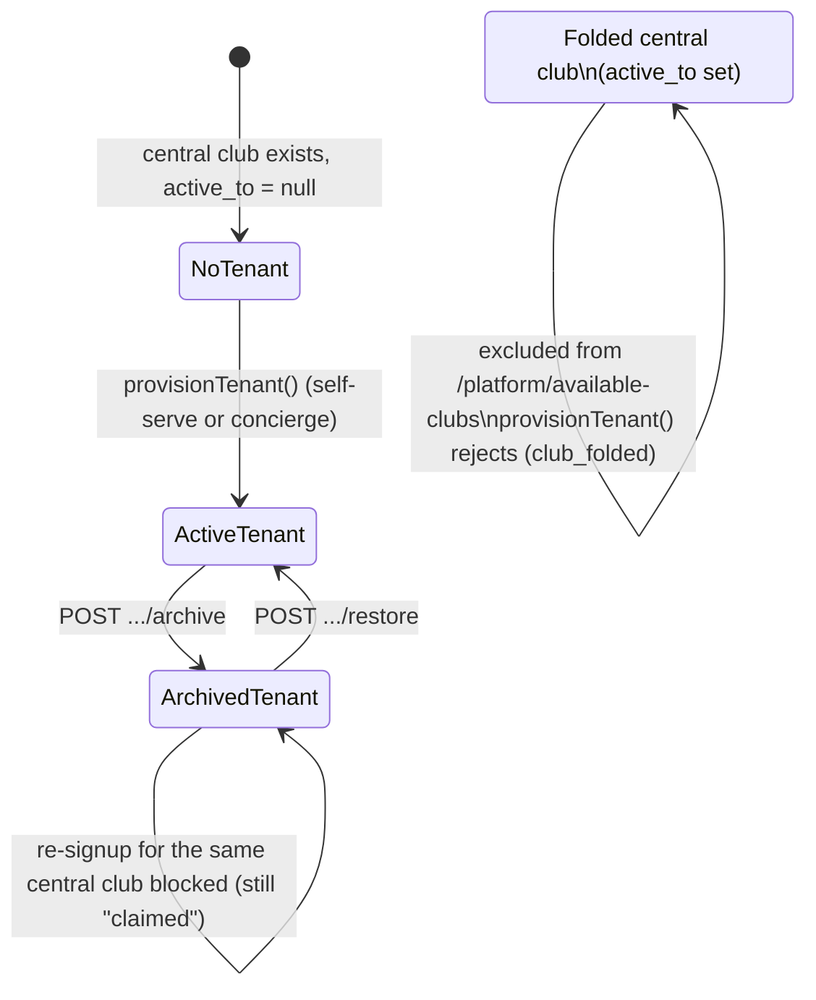

# feat: Tenant club archival and folded-club provisioning guard

## Summary

Add a reversible **archive/restore** lifecycle for tenants so a platform admin can take a club off the live platform — blocking its admin access and removing it from the public directory and future re-signup — without deleting a single row of its curated history, photos, or admin records. Separately, close a provisioning gap: a **folded or renamed central club** (`central.clubs.active_to` set — e.g. Coastal Districts, which folded and no longer fields a team) can currently still be picked in both the self-serve signup wizard and the platform-admin concierge picker; this plan excludes those clubs from provisioning everywhere, with a server-side guard as defense-in-depth.

No data is ever deleted. No database migration is required — the mechanism reuses the existing `suspendedAt` column on `tenants` (`lib/db/src/schema/tenants.ts:80`), which the codebase already displays and filters on but has never had a way to _set_.

## Problem Frame

Two related gaps in tenant lifecycle management, both surfaced by the current platform-admin console (see the user's screenshots):

1. **No way to retire a tenant.** `tenantsTable.suspendedAt` exists, is shown in the tenants list ("Suspended" pill and filter chip), and already keeps a suspended tenant out of the public directory (`GET /platform/directory-clubs` at `artifacts/api-server/src/routes/platform.ts:111` already filters `isNull(suspendedAt)`) — but **no code path ever writes to it**. There is no button, no endpoint, nothing. A club that stops paying or wants to pause cannot be taken off the live platform today short of a manual DB edit, and even then nothing would stop its admin from continuing to log in and edit content.

2. **Folded clubs are provisionable.** `central.clubs` already models club lineage (`parent_club_id`, `lineage_role`, `active_from`/`active_to` — `lib/db/src/central-schema/clubs.ts:9`): a club whose `active_to` is set has stopped operating under that id, either because it folded or because it renamed/merged into a successor row. Nothing in `/platform/available-clubs` (`artifacts/api-server/src/routes/platform.ts:57`, shared by both self-serve signup and the concierge "Provision a club" picker) or in `provisionTenant()` (`lib/db/src/provision.ts:91`) checks this. A folded club like Coastal Districts can be signed up as a brand-new tenant today, which is exactly what the user wants to prevent.

The screenshots show _Coastal Districts Cricket Club_ already provisioned as a tenant (`test-coastal`, plan `FREE`, never active, 1 admin). The fix for that specific row is an **operational action** the platform admin takes with the new Archive button once this ships — not a data migration in this plan (see Scope Boundaries).

## Requirements

- **R1**: A platform admin can archive an active tenant. Archiving preserves every row tied to that `tenant_id` (curated content, honour boards, photos, admins, branding) unchanged — it only sets `suspendedAt`.
- **R2**: A platform admin can restore an archived tenant, instantly reinstating full admin access and public-directory listing with no re-provisioning step.
- **R3**: Once archived, a tenant's club admin can no longer sign in or perform any admin-gated action (create/edit/delete anything), but the tenant's own public site keeps serving its existing read-only pages ("view stats only") — visitors can still browse history, scorecards, and records.
- **R4**: An archived tenant is removed from the public platform directory and cannot be re-claimed by a fresh signup while archived (its `centralClubId` stays "claimed" until restored or the tenant is repointed).
- **R5**: A central club with `active_to` set (folded or superseded by a renamed/merged successor row) cannot be selected for tenant provisioning, via the self-serve signup wizard or the platform-admin concierge picker, and the underlying provisioning function rejects it even if called directly.
- **R6**: Archiving the platform's own demo/fallback tenant (Halls Head, id 1) is blocked — suspending it would silently break every local/dev/preview host that falls back to the default tenant.

## Key Technical Decisions

- **Reuse `suspendedAt`, add no new column.** The schema doc-comment at `lib/db/src/schema/tenants.ts:44` already anticipated this: "enforcement (blocking access) is a separate follow-up." This plan is that follow-up — no migration, minimal risk.
- **One enforcement choke point.** `resolveAdmin` (`artifacts/api-server/src/middlewares/require-admin.ts:19`) is the single function behind `requireAdmin`, which gates roughly 40 route files. Teaching `resolveAdmin` to treat a suspended tenant's admin as unauthenticated protects every admin-gated route with one change, instead of auditing and patching ~40 files individually.
- **Archive/Restore are explicit POST actions, not PATCH fields.** `PATCH /platform/admin/tenants/:id` already carries `plan`/`customDomain`; folding suspension into that generic body would make an accidental suspension one stray field away. Two dedicated, idempotent, audit-logged endpoints (mirroring the existing `admin-resets` audit pattern at `artifacts/api-server/src/routes/platform-admin.ts:520`) make the action explicit and safe to retry.
- **Idempotent by design.** Archiving an already-archived tenant (or restoring an already-active one) returns 200 with the current state rather than erroring — avoids a whole class of double-click/race bugs and lets the frontend button stay simple.
- **Public site access is not gated at host resolution.** `tenant-context.ts`'s subdomain/custom-domain resolution is untouched — an archived tenant's site keeps resolving normally. "View stats only" falls out naturally from blocking admin auth while every public read route keeps working exactly as before; no new "archived" branch is threaded through the read paths.
- **Folded-club check keys off the existing `active_to` lineage column**, not a new flag — consistent with the lineage model already documented in `CLAUDE.md` ("The central PCA database"), and correct for both permanently-folded clubs and clubs that renamed (the old id's `active_to` is set; the successor id, if any, is what should be provisioned instead).
- **The pure eligibility check lives in `@workspace/db`** (`lib/db/src/central-schema/clubs.ts`), not in `artifacts/api-server`, so both `provisionTenant()` (same package) and the `/platform/available-clubs` route (consumer package, already imports `@workspace/db/central`) share one definition without a new cross-package dependency.

---

## High-Level Technical Design



| State                                  | Admin login                | Public site                            | In directory                               | Re-signup for this club                                    |
| -------------------------------------- | -------------------------- | -------------------------------------- | ------------------------------------------ | ---------------------------------------------------------- |
| Active tenant                          | ✅                         | ✅ full                                | ✅                                         | n/a (already claimed)                                      |
| Archived tenant                        | ❌ (`resolveAdmin` → null) | ✅ read-only pages ("view stats only") | ❌ (existing `isNull(suspendedAt)` filter) | ❌ (blocked — club still claimed)                          |
| Folded central club, never provisioned | n/a                        | n/a (no tenant exists)                 | n/a                                        | ❌ (excluded from the picker; `provisionTenant()` rejects) |

---

## Scope Boundaries

**In scope:** archive/restore lifecycle for tenants; admin-access enforcement for archived tenants; folded-club exclusion from provisioning (both flows) with a defense-in-depth server guard; platform-admin console UI to trigger archive/restore.

**Out of scope / non-goals:**

- Hard-deleting a tenant or any of its rows — never happens, by design, in this or any future iteration described here.
- A new public "browse any central club's stats without a tenant" page. "View stats only" for an archived tenant is satisfied by its _existing_ public site continuing to serve read routes — building a stats surface for clubs that have _never_ had a tenant (fully independent of tenant hosting) is a materially larger feature and is deferred.
- A visible "this club is archived" banner on the archived tenant's own public pages. Threading a `suspended` signal into `TenantBrand`/`@workspace/scorecard` (the shared web+mobile view-model, explicitly protected in `CLAUDE.md`) would widen this change's blast radius across every brand-consuming renderer for a cosmetic touch. The platform-admin console already shows the "Suspended" state clearly to staff. Can be revisited later as a small, separate change.

### Deferred to Follow-Up Work

- Manually archiving the existing `test-coastal` tenant row via the new console button — an operational action taken after this ships, not a migration script in this plan.
- Auditing all ~40 `requireAdmin`-gated route files to confirm none bypass it for a mutating action — out of scope here; flagged as a residual risk below instead of a blocking prerequisite, since `requireAdmin` is already the established, conventionally-applied gate for every admin route added to date.

---

## Implementation Units

### U1. OpenAPI contract: archive/restore endpoints

**Goal:** Add the two new platform-admin endpoints to the API contract so client types/hooks generate correctly.

**Requirements:** R1, R2

**Dependencies:** none

**Files:**

- `lib/api-spec/openapi.yaml` — add `POST /platform/admin/tenants/{id}/archive` (operationId `archiveAdminTenant`) and `POST /platform/admin/tenants/{id}/restore` (operationId `restoreAdminTenant`) under the existing `/platform/admin/tenants/{id}` path group (near line 5295, alongside the `/brand` sub-path). Both take no request body, return `AdminTenant` (200), and document 400 (guarded tenant, e.g. the demo tenant), 401, and 404.

**Approach:** Mirror the existing `/platform/admin/tenants/{id}/brand` and `/admin-resets` path definitions in shape and response schema (`$ref: "#/components/schemas/AdminTenant"`). No new schema object is needed — both actions return the same `AdminTenant` shape already used by the list/detail/PATCH endpoints.

**Patterns to follow:** `lib/api-spec/openapi.yaml:5295` (`/brand` sub-path), `lib/api-spec/openapi.yaml:5371` (`/admin-resets` sub-path).

**Test scenarios:**

- Test expectation: none -- pure OpenAPI contract addition; correctness is verified indirectly by U3's route tests (server implements the contract) and by the generated TypeScript/Zod compiling cleanly after codegen.

**Verification:** Run the workspace's OpenAPI codegen (`pnpm --filter @workspace/api-spec run codegen`, per `CLAUDE.md`'s "Do not break" rule — never hand-edit the generated files) and confirm `@workspace/api-zod` and `@workspace/api-client-react` regenerate without errors, producing `useArchiveAdminTenant`/`useRestoreAdminTenant`-equivalent hooks.

---

### U2. Suspension-aware admin auth enforcement

**Goal:** Make a suspended tenant's admin access actually stop working — the "no code path enforces `suspendedAt`" gap.

**Requirements:** R3

**Dependencies:** none (reads the existing `suspendedAt` column; independent of U1/U3's write path)

**Files:**

- `artifacts/api-server/src/lib/tenant.ts` — add `suspended: boolean` to the internal `TenantConfig` shape (populate from `tenantsTable.suspendedAt != null` in `getTenantConfig`), and export `isTenantSuspended(tenantId: number): Promise<boolean>`. Update the doc-comment on `invalidateTenantConfigCache` to note it must also be called after archive/restore.
- `artifacts/api-server/src/middlewares/require-admin.ts` — in `resolveAdmin`, after the existing tenant-match check, also return `null` when `isTenantSuspended(admin.tenantId)` is true. This is the single choke point behind `requireAdmin`, used by ~40 route files, so this one change protects all of them.
- `artifacts/api-server/src/routes/auth.ts` — in `POST /auth/login`, after successful credential verification, check `isTenantSuspended(getTenantId(req))`; if true, respond `403 { error: "This club's admin access is currently suspended." }` instead of minting a session. (Checked _after_ credential verification, not before, so a suspended tenant's login attempt is never used to distinguish a valid vs. invalid username/password.)

**Approach:** `resolveAdmin` keeps its existing `AdminRow | null` contract — a suspended tenant's admin resolves to `null`, so every `requireAdmin`-gated route responds with the existing generic `401 { error: "Not authenticated" }`. This is a deliberate trade-off (see Key Technical Decisions): broad, uniform protection over a bespoke error message on every route. The login route is the one place that gets a specific, actionable message, since it's the point where a real club admin is most likely to hit this and need to understand why.

**Patterns to follow:** `artifacts/api-server/src/lib/tenant.ts:88` (`getTenantConfig` cache-then-query shape), `artifacts/api-server/src/middlewares/require-admin.ts:19` (`resolveAdmin`).

**Test scenarios:**

- `isTenantSuspended` returns `false` for a tenant with `suspendedAt = null` and `true` once it's set; reflects a change immediately after `invalidateTenantConfigCache(id)` (no stale cache read).
- `resolveAdmin` returns `null` for a valid session belonging to an admin on a now-suspended tenant (session itself is untouched — no forced logout mechanism needed).
- `resolveAdmin` continues to return the admin normally once the tenant is restored, using the _same_ pre-existing session cookie (no re-login required).
- `POST /auth/login` with correct credentials on a suspended tenant returns 403 with the suspended-specific message and does **not** set a session cookie.
- `POST /auth/login` with correct credentials on an active tenant is unaffected (regression guard).
- Integration: a `requireAdmin`-gated route (e.g. `PATCH /tenant-brand`) returns 401 for a previously-valid session once its tenant is archived.

Covers R3. Test files: `artifacts/api-server/src/lib/tenant.test.ts` (new), `artifacts/api-server/src/routes/auth-suspended-tenant.test.ts` (new, real-DB integration test following the pattern in `artifacts/api-server/src/routes/platform-admin-tenants.test.ts`).

**Verification:** New tests above pass; existing `artifacts/api-server/src/lib/tenant-brand.test.ts` and admin-auth-adjacent suites (`artifacts/api-server/src/routes/admins-isolation.test.ts`, `admin-mutation-isolation.test.ts`) remain green, confirming no regression for non-suspended tenants.

---

### U3. Archive/Restore endpoints

**Goal:** Give the platform admin an actual way to set and clear `suspendedAt`.

**Requirements:** R1, R2, R4, R6

**Dependencies:** U1 (contract)

**Files:**

- `artifacts/api-server/src/routes/platform-admin.ts` — add `router.post("/platform/admin/tenants/:id/archive", requirePlatformAdmin, ...)` and the `/restore` counterpart, near the existing tenant PATCH handlers (after line 316).
- `artifacts/api-server/src/routes/platform-admin-tenant-archive.test.ts` (new) — route-level tests.

**Approach:**

- Both handlers: parse/validate `id` (same pattern as the existing PATCH), 404 if no such tenant.
- Archive: reject with `400 { error: "The demo tenant can't be archived." }` when `id === 1` (Halls Head / `DEFAULT_TENANT_ID`, per R6 — reference the constant from `artifacts/api-server/src/middlewares/tenant-context.ts` rather than the magic number). Otherwise idempotently set `suspendedAt = now()` (no-op success if already set).
- Restore: idempotently clear `suspendedAt = null`.
- Both: `req.log?.info({ event: "tenant_archived" | "tenant_restored", platformAdminId, tenantId }, ...)`, mirroring the audit-log shape at `artifacts/api-server/src/routes/platform-admin.ts:601`.
- Both: `invalidateTenantConfigCache(id)` (so U2's `isTenantSuspended` reflects the change immediately) after the write; respond with `toAdminTenant(row, centralClubName, adminCount)` (same shaping as the sibling PATCH handlers, reusing `centralClubNames()`/`adminCountsByTenant()`).

**Technical design:**

```
POST .../:id/archive
  tenant := SELECT ... WHERE id = :id            -- 404 if missing
  if tenant.id == DEFAULT_TENANT_ID: 400
  if tenant.suspendedAt == null:
    UPDATE tenants SET suspended_at = now() WHERE id = :id
    log tenant_archived
    invalidateTenantConfigCache(id)
  return toAdminTenant(current row)               -- 200, idempotent either way

POST .../:id/restore  -- symmetric, suspended_at = null, log tenant_restored
```

**Patterns to follow:** `artifacts/api-server/src/routes/platform-admin.ts:211` (existing PATCH tenant handler — id validation, cache invalidation, response shaping), `artifacts/api-server/src/routes/platform-admin.ts:520` (`admin-resets` audit-log shape).

**Test scenarios:**

- Archiving an active tenant sets `suspendedAt`, returns it in the response, and a follow-up `GET /platform/admin/tenants/:id` reflects it.
- Restoring an archived tenant clears `suspendedAt`.
- Archiving an already-archived tenant is idempotent: 200, `suspendedAt` unchanged (not bumped to a new timestamp).
- Restoring an already-active tenant is idempotent: 200, no-op.
- Archiving tenant id 1 (Halls Head) returns 400 and does not touch the row.
- Both endpoints 404 for a nonexistent tenant id.
- Both endpoints 401 without a platform-admin session, and reject a club-admin session (cross-surface isolation, mirroring the existing test at `artifacts/api-server/src/routes/platform-admin-tenants.test.ts:99`).
- After archiving, `GET /platform/directory-clubs` (public, unauthenticated) no longer lists the tenant — regression check on the pre-existing filter at `artifacts/api-server/src/routes/platform.ts:111`, now exercised via a real write instead of only a seeded row.

Covers R1, R2, R4, R6. Test file: `artifacts/api-server/src/routes/platform-admin-tenant-archive.test.ts` (new).

**Verification:** New test file passes; `artifacts/api-server/src/routes/platform-admin-tenants.test.ts` and `artifacts/api-server/src/routes/platform-directory.test.ts` remain green.

---

### U4. Folded-club provisioning guard

**Goal:** A central club with `active_to` set can never be provisioned as a new tenant, in either signup flow, with a server-side guard even if the picker is bypassed.

**Requirements:** R5

**Dependencies:** none

**Files:**

- `lib/db/src/central-schema/clubs.ts` — add a small pure helper: `isCentralClubProvisionable(club: Pick<CentralClubRow, "activeTo">): boolean` (`club.activeTo == null`). Flows through the existing `export * from "./central-schema"` in `lib/db/src/central.ts`, so both consumers below import it from `@workspace/db/central` (route) or `./central` (same-package) without a new cross-package dependency.
- `lib/db/src/provision.ts` — in `resolveCentralClub`, after the not-found/ambiguous checks, throw a new `ProvisionError("club_folded", ...)` when `!isCentralClubProvisionable(club)`. Add `"club_folded"` to `ProvisionErrorCode`.
- `artifacts/api-server/src/routes/platform.ts` — in `GET /platform/available-clubs`, filter out clubs where `!isCentralClubProvisionable(c)` before mapping to `AvailableClub` (alongside the existing `claimedIds` filter at line 71-72).
- `lib/db/src/provision.test.ts` (new) — unit test for the guard, following the mocked-central-DB pattern already established for this package.

**Approach:** No new `ProvisionError` HTTP-status branch is needed in `platform.ts`/`platform-admin.ts` — both already fall through to a generic `400 { error: e.message }` for any `ProvisionError` code other than `slug_taken`/`club_claimed` (`artifacts/api-server/src/routes/platform.ts:243`, `artifacts/api-server/src/routes/platform-admin.ts:502`), so `club_folded` is handled correctly with zero changes there. The `/platform/available-clubs` filter is the primary defense (folded clubs never appear in either picker); the `provisionTenant()` check is defense-in-depth for a direct API call bypassing the UI.

**Patterns to follow:** `lib/db/src/provision.ts:74` (existing not-found/ambiguous `ProvisionError` throws in `resolveCentralClub`), `artifacts/api-server/src/lib/admin-tenant-shape.ts` (precedent for a small, pure, DB-free helper co-located with its schema for unit-testability), `lib/db/src/central-queries.test.ts:25` (the `vi.mock("./central", ...)` pattern for testing central-DB-dependent code without a real connection).

**Test scenarios:**

- `isCentralClubProvisionable` returns `true` for `activeTo: null` and `false` for any non-null `activeTo` string.
- `provisionTenant({ centralClubId })` throws `ProvisionError` with code `club_folded` when the resolved central club has `activeTo` set (mocked central DB row), and the message names the club.
- `provisionTenant` succeeds unchanged for a club with `activeTo: null` (regression guard on the existing happy path).
- `GET /platform/available-clubs` excludes a club with `activeTo` set from the response, while still including active clubs and still excluding already-claimed clubs (both filters composing correctly).
- Integration: `POST /platform/signup` and `POST /platform/admin/tenants` (concierge) both reject a direct `centralClubId` for a folded club with 400, even though the picker would never have offered it.

Covers R5. Test files: `lib/db/src/provision.test.ts` (new, mocked-central-DB unit test), extend `artifacts/api-server/src/routes/platform-signup.test.ts` (available-clubs filter + signup rejection) and `artifacts/api-server/src/routes/platform-admin-tenants.test.ts` (concierge provisioning rejection).

**Verification:** New/extended tests pass; existing provisioning tests (`platform-signup.test.ts`, `platform-admin-tenants.test.ts`) remain green for non-folded clubs.

---

### U5. Platform-admin console: Archive / Restore controls

**Goal:** Let a platform admin actually trigger archive/restore from the console.

**Requirements:** R1, R2

**Dependencies:** U1, U3 (needs the live endpoints + generated hooks)

**Files:**

- `artifacts/cricket-club/src/pages/platform-admin/tenant-detail.tsx` — add a "Status" affordance (near the existing "Plan & domain" card) showing Active/Archived state with an Archive or Restore button as appropriate.
- `lib/api-spec/openapi.yaml` / generated client — already covered by U1; this unit consumes the resulting hooks.

**Approach:** Use the existing app-wide `useConfirm()` dialog (`artifacts/cricket-club/src/components/confirm-dialog.tsx`) before firing the archive mutation (`destructive: true`, a short description naming what's preserved vs. what stops working), matching how other admin actions in this codebase gate a consequential change. Restore needs no confirmation (fully reversible, non-destructive). On success, invalidate the same query keys the existing PATCH mutation invalidates (`getGetAdminTenantQueryKey`, `getListAllTenantsQueryKey`) so the detail page and the tenants list both reflect the new state immediately.

**Patterns to follow:** `artifacts/cricket-club/src/pages/platform-admin/tenant-detail.tsx:40` (`useUpdateAdminTenant` mutation wiring, query invalidation on success), `artifacts/cricket-club/src/components/confirm-dialog.tsx` (`useConfirm()` usage).

**Test scenarios:**

- Archiving from the detail page shows a confirmation dialog naming the consequence; confirming calls the archive mutation and the page reflects "Archived" without a manual refresh.
- Cancelling the confirmation dialog fires no request and leaves the tenant active.
- Restoring an archived tenant requires no confirmation and immediately shows "Active".
- The tenants list (`tenants-list.tsx`) already renders the "Suspended" pill from `suspendedAt` (no change needed there) — verify it updates after a detail-page archive/restore round trip (integration-level, via query invalidation).
- Attempting to archive tenant id 1 (Halls Head) surfaces the server's 400 message rather than a generic failure toast.

Covers R1, R2. Test file: a component test alongside existing platform-admin frontend test conventions, or a manual browser verification pass per the project's UI-change testing expectation (start the dev server, exercise the golden path and the Halls Head guard).

**Verification:** Manual run through the dev server: archive a throwaway tenant, confirm its admin can no longer sign in (ties back to U2) and it drops off `/platform/directory-clubs`, then restore it and confirm both reverse immediately.

---

### U6. Provision picker: explain the folded-club exclusion

**Goal:** A platform admin searching for a club that doesn't appear in the "Provision a club" picker should understand why, instead of assuming it's a bug.

**Requirements:** R5 (UX support, not new logic)

**Dependencies:** U4

**Files:**

- `artifacts/cricket-club/src/pages/platform-admin/provision.tsx` — add a short static note under the page's existing subtitle (near line 241), e.g. "Folded or merged clubs aren't available to provision — their history stays in the platform, view-only."

**Approach:** Pure copy addition; no new prop, state, or request. The exclusion itself is entirely server-side (U4), so this list already renders correctly with zero frontend logic changes — this unit only adds the explanatory line.

**Patterns to follow:** The existing subtitle copy immediately above the insertion point (`artifacts/cricket-club/src/pages/platform-admin/provision.tsx:241`).

**Test scenarios:**

- Test expectation: none -- static copy only, no behavioral change; covered visually by U5's manual browser pass.

**Verification:** Visual check during U5's manual dev-server pass.

---

## System-Wide Impact

- **Auth boundary**: `resolveAdmin` is the most widely-shared function touched by this plan (behind ~40 route files via `requireAdmin`). The change is additive (one more condition that can return `null`) and does not alter behavior for any non-suspended tenant.
- **Platform-admin console**: new UI surface on the tenant detail page; no change to the tenants list beyond what it already renders.
- **Provisioning**: both self-serve signup and concierge provisioning share the same guarded code paths (`/platform/available-clubs`, `provisionTenant`), so the fix applies uniformly without duplicating logic per flow.
- **No schema migration, no new environment variables, no change to `tenant-context.ts` host resolution.**

## Risks & Dependencies

- **Residual risk — unaudited write paths.** `resolveAdmin`/`requireAdmin` is the established gate for admin-mutating routes, but this plan does not exhaustively audit all ~40 consumers to prove none perform a write via some other, non-`requireAdmin` path. Mitigated by convention (every route added to date follows this gate) and explicitly called out rather than silently assumed; a full audit is deferred (see Scope Boundaries).
- **Demo-tenant lockout.** Archiving tenant #1 (Halls Head) would also be `DEFAULT_TENANT_ID`, breaking every local/dev/preview fallback host. Directly mitigated by R6 / U3's explicit guard.
- **Cache staleness.** `getTenantConfig`'s 5-minute TTL means a missed `invalidateTenantConfigCache(id)` call after archive/restore would leave stale access for up to 5 minutes. Mitigated by calling it in the same handler that writes `suspendedAt`, mirroring the existing plan/customDomain PATCH pattern exactly.
- **Dependency**: U3 and U5 depend on U1's OpenAPI codegen completing cleanly before the frontend hooks exist.

---

## Verification Contract

- All new/extended test files listed per-unit pass: `artifacts/api-server/src/lib/tenant.test.ts`, `artifacts/api-server/src/routes/auth-suspended-tenant.test.ts`, `artifacts/api-server/src/routes/platform-admin-tenant-archive.test.ts`, `lib/db/src/provision.test.ts`, plus extensions to `platform-signup.test.ts` and `platform-admin-tenants.test.ts`.
- No regression in existing suites: `tenant-brand.test.ts`, `admins-isolation.test.ts`, `admin-mutation-isolation.test.ts`, `platform-directory.test.ts`, `platform-admin-tenants.test.ts`, `platform-signup.test.ts`.
- `pnpm --filter @workspace/api-spec run codegen` completes without diff-breaking downstream type errors.
- Manual dev-server pass (U5/U6 verification) confirms the end-to-end archive → admin-locked-out → directory-hidden → restore → admin-restored loop on a throwaway tenant, and confirms the Halls Head archive guard.

## Definition of Done

- A platform admin can archive and restore any non-demo tenant from the console; the action is idempotent, audited, and reversible.
- An archived tenant's admin cannot sign in or perform any admin-gated action; its public site keeps serving read-only pages; it is absent from the public directory and cannot be re-signed-up while archived.
- A folded/renamed central club (`active_to` set) never appears in either provisioning picker and is rejected server-side if provisioning is attempted directly.
- Halls Head (tenant #1) cannot be archived.
- No tenant-scoped data is deleted anywhere in this plan.
- All Verification Contract items pass.
