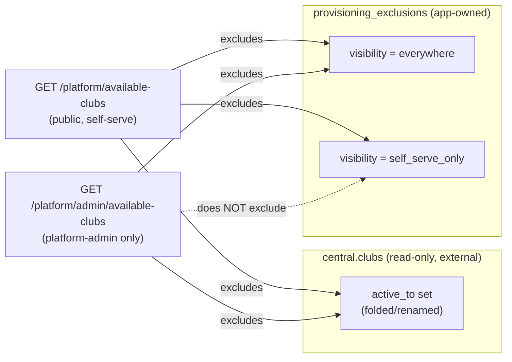

# feat: Platform-admin-managed provisioning exclusion list

## Summary

Add a platform-admin-managed exclusion list for central PCA clubs, independent of `central.clubs.active_to` (the 2026-07-31-001 plan's folded-club guard). Two visibility states per excluded club: **hidden everywhere** (excluded from both self-serve signup and the concierge picker — for clubs that are defunct or have merged into another club) and **hidden from self-serve only** (excluded from public signup but still concierge-provisionable by a platform admin — for clubs invited into selected PCA competitions but not ready for public self-serve).

This is deliberately a *second*, independent mechanism from the existing `active_to`-based guard: `central.clubs` is read-only from this app (`CLAUDE.md`, "Never write to it from the app"), and this app has no way to verify today's `active_to` values for any specific club without a live `CENTRAL_DATABASE_URL` connection. Rather than guess, platform admins get a table they fully control, populated by searching and picking real clubs from a live list — not by auto-matching free-text club names to `centralClubId`, which risks silently matching the wrong row.

## Problem Frame

The self-serve signup wizard and the platform-admin concierge picker currently share one endpoint (`GET /platform/available-clubs`, `artifacts/api-server/src/routes/platform.ts:57`) and one filter set: already-claimed clubs, and (per 2026-07-31-001) folded/renamed clubs (`active_to` set). There is no way to:

1. Exclude a club that is defunct or merged but whose `active_to` value in the external central database can't be confirmed from this app.
2. Exclude a club from *public self-serve* while still letting a platform admin concierge-provision it later, once a club is ready to onboard (e.g. clubs invited into selected PCA competitions, still being built out).

Fifteen named clubs need this today (per the user's list): eight are defunct or merged (hidden everywhere) and seven belong to other associations and aren't ready for public signup yet (hidden from self-serve only). The exact `centralClubId` for each is not known in this session (no live central DB connection) — the platform admin will add them via a search-and-pick UI once this ships, the same way `provision.tsx` already lets them pick a club by name today.

## Requirements

- **R1**: A platform admin can add a central club to the exclusion list, choosing "hidden everywhere" or "hidden from self-serve only", with an optional reason/note, by searching and picking the club (not by typing a raw id).
- **R2**: A platform admin can view the current exclusion list (club name, visibility, reason) and remove an entry.
- **R3**: The public self-serve signup picker (`/platform/available-clubs`) excludes clubs in *either* visibility state, in addition to the existing claimed/folded filters.
- **R4**: The concierge picker (`provision.tsx`) excludes only "hidden everywhere" clubs — "hidden from self-serve only" clubs remain visible and provisionable there.
- **R5**: `provisionTenant()` rejects a direct API call for an excluded club, applying the same visibility rule as the caller's context (self-serve vs. concierge) — defense-in-depth, mirroring the existing `club_folded` guard from 2026-07-31-001.
- **R6**: No dependency on `central.clubs.active_to` or any write to the central database.

## Key Technical Decisions

- **New app-side table, not a central-DB write.** `provisioning_exclusions` lives in the tenant/platform database (`lib/db`), keyed by `centralClubId`, fully owned by this app. Snapshots the club's `name` at exclusion time (mirrors `tenants.name`'s snapshot-from-central pattern) so the list renders without a central-DB round trip on every read.
- **Manual pick, not name-matching.** No migration/seed script tries to resolve the 15 club names to ids. The manage-exclusions UI reuses the exact search-and-pick pattern already in `provision.tsx`'s `ClubPicker`, so the platform admin adds each club against a live, accurate list after deploy.
- **`provisionTenant()` takes an explicit context.** Adds a `context: "self-serve" | "concierge"` option so the same shared function can apply the right exclusion rule for each caller — self-serve rejects both visibility states, concierge rejects only `everywhere`. Mirrors how `mode: "upsert" | "create"` already branches caller-specific behavior in the same function.
- **Two available-clubs endpoints, not one endpoint with a query flag.** The existing public `GET /platform/available-clubs` keeps applying both exclusion states (used by self-serve signup). A new `GET /platform/admin/available-clubs` (platform-admin-gated) applies only `everywhere`, for the concierge picker. Matches the codebase's existing pattern of a public platform surface (`platform.ts`) versus a separate admin surface (`platform-admin.ts`) rather than overloading one route with a permission-dependent response shape.
- **Reuse `toAdminTenant`-style shaping conventions, not a new abstraction.** The exclusions CRUD endpoints follow the same request/response shape and error-handling conventions already established in `platform-admin.ts` (validate id, 404 on missing, `req.log?.info` audit entries).

---

## High-Level Technical Design

| Club state | Self-serve signup | Concierge picker |
|---|---|---|
| Normal, unclaimed | visible | visible |
| Folded (`active_to` set) | excluded | excluded |
| Exclusion: `everywhere` | excluded | excluded |
| Exclusion: `self_serve_only` | excluded | **visible** |

---

## Scope Boundaries

**In scope:** the `provisioning_exclusions` table; CRUD endpoints; the split available-clubs endpoints; the `provisionTenant()` context guard; the manage-exclusions platform-admin page; wiring the concierge picker to the new admin endpoint.

**Out of scope / deferred:**
- Populating the 15 named clubs — a manual, post-deploy action by the platform admin via the new UI, not part of this plan's implementation units.
- Any change to the existing `central.clubs.active_to` folded-club guard (2026-07-31-001) — the two mechanisms run side by side.
- Editing an existing exclusion's visibility/reason in place — v1 is add/remove only; changing an entry means removing and re-adding it.
- Bulk import (CSV/paste-list) for adding exclusions — one club at a time via the picker, matching the existing concierge-provisioning UX.

---

## Implementation Units

### U1. Schema: `provisioning_exclusions` table

**Goal:** A new platform-wide table recording excluded central clubs.

**Requirements:** R1, R2, R6

**Dependencies:** none

**Files:**
- `lib/db/src/schema/provisioning_exclusions.ts` — new table definition.
- `lib/db/src/schema/index.ts` — add `export * from "./provisioning_exclusions"`.

**Approach:** No tenant scoping (this is a platform-wide list, not tenant data) — follow `lib/db/src/schema/platform_settings.ts`'s platform-wide table shape rather than `club_roles.ts`'s tenant-scoped shape. Columns: `id` (serial PK), `centralClubId` (integer, `unique`, not null — one exclusion row per club), `clubName` (text, not null — snapshot at exclusion time for display), `visibility` (text, not null — `"everywhere" | "self_serve_only"`), `reason` (text, nullable), `createdByPlatformAdminId` (integer, references `platformAdminsTable.id`), `createdAt` (timestamp with timezone, not null, `defaultNow()`).

**Patterns to follow:** `lib/db/src/schema/platform_settings.ts` (platform-wide table, no tenant column), `lib/db/src/schema/admin_password_resets.ts` (FK to `platformAdminsTable`, `createdAt` default pattern).

**Test scenarios:**
- Test expectation: none -- pure schema addition, no behavior; exercised indirectly by U3's route tests.

**Verification:** `pnpm --filter @workspace/db run push` (operational step, run against the real database — not available in a sandbox without `DATABASE_URL`) applies the new table without conflicts; `tsc --build` on `lib/db` compiles clean.

---

### U2. OpenAPI contract: exclusions CRUD + admin available-clubs

**Goal:** Add the new endpoints to the API contract so client types/hooks generate correctly.

**Requirements:** R1, R2, R4

**Dependencies:** U1 (response shapes reference the new row's fields)

**Files:**
- `lib/api-spec/openapi.yaml` — add:
  - `GET /platform/admin/provisioning-exclusions` (operationId `listProvisioningExclusions`) — returns an array of a new `ProvisioningExclusion` schema (`id`, `centralClubId`, `clubName`, `visibility` enum, `reason` nullable, `createdAt`).
  - `POST /platform/admin/provisioning-exclusions` (operationId `createProvisioningExclusion`) — body `{ centralClubId, visibility, reason? }`; 201 returns the created row; 404 if the central club id doesn't resolve; 409 if already excluded.
  - `DELETE /platform/admin/provisioning-exclusions/{id}` (operationId `deleteProvisioningExclusion`) — 204; 404 if missing.
  - `GET /platform/admin/available-clubs` (operationId `getAdminAvailableClubs`) — reuses the existing `AvailableClub` schema; platform-admin-gated variant of `GET /platform/available-clubs` that excludes only `everywhere`-visibility clubs.

**Approach:** Mirror the existing `/platform/admin/tenants/*` path group's shape and the existing `AvailableClub` schema (`lib/api-spec/openapi.yaml:7252`) for the new admin-available-clubs response — no new club-shape schema needed there.

**Patterns to follow:** `lib/api-spec/openapi.yaml:5295` (`/brand` sub-path, request/response shape for a platform-admin POST/PATCH), `lib/api-spec/openapi.yaml:7252` (`AvailableClub` schema).

**Test scenarios:**
- Test expectation: none -- pure contract addition; verified indirectly by U3/U5's route tests and generated-type compilation.

**Verification:** `pnpm --filter @workspace/api-spec run codegen` (or the direct `orval` binary — see `windows-local-test-setup` project memory) regenerates `@workspace/api-zod` and `@workspace/api-client-react` without errors.

---

### U3. Backend: exclusions CRUD routes

**Goal:** Let a platform admin list, add, and remove exclusion entries.

**Requirements:** R1, R2

**Dependencies:** U1, U2

**Files:**
- `artifacts/api-server/src/routes/platform-admin.ts` — add the three route handlers, near the tenant archive/restore routes.
- `artifacts/api-server/src/routes/provisioning-exclusions.test.ts` (new) — route-level tests.

**Approach:**
- `GET`: `requirePlatformAdmin`, plain `db.select().from(provisioningExclusionsTable).orderBy(...)`.
- `POST`: `requirePlatformAdmin`; validate body via the generated Zod schema; lazily resolve the central club by id (mirroring `resolveCentralClub`'s pattern in `lib/db/src/provision.ts`) to snapshot `clubName` and to 404 on an unknown id; 409 if `centralClubId` already has a row (unique constraint); insert; `req.log?.info` an audit entry (`event: "provisioning_exclusion_created"`).
- `DELETE`: `requirePlatformAdmin`; 404 if missing; delete; audit log (`event: "provisioning_exclusion_removed"`).

**Patterns to follow:** `artifacts/api-server/src/routes/platform-admin.ts` (the `parseTenantIdParam`/`getTenantOrNotFound`-style small-helper convention introduced in 2026-07-31-001, the `admin-resets` audit-log shape).

**Test scenarios:**
- Listing returns an empty array when no exclusions exist, and all rows (newest first or by name — pick one, document it) once some do.
- Creating an exclusion for a real central club id succeeds, snapshots the club's name, and appears in the list.
- Creating an exclusion for an unknown central club id 404s.
- Creating a second exclusion for an already-excluded `centralClubId` 409s.
- Deleting a real exclusion id succeeds and it no longer appears in the list.
- Deleting an unknown id 404s.
- All three endpoints 401 without a platform session, and reject a club-admin session (cross-surface isolation, mirroring `artifacts/api-server/src/routes/platform-admin-tenants.test.ts:99`).

Covers R1, R2. Test file: `artifacts/api-server/src/routes/provisioning-exclusions.test.ts` (new, real-DB integration test, needs `DATABASE_URL` and `CENTRAL_DATABASE_URL`).

**Verification:** New test file passes.

---

### U4. Backend: context-aware `provisionTenant()` exclusion guard

**Goal:** Reject provisioning an excluded club server-side, applying the caller's context (self-serve vs. concierge), as defense-in-depth against a direct API call bypassing either picker.

**Requirements:** R5, R6

**Dependencies:** U1

**Files:**
- `lib/db/src/provision.ts` — extend `ProvisionTenantOptions` with `context?: "self-serve" | "concierge"` (default `"self-serve"` — the more restrictive default, so an unspecified context never accidentally under-restricts); add the exclusion check in `resolveCentralClub`, alongside the existing `club_folded` check.
- `artifacts/api-server/src/routes/platform.ts` — `POST /platform/signup` passes `context: "self-serve"` (or omits it, relying on the restrictive default — make it explicit for clarity).
- `artifacts/api-server/src/routes/platform-admin.ts` — `POST /platform/admin/tenants` (concierge provisioning) passes `context: "concierge"`.
- `lib/db/src/provision.test.ts` — extend with the new guard's scenarios (mocked central + tenant DB, same pattern as the existing `club_folded` tests).

**Approach:** Add `"club_excluded"` to `ProvisionErrorCode`. In `resolveCentralClub`, after the `isCentralClubProvisionable` check, query `provisioningExclusionsTable` for the resolved `centralClubId`; if a row exists with `visibility === "everywhere"`, or (`context === "self-serve"` and `visibility === "self_serve_only"`), throw `ProvisionError("club_excluded", ...)`. No new HTTP-layer branch needed in the routes — both already fall through to the existing generic 400-on-`ProvisionError` handling.

**Patterns to follow:** `lib/db/src/provision.ts`'s existing `club_folded` check (2026-07-31-001) — same shape, one more condition.

**Test scenarios:**
- `provisionTenant({ context: "self-serve" })` rejects a club with an `everywhere` exclusion.
- `provisionTenant({ context: "self-serve" })` rejects a club with a `self_serve_only` exclusion.
- `provisionTenant({ context: "concierge" })` rejects a club with an `everywhere` exclusion.
- `provisionTenant({ context: "concierge" })` **succeeds** for a club with only a `self_serve_only` exclusion (the core behavioral difference this unit exists to prove).
- `provisionTenant()` with no `context` passed behaves like `"self-serve"` (restrictive default).
- A club with no exclusion row and no `active_to` set provisions normally in both contexts (regression guard).

Covers R5, R6. Test file: `lib/db/src/provision.test.ts` (extend the existing file from 2026-07-31-001).

**Verification:** Extended test file passes; existing `club_folded` tests in the same file remain green.

---

### U5. Backend: split available-clubs endpoints

**Goal:** The public self-serve picker excludes both visibility states; a new admin-gated endpoint for the concierge picker excludes only `everywhere`.

**Requirements:** R3, R4

**Dependencies:** U1, U2

**Files:**
- `artifacts/api-server/src/routes/platform.ts` — `GET /platform/available-clubs`: add the exclusion filter (both visibilities) alongside the existing `claimedIds`/`isCentralClubProvisionable` filters.
- `artifacts/api-server/src/routes/platform-admin.ts` — add `GET /platform/admin/available-clubs`, `requirePlatformAdmin`-gated, same shaping as the public endpoint but excluding only `everywhere`-visibility clubs.
- `lib/db/src/central-schema/clubs.ts` or a small new shared helper — consider whether the "is this club excluded for context X" predicate belongs alongside `isCentralClubProvisionable` for reuse between this unit and U4, or stays route-local; decide based on how much the two call sites actually share once written (both read `provisioningExclusionsTable`, but one is a `WHERE ... NOT IN` set-membership filter over many rows and the other is a single-row lookup — likely different enough that a shared predicate isn't a real reduction in duplication, but check before assuming).
- `artifacts/api-server/src/routes/platform-signup.test.ts` — extend for the public endpoint's exclusion filtering.
- `artifacts/api-server/src/routes/platform-admin-available-clubs.test.ts` (new) — the admin endpoint's filtering behavior.

**Approach:** Both endpoints already load the full `central.clubs` set and the claimed-ids set; add one more query (all `provisioningExclusionsTable` rows) and filter in memory, same shape as the existing `claimedIds`/`isCentralClubProvisionable` filters — no new query-per-row pattern.

**Patterns to follow:** `artifacts/api-server/src/routes/platform.ts:57` (`GET /platform/available-clubs`'s existing filter chain).

**Test scenarios:**
- Public `GET /platform/available-clubs` excludes a club with an `everywhere` exclusion.
- Public `GET /platform/available-clubs` excludes a club with a `self_serve_only` exclusion.
- Admin `GET /platform/admin/available-clubs` excludes a club with an `everywhere` exclusion.
- Admin `GET /platform/admin/available-clubs` **includes** a club with only a `self_serve_only` exclusion.
- Admin endpoint 401s without a platform session and rejects a club-admin session.
- A club with no exclusion appears in both lists (regression guard).

Covers R3, R4. Test files: extend `artifacts/api-server/src/routes/platform-signup.test.ts`; new `artifacts/api-server/src/routes/platform-admin-available-clubs.test.ts`.

**Verification:** New/extended tests pass; existing `platform-signup.test.ts` and `platform-admin-tenants.test.ts` provisioning tests remain green.

---

### U6. Frontend: concierge picker uses the admin available-clubs endpoint

**Goal:** The "Provision a club" page can now offer `self_serve_only`-excluded clubs to the platform admin.

**Requirements:** R4

**Dependencies:** U2, U5 (needs the generated `useGetAdminAvailableClubs`-equivalent hook and the live endpoint)

**Files:**
- `artifacts/cricket-club/src/pages/platform-admin/provision.tsx` — `ClubPicker` switches from `useGetAvailableClubs` to the new generated admin-scoped hook.

**Approach:** Pure data-source swap — the component's search/pick/display logic is unchanged; only the hook it calls changes.

**Patterns to follow:** The existing `useGetAvailableClubs` call site being replaced.

**Test scenarios:**
- Test expectation: none -- one-line hook swap, no new logic; covered by U3/U5's backend tests proving the endpoint's filtering, and a manual/browser check that the picker still renders and searches correctly.

**Verification:** Manual dev-server pass (or `agent-browser`, if available in the execution environment): open "Provision a club", confirm the list loads and search still works.

---

### U7. Frontend: manage-exclusions page

**Goal:** A platform admin can search for a club, add it to the exclusion list with a visibility choice and optional reason, view the current list, and remove an entry.

**Requirements:** R1, R2

**Dependencies:** U2, U3

**Files:**
- `artifacts/cricket-club/src/pages/platform-admin/provisioning-exclusions.tsx` (new).
- `artifacts/cricket-club/src/pages/platform-admin/index.tsx` — add the route.
- `artifacts/cricket-club/src/components/platform-admin-shell.tsx` — add the nav entry.

**Approach:** Two-part page, mirroring `provision.tsx`'s structure: (1) a list of current exclusions (club name, a `StatusPill`-style visibility badge, reason, a remove button gated by `useConfirm()` since removal re-opens provisioning); (2) an "Add exclusion" flow reusing `provision.tsx`'s `ClubPicker` component (or a shared extraction of it, if reuse is straightforward — decide during implementation) against the **public** `useGetAvailableClubs` list (a club already excluded shouldn't be pickable again; a club that's `active_to`-folded shouldn't be pickable either — both are already filtered out of that list), followed by a small form for visibility (`everywhere` / `self_serve_only`) and an optional reason.

**Patterns to follow:** `artifacts/cricket-club/src/pages/platform-admin/provision.tsx` (`ClubPicker`, two-step page flow), `artifacts/cricket-club/src/pages/platform-admin/tenant-detail.tsx`'s `StatusCard` (confirm-gated destructive action, `useConfirm()`), `artifacts/cricket-club/src/components/platform-admin-shell.tsx:118` (nav array).

**Test scenarios:**
- Test expectation: none -- UI composition of already-tested backend endpoints and existing design-system primitives; verified via manual dev-server pass per the project's UI-change testing convention.

**Verification:** Manual dev-server pass: add an exclusion (both visibility choices), confirm it appears in the list and disappears from the relevant picker(s); remove it via the confirm-gated button and confirm it reappears.

---

## System-Wide Impact

- **New platform-wide table**, no tenant scoping, no interaction with tenant isolation.
- **Auth boundary**: all new endpoints are `requirePlatformAdmin`-gated, the same established pattern as the tenant archive/restore endpoints — no new authorization surface.
- **Provisioning**: both self-serve and concierge flows now read from `provisioningExclusionsTable` in addition to their existing filters; `provisionTenant()`'s public signature grows one optional parameter, backward compatible for any caller that doesn't pass it (defaults to the more restrictive `"self-serve"`).
- **No change to the 2026-07-31-001 folded-club (`active_to`) guard** — both mechanisms coexist and compose.

## Risks & Dependencies

- **Two independent exclusion mechanisms.** A club could theoretically be excluded by both `active_to` and this new table — harmless redundancy, no special-case handling needed, but worth knowing if a future reader is confused why a club shows up in neither picker.
- **Manual data entry.** The 15 named clubs are not seeded by this plan; until the platform admin adds them via the new UI, they remain provisionable. This is a deliberate scope decision (see Scope Boundaries), not an oversight.
- **`provisionTenant()` signature change.** Any other caller of `provisionTenant()` besides the two updated in U4 would silently get the restrictive `"self-serve"` default — grep for all call sites during U4 to confirm only `platform.ts` and `platform-admin.ts` call it (matches the current known callers).

---

## Verification Contract

- All new/extended test files listed per-unit pass: `provisioning-exclusions.test.ts`, `provision.test.ts` (extended), `platform-signup.test.ts` (extended), `platform-admin-available-clubs.test.ts`.
- No regression in existing suites: `platform-admin-tenants.test.ts`, `platform-admin-tenant-archive.test.ts`.
- `pnpm --filter @workspace/api-spec run codegen` completes without diff-breaking downstream type errors.
- `pnpm --filter @workspace/db run push` (or equivalent) applies the new table to a real database without conflicts.
- Manual dev-server pass (U6/U7) confirms: add an exclusion of each visibility type, confirm it disappears from the correct picker(s) and reappears on removal.

## Definition of Done

- A platform admin can search for, add, and remove excluded clubs from a dedicated console page, choosing between "hidden everywhere" and "hidden from self-serve only".
- The public self-serve picker excludes both visibility states; the concierge picker excludes only "hidden everywhere".
- `provisionTenant()` rejects a direct API call for an excluded club, applying the correct rule for its context.
- No write to the central database anywhere in this feature.
- All Verification Contract items pass.
