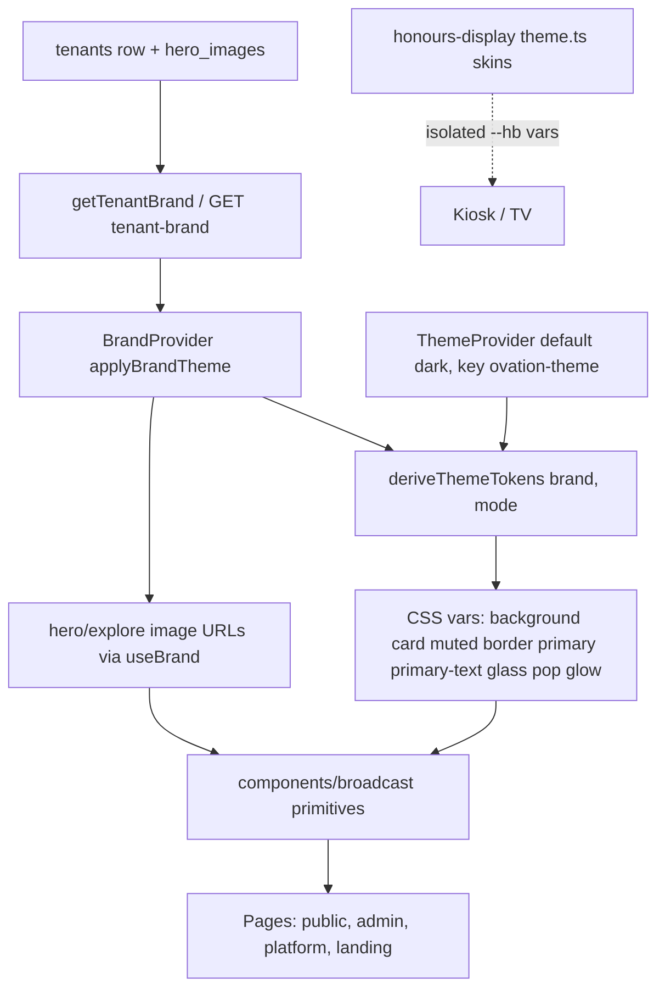
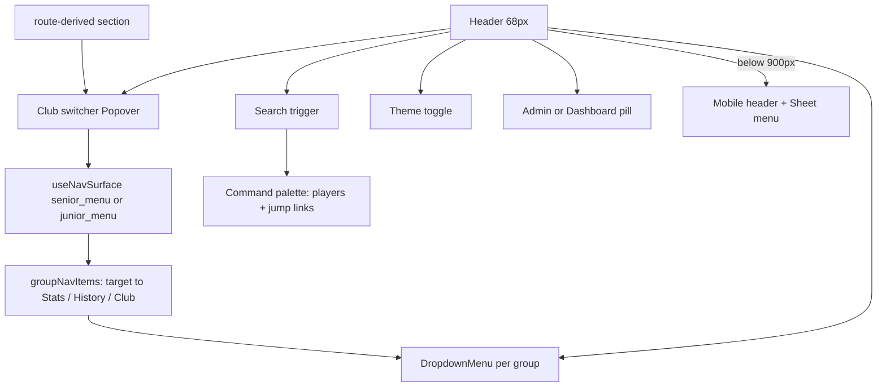
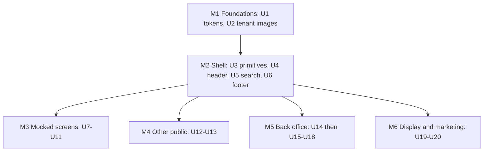

# Broadcast UI Redesign - Plan

## Goal Capsule

- **Objective:** Rebuild the `artifacts/cricket-club` web app on the "Broadcast" design system (handoff option 1a): new per-tenant tokens and type, a single glass header with club switcher / grouped nav / Cmd-K search, shared primitives, and every in-scope public, back-office, display and marketing surface re-laid out on them — dark mode by default, fully tenant-driven.
- **Authority:** This plan > the design handoff (`Handoff.md` + `Ovation App.dc.html` in the untracked `Application banner redesign.zip`) > existing page layouts. Where the handoff contradicts a repo invariant (white-label, juniors isolation, OpenAPI-first, kiosk skin parity, card-font loading), the invariant wins and this plan records the adaptation.
- **Execution profile:** Six milestones, landed as sequential PRs on `main` (no feature flag). Milestones M1–M2 gate everything; units inside M3–M6 are independent once M2 lands, except U15–U17, which depend on U14.
- **Stop conditions:** Stop and surface if (a) a change would require a new stats endpoint, (b) a pack/share-card or kiosk built-in skin renders differently, (c) the production migration cannot be applied with the incremental-migration runner, or (d) an excluded surface (Records, Compare, Social Studio, card editors) needs more than token/shell inheritance to stay usable.
- **Tail ownership:** PRs follow `CLAUDE.local.md` (auto-merge when CI is `CLEAN`) with these exceptions held for Ash:
  - U2 merges only after Ash has applied `0004` to prod via `lib/db/src/migrate.ts` and `db-drift-check` confirms the column. Any build containing the U2 schema change, api-server included, must not publish before that; the PR description carries a do-not-publish-until-migrated note.
  - U1, U17 and U19 merge only after the manual share-card / pack-card PNG or kiosk screenshot comparison is recorded in the PR description.

---

## Product Contract

### Summary

Adopt the Broadcast direction across the web app: tokens and fonts first, then the header/footer/search shell and a shared primitive set, then the six mocked screens pixel-close, then every other public, admin, captain, platform-admin, display and marketing page re-laid out from the same primitives. Records, Compare, Social Studio and the card editors only inherit tokens and shell. Tenants gain uploadable hero and explore-card images.

### Problem Frame

The current UI shows eight flat nav items, a Seniors/Juniors pill, theme and Help buttons and a separate gold section strip; at 375px the header overflows and controls fall off-screen (`docs/product-review/RECOMMENDATIONS.md` §2). The client selected the Broadcast direction: a calmer header, photography-led heroes, condensed stat typography and denser tables in dark and light modes. Because Ovation is white-label, every Halls Head value in the mocks (gold, slate, crest, photos) must come from the tenant brand, and surfaces with their own contracts (share cards, pack renderer, kiosk skins, platform brand) must not regress.

### Requirements

**Design system foundations**

- R1. Broadcast colour tokens (bg, surface, surface2, line, ink, ink2, accent, glass, pop, glow, shadow) exist for dark and light, mapped onto the existing shadcn variables and derived per tenant.
- R2. A contrast-safe accent-text token (`--primary-text`) is derived per tenant so accent text meets ≥4.5:1 on `--card` in both modes.
- R3. Barlow Condensed (500–800) is the default display/number face, IBM Plex Sans the body face, IBM Plex Mono the keycap face; the per-tenant heading-font override keeps working.
- R4. Dark mode is the default for visitors with no stored preference; stored preferences and the `ovation-theme` key are preserved.
- R5. Motion (lifts, zoom, pulse, ticker, bar width) follows the handoff timings and is disabled under `prefers-reduced-motion`.

**Global shell**

- R6. A 68px sticky glass header replaces the current header, section strip, Seniors/Juniors pill and header Help button: crest + club switcher (Seniors/Juniors + "Switch club"), grouped nav menus, search trigger, theme toggle, Admin/Dashboard pill.
- R7. Grouped nav menus are generated from the tenant's configured nav (`useNavSurface`), not hard-coded, and a group shows active when the current route is one of its children.
- R8. Below ~900px a 60px mobile header with section buttons, Search, Theme and a Menu sheet replaces the desktop header; all hit targets ≥44px and no page scrolls horizontally at 375px.
- R9. A Cmd/Ctrl-K search palette searches senior (and, in the juniors section, junior) players plus jump-to links, with arrow/Enter/Esc keyboard support.
- R10. A new footer shows crest, club identity, one column per nav group, admin login, and "Powered by Ovation"; the guided tour moves out of the header.

**Screens (mocked, pixel-close)**

- R11. Home (Seniors): photo hero with live pill, CTAs and an animated latest-results ticker; stat tiles; latest results; top performers with runs/wickets toggle, season and grade filters and animated bars; explore photo cards.
- R12. Players list with live name filter, grade chips (URL-synced), sticky-first-column table and empty state.
- R13. Player detail with portrait (headshot or initials fallback), cap pill, attribute chips, hairline career strip, share/compare actions, season-by-season table and milestones timeline.
- R14. Match scorecard with glow score hero, result/POTM footer, underline innings tabs, batting and bowling cards.
- R15. Honour boards with photo hero, URL-synced underline tabs and grade filter, and premiership cards.
- R16. Juniors home with brown hero, stat tiles, latest junior results (brown grade tiles) and junior premierships; section switching only via the club switcher.

**Other surfaces (re-laid out from the system, not pixel-mocked)**

- R17. Remaining public senior pages (Matches, Fixtures, Grades, Grade leaderboard, Premierships, Stat detail, Person detail, 404) and junior pages (Matches, Match detail, Players, Player detail, Premierships, Office bearers) use the Broadcast primitives and patterns of the nearest mocked screen.
- R18. Admin, captain and platform-admin shells and pages are redesigned on the Broadcast system, section by section.
- R19. Honours display gains a Broadcast built-in skin; the kiosk/TV keep their big-screen layouts and existing skins stay pixel-identical.
- R20. Ovation landing, directory and signup adopt Broadcast styling in the platform brand.

**Tenant content**

- R21. Each tenant can upload a home hero, juniors hero, honour-boards hero and three explore-card images from admin branding (self-serve and concierge); tenants without images get a brand-colour gradient hero.
- R22. Player portraits use the existing player image (`players.image_url`), falling back to an initials tile.

### Acceptance Examples

- AE1. **Covers R2.** Given a tenant whose primary is a light yellow, when viewed in light mode, accent-coloured text renders in a darkened shade with ≥4.5:1 contrast on white, while fills (buttons, bars) keep the original yellow.
- AE2. **Covers R4.** Given a first-time visitor whose OS is in light mode, the site loads dark with no flash; given a visitor who previously chose light, it loads light.
- AE3. **Covers R7.** Given a tenant whose `senior_menu` has an item targeting `/records` and a custom item targeting an external URL, the Records item appears under Stats and the external item appears under Club; hiding an item in admin nav removes it from the menu.
- AE4. **Covers R16, juniors isolation.** Given a user on `/juniors/players`, the club switcher shows Juniors active, the search palette queries junior players only, and no senior stats appear on juniors pages.
- AE5. **Covers R21.** Given a tenant with no home hero image, the home hero renders the gradient on the tenant's background colour with readable white text and no broken image.
- AE6. **Covers R11, R5.** Given the latest season has results in four grades, the ticker shows each result once to screen readers, loops seamlessly, pauses on hover, and renders as a static scrollable row under reduced motion.

### Scope Boundaries

- Records (`pages/records.tsx`), Compare (`pages/compare.tsx`), Social Studio (`pages/admin-social-studio.tsx`, `components/social-studio/`), and the card editors (`components/card-layout-editor/`, `components/card-template-builder.tsx`, trading-card template editing) receive only token and shell inheritance; their layouts are untouched.
- The Expo app (`artifacts/cricket-mobile`), the `/__card-render` harness, and pack/share-card templates are out of scope.
- No new stats endpoints; the ticker and all screens use existing hooks.

#### Deferred to Follow-Up Work

- Redesign of Records, Compare, Social Studio and card editors (Ash to decide direction).
- Server-side responsive image variants (`srcset` / AVIF) — this plan compresses on upload only.
- Match-day live polling of the ticker.
- A persisted nav `group` column / admin UI for choosing groups (this plan groups client-side).
- Per-tenant OG/meta tags served dynamically, and `established_year` / contact tenant fields for the footer.
- Code-splitting `admin-groups.tsx` eager imports (`plan.md` §5.5).

---

## Planning Contract

### Key Technical Decisions

- KTD1. **Extend `deriveThemeTokens`, don't add a parallel system.** New tokens (`--primary-text`, `--glass`, `--pop`, `--glow`, `--shadow-pop`) are emitted by `deriveThemeTokens(brand, mode)` in `artifacts/cricket-club/src/lib/theme-tokens.ts` and mirrored into the static `:root`/`.dark` blocks in `src/index.css` (the sync test requires it). Token names contain no digits (the sync test's key regex is `/(--[a-z-]+)/`). Only `--primary-text` joins `OVERRIDE_COLOUR_KEYS`, with matching `TOKEN_LABELS` and `FULL_TOKEN_GROUPS` entries in `src/lib/branding-controls.ts`; `--glass`/`--pop`/`--glow`/`--shadow-pop` are derived-only because alpha and box-shadow values cannot round-trip as colour overrides. `--primary-text` is computed after `applyThemeOverrides`, from the final `--primary` and `--card`, unless it is itself overridden. The Tailwind `text-primary` utility maps to `--primary-text` while `bg-primary`/`border-primary`/`ring-primary` stay on `--primary`, so existing accent text becomes contrast-safe without touching its ~327 call sites. The handoff's `buildBrandCss()` does not exist; this is its equivalent.
- KTD2. **Re-baseline the surface scale deliberately.** U1 replaces the navy fallback constants (`NAVY_DARK`/`NAVY_LIGHT`, used by tenants without a `backgroundColour` and by `useNavyBase`) with the neutral Broadcast scale, and retunes the derived-surface L/S multipliers so Halls Head's `#333F48` yields `#0B1014`/`#131A20`/`#1B242B`/`#26313A`. The exact-value tests in `theme-tokens.test.ts` are re-baselined in the same commit: Halls Head dark and light, the wild-brand saturation clamp, `useNavyBase`, the L>60 fallback, and the `DEFAULT_BRAND` CSS sync. The "no HHCC literals leak" guarantee lives in `src/__tests__/brand-leaks.test.tsx` and stays untouched.
- KTD3. **Keep existing font families loaded.** Add Barlow Condensed to the Google Fonts link but keep IBM Plex Sans/Mono and Bricolage Grotesque: share cards force-load IBM Plex Sans from the page's font link, the gold-foil pack and `--hb-title-font` use Bricolage. `--app-font-serif` defaults to Barlow Condensed; tenant overrides via `themeOverrides["--app-font-serif"]` still win.
- KTD4. **Group nav client-side.** `nav_items` is flat. A static target→group map (Stats / History / Club, per section) groups `useNavSurface` results; unmapped internal targets and external links fall into "Club"; "Home"/"Overview" stay top-level on desktop and form the "Browse" group in the mobile sheet. No schema change now (DB `group` column deferred).
- KTD5. **One JSONB column for tenant imagery.** Add `tenants.hero_images` (jsonb: `home`, `juniors`, `honours`, `explore.{honours,players,premierships}`) rather than six columns — one migration, one field in `TenantBrand` / both closed PATCH schemas, and room for future slots. Headshots reuse `players.image_url` (KTD per R22).
- KTD6. **Compress on upload, not a server pipeline.** Admin image uploads are downscaled client-side to WebP (≤2000px wide for heroes, ≤1000px for explore cards) before the presigned upload; when the browser's encoder returns a non-WebP blob (Safari), re-encode as JPEG at ~0.82 quality. Heroes render with `object-fit` and `fetchpriority`; explore cards lazy-load.
- KTD7. **Broadcast primitives live in `artifacts/cricket-club/src/components/broadcast/`** and consume shadcn tokens only (no raw hex except the fixed hero overlay gradients and juniors `--juniors-accent`). Radix `DropdownMenu`/`Popover` back the menus (no new `navigation-menu` dependency); the existing `ui/command.tsx` (cmdk) backs search; `ui/sheet.tsx` backs the mobile menu.
- KTD8. **Header height is a CSS variable.** `--header-h` (68px desktop / 60px mobile) replaces hard-coded offsets such as `admin-layout.tsx`'s `sticky top-28`.
- KTD9. **Kiosk gets a new skin, not a restyle.** A built-in "P5 · Broadcast" skin already exists, and built-ins are the `TemplateId` union + `TEMPLATES` in `components/honours-display/types.ts` plus `.skin-pN` CSS classes (not `theme.ts`). Add `p11` "P11 · Ovation Broadcast" with a `.skin-p11` block in `styles/honour-boards.css`; `.skin-p1`–`.skin-p10` stay byte-identical and remain the default for tenants that already chose one.
- KTD10. **Ticker from `useGetSeniorOverview().recentMatches`.** It already returns the latest match per grade in the latest season; no new endpoint.
- KTD11. **Preserve tour and test hooks.** Every `data-tour` selector in `lib/tour.ts` and existing `data-testid`s (e.g. `link-section-seniors`) move onto their Broadcast equivalents; the tour's `help-button` step is retargeted to the footer "Take the tour" link.
- KTD12. **No Halls Head assets in the repo.** Mock photos are tenant content: Ash uploads them for tenant #1 through the new admin fields after U2 ships. The design zip stays untracked.

### High-Level Technical Design

Token and brand data flow (U1, U2):

Header composition and nav grouping (U4, U5):

Milestone sequencing:

### Sequencing

M1 → M2 are prerequisites. U2 can land in parallel with U3–U6 but must precede U7/U10/U11 (heroes). U12 must follow U10, because it reuses U10's premiership card grid. Within M5, U14 (chrome) precedes U15–U17; U18 depends only on U3. M3–M6 can otherwise proceed in any order; suggested order is M3 → M4 → M5 → M6 so visitors see the mixed old/new state for the shortest time.

### Research Anchors

- Token pipeline: `artifacts/cricket-club/src/lib/theme-tokens.ts` (`deriveThemeTokens`, `ACCENT_TOKENS`, override whitelists, `--primary-foreground` threshold), `src/lib/theme-tokens-css-sync.test.ts`, `src/lib/theme-tokens.test.ts`, `src/lib/brand-context.tsx` (`applyBrandTheme`), `src/lib/theme-context.tsx` + inline anti-flash script in `index.html`.
- Brand type: `lib/scorecard/src/brand.ts` (`ClubBrand`, `DEFAULT_BRAND`).
- Nav: `src/lib/use-nav.ts`, `lib/scorecard/src/nav.ts`, `src/lib/nav-icons.tsx`, `pages/admin-nav.tsx`; tour selectors `src/lib/tour.ts`.
- Branding write path: `lib/db/src/schema/tenants.ts`, `artifacts/api-server/src/lib/tenant-brand.ts`, `routes/tenant.ts`, `routes/platform-admin.ts`, OpenAPI `TenantBrand` / `UpdateTenantBrandBody` / `UpdateAdminTenantBrandBody`, `pages/admin-branding.tsx` (`backgroundUrl` upload block), `pages/platform-admin/branding-card.tsx`.
- Home data: `useGetSeniorOverview`, `useGetSeniorSeasonTopPerformers` in `pages/home.tsx`.
- Kiosk: `components/honours-display/theme.ts`, `styles/honour-boards.css`.
- Learnings: `memory/production-migration-drift.md` (incremental migration + journal/snapshot chaining), `.agents/memory/canvas-share-card-fonts.md`, `.agents/memory/honour-display-rework.md`, `.agents/memory/admin-configurable-nav.md`, `memory/windows-local-test-setup.md`.

### Risks

| Risk                                                                                                                                                              | Mitigation                                                                                                                                                                                                               |
| ----------------------------------------------------------------------------------------------------------------------------------------------------------------- | ------------------------------------------------------------------------------------------------------------------------------------------------------------------------------------------------------------------------ |
| Font-link change silently breaks share cards / packs / kiosk titles                                                                                               | KTD3 keeps all existing families; U1 test asserts the link still includes IBM Plex Sans and Bricolage; render a real share-card PNG before merging U1                                                                    |
| New API code selects `hero_images` before prod has the column (10 Sep outage pattern: every `db.select().from(tenantsTable)`, incl. `routes/auth.ts`, would fail) | U2 ships an incremental `ADD COLUMN IF NOT EXISTS` migration with chained journal/snapshot; U2 is held from auto-merge until Ash applies it via `lib/db/src/migrate.ts` and `db-drift-check` passes (see Tail ownership) |
| Manual card/kiosk checks skipped by auto-merge                                                                                                                    | U1, U17, U19 held from auto-merge until the comparison is recorded in the PR (see Tail ownership)                                                                                                                        |
| Mixed old/new look during rollout                                                                                                                                 | Shell lands first so every page gets the new chrome; M3/M4 follow promptly                                                                                                                                               |
| Sticky offsets and full-bleed heroes fight nested `Layout` padding                                                                                                | `--header-h` var (KTD8); heroes opt out of the content container via a full-bleed primitive                                                                                                                              |
| Unmocked admin pages drift stylistically                                                                                                                          | All built from `components/broadcast/` primitives; screenshot review of each M5 unit at 1280 and 375 in both modes                                                                                                       |
| Tour breaks after header rebuild                                                                                                                                  | KTD11; tour smoke test covers selector presence                                                                                                                                                                          |

---

## Implementation Units

| U-ID | Title                                            | Key files                                                                                                                                                                                     | Depends on |
| ---- | ------------------------------------------------ | --------------------------------------------------------------------------------------------------------------------------------------------------------------------------------------------- | ---------- |
| U1   | Broadcast tokens, fonts, dark default            | `src/lib/theme-tokens.ts`, `src/index.css`, `index.html`, `src/lib/theme-context.tsx`                                                                                                         | —          |
| U2   | Tenant hero/explore images                       | `lib/db/src/schema/tenants.ts`, `lib/db/migrations/`, `api-server/src/lib/tenant-brand.ts`, `openapi.yaml`, `pages/admin-branding.tsx`                                                        | —          |
| U3   | Broadcast primitives + shadcn restyle            | `src/components/broadcast/*`, `src/components/ui/*`                                                                                                                                           | U1         |
| U4   | Header, club switcher, grouped nav, mobile sheet | `src/components/layout.tsx`, `src/components/broadcast/site-header/*`                                                                                                                         | U3         |
| U5   | Cmd-K search palette                             | `src/components/broadcast/search-palette.tsx`                                                                                                                                                 | U4         |
| U6   | Footer and tour relocation                       | `src/components/layout.tsx`, `src/lib/tour.ts`                                                                                                                                                | U4         |
| U7   | Home (Seniors)                                   | `pages/home.tsx`                                                                                                                                                                              | U2, U3–U6  |
| U8   | Players list + Player detail                     | `pages/players.tsx`, `pages/player-detail.tsx`                                                                                                                                                | U3–U6      |
| U9   | Match scorecard                                  | `pages/match-detail.tsx`, `components/scorecard/*`                                                                                                                                            | U3–U6      |
| U10  | Honour boards                                    | `pages/honour-boards.tsx`, `components/*-tab.tsx`, `components/premierships/*`                                                                                                                | U2, U3–U6  |
| U11  | Juniors home                                     | `pages/juniors-dashboard.tsx`                                                                                                                                                                 | U2, U3–U6  |
| U12  | Other senior public pages                        | `pages/matches.tsx`, `fixtures-results.tsx`, `grades.tsx`, `grade-leaderboard.tsx`, `premierships.tsx`, `stat-detail.tsx`, `person-detail.tsx`, `not-found.tsx`                               | U3–U6, U10 |
| U13  | Other junior public pages                        | `pages/juniors-*.tsx`                                                                                                                                                                         | U3–U6      |
| U14  | Back-office chrome                               | `admin-shell.tsx`, `admin-layout.tsx`, `pages/admin.tsx`, `pages/admin-groups.tsx`, `captain-shell.tsx`                                                                                       | U3–U6      |
| U15  | Admin: Honours section                           | `pages/admin-{awards,caps,life-members,premierships,team-of-decade,honour-boards,milestone-board,honours-display,records-display,match-display,junior-premierships,junior-match-display}.tsx` | U14        |
| U16  | Admin: People, Stats, Settings                   | `pages/admin-{players,people,committee,captains,junior-committee,junior-players,junior-stats,stats,fixtures,users,import,reset,nav,branding,tour-content}.tsx`                                | U14        |
| U17  | Admin: Social (non-editor) + captain             | `pages/admin-{social,social-queue,social-create,social-sets,junior-social,trading-cards}.tsx`, `pages/captain.tsx`                                                                            | U14        |
| U18  | Platform admin                                   | `components/platform-admin-shell.tsx`, `pages/platform-admin/*`                                                                                                                               | U3         |
| U19  | Honours display Broadcast skin                   | `components/honours-display/types.ts`, `styles/honour-boards.css`, `pages/honours-display.tsx`                                                                                                | U1, U3     |
| U20  | Landing, directory, signup                       | `pages/landing/*`                                                                                                                                                                             | U3         |

(All web paths below are under `artifacts/cricket-club/` unless stated.)

### U1. Broadcast tokens, fonts, dark default

**Goal:** Every tenant renders with Broadcast colour, type and radius tokens in both modes, dark by default.
**Requirements:** R1, R2, R3, R4, R5
**Dependencies:** none
**Files:** `src/lib/theme-tokens.ts`, `src/index.css`, `index.html`, `src/lib/theme-context.tsx`, `src/lib/brand-context.tsx`, `src/lib/branding-controls.ts`, `src/lib/share-card/fonts.ts` (force-load list), `lib/scorecard/src/brand.ts` (only if `DEFAULT_BRAND` surface defaults change), `.design-sync/conventions.md`; tests `src/lib/theme-tokens.test.ts`, `src/lib/theme-tokens-css-sync.test.ts`, `src/lib/theme-context.test.tsx`, new `src/lib/primary-text-contrast.test.ts`.
**Approach:** Replace the navy fallback and retune the derived-surface multipliers to the Broadcast scale (KTD2). Add `--primary-text`: after overrides are applied, darken or lighten the final primary until it reaches ≥4.5:1 against the final `--card`. Map `text-primary` to it (KTD1). Add derived-only `--glass`, `--pop`, `--glow`, `--shadow-pop`; set radius scale to 12px card / 8px control. Set `--app-font-serif` default to Barlow Condensed with uppercase + 0.01em tracking on headings, `tabular-nums` utility for stats. Add Barlow Condensed 500–800 to the font link keeping existing families (KTD3). Switch ThemeProvider and the inline script default from `system` to `dark`. Add reduced-motion base rules and the shared keyframes (pulse, ticker) alongside the preserved `hhPulse/hhShine/hhGlow`. Ensure IBM Plex Sans stays in the share-card force-load list, since Broadcast DOM text may no longer request it. Regenerate the static CSS blocks. Confirm the `/__card-render` harness keeps a transparent/unchanged body under the dark default.
**Patterns to follow:** existing `ACCENT_TOKENS` derivation and `--primary-foreground` threshold logic; override whitelist pattern.
**Test scenarios:**

- Covers AE1. Yellow primary (`#FBE34A`) in light mode → `--primary-text` contrast vs `--card` ≥ 4.5; `--primary` unchanged.
- Dark navy primary in dark mode → `--primary-text` lightened to ≥ 4.5 against dark card.
- `themeOverrides` sets `--card` to a light colour in dark mode → `--primary-text` still ≥ 4.5 against the overridden card; an explicit `--primary-text` override wins.
- Covers AE1. A rendered `text-primary` element under a yellow-primary brand in light mode resolves to `--primary-text`; a `bg-primary` element keeps `--primary`.
- Halls Head brand in dark mode → background/card/muted/border match Broadcast `#0B1014/#131A20/#1B242B/#26313A` within 2 HSL; re-baselined exact values for Halls Head light, wild-brand clamp, `useNavyBase` and L>60 fallback pass.
- `branding-controls` typechecks with `--primary-text` in `TOKEN_LABELS` and the full-editor coverage check passes.
- No-brand tenant → `brand-leaks` test still passes.
- `themeOverrides["--app-font-serif"]` set → heading font var reflects override.
- Covers AE2. ThemeProvider with empty storage and OS light → resolves dark; with stored `light` → light; stored `system` → follows OS.
- CSS sync: static `:root`/`.dark` equal `deriveThemeTokens(DEFAULT_BRAND, mode)` including new tokens.
- `index.html` font link contains Barlow Condensed, IBM Plex Sans and Bricolage Grotesque.
  **Verification:** Tests green; home page in the preview shows Barlow headings, dark surfaces; a share-card PNG export renders in IBM Plex Sans unchanged.

### U2. Tenant hero and explore-card images

**Goal:** Tenants can upload hero and explore images that flow to the brand context.
**Requirements:** R21, R22
**Dependencies:** none
**Files:** `lib/db/src/schema/tenants.ts`, `lib/db/migrations/0004_tenant_hero_images.sql` (+ `meta/_journal.json`, snapshot), `artifacts/api-server/src/lib/tenant-brand.ts`, `artifacts/api-server/src/routes/tenant.ts`, `artifacts/api-server/src/routes/platform-admin.ts`, `lib/api-spec/openapi.yaml`, generated `lib/api-client-react` + `lib/api-zod` (via codegen), `lib/scorecard/src/brand.ts`, `pages/admin-branding.tsx`, `pages/platform-admin/branding-card.tsx`, new `src/lib/compress-image.ts`, new `src/lib/use-hero-image.ts`; tests `artifacts/api-server/src/routes/tenant-brand-images.test.ts`, `src/lib/compress-image.test.ts`, `pages/platform-admin/branding-card.test.ts`.
**Approach:** Add nullable `hero_images` jsonb (KTD5). Write an incremental migration with `ADD COLUMN IF NOT EXISTS`, chained journal and snapshot. Extend the brand select/builder/cache, `ClubBrand`, `TenantBrand`, and both closed PATCH schemas with a validated `heroImages` object (each slot a storage path string or null); whitelist in both handlers and invalidate the brand cache. Add an "Imagery" card to admin branding and the concierge card mirroring the `backgroundUrl` upload block, with client-side WebP downscale (KTD6) and preview. `useHeroImage(slot)` returns the URL or null for gradient fallback.
**Patterns to follow:** `backgroundUrl` end-to-end path; `invalidateTenantBrandCache`; existing incremental migration `0003_playhq_fixtures.sql`.
**Execution note:** Start with the API integration test for PATCH/GET round-trip, then UI.
**Test scenarios:**

- PATCH `/tenant-brand` with `heroImages.home` path → GET returns it; other slots null.
- PATCH with unknown key inside `heroImages` → 400 (closed schema).
- PATCH as tenant A admin never changes tenant B's images (isolation).
- Concierge PATCH `/platform/admin/tenants/{id}/brand` sets `heroImages.explore.players`.
- Clearing a slot (null) removes it; cache invalidated so next GET reflects change.
- Tenant row with null `hero_images` → brand DTO has all slots null (old rows safe).
- `compressImage` on a 4000px JPEG → ≤2000px WebP; on a 600px image → not upscaled; on a non-image → rejects.
- Encoder returns a PNG blob for a WebP request (Safari) → output re-encoded as JPEG.
- Covers AE5. `useHeroImage('home')` with no image → null.
  **Verification:** CI migrations-diff and codegen-diff pass; uploading in admin (Chrome and Safari) shows the image on reload; migration applies cleanly against a prod-shaped DB with the runner. Update the `UpdateAdminTenantBrandBody` description's property count.

### U3. Broadcast primitives and shadcn restyle

**Goal:** A shared component set every page composes from.
**Requirements:** R1, R5, R11–R20 (enabling)
**Dependencies:** U1
**Files:** new `src/components/broadcast/` — `page-hero.tsx` (photo/gradient, full-bleed, overlay variants: home, juniors, honours), `page-header.tsx` (eyebrow/H1/subtitle/actions), `stat-tile.tsx`, `stat-strip.tsx` (hairline career strip), `result-row.tsx`, `result-pill.tsx`, `leader-row.tsx`, `photo-card.tsx`, `filter-chips.tsx`, `segmented-control.tsx`, `underline-tabs.tsx`, `glass-pill.tsx`, `live-pill.tsx`, `data-table.tsx` (card-wrapped, horizontal scroll, optional sticky first column), `section-card.tsx` (H2 + action link), `initials-avatar.tsx`, `timeline.tsx`, `results-ticker.tsx`, `skeletons.tsx`, `index.ts`; restyle `src/components/ui/{card,button,input,badge,tabs,dialog,dropdown-menu,popover,select,sheet,command}.tsx`; `src/components/grade-badge.tsx` (diamond 40px variant, juniors brown tile variant); tests `src/components/broadcast/__tests__/{results-ticker,filter-chips,underline-tabs,leader-row,page-hero}.test.tsx`.
**Approach:** Primitives consume tokens only (KTD7). Result colours become tokens (`--win`, `--loss` pairs per mode). `ResultsTicker` renders items twice with the duplicate `aria-hidden` and buttons `tabIndex=-1`, duration = 5s × unique count, pause on hover, static scroll row under reduced motion. `FilterChips` / `UnderlineTabs` accept a URL-sync option via wouter search params. `PageHero` accepts image URL or falls back to a gradient on `--background`/`--juniors-accent`. Restyling shared `ui/*` also reaches Records, Compare and Social Studio; check those three still render and work before merging (stop condition (d)).
**Patterns to follow:** existing `data-states.tsx` skeleton/empty conventions; `GradeBadge` badge-style context.
**Test scenarios:**

- Covers AE6. Ticker with 4 items → 8 rendered, 4 `aria-hidden`; duplicate buttons have tabindex -1; animation duration 20s.
- Ticker under mocked `prefers-reduced-motion` → no animation class, container horizontally scrollable.
- Ticker with 0 items → renders nothing (no empty glass bar).
- FilterChips with URL sync → clicking "B Grade" sets `?grade=B`; loading with `?grade=B` marks it active.
- UnderlineTabs keyboard: arrow keys move focus, active tab has `aria-selected`.
- LeaderRow bar width = value / leader value; zero leader value → 0% without NaN.
- Covers AE5. PageHero without image → gradient element, no `img`.
  **Verification:** Primitives render in dark/light; existing `pages-smoke` still green with restyled shadcn components.

### U4. Header, club switcher, grouped nav, mobile sheet

**Goal:** The single Broadcast header on every `Layout` page.
**Requirements:** R6, R7, R8
**Dependencies:** U3
**Files:** `src/components/layout.tsx`, new `src/components/broadcast/site-header/{site-header,club-switcher,nav-group-menu,mobile-header,mobile-section-toggle,mobile-menu-sheet,theme-toggle}.tsx`, new `src/lib/nav-groups.ts`, `src/lib/tour.ts`, `src/components/admin-layout.tsx` (use `--header-h`); tests `src/lib/nav-groups.test.ts`, `src/components/broadcast/site-header/__tests__/site-header.test.tsx`, `src/__tests__/smoke.test.tsx` updates.
**Approach:** `groupNavItems(items, section)` maps known targets to Stats / History / Club and returns top-level items (KTD4). Desktop groups use `DropdownMenu` with icon tiles from `nav-icons` and item descriptions; active group derived from the route. The club switcher is a `Popover` with Seniors and Juniors rows and a "Switch club" link to the Ovation directory on the apex host. The Juniors row is hidden only when the raw `useListNavItems({surface:'junior_menu'})` has loaded, is non-empty and every item is `visible:false`; unseeded tenants keep the fallback juniors nav and the row. The Admin pill reads "Admin", or "Dashboard" when signed in, and replaces the auto-appended nav Admin item. Remove the section banner, the pill toggle and the header Help button. Below 900px (a custom breakpoint) the mobile header shows:

- tapping the crest/name reveals an inline row of two 48px Seniors/Juniors buttons, the active one accent-bordered;
- a Menu `Sheet` grouped into Browse (Home/Overview), Stats, History and Club. Carry `data-tour` and `data-testid` hooks (KTD11). Set `--header-h`.
  **Patterns to follow:** existing `useNavSurface` fallbacks and admin auto-append logic in `layout.tsx`.
  **Test scenarios:**
- Covers AE3. `groupNavItems` puts `/players`, `/matches`, `/grades`, `/records`, `/compare` under Stats; `/honour-boards`, `/premierships` under History; `/fixtures` and an external URL under Club; `/` top-level.
- Juniors items: `/juniors/matches`, `/juniors/players` → Stats; `/juniors/premierships`, `/juniors/office-bearers` → History.
- Group with zero visible children is not rendered.
- On `/records`, the Stats trigger has the active style.
- Covers AE4. On `/juniors/players`, switcher label reads Juniors and menu shows junior groups.
- Tenant whose loaded junior menu items are all hidden → switcher shows Seniors row only; unseeded tenant (no rows) → both rows.
- Mobile: tapping the crest reveals the Seniors/Juniors button row; tapping Juniors navigates to `/juniors`.
- Mobile sheet lists Home under Browse and the Stats/History/Club groups.
- Esc closes an open menu and the switcher; outside click closes.
- Signed-in admin → pill reads Dashboard and links `/admin`; nav has no duplicate Admin item.
- `data-tour="main-nav"`, `section-toggle` and `data-testid="link-section-seniors"` present.
  **Verification:** Header matches `screenshots/01` / `03` at 1280 and 375 in both modes; no horizontal scroll at 375 on home and players.

### U5. Cmd-K search palette

**Goal:** Fast keyboard search for players and key pages.
**Requirements:** R9
**Dependencies:** U4
**Files:** new `src/components/broadcast/search-palette.tsx`, `src/components/broadcast/site-header/site-header.tsx`; test `src/components/broadcast/__tests__/search-palette.test.tsx`.
**Approach:** `CommandDialog` (cmdk) styled per handoff. Debounced query → `useListPlayers({search, limit:5})` in the senior section, `useListJuniorPlayers({search})` in the juniors section (juniors isolation). Rows show initials/headshot, name, grades, runs · wkts when available. "Jump to" group lists nav targets for the current section plus latest scorecard. Global Cmd/Ctrl-K listener; ignored while focus is in an input other than the palette.
**Test scenarios:**

- Ctrl-K opens with input focused; Esc closes.
- Typing "cai" on a senior route calls the players list with `search=cai`, renders ≤5 rows; Enter navigates to `/players/:id`.
- Covers AE4. On a juniors route, the junior players hook is used and the senior one is not called.
- Empty query shows only Jump to; no results shows an empty message.
- ArrowDown/ArrowUp change the highlighted row.
  **Verification:** Palette matches handoff layout; keyboard-only navigation works.

### U6. Footer and tour relocation

**Goal:** Broadcast footer and a non-header home for the guided tour.
**Requirements:** R10
**Dependencies:** U4
**Files:** `src/components/layout.tsx` (or new `src/components/broadcast/site-footer.tsx`), `src/lib/tour.ts`, `src/components/welcome-guide.tsx`; test `src/components/broadcast/__tests__/site-footer.test.tsx`.
**Approach:** Crest + short name/full name + tagline column, one column per nav group from `groupNavItems`, bottom bar with © year + club name + Admin login + "Take the tour" + "Powered by Ovation". The tour link reuses `HelpButton`'s launch logic: the admin tour on `/admin*` when signed in, the fan tour otherwise. Retarget the tour's help step to the footer link.
**Test scenarios:**

- Footer columns mirror header groups for the active section.
- Signed-in admin on `/admin` → tour link launches the admin tour.
- Tour starts from the footer link; the retargeted step's selector exists.
- Copyright uses the tenant name (no Halls Head literal; `brand-leaks` test green).
  **Verification:** Footer matches handoff in both modes and collapses to one column at 375.

### U7. Home (Seniors)

**Goal:** Pixel-close Broadcast home.
**Requirements:** R11, R21
**Dependencies:** U2, U3–U6
**Files:** `pages/home.tsx`, new `pages/home/{home-hero,top-performers-card,latest-results-card,explore-grid}.tsx`; test `src/__tests__/home-broadcast.test.tsx`.
**Approach:** Hero with `useHeroImage('home')`, live pill from `latestSeasonLabel` + latest round, CTAs (latest scorecard = most recent `recentMatches` item), ticker from `recentMatches` (KTD10). Stat tiles from `totals`. Latest results card with diamond badges. Top performers with segmented Runs/Wickets, season select, grade chips, animated `LeaderRow`s via `useGetSeniorSeasonTopPerformers`. Explore grid uses tenant explore images with gradient fallback. Keep `data-tour` home hooks.
**Test scenarios:**

- Renders tiles from mocked overview totals with tabular formatting.
- Toggling Wickets re-queries/reshapes leaders; bars recompute widths.
- Grade chip filter passes the grade param.
- No recent matches → ticker and latest-results show empty states, hero still renders.
- Clicking a ticker item navigates to `/matches/:id`.
- Covers AE5. Tenant without home hero → gradient hero.
- Overview query pending → skeleton blocks shaped like tiles and cards render.
  **Verification:** Compare against `screenshots/01–03`.

### U8. Players list and Player detail

**Goal:** Broadcast players table and player profile.
**Requirements:** R12, R13, R22
**Dependencies:** U3–U6
**Files:** `pages/players.tsx`, `pages/player-detail.tsx` (split heavy sections into `pages/player-detail/*` as needed); tests `src/__tests__/players-broadcast.test.tsx`, `src/__tests__/player-detail-broadcast.test.tsx`.
**Approach:** Players: `PageHeader` with live search pill, URL-synced grade chips, `DataTable` with sticky player column. Detail: portrait from `player.imageUrl` or initials tile, glass cap pill, attribute chips, `StatStrip`, share (existing lazy share-card modal) and compare actions, season table, milestones `Timeline`. Preserve existing detail tabs/content not in the mock by restyling them below the fold.
**Test scenarios:**

- `?grade=B&q=smith` loads with chip and input set, table filtered.
- No match → "No players match that filter."
- Row click navigates to detail.
- Player without image → initials tile; with image → `img` with cover.
- Player without cap → no cap pill.
- Share opens the existing share-card modal.
- Players list and player queries pending → table-row and portrait/strip skeletons render.
  **Verification:** Compare against `screenshots/04–09`; sticky column works when scrolled at 375.

### U9. Match scorecard

**Goal:** Broadcast match page.
**Requirements:** R14
**Dependencies:** U3–U6
**Files:** `pages/match-detail.tsx`, `src/components/scorecard/*` (presentation only; `@workspace/scorecard` view-model unchanged); test `src/__tests__/match-detail-broadcast.test.tsx`.
**Approach:** Score hero (glow, crest vs initial disc, def / lost to / tied), result + POTM footer, `UnderlineTabs` per innings, batting and bowling `DataTable` cards with extras/total/did-not-bat rows.
**Test scenarios:**

- Win → "def"; loss → "lost to"; tie → "tied"; no result → neutral label.
- Opposition without logo → initial disc.
- Switching innings tab swaps both cards.
- Grand final match → Grand Final pill.
- Missing POTM → footer omits it.
- Match query pending → hero and scorecard skeletons render.
- `juniors-match-detail` (shares `components/scorecard/*`) still renders correctly.
  **Verification:** Compare against `screenshots/10–12`.

### U10. Honour boards

**Goal:** Broadcast honour boards with tabs and premiership cards.
**Requirements:** R15, R21
**Dependencies:** U2, U3–U6
**Files:** `pages/honour-boards.tsx`, `src/components/{awards-tab,cap-register-tab,life-members-tab,records-tab,team-of-decade-tab,committee-tab}.tsx`, `src/components/premierships/*`; test `src/__tests__/honour-boards-broadcast.test.tsx`.
**Approach:** `PageHero` with `useHeroImage('honours')`, URL-synced `UnderlineTabs` and grade chips with count, premiership card grid (hover lift, click to match/squad). Other tabs re-laid out on `DataTable`/`SectionCard`.
**Test scenarios:**

- `?tab=life-members` opens that tab; switching updates URL.
- Grade filter updates the count text ("N premierships shown").
- Premiership card click navigates to linked match; card without match link is not clickable.
- Each tab renders its empty state when data is empty.
- Premierships query pending → card-grid skeletons render.
  **Verification:** Compare against `screenshots/13–15`.

### U11. Juniors home

**Goal:** Broadcast juniors dashboard.
**Requirements:** R16, R21
**Dependencies:** U2, U3–U6
**Files:** `pages/juniors-dashboard.tsx`; test `src/__tests__/juniors-dashboard-broadcast.test.tsx`.
**Approach:** Hero on `--juniors-accent` with `useHeroImage('juniors')`, accent H1, junior stat tiles, latest junior results with brown grade tiles, junior premierships list — junior hooks only.
**Test scenarios:**

- Covers AE4. Only `/api/juniors/*` hooks are called.
- Tenant `juniorsColour` drives the hero background.
- No junior results → empty state.
- Junior queries pending → tile and list skeletons render.
  **Verification:** Compare against `screenshots/16–18`.

### U12. Other senior public pages

**Goal:** Remaining senior pages on the system.
**Requirements:** R17
**Dependencies:** U3–U6, U10
**Files:** `pages/matches.tsx`, `pages/fixtures-results.tsx`, `pages/grades.tsx`, `pages/grade-leaderboard.tsx`, `pages/premierships.tsx`, `pages/stat-detail.tsx`, `pages/person-detail.tsx`, `pages/not-found.tsx`; test updates in `src/__tests__/pages-smoke.test.tsx`.
**Approach:** Lists → `PageHeader` + chips + `ResultRow`/`DataTable` (Matches, Fixtures); Grades → grade tiles; leaderboards → `LeaderRow`/`DataTable`; Premierships → the U10 premiership card grid; Person/Stat detail → Player-detail patterns; 404 → `PageHeader` + CTA. Replace the `hhcc-` share filename prefix with a client-side slug of `brand.shortName ?? brand.name` from `useBrand()`; no spec change is needed.
**Test scenarios:**

- Each page renders in `pages-smoke` with mocked data and with empty data.
- Premierships share filename uses the slugified tenant short name, not `hhcc`.
- Grade leaderboard respects `:grade` param and chip changes.
  **Verification:** Screenshot review at 1280/375, both modes.

### U13. Other junior public pages

**Goal:** Remaining junior pages on the system.
**Requirements:** R17
**Dependencies:** U3–U6
**Files:** `pages/juniors-matches.tsx`, `pages/juniors-match-detail.tsx`, `pages/juniors-players.tsx`, `pages/juniors-player-detail.tsx`, `pages/juniors-premierships.tsx`, `pages/juniors-office-bearers.tsx`; test updates in `src/__tests__/pages-smoke.test.tsx`.
**Approach:** Mirror U8/U9/U12 patterns with the juniors brown tile variant; remove `text-[#bc8c6b]` in `juniors-players.tsx` in favour of tokens; replace the `hhcc-junior-` share filename prefix in `juniors-premierships.tsx` the same way as U12.
**Test scenarios:**

- Each page renders with mocked and empty data.
- Junior premierships share filename carries no `hhcc` prefix.
- Only junior hooks are used on these routes.
- No raw hex colour classes remain in these files.
  **Verification:** Screenshot review at 1280/375, both modes.

### U14. Back-office chrome

**Goal:** Admin, captain shells and admin hub on Broadcast.
**Requirements:** R18
**Dependencies:** U3–U6
**Files:** `src/components/admin-shell.tsx`, `src/components/admin-layout.tsx`, `src/components/captain-shell.tsx`, `pages/admin.tsx`, `pages/admin-groups.tsx`; tests `src/__tests__/admin-shell-broadcast.test.tsx`.
**Approach:** Login gate as a centred `pop` card; sidebar restyled (menu-item radius, accent icon tiles, active `--muted` state) sticky at `--header-h`, collapsing to a `Sheet` below 900px; admin hub tiles as `PhotoCard`-less icon cards; group tabs as `UnderlineTabs` (URL-driven, preserving old-URL redirects).
**Test scenarios:**

- Unauthenticated `/admin` shows login card; authenticated shows sidebar.
- Entitlement-filtered items still hidden.
- Group tab URL `/admin/honours/awards` selects Awards.
- `data-tour="admin-nav"` hooks present.
- Mobile width renders the sidebar sheet trigger.
  **Verification:** Admin navigable at 1280 and 375 in both modes.

### U15. Admin: Honours section

**Goal:** Honours admin pages on the system.
**Requirements:** R18
**Dependencies:** U14
**Files:** `pages/admin-awards.tsx`, `admin-caps.tsx`, `admin-life-members.tsx`, `admin-premierships.tsx`, `admin-team-of-decade.tsx`, `admin-honour-boards.tsx`, `admin-milestone-board.tsx`, `admin-honours-display.tsx`, `admin-records-display.tsx`, `admin-match-display.tsx`, `admin-junior-premierships.tsx`, `admin-junior-match-display.tsx`, `src/components/admin-awards/*`, `src/components/honour-boards/*`; tests: existing `pages/admin-honours-display.test.tsx` plus `pages-smoke` coverage.
**Approach:** Page = `PageHeader` (no `h1` on leaf pages per admin convention) + `SectionCard` forms + `DataTable` lists + consistent dialog styling. No behaviour changes.
**Test scenarios:**

- Each page renders with mocked list data and empty data.
- Create/edit dialog opens and submits via existing mutation (one representative page: awards).
- `admin-honours-display.test.tsx` still passes.
  **Verification:** Screenshot pass of each page in both modes.

### U16. Admin: People, Stats and Settings

**Goal:** Remaining non-social admin pages on the system.
**Requirements:** R18, R21
**Dependencies:** U14
**Files:** `pages/admin-players.tsx`, `admin-people.tsx`, `admin-committee.tsx`, `admin-captains.tsx`, `admin-junior-committee.tsx`, `admin-junior-players.tsx`, `admin-junior-stats.tsx`, `admin-stats.tsx`, `admin-fixtures.tsx`, `admin-users.tsx`, `admin-import.tsx`, `admin-reset.tsx`, `admin-nav.tsx`, `admin-branding.tsx`, `admin-tour-content.tsx`, `src/components/admin-import/*`, `src/components/display-settings/*`; tests via `pages-smoke`.
**Approach:** Same page anatomy as U15. `admin-nav.tsx` gains a read-only preview of which header group each item lands in (from `groupNavItems`). `admin-branding.tsx` Imagery card from U2 is laid out alongside colour/logo sections with a live header/hero preview.
**Test scenarios:**

- Each page renders with mocked and empty data.
- Admin nav preview shows `/records` under Stats and an external link under Club.
- Branding preview reflects an unsaved primary colour change.
- Reset page keeps its confirmation dialog.
  **Verification:** Screenshot pass in both modes.

### U17. Admin: Social (non-editor) and captain

**Goal:** Social admin lists and captain page on the system without touching editors.
**Requirements:** R18
**Dependencies:** U14
**Files:** `pages/admin-social.tsx`, `admin-social-queue.tsx`, `admin-social-create.tsx`, `admin-social-sets.tsx`, `admin-junior-social.tsx`, `admin-trading-cards.tsx` (chrome only), `pages/captain.tsx`; tests: existing social tests plus `pages-smoke`.
**Approach:** Restyle queue lists, create flow chrome and captain forms; Social Studio canvas, card layout editor and template builder mount unchanged inside the new chrome. Every `<PackCard>` still receives `data`.
**Test scenarios:**

- `pack-card-mounts.test.ts` and `pack-animations.test.ts` still pass.
- Queue page renders items and the pending badge count.
- Captain page gate + form render.
  **Verification:** Render one pack card PNG from the queue and compare to pre-change output.

### U18. Platform admin

**Goal:** Platform admin on Broadcast in the platform brand.
**Requirements:** R18
**Dependencies:** U3
**Files:** `src/components/platform-admin-shell.tsx`, `pages/platform-admin/{index,tenants-list,tenant-detail,provision,provisioning-exclusions,platform-brand,branding-card}.tsx`; tests: existing `branding-card.test.ts` plus smoke render.
**Approach:** Standalone shell gets a 68px glass header ("Ovation / Platform"), token-driven surfaces from the platform brand, `DataTable` tenant list, `SectionCard` detail panels. Concierge imagery fields from U2 sit in `branding-card.tsx`.
**Test scenarios:**

- Tenants list renders rows and empty state.
- Tenant detail renders brand card including imagery fields.
- Shell renders on the apex host only (existing routing unchanged).
  **Verification:** Screenshot pass in both modes.

### U19. Honours display Broadcast skin

**Goal:** Broadcast look available for kiosk/TV without changing existing skins.
**Requirements:** R19
**Dependencies:** U1, U3
**Files:** `src/components/honours-display/types.ts`, `src/styles/honour-boards.css`, `pages/honours-display.tsx`, `src/components/display-settings/*` (skin picker label); tests `src/components/honours-display/__tests__/broadcast-skin.test.ts`.
**Approach:** Add built-in skin `p11` "P11 · Ovation Broadcast" to `TemplateId`/`TEMPLATES` with a `.skin-p11` block (dark surfaces, Barlow Condensed titles via its own `--hb-title-font`, accent from `--club-*`), distinct from the existing "P5 · Broadcast" (KTD9). It is selectable in display settings. Keep `safe center` framing, and leave `.skin-p1`–`.skin-p10` untouched. `/honours-display` (inside Layout) page chrome restyled with U3 primitives.
**Test scenarios:**

- `.skin-p1`–`.skin-p10` CSS blocks are byte-identical to before (snapshot of the extracted blocks).
- `TEMPLATES` includes `p11` with a label distinct from P5; selecting it applies `.skin-p11`.
- Tenant customised skin still overrides built-ins.
  **Verification:** Kiosk renders unchanged on an existing skin; Broadcast skin reviewed on a 1920×1080 viewport.

### U20. Landing, directory, signup

**Goal:** Ovation marketing surfaces on Broadcast in the platform brand.
**Requirements:** R20
**Dependencies:** U3
**Files:** `pages/landing/landing-page.tsx`, `pages/landing/directory-page.tsx`, `pages/landing/signup-page.tsx`; tests existing `landing/signup-page.test.ts` plus smoke render.
**Approach:** Broadcast hero (gradient, platform primary), `PhotoCard`/tile grid for the directory with club crests, signup as a centred `pop` card with Broadcast inputs. Keep the Halls Head showcase copy but source the club name/link from the showcased tenant record if one is available, otherwise leave copy as-is (deferred).
**Test scenarios:**

- Signup validation messages still render and submit calls the existing mutation.
- Directory lists clubs and filters by search.
- Landing renders with the platform brand only (no tenant tokens).
  **Verification:** Screenshot pass at 1280/375 in both modes on the apex host.

---

## Verification Contract

Run from repo root unless noted. On Windows follow `memory/windows-local-test-setup.md` (no `pnpm --filter … run` locally; use the package-local binaries).

| Gate                       | Command                                                                                                                                                    | Applies to               |
| -------------------------- | ---------------------------------------------------------------------------------------------------------------------------------------------------------- | ------------------------ |
| Web unit/integration tests | `cd artifacts/cricket-club && NODE_ENV=test ./node_modules/.bin/vitest run` (CI: `pnpm --filter @workspace/cricket-club test`)                             | every unit               |
| Lib tests                  | `pnpm run test:libs`                                                                                                                                       | U1, U2 (scorecard brand) |
| API integration tests      | CI Postgres job (`artifacts/api-server` tests)                                                                                                             | U2                       |
| Typecheck                  | `pnpm run typecheck`                                                                                                                                       | every unit               |
| Codegen diff               | `lib/api-spec/node_modules/.bin/orval --config ./orval.config.ts`, then no uncommitted diff                                                                | U2                       |
| Migrations diff            | CI "Migrations match the Drizzle schema"                                                                                                                   | U2                       |
| Lint + format              | `pnpm run lint`, `pnpm run format:check` (CI)                                                                                                              | every unit               |
| Build                      | `pnpm --filter @workspace/api-server --filter @workspace/cricket-club run build` (CI)                                                                      | every PR                 |
| Visual check               | Browser preview at 1280 and 375, dark and light, compared to the handoff screenshots (M3) or reviewed for consistency (M4–M6); no horizontal scroll at 375 | every UI unit            |
| Card regression            | Export a share card and a pack card PNG, compare to pre-change                                                                                             | U1, U17                  |

---

## Definition of Done

- All units U1–U20 merged to `main` with CI green.
- R1–R22 satisfied; AE1–AE6 covered by passing tests.
- `brand-leaks`, `theme-tokens-css-sync`, `pack-card-mounts`, `pack-animations`, `pages-smoke` and `admin-honours-display` suites pass.
- Production migration for `hero_images` applied via the runner (and `db-drift-check` clean) before any build containing the U2 schema change publishes; Halls Head imagery uploaded for tenant #1.
- U1, U17 and U19 PRs record the manual card/kiosk comparison before merge.
- Records, Compare, Social Studio and card editors still function inside the new shell.
- No Halls Head literals or raw hex introduced outside the documented hero overlays; no dead code from abandoned approaches left in the diff; the design zip remains untracked.
- `.design-sync/conventions.md` and `replit.md` theming notes updated to Barlow Condensed / Broadcast tokens / dark default.
