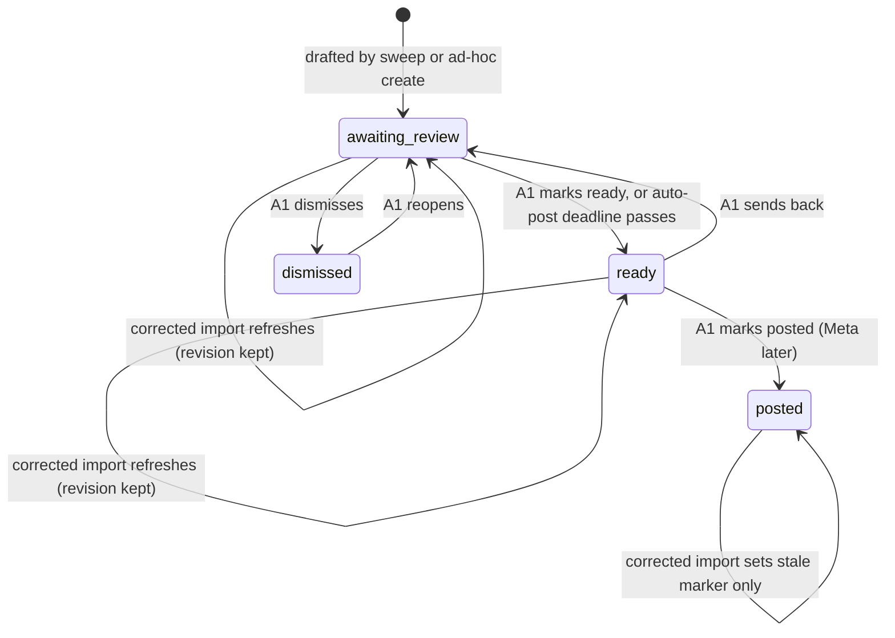
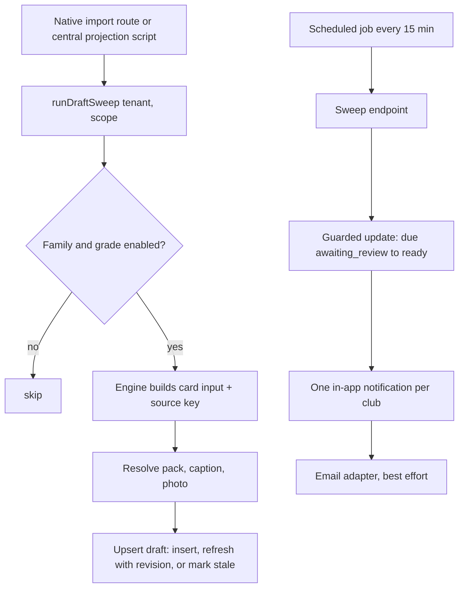

# Social Studio Automation and Admin Redesign - Plan

## Goal Capsule

- **Objective:** Every data import turns into a queue of on-brand, ready-to-post social cards, with light editing, a club photo library and a one-click post pack; then restyled packs with a landscape format, a card editor, and the full admin redesign.
- **Product authority:** The Product Contract below. The design bundle `design_handoff_social_studio_admin` (Handoff.md and its `.dc.html` prototypes) is the visual and interaction reference, not a scope authority — where it conflicts with this contract, this contract wins.
- **Execution profile:** Four shippable milestones in order — M1 automation (U1–U10), M2 packs and landscape (U11–U14), M3 editor (U15–U19), M4 admin redesign (U20–U24). Each unit lands as its own PR. Meta posting (R30) is planned to prerequisites only and is not executed by this plan.
- **Stop conditions:** Stop and surface when a unit needs a product decision not settled here, when a schema change cannot be expressed as an incremental migration, or when an external-service choice (KTD14) turns out unavailable.
- **Tail ownership:** PRs follow `CLAUDE.local.md` (auto-merge on `CLEAN`), except: PRs carrying a migration merge only after Ash approves applying it to prod through the Replit agent and the runner reports it recorded; the posting-window scheduled job (U9) needs Ash to create the Replit Scheduled Deployment; external-service API keys are Ash's to provision.
- **Open blockers:** None for M1–M4. Meta posting stays blocked on Meta app review and the data-licence decision.

---

## Product Contract

Product Contract changed: R3 and AE3 (corrections refresh with an undo, per Ash), R9 (window anchored to each draft's own import), R10–R12 (library is senior-only in v1), R14 (landscape uses summarised layouts for data-heavy types); R31 added (revert to a previous version). Remaining text unchanged from the brainstorm.

### Summary

Each import drafts cards for results, player achievements, round wraps and leaders, and match day and team lists, in the club's chosen pack. Each draft carries an auto-picked photo from a new club photo library and a one-click post pack (images plus caption), with an optional auto-post window. Restyled packs (with a landscape format), a card editor for fixing or creating cards, and the full admin redesign follow; direct Meta posting comes last.

### Problem Frame

The club's media officer (for Halls Head, Ash) builds every social post by hand. Only match summaries, milestones and round-ups auto-draft today, only for clubs that import their own files, and those still land as PNGs to download. The officer then fixes photos and copy, uploads each image to Instagram and Facebook, and writes captions, every round. Cards reuse whatever photo was uploaded per card because there is no shared library, and most of the club's photos are iPhone HEIC files the uploader rejects. The admin area around the Studio was restyled in the Broadcast redesign, but its list and settings pages still use the older patterns.

### Key Decisions

- **Automation first.** Milestone 1 delivers auto-drafting, the photo library, the queue and the post pack using today's packs. Order after that: pack restyle and landscape, then the editor, then the full admin redesign, then Meta posting.
- **Packs stay data-driven templates.** Every card is a pack template filled with data, so automated cards are on brand by construction. The editor adjusts a card and adds layers on top; a blank canvas covers fully custom cards.
- **Keep all 17 card types.** The Studio groups them into families (Results, Achievements, Round wrap & leaders, Match day & teams, Trading cards) instead of collapsing them to the handoff's six.
- **Share kit before Meta.** v1 ends at a post pack the officer shares manually. The auto-post setting ships in v1 and gains real posting when the Meta milestone lands.
- **One admin level.** No Owner / Editor / Reviewer roles, approvals, comments or version history of designs in this programme.
- **Studio pages are built in the new design from milestone 1.** The queue, library and Studio settings built for automation use the redesigned admin patterns, so the admin redesign does not rebuild them.
- **Corrections refresh with an undo.** A corrected import updates cards that are not yet posted and keeps the previous version one click away.
- **No junior photos in v1.** The library holds senior photos only; junior cards use no-photo layouts until consent tracking is designed.

### Actors

- A1. Club admin (media officer): reviews, edits, creates and shares cards; configures automation. One admin level per club.
- A2. Import pipeline: each scrape, CSV import or central-data update that commits match, player or fixture data for a club.
- A3. Club followers: see posted cards; never interact with the app.

### Key Flows

- F1. Import to post
  - **Trigger:** A2 commits a round's data.
  - **Steps:** Drafts are created for each enabled card family, with pack, photo and caption filled. A1 reviews the queue, optionally edits a card, then opens its post pack and shares it.
  - **Outcome:** Posts go out without A1 building any card by hand.
- F2. Auto-post window
  - **Trigger:** Auto-post is on and a draft's posting window after its import elapses.
  - **Steps:** Drafts still awaiting review become ready to post, and A1 is notified. When Meta posting exists, ready drafts post automatically instead.
  - **Outcome:** Posting keeps pace with imports even when A1 does not review.
- F3. Ad-hoc card
  - **Trigger:** A1 chooses Create a card.
  - **Steps:** Pick a type, pack and format (or a blank canvas), fill or edit it in the editor, then add it to the queue.
  - **Outcome:** Non-data posts (news, events, sponsors) come from the same on-brand tooling.
- F4. Stock the photo library
  - **Trigger:** A1 has a batch of match-day or team photos.
  - **Steps:** Bulk upload (HEIC included), then tag photos in batches with season, grade and players.
  - **Outcome:** Auto-drafts and the editor can find the right photo.

### Requirements

**Automated drafting**

- R1. After each import, drafts are created for every enabled family: match results, player achievements (centuries, 5-fors, milestones, debuts, caps), round wrap and leaders, and match day and team lists.
- R2. A1 can switch each family on or off, and by grade; junior drafting stays off by default.
- R3. Re-importing the same data never duplicates a draft for the same event; a corrected import refreshes drafts that are not yet posted and keeps the previous version.
- R4. Each draft uses the club's default pack for its card type and a caption generated from an editable per-type template.
- R5. Each senior draft picks a photo in this order: a library photo tagged with the player (newest first), the player's headshot, a team or grade photo, then the pack's no-photo layout.

**Queue and posting**

- R6. The queue shows drafts by state — awaiting review, ready, posted, dismissed — with family and grade filters and a count of drafts awaiting review in the admin navigation.
- R7. A post pack gives each card's images in the chosen formats plus a ready-to-copy caption and hashtags, as one download and through the phone share sheet.
- R8. A1 can mark a draft posted or dismissed, and can reopen a dismissed draft.
- R9. A club-level auto-post setting (on or off) with a posting window in hours measured from each draft's own import: when on, drafts still awaiting review at their deadline become ready and A1 is notified in-app and by email; when off, drafts wait for A1.
- R31. A1 can revert a draft to any of its previous versions (before a data refresh or an edit).

**Club photo library**

- R10. A1 can bulk upload senior photos, including HEIC, which is converted automatically.
- R11. Photos carry tags for season, grade and senior players, applied one at a time or in batches.
- R12. The library feeds senior auto-drafts (R5), the editor and the admin image dialog; it never supplies junior cards.

**Design packs**

- R13. All five packs are restyled to the handoff across all 17 card types.
- R14. Every card type is available in square, portrait, story and landscape (1200×630); data-heavy types use a summarised landscape layout.
- R15. Pack colours, crest, club name and sponsor strip come from the club's brand; no pack hard-codes one club's values.

**Card editor**

- R16. A1 can open any draft or card and change its data and copy, swap, crop and reposition its photo, hide template elements, and add free layers (text, shapes, stickers, cricket charts, milestone badges, player blocks, live stat fields).
- R17. Edits stay on brand by default: brand colours, fonts, crest and a lockable sponsor strip are one click away, and a recolour-to-brand action is available.
- R18. A1 can create an ad-hoc card from a type, pack and format, or start from a blank canvas.
- R19. The editor supports undo and redo, a layers list, multi-select and grouping, alignment and smart guides, and keyboard shortcuts.
- R20. A1 can export PNG, JPG and PDF, and animated MP4 and GIF using layer animations.
- R21. A1 can remove a photo's background.
- R22. Match-day cards show the forecast for the venue and start time.
- R23. A1 can save a card as a club template for reuse.

**Admin redesign**

- R24. The admin shell gains grouped sidebar sub-tabs, a top bar with breadcrumb and a Create a card action, a jump-to search, and a light/dark toggle.
- R25. Admin list pages use a searchable, filterable table with an edit drawer.
- R26. Admin settings pages use form cards with a save bar that appears when there are unsaved changes.
- R27. One image upload and crop dialog serves headshots, crest and sponsor logos, with size guidance and a low-resolution warning; HEIC is converted, not rejected.
- R28. Import CSV becomes a three-step flow: upload, review changes, publish.
- R29. The admin hub shows what needs attention (drafts awaiting review, recent imports, recent activity).

**Meta posting (final milestone, not executed by this plan)**

- R30. A club can connect its Facebook Page and Instagram Business account and schedule or publish ready drafts; with auto-post on, ready drafts post automatically.

### Acceptance Examples

- AE1. **Covers R9.** Given auto-post is on with a 12-hour window, when a Saturday import lands at 6pm and nothing is reviewed, then at 6am Sunday its drafts become ready and A1 gets one in-app and one email notice for the batch. Given auto-post is off, the same drafts stay awaiting review indefinitely.
- AE2. **Covers R5.** Given a century for a senior player with two tagged library photos and a headshot, the draft uses the newer tagged photo. Given no tagged photos and no headshot, it uses a tagged team photo for that grade, else the pack's no-photo layout.
- AE3. **Covers R3, R31.** Given a round's results were drafted, when the same round is re-imported with a corrected score, then no second draft appears, every not-yet-posted draft for that match shows the corrected data, and A1 can revert each to its previous version in one click. A posted draft keeps its content and shows a "data changed since posting" notice with a refresh that is itself revertible.
- AE4. **Covers R2.** Given junior drafting is off for a grade, an import of that grade creates no junior drafts; turning it on affects later imports only.
- AE5. **Covers R9.** Given auto-post is off and three drafts are past their window, when A1 turns auto-post on, those three become ready at the next check; turning it off later does not return ready drafts to awaiting review.

### Success Criteria

- A round's cards are ready to share within minutes of its import, without A1 building a card by hand.
- Most auto-drafts are shared with no editor changes beyond an optional photo swap.
- With auto-post on, nothing waits on A1 past the posting window.

### Scope Boundaries

**Deferred for later**

- Posting to Meta, X and the clubroom TV feed.
- Owner / Editor / Reviewer roles, approval workflow, comments and design version history.
- Junior photos and a parent-consent record.
- Records and Compare pages (designed separately).

### Dependencies / Assumptions

- Meta posting (R30) waits on Meta app review and business verification (typically 2–4 weeks), and a decision on the data-governance rule against commercialising scraped data, since cards carry stats derived from scraped scorecards.
- Background removal (R21), forecasts (R22) and email (R9) use paid or licensed external services; forecasts need a commercial licence before Ovation charges clubs.
- Clubs fed from the central association data get auto-drafts through a new trigger (U4), not the file-import hooks.

### Sources / Research

- Design bundle: `Application banner redesign.zip` → `design_handoff_social_studio_admin/Handoff.md` and its `.dc.html` prototypes.
- Prior plans: `docs/plans/2026-07-20-001-feat-design-packs-auto-draft-plan.md`, `docs/plans/2026-07-28-001-feat-complete-design-pack-catalogue-plan.md`, `docs/plans/2026-07-29-001-feat-pack-switcher-plan.md`, `docs/plans/2026-09-23-001-feat-broadcast-ui-redesign-plan.md`.

---

## Planning Contract

### Key Technical Decisions

- KTD1. **Evolve `social_drafts`, don't replace it.** Rename statuses in place (`pending` → `awaiting_review`, `approved` → `ready`; `posted`, `dismissed` unchanged) and add: family, source key, source import time, pack id, caption text, chosen photo (URL plus how it was chosen), adjustments (U15), edited flag and a "stale since posting" marker. Existing queue data and the match-summary dedupe index keep working after the rename.
- KTD2. **Versions live in a separate revisions table.** Each refresh, edit save or revert writes the prior snapshot (card input, caption, photo, adjustments, reason) to `social_draft_revisions`, capped at 20 per draft. Revert copies a snapshot back and records the current state as a new revision, so revert is itself undoable.
- KTD3. **Every engine dedupes on a source key.** Match summaries keep their match key; milestones, round-ups, match-day and team-list drafts get a deterministic key (engine, event identity, season, round, grade) with a partial unique index excluding dismissed rows. Engines upsert: a changed input refreshes non-posted drafts through KTD2; a posted draft only gets the stale marker.
- KTD4. **Posting deadlines use lazy evaluation plus an idempotent sweep.** The API computes the effective state on read (awaiting review past `source_imported_at + window` with auto-post on counts as ready). A protected sweep endpoint persists due drafts to `ready` with a guarded update and sends notifications. A Replit Scheduled Deployment calls it every 15 minutes. Autoscale instances scale to zero, so no in-process timer.
- KTD5. **Notifications are in-app first, email best-effort.** One notification row per club per sweep batch is authoritative; email goes through an adapter with one retry, and a failure is logged without blocking the state change. Admins have no email field, so the recipient is a club-level notification email in social settings. Sending is from one platform address.
- KTD6. **Drafts snapshot their photo.** The chosen image URL is copied onto the draft at pick time, so library edits and deletions never change existing drafts. A data refresh re-runs the pick only when the current photo was auto-picked, never when A1 chose it.
- KTD7. **HEIC is converted server-side.** HEIC/HEIF joins the storage allowlist; an ingest endpoint converts with `heic-convert` in a worker thread, then uses `sharp` to apply orientation, strip GPS and other EXIF, cap width and write JPEG plus a thumbnail. `sharp` is a new API dependency, as `heic-convert` and `exifr` are.
- KTD8. **Default pack and captions resolve on the server at draft time.** Move pack resolution (`resolvePackIdForKind`) and caption rendering (`lib/captions.ts`) into `lib/scorecard` so the API and web share one implementation, and each draft stores its pack and caption at creation.
- KTD9. **Post packs render on the server.** One endpoint renders each enabled format through the existing still-render harness and returns a zip plus caption text; it needs `RENDER_HARNESS_ORIGIN` for background use. Phones use the Web Share API with files; desktops download the zip.
- KTD10. **One drafting sweep serves every club type.** Refactor the post-commit hooks into `runDraftSweep(tenantId, scope)`, called by the existing native import routes, by the central fixtures/results projection scripts after they commit, and by the scheduled job for central-data clubs. Source keys make repeated sweeps safe.
- KTD11. **Landscape is a first-class size.** Add `landscape` (1200×630) to the size catalogue and every enumeration. Layer geometry becomes fractions of the active format's width, with a migration that leaves existing 1080-wide layers unchanged. Data-heavy types get summarised landscape templates.
- KTD12. **The editor adjusts pack cards through an overlay, not a layer document.** An `adjustments` object (field overrides, photo transform, hidden slots, free layers positioned in percent of the artboard, with animation) is applied in the pack bind step, identically in the browser and the render harness. Blank-canvas cards are packless cards with only free layers.
- KTD13. **Admin UI primitives are built in M1.** A data table, an edit drawer, a settings card with a sticky save bar and a status pill go under `artifacts/cricket-club/src/components/admin-ui/`; M1's Studio pages use them first and M4 adopts them everywhere.
- KTD14. **External services sit behind adapters.** Photoroom for background removal (remove.bg's API shuts down 1 Dec 2026, and the free in-browser model is AGPL-licensed), Open-Meteo's BOM model for forecasts, and Resend for email. Each adapter is off when its key is missing, and the UI hides the feature.
- KTD15. **Juniors stay walled off.** Junior drafts keep today's per-grade gating, `junior: true` input and private-player masking; photo pick never runs for junior cards, and library tagging rejects junior players.

### High-Level Technical Design

Draft lifecycle (effective state; revisions are recorded on every content change):

Import to notification:

### Assumptions

- The PlayHQ fixtures data (`lib/db/src/schema/fixtures.ts`) is enough for match-day drafts; selected teams for team-list drafts may not exist in any feed, in which case team-list drafting waits for a data source and stays manual (U3).
- Match-day drafts are created 48 hours before the fixture start by the scheduled sweep.

### Implementation Constraints

- OpenAPI-first: change `lib/api-spec/openapi.yaml`, then run codegen; never hand-edit `lib/api-client-react` or `lib/api-zod`.
- Migration numbers are the next free number at merge time; a PR rebases and regenerates its journal entry and snapshot if another migration lands first.
- Every schema change ships an incremental migration (`ADD COLUMN IF NOT EXISTS` / `CREATE TABLE IF NOT EXISTS`) with its journal entry and snapshot; prod was built with `drizzle-kit push` and will not pick up schema edits otherwise.
- Every `<PackCard>` mount and every server render path passes tenant `data`; `pack-card-mounts.test.ts` guards mounts only.
- Client and server pack registries change together; `pack-coverage-parity.test.ts` must stay green.
- No Halls Head literals or raw hex outside documented pack tokens; the central database is never written.

---

## Implementation Units

| U-ID | Title                                     | Key files                                                                                                                                          | Depends on          |
| ---- | ----------------------------------------- | -------------------------------------------------------------------------------------------------------------------------------------------------- | ------------------- |
| U1   | Draft model v2 and revisions              | `lib/db/src/schema/social_cards.ts`, `lib/db/migrations/<next>_*`, `lib/api-spec/openapi.yaml`, `artifacts/api-server/src/routes/social-drafts.ts` | —                   |
| U2   | Source-key dedupe and correction refresh  | `artifacts/api-server/src/lib/post-commit-social.ts`, `roundup.ts`, `match-milestone-detector.ts`, `match-summary-drafter.ts`                      | U1                  |
| U3   | Families, grade config and new engines    | `artifacts/api-server/src/lib/social-families.ts`, `social_cards.ts`                                                                               | U2                  |
| U4   | One sweep for every club type             | `artifacts/api-server/src/lib/draft-sweep.ts`, `scripts/src/playhq-project-fixtures.ts`                                                            | U3                  |
| U5   | Shared pack and caption resolution        | `lib/scorecard/src/`, `artifacts/api-server/src/lib/draft-enrich.ts`                                                                               | U1, U6 (photo pick) |
| U6   | Club photo library and HEIC ingest        | `lib/db/src/schema/club_photos.ts`, `artifacts/api-server/src/routes/club-photos.ts`, `routes/storage.ts`                                          | U1                  |
| U7   | Admin UI primitives                       | `artifacts/cricket-club/src/components/admin-ui/`                                                                                                  | —                   |
| U8   | Queue v2 and library pages                | `artifacts/cricket-club/src/pages/admin-social-queue.tsx`, `pages/admin-photo-library.tsx`                                                         | U1, U5, U6, U7      |
| U9   | Auto-post window, sweep and notifications | `artifacts/api-server/src/routes/social-sweep.ts`, `lib/integrations/email.ts`, `lib/db/src/schema/notifications.ts`                               | U1, U4              |
| U10  | Post pack                                 | `artifacts/api-server/src/routes/post-pack.ts`, `artifacts/cricket-club/src/components/post-pack/`                                                 | U5, U8              |
| U11  | Landscape format plumbing                 | `artifacts/cricket-club/src/lib/share-card/types.ts`, `lib/pack-render/templates.ts`, `artifacts/api-server/src/lib/design-packs.ts`               | —                   |
| U12  | Pack skeleton and Broadcast Dark restyle  | `artifacts/cricket-club/src/lib/pack-templates/shared.ts`, `pack-templates/broadcast-dark/`                                                        | U11                 |
| U13  | Restyle the other four packs              | `pack-templates/gold-foil/`, `bold-type/`, `neon-night/`, `sunset/`                                                                                | U12                 |
| U14  | Studio admin pages restyle                | `artifacts/cricket-club/src/pages/admin-social*.tsx`, `pages/admin-social-studio.tsx`                                                              | U7, U12             |
| U15  | Adjustments overlay model                 | `artifacts/cricket-club/src/lib/pack-render/adjustments.ts`, `lib/pack-render/bind.ts`                                                             | U1, U11             |
| U16  | Editor canvas core                        | `artifacts/cricket-club/src/components/studio-editor/`                                                                                             | U15                 |
| U17  | Editor panels and content layers          | `components/studio-editor/panels/`, `components/studio-editor/layers/`                                                                             | U16, U6             |
| U18  | Export, templates and ad-hoc cards        | `components/studio-editor/export/`, `pages/card-render-harness.tsx`, `lib/db/src/schema/social_cards.ts`                                           | U16, U10            |
| U19  | Background removal and forecast adapters  | `artifacts/api-server/src/lib/integrations/`                                                                                                       | U17                 |
| U20  | Admin shell v2                            | `artifacts/cricket-club/src/components/admin-layout.tsx`, `pages/admin-groups.tsx`                                                                 | U7                  |
| U21  | List pages on table and drawer            | `artifacts/cricket-club/src/pages/admin-players.tsx` and siblings                                                                                  | U7, U20             |
| U22  | Settings pages on form cards              | `artifacts/cricket-club/src/pages/admin-*-display.tsx` and siblings                                                                                | U7, U20             |
| U23  | Shared image crop dialog                  | `artifacts/cricket-club/src/components/admin-ui/image-crop-dialog.tsx`                                                                             | U6, U7              |
| U24  | Import flow and admin hub                 | `artifacts/cricket-club/src/pages/admin-import.tsx`, `pages/admin.tsx`                                                                             | U7, U20             |

### Milestone 1 — Automation

### U1. Draft model v2 and revisions

**Goal:** Give drafts the states, fields and version history the automation needs.
**Requirements:** R3, R6, R8, R31; KTD1, KTD2.
**Dependencies:** None.
**Files:** `lib/db/src/schema/social_cards.ts`, a new migration `lib/db/migrations/<next>_social_drafts_v2.sql` (+ journal and snapshot), `lib/api-spec/openapi.yaml`, `artifacts/api-server/src/routes/social-drafts.ts`, `artifacts/api-server/src/routes/social-drafts-v2.test.ts`.
**Approach:** Migration renames status values in data and the check constraint, adds the KTD1 columns (nullable, defaulted), and creates `social_draft_revisions`. Add routes: list with state/family/grade filters, mark ready, send back, reopen, list revisions, revert. Fix the spec's status enum (it lacks `posted`). Pending count counts awaiting review only.
**Patterns to follow:** `social_drafts_match_dedupe` partial index; `routes/social-drafts-sweep.test.ts` setup (tenant stamp, admin cookie, `x-tenant-id`).
**Test scenarios:**

- Migration converts `pending` rows to `awaiting_review` and `approved` to `ready`; posted and dismissed are unchanged.
- Mark ready, send back, mark posted, dismiss and reopen each move the state as the lifecycle diagram shows; reopen on a non-dismissed draft returns 409.
- Covers AE3. Reverting to a revision restores card input, caption and photo, and writes the replaced state as a new revision.
- The 21st revision drops the oldest.
- Another tenant's draft id returns 404 for every route.
  **Verification:** API tests pass against Postgres; codegen and migration drift gates are clean.

### U2. Source-key dedupe and correction refresh

**Goal:** Make every engine idempotent and refresh drafts on corrected imports.
**Requirements:** R3, R31; KTD3, KTD2.
**Dependencies:** U1.
**Files:** `artifacts/api-server/src/lib/post-commit-social.ts`, `artifacts/api-server/src/lib/roundup.ts`, `artifacts/api-server/src/lib/match-milestone-detector.ts`, `artifacts/api-server/src/lib/match-summary-drafter.ts`, `artifacts/api-server/src/lib/draft-upsert.ts`, `artifacts/api-server/src/lib/draft-upsert.test.ts`.
**Approach:** One `upsertDraftByKey` used by all engines: insert when no undismissed row holds the key; refresh (with a revision) when the input differs and the draft is not posted; set the stale marker on posted drafts. Scope `snapshotCareerTotals` and `snapshotGradeGames` reads to the tenant (`player_grade_stats` lacks `tenant_id`; join through tenant-owned players).
**Execution note:** Start with a failing integration test showing round-up duplicates on a second import.
**Test scenarios:**

- Covers AE3. Importing the same round twice yields one round-up draft per grade; a changed score refreshes the match-summary draft and writes one revision.
- An edited but unposted draft is refreshed and its edit is recoverable by revert.
- A posted draft keeps its card input and gains the stale marker.
- A dismissed draft does not block a new draft for the same key.
- Two tenants importing the same central club data get independent drafts.
  **Verification:** No engine can create two undismissed drafts with the same key.

### U3. Families, grade config and new engines

**Goal:** Cover all four families with per-family, per-grade switches.
**Requirements:** R1, R2; KTD15.
**Dependencies:** U2.
**Files:** `artifacts/api-server/src/lib/social-families.ts`, `artifacts/api-server/src/lib/engines/match-day.ts`, `artifacts/api-server/src/lib/engines/team-list.ts`, `lib/db/src/schema/social_cards.ts` (settings `family_config` jsonb), migration `<next>_social_family_config.sql`, `lib/api-spec/openapi.yaml`, tests alongside each engine.
**Approach:** A static map assigns each of the 17 card types to a family. `family_config` holds per-family on/off and per-grade overrides, seeded from today's engine flags (match summary on, milestones and round-ups off). The match-day engine drafts from `fixtures` 48 hours before start. The team-list engine drafts only when a selected-team source exists; otherwise it is registered but inactive. Achievements add cap and debut detection to the milestone detector.
**Test scenarios:**

- Covers AE4. With junior drafting off for Under 15s, an import creates no Under 15 drafts; turning it on affects only later imports.
- Disabling the Achievements family stops century and 5-for drafts but not match summaries.
- A fixture 47 hours out gets one match-day draft; a second sweep adds none.
- Existing tenants' behaviour is unchanged after the settings migration.
  **Verification:** Each family can be toggled from the API and the next sweep honours it.

### U4. One sweep for every club type

**Goal:** Clubs fed from central data get auto-drafts too.
**Requirements:** R1; KTD10.
**Dependencies:** U3.
**Files:** `artifacts/api-server/src/lib/draft-sweep.ts`, `artifacts/api-server/src/lib/import-commit.ts`, `artifacts/api-server/src/routes/imports-csv.ts`, `artifacts/api-server/src/routes/imports-batch.ts`, `scripts/src/playhq-project-fixtures.ts`, `artifacts/api-server/src/lib/draft-sweep.test.ts`.
**Approach:** Replace the three post-commit hook calls with `runDraftSweep(tenantId, scope)`. For central tenants the sweep reads results through `central-queries.ts` and resolves player ids via the crosswalk in the caller, never in the central query. The projection script calls the sweep endpoint for each affected tenant after it commits; the U9 scheduled job also sweeps central tenants.
**Test scenarios:**

- A native CSV import and a central-data update for comparable matches both produce match-summary drafts.
- Running the sweep twice with no new data creates nothing.
- A central tenant's drafts carry app player ids from the crosswalk, not GUIDs; fill-ins (id ≥ 90000) are excluded.
  **Verification:** `tenant-isolation.test.ts` extended to drafts passes.

### U5. Shared pack and caption resolution

**Goal:** Each draft stores its pack, caption and chosen photo at creation.
**Requirements:** R4, R5; KTD8, KTD6, KTD15.
**Dependencies:** U1 (photo pick activates once U6 lands).
**Files:** `lib/scorecard/src/captions.ts`, `lib/scorecard/src/pack-resolve.ts`, `artifacts/cricket-club/src/lib/captions.ts`, `artifacts/cricket-club/src/lib/card-template.ts`, `artifacts/api-server/src/lib/draft-enrich.ts`, `artifacts/api-server/src/lib/draft-enrich.test.ts`, `lib/scorecard/src/captions.test.ts`.
**Approach:** Move caption rendering and pack resolution into `lib/scorecard`; the web app re-exports them. `enrichDraft` sets pack, caption and photo; the photo pick follows R5's order and records its source. Junior inputs skip the pick.
**Test scenarios:**

- Covers AE2. A player with two tagged photos and a headshot gets the newer tagged photo; with none, a grade-tagged team photo; else no photo.
- A junior match summary gets no photo.
- A tenant whose default pack for match summaries is Sunset gets Sunset on new drafts; changing the default leaves existing drafts unchanged.
- Web caption output is identical before and after the move for every token in `KNOWN_TOKENS`.
  **Verification:** `lib/scorecard` tests pass in `pnpm run test:libs`.

### U6. Club photo library and HEIC ingest

**Goal:** A senior-only, tagged photo library with HEIC support.
**Requirements:** R10, R11, R12; KTD7, KTD15.
**Dependencies:** U1.
**Files:** `lib/db/src/schema/club_photos.ts`, migration `<next>_club_photos.sql`, `lib/api-spec/openapi.yaml`, `artifacts/api-server/src/routes/club-photos.ts`, `artifacts/api-server/src/lib/image-ingest.ts`, `artifacts/api-server/src/lib/image-ingest.worker.ts`, `artifacts/api-server/src/routes/storage.ts`, `artifacts/api-server/src/routes/club-photos.test.ts`, `artifacts/api-server/src/lib/image-ingest.test.ts`.
**Approach:** `club_photos` (tenant, object path, thumbnail path, width, height, season, grade, taken-at) and `club_photo_players` (photo, player). Allow `image/heic` and `image/heif` uploads; an ingest endpoint converts and stores JPEG plus thumbnail, then deletes the original. Batch tag and batch delete endpoints. Tagging rejects junior players and fill-ins.
**Test scenarios:**

- A sample iPhone HEIC ingests to an upright JPEG with no GPS EXIF.
- A corrupt HEIC fails that file only; the rest of the batch succeeds, with per-file errors returned.
- Batch-tagging ten photos with a grade and two players writes all tags in one call.
- Tagging a junior participant returns 422.
- Another tenant cannot list, tag or delete these photos.
  **Verification:** Ingest of a 7 MB HEIC does not block other requests (worker thread).

### U7. Admin UI primitives

**Goal:** Build the shared admin patterns once, for M1 Studio pages and M4.
**Requirements:** R25, R26 (foundations); KTD13.
**Dependencies:** None.
**Files:** `artifacts/cricket-club/src/components/admin-ui/data-table.tsx`, `edit-drawer.tsx`, `settings-card.tsx`, `save-bar.tsx`, `status-pill.tsx`, `index.ts`, `artifacts/cricket-club/src/components/admin-ui/__tests__/admin-ui.test.tsx`.
**Approach:** Data table with search, filter chips, 52px rows, horizontal scroll, row click and empty state; edit drawer on the existing `Sheet` (480px, footer with delete and cancel/save); settings card with label/helper/control rows; a save bar shown while a form is dirty. Built on the Broadcast tokens; no new theme variables.
**Test scenarios:**

- Typing in search filters rows; a filter chip narrows rows; clearing restores them.
- Clicking a row opens the drawer with that row; Escape closes it.
- The save bar appears after an edit and disappears after save or reset.
- At 375px the table scrolls horizontally without page overflow.
  **Verification:** Components render in dark and light with no raw hex.

### U8. Queue v2 and library pages

**Goal:** The Studio queue and photo library in the new design.
**Requirements:** R6, R8, R31, R10, R11, R12.
**Dependencies:** U1, U5, U6, U7.
**Files:** `artifacts/cricket-club/src/pages/admin-social-queue.tsx`, `artifacts/cricket-club/src/pages/admin-photo-library.tsx`, `artifacts/cricket-club/src/components/social-queue/`, `artifacts/cricket-club/src/pages/admin-groups.tsx`, `artifacts/cricket-club/src/components/admin-layout.tsx`, `artifacts/cricket-club/src/__tests__/social-queue-v2.test.tsx`, `artifacts/cricket-club/src/__tests__/photo-library.test.tsx`.
**Approach:** Queue chips (awaiting review, ready, posted, dismissed), family and grade filters, rows with thumbnail, title, source and time. A draft drawer shows the card, caption, photo (swap from library), revisions with revert, and the stale notice. The library page supports bulk drag-drop upload with per-file progress, a grid with multi-select and batch tagging. The navigation badge counts awaiting review.
**Test scenarios:**

- Covers AE3. A draft with two revisions lists both; reverting calls the revert endpoint and refreshes the drawer.
- A posted draft with the stale marker shows the "data changed since posting" notice and a refresh action.
- Swapping the photo records the manual choice.
- Selecting three library photos and applying a grade tags all three.
- A failed file in a bulk upload shows its error while the others complete.
  **Verification:** Pages pass the junior-isolation and no-raw-hex guard tests.

### U9. Auto-post window, sweep and notifications

**Goal:** Ready-on-deadline behaviour with notifications, safe on scale-to-zero hosting.
**Requirements:** R9, R29 (attention count); KTD4, KTD5, KTD14.
**Dependencies:** U1, U4.
**Files:** `lib/db/src/schema/notifications.ts`, migration `<next>_auto_post_notifications.sql`, `lib/api-spec/openapi.yaml`, `artifacts/api-server/src/routes/social-sweep.ts`, `artifacts/api-server/src/lib/integrations/email.ts`, `artifacts/api-server/src/lib/effective-draft-state.ts`, `artifacts/cricket-club/src/components/admin-ui/notification-bell.tsx`, `artifacts/cricket-club/src/components/admin-social/auto-post-card.tsx`, tests alongside each.
**Approach:** Social settings gain auto-post on/off, window hours and notification email. Reads apply the effective-state rule. The sweep endpoint, protected by a shared secret header, promotes due drafts with a guarded update, sweeps central tenants and match-day timing (U3, U4), writes one notification per club per run and emails through Resend. Ad-hoc drafts have no import time and never auto-promote.
**Test scenarios:**

- Covers AE1. With a 12-hour window, a draft imported at 18:00 is awaiting review at 05:59 and ready at 06:00 by both read and sweep; one notification and one email go out for the batch.
- Covers AE5. Turning auto-post on promotes three overdue drafts at the next sweep; turning it off leaves ready drafts ready.
- Two concurrent sweeps promote each draft once and send one email.
- The email adapter failing twice still leaves the drafts ready and the in-app notification present.
- A sweep call without the secret returns 401.
- An ad-hoc draft stays awaiting review past any window.
  **Verification:** Operational note — Ash creates a Replit Scheduled Deployment calling the sweep every 15 minutes, and sets the Resend key and platform sender.

### U10. Post pack

**Goal:** One-click images plus caption for sharing.
**Requirements:** R7, R8; KTD9.
**Dependencies:** U5, U8.
**Files:** `lib/api-spec/openapi.yaml`, `artifacts/api-server/src/routes/post-pack.ts`, `artifacts/api-server/src/routes/post-pack.test.ts`, `artifacts/cricket-club/src/components/post-pack/post-pack-button.tsx`, `artifacts/cricket-club/src/components/post-pack/__tests__/post-pack.test.tsx`.
**Approach:** The endpoint renders each enabled format of a draft through the still harness with tenant data and returns a zip with images and `caption.txt`. The web button uses `navigator.share` with files where supported, else downloads; afterwards it offers "Mark posted". Renders are serialised through the existing render queue.
**Test scenarios:**

- A draft with square and story enabled returns a zip holding two PNGs and the caption.
- A junior draft's images use the juniors palette and masked private names.
- On a browser with `navigator.canShare({files})` the share sheet is used; otherwise a download starts.
- Another tenant's draft returns 404.
  **Verification:** A real post pack for a Halls Head draft opens and every image shows club branding.

### Milestone 2 — Packs and landscape

### U11. Landscape format plumbing

**Goal:** `landscape` 1200×630 works end to end with today's packs.
**Requirements:** R14; KTD11.
**Dependencies:** None.
**Files:** `artifacts/cricket-club/src/lib/share-card/types.ts`, `artifacts/cricket-club/src/lib/pack-render/templates.ts`, `artifacts/cricket-club/src/lib/pack-templates/types.ts`, `artifacts/api-server/src/lib/design-packs.ts`, `artifacts/api-server/src/lib/card-video-jobs.ts`, `lib/api-spec/openapi.yaml`, `lib/db/src/schema/social_cards.ts` (`size_landscape`), migration `<next>_landscape_size.sql`, `artifacts/cricket-club/src/components/admin-social/constants.ts`, `artifacts/cricket-club/src/lib/share-card/landscape.test.ts`.
**Approach:** Add the size everywhere sizes are enumerated (the research list in Sources). Templates without a landscape variant fall back to a centred square render on a brand backdrop until U12–U13 supply real layouts. Layer geometry reads the active format's width.
**Test scenarios:**

- `selectFormatHtml` returns landscape markup when present and the fallback otherwise.
- An existing 1080-wide layout renders unchanged in square.
- A landscape still renders at exactly 1200×630.
- Settings round-trip `sizeLandscape`.
  **Verification:** Parity, lint and animation pack tests stay green.

### U12. Pack skeleton and Broadcast Dark restyle

**Goal:** Restyle Broadcast Dark to the handoff on a shared skeleton that later packs reuse.
**Requirements:** R13, R14, R15.
**Dependencies:** U11.
**Files:** `artifacts/cricket-club/src/lib/pack-templates/shared.ts`, `artifacts/cricket-club/src/lib/pack-templates/broadcast-dark/*.ts`, `artifacts/api-server/src/lib/design-packs.ts`, `artifacts/cricket-club/src/lib/pack-templates/broadcast-dark.test.ts`.
**Approach:** Extract the handoff's shared skeleton (crest and club name, kind chip, auto-fit body, footer rule, sponsor strip, hashtag) as fragments driven by tenant tokens. Port each of the 17 types in four formats from the prototype's `build(kind, pack, format)`, with summarised landscape layouts for data-heavy types (top five leaders, XI in two columns).
**Execution note:** Render a real PNG of every type × format before calling the unit done; unit tests have missed collapsed photo-less layouts before.
**Test scenarios:**

- Every type has all four formats and passes `pack-lint`.
- A tenant with a purple accent renders purple chips and rules with no gold literals.
- A photo-less milestone keeps its content column justified.
- A 12-row leaderboard renders five rows in landscape.
  **Verification:** Recorded PNG review for all 68 renders.

### U13. Restyle the other four packs

**Goal:** Gold Foil (Metallic Foil), Bold Type, Neon Night and Sunset on the shared skeleton.
**Requirements:** R13, R14, R15.
**Dependencies:** U12.
**Files:** `artifacts/cricket-club/src/lib/pack-templates/gold-foil/*.ts`, `bold-type/*.ts`, `neon-night/*.ts`, `sunset/*.ts`, their tests, `artifacts/api-server/src/lib/design-packs.ts`.
**Approach:** One PR per pack, each applying the handoff's signature treatment on the U12 skeleton. Pack ids stay stable so tenant defaults survive.
**Execution note:** Same PNG review as U12, per pack.
**Test scenarios:**

- Each pack covers 17 types × 4 formats and passes lint and parity.
- Switching a tenant's default pack re-renders a draft in the new pack with brand colours applied.
  **Verification:** Recorded PNG review per pack.

### U14. Studio admin pages restyle

**Goal:** The remaining Social Media Studio pages in the handoff's design.
**Requirements:** R2, R4, R9 (settings surfaces), R18 (create entry).
**Dependencies:** U7, U12.
**Files:** `artifacts/cricket-club/src/pages/admin-social-studio.tsx`, `admin-social.tsx`, `admin-social-create.tsx`, `admin-social-sets.tsx`, `admin-fixtures.tsx`, `admin-junior-social.tsx`, `admin-trading-cards.tsx`, `artifacts/cricket-club/src/components/admin-social/*`, `artifacts/cricket-club/src/__tests__/studio-pages-v2.test.tsx`.
**Approach:** Studio shows an auto-drafts grid and the awaiting-review count; Cards settings shows default pack per type, family and grade switches, auto-post, sponsors and caption defaults on settings cards; Create a card picks type, pack and format. The junior cards banner uses `--juniors-accent`, not the handoff's timber hex.
**Test scenarios:**

- Changing the default pack for a type saves and shows on the next draft.
- Turning a family off from Cards settings hides it from new drafts.
- The junior banner carries no raw hex.
  **Verification:** `pack-card-mounts` stays green; every mount passes `data`.

### Milestone 3 — Card editor

### U15. Adjustments overlay model

**Goal:** A card's edits are data applied over its pack template.
**Requirements:** R16, R17; KTD12.
**Dependencies:** U1, U11.
**Files:** `artifacts/cricket-club/src/lib/pack-render/adjustments.ts`, `artifacts/cricket-club/src/lib/pack-render/bind.ts`, `artifacts/cricket-club/src/lib/pack-render/render.ts`, `artifacts/cricket-club/src/pages/card-render-harness.tsx`, `lib/api-spec/openapi.yaml`, `artifacts/cricket-club/src/lib/pack-render/adjustments.test.ts`.
**Approach:** The adjustments object holds field overrides, photo transform (crop, focal point, zoom), hidden slot ids and free layers positioned in percent of the artboard with animation settings. Bind applies overrides before template substitution; free layers render in a layer above the template. The harness accepts adjustments so server renders match the browser.
**Test scenarios:**

- Overriding a headline changes only that field.
- Hiding a slot removes it and the layout stays intact.
- A free text layer at 10%/10% lands at the same relative spot in square and landscape.
- Harness and browser renders of the same adjustments produce identical markup.
  **Verification:** Existing drafts without adjustments render byte-identically.

### U16. Editor canvas core

**Goal:** The full-screen editor shell and canvas interactions.
**Requirements:** R16, R19.
**Dependencies:** U15.
**Files:** `artifacts/cricket-club/src/components/studio-editor/editor-shell.tsx`, `canvas.tsx`, `selection.tsx`, `guides.ts`, `history.ts`, `shortcuts.ts`, `layers-drawer.tsx`, `artifacts/cricket-club/src/pages/admin-studio-editor.tsx`, `artifacts/cricket-club/src/components/studio-editor/__tests__/`.
**Approach:** Always-dark editor palette, top bar (back, resize menu, undo/redo, title, primary action), rail plus 340px panel, bottom page strip and zoom. Selection handles with rotate snapping, multi-select, groups with double-click to enter, smart guides snapping within 0.8%, keyboard shortcuts as the handoff lists, undo/redo as snapshots capped at 40. It reuses what fits from `components/card-layout-editor/` (pointer drag, snapping), which is retired once U18 covers its callers.
**Test scenarios:**

- Undo and redo restore the prior adjustments in order; a new edit clears redo.
- Arrow keys nudge 0.5% (2% with Shift); Delete removes the selection; Escape clears it.
- Shift-click toggles multi-select; grouping then clicking a member selects the group.
- Dragging within 0.8% of the page centre snaps to it.
- Below 1280px the primary action stays visible.
  **Verification:** Opening a queue draft in the editor and saving writes adjustments and one revision.

### U17. Editor panels and content layers

**Goal:** The panels and layer types A1 uses to fix and enrich cards.
**Requirements:** R16, R17.
**Dependencies:** U16, U6.
**Files:** `artifacts/cricket-club/src/components/studio-editor/panels/*.tsx` (templates, elements, cricket, players, text, photos, uploads, live stats, brand), `artifacts/cricket-club/src/components/studio-editor/layers/*.tsx` (shape, sticker, chart, medal, player block, live field), tests alongside.
**Approach:** Photos panel reads the club library with season, grade and player chips. Cricket charts (run worm, runs per over, wagon wheel, bowling figures, ladder) render from the draft's scorecard data. Live stat fields bind to the card's data and show a "Live" tag. The brand panel offers recolour-to-brand (nearest brand colour by RGB distance from the tenant's own palette) and a sponsor-strip lock that refuses deletion while on.
**Test scenarios:**

- Adding a player block inserts a grouped photo, name, cap and stats layer set bound to that player.
- Recolour-to-brand maps a non-brand fill to the nearest tenant colour.
- With the sponsor lock on, deleting the strip is refused and a missing strip is appended.
- A wagon wheel for a match with no shot data shows its empty state.
  **Verification:** Every panel works on a pack draft and on a blank canvas.

### U18. Export, templates and ad-hoc cards

**Goal:** Get cards out of the editor, and start new ones.
**Requirements:** R18, R20, R23.
**Dependencies:** U16, U10.
**Files:** `artifacts/cricket-club/src/components/studio-editor/export/download-menu.tsx`, `artifacts/cricket-club/src/pages/card-render-harness.tsx`, `artifacts/api-server/src/lib/card-video-renderer.ts`, `lib/db/src/schema/social_cards.ts` (club templates reuse `card_templates` with adjustments), migration `<next>_card_template_adjustments.sql`, `lib/api-spec/openapi.yaml`, tests alongside.
**Approach:** The download menu offers PNG, JPG, PDF, MP4 and GIF at 1–3× scale with platform size hints; stills and MP4 go through the harness with adjustments, and GIF reuses `use-video-export.ts`. Save-as-template stores the pack plus adjustments in `card_templates`. Create a card and blank canvas create an ad-hoc draft (no import time).
**Test scenarios:**

- MP4 export of a card with a rise-animated layer shows the layer entering over its first 0.7s.
- Save as template, then create from it, reproduces the adjustments.
- A blank-canvas card has no pack and renders only free layers.
- An ad-hoc card enters the queue awaiting review and never auto-promotes.
  **Verification:** The old card layout editor has no remaining callers and is removed in this unit.

### U19. Background removal and forecast adapters

**Goal:** Cut-outs for player photos and forecasts for match day.
**Requirements:** R21, R22; KTD14.
**Dependencies:** U17.
**Files:** `artifacts/api-server/src/lib/integrations/background-removal.ts`, `artifacts/api-server/src/lib/integrations/forecast.ts`, `artifacts/api-server/src/routes/studio-tools.ts`, `lib/api-spec/openapi.yaml`, venue coordinates on the club/venue data where missing, tests alongside.
**Approach:** Background removal calls Photoroom and stores the cut-out PNG in the club library as a derived image. Forecasts call Open-Meteo's BOM model for the venue's coordinates and start hour, cached per venue and hour. Each tool is hidden when its key or venue coordinates are missing.
**Test scenarios:**

- A removal request stores a PNG with transparency and links it to the source photo.
- A provider error returns a clear failure and leaves the photo unchanged.
- A forecast for a venue and time returns temperature and conditions; a second request within the hour hits the cache.
- With no API key configured, the tool's endpoints return 404 and the UI hides the tool.
  **Verification:** Match-day game-day block shows a forecast for a Halls Head fixture.

### Milestone 4 — Admin redesign

### U20. Admin shell v2

**Goal:** Sidebar sub-tabs, top bar, jump-to and theme toggle.
**Requirements:** R24.
**Dependencies:** U7.
**Files:** `artifacts/cricket-club/src/components/admin-layout.tsx`, `artifacts/cricket-club/src/components/admin-shell.tsx`, `artifacts/cricket-club/src/pages/admin-groups.tsx`, `artifacts/cricket-club/src/components/admin-ui/admin-topbar.tsx`, `artifacts/cricket-club/src/__tests__/admin-shell-v2.test.tsx`.
**Approach:** A 256px sidebar where the active group expands its tabs; the top bar holds breadcrumb, notification bell (U9) and Create a card; jump-to reuses `components/broadcast/search-palette.tsx` with admin destinations; the theme toggle uses the existing theme context. Existing URLs and redirects are unchanged.
**Test scenarios:**

- On `/admin/honours/awards` the Honours group is expanded with Awards active and the breadcrumb reads Admin / Honours & Records / Awards.
- ⌘K opens jump-to and selecting Players navigates there.
- Entitlement-hidden groups stay hidden.
- At 375px the sidebar is a sheet and the top bar keeps Create a card.
  **Verification:** The U14 admin shell test cases still pass.

### U21. List pages on table and drawer

**Goal:** Every admin list page uses the data table and edit drawer.
**Requirements:** R25.
**Dependencies:** U7, U20.
**Files:** `artifacts/cricket-club/src/pages/admin-players.tsx`, `admin-stats.tsx`, `admin-committee.tsx`, `admin-captains.tsx`, `admin-people.tsx`, `admin-junior-players.tsx`, `admin-junior-committee.tsx`, `admin-premierships.tsx`, `admin-awards.tsx`, `admin-caps.tsx`, `admin-life-members.tsx`, `admin-junior-premierships.tsx`, `admin-users.tsx`, `artifacts/cricket-club/src/__tests__/admin-lists-v2.test.tsx`.
**Approach:** Land in batches by group (People, Honours, Users), one PR each. Create and edit move into the drawer; mutations and validation are unchanged. Junior players carry the handoff's info note about public name format.
**Test scenarios:**

- Each page lists mocked rows, filters by search, and opens the drawer on row click.
- Saving in the drawer calls the existing update mutation; delete asks for confirmation.
- Empty data shows the empty state.
  **Verification:** Existing admin page tests are updated, not deleted.

### U22. Settings pages on form cards

**Goal:** Settings pages use form cards with a sticky save bar.
**Requirements:** R26.
**Dependencies:** U7, U20.
**Files:** `artifacts/cricket-club/src/pages/admin-match-display.tsx`, `admin-records-display.tsx`, `admin-honour-boards.tsx`, `admin-milestone-board.tsx`, `admin-junior-match-display.tsx`, `admin-tour-content.tsx`, `admin-honours-display.tsx`, `artifacts/cricket-club/src/components/display-settings/*`, tests alongside.
**Approach:** Each settings section becomes a card of rows; saves batch through the existing mutations when the save bar is used.
**Test scenarios:**

- Editing a toggle shows the save bar; saving persists and hides it; reset restores the loaded values.
- Navigating away with unsaved changes prompts first.
  **Verification:** `admin-honours-display.test.tsx` passes.

### U23. Shared image crop dialog

**Goal:** One upload-and-crop dialog for headshots, crest and sponsor logos.
**Requirements:** R27; KTD7.
**Dependencies:** U6, U7.
**Files:** `artifacts/cricket-club/src/components/admin-ui/image-crop-dialog.tsx`, `artifacts/cricket-club/src/components/hero-image-fields.tsx`, `artifacts/cricket-club/src/pages/admin-branding.tsx`, player headshot and sponsor upload sites, `artifacts/cricket-club/src/components/admin-ui/__tests__/image-crop-dialog.test.tsx`.
**Approach:** Drop zone, pan and 1–4× zoom crop frame clamped to cover, circular mask for headshots and 2:1 / 3:2 / 1:1 for sponsors, suggested-size card, low-resolution warning and live previews. HEIC files go through the U6 ingest before cropping; the library is available as a source.
**Test scenarios:**

- A 400×400 headshot shows the low-resolution warning; a 1200×1200 does not.
- Zooming never exposes empty space inside the frame.
- A HEIC file is accepted and converted before the crop step.
  **Verification:** Branding, headshot and sponsor uploads all use the dialog.

### U24. Import flow and admin hub

**Goal:** A three-step import and a hub that shows what needs attention.
**Requirements:** R28, R29.
**Dependencies:** U7, U20.
**Files:** `artifacts/cricket-club/src/pages/admin-import.tsx`, `artifacts/cricket-club/src/components/admin-import/*`, `artifacts/cricket-club/src/pages/admin.tsx`, tests alongside.
**Approach:** Wrap the existing upload → preview → commit hooks in a step indicator with a new / changed / unchanged summary. The hub shows drafts awaiting review, recent imports and recent notifications from U9.
**Test scenarios:**

- A CSV preview shows new, changed and unchanged counts before publish.
- Publish commits and reports how many drafts the sweep created.
- The hub lists awaiting-review drafts with a link to the queue.
  **Verification:** Existing import tests pass unchanged apart from markup.

---

## Verification Contract

| Gate                  | Command                                                                                                                        | Applies to                    |
| --------------------- | ------------------------------------------------------------------------------------------------------------------------------ | ----------------------------- |
| Web tests             | `cd artifacts/cricket-club && NODE_ENV=test ./node_modules/.bin/vitest run` (CI: `pnpm --filter @workspace/cricket-club test`) | All web units                 |
| API integration tests | CI `api-tests` job (Postgres 16); locally needs `DATABASE_URL`                                                                 | U1–U6, U9, U10, U18, U19      |
| Library tests         | `pnpm run test:libs`                                                                                                           | U5                            |
| Typecheck             | `pnpm run typecheck`                                                                                                           | Every unit                    |
| Codegen drift         | Orval codegen from `lib/api-spec`, then no uncommitted diff                                                                    | Units changing `openapi.yaml` |
| Migration drift       | CI "Migrations match the Drizzle schema"                                                                                       | Units with migrations         |
| Lint and format       | `pnpm run lint`, `pnpm run format:check` (Prettier 3.9.6)                                                                      | Every unit                    |
| Build                 | `pnpm --filter @workspace/api-server --filter @workspace/cricket-club run build`                                               | Every PR                      |
| Pack guards           | `pack-lint`, `pack-coverage-parity`, `pack-animations`, `pack-card-mounts` suites                                              | U11–U15, U17, U18             |
| Rendered PNG review   | Render every type × format and record the check in the PR                                                                      | U12, U13                      |
| Prod migration        | Apply via the Replit agent and `lib/db/src/migrate.ts`, confirm recorded, before publish                                       | U1, U3, U6, U9, U11, U18      |

---

## Definition of Done

- U1–U24 are merged to `main` with CI green.
- Every migration has been applied to prod through the runner, and the ledger shows it recorded before any build containing it was published.
- The Replit Scheduled Deployment calls the sweep every 15 minutes, and email and external-service keys are configured or their features hidden.
- AE1–AE5 are covered by passing tests.
- Pack PNG reviews are recorded in the U12 and U13 PRs.
- Tenant-isolation tests cover drafts, revisions, photos and notifications; no Halls Head literals or raw hex are introduced.
- The old card layout editor is removed, and no abandoned-approach code remains in the diff.

---

## Scope and Sequencing Notes

### Deferred to Follow-Up Work

- Meta posting (R30): Facebook Page and Instagram Business connection, scheduling and auto-publish. Prerequisites: Meta app review with `instagram_business_content_publish` and page-publishing scopes, 60-day token refresh, 100 posts per account per 24 hours, and the data-licence decision.
- Per-club email sender domains.
- Team-list auto-drafts, if no selected-team data source exists.

### Risks & Dependencies

| Risk                                                                      | Mitigation                                                                  |
| ------------------------------------------------------------------------- | --------------------------------------------------------------------------- |
| Pack restyle volume (5 packs × 17 types × 4 formats)                      | Shared skeleton first (U12); one PR per pack; PNG review per pack           |
| Render harness load from post packs and exports                           | Reuse the serialised render queue; post packs render only enabled formats   |
| Prod schema drift (10 Sep outage pattern)                                 | Incremental migrations only; PRs with migrations wait for the prod apply    |
| Scheduled job not configured                                              | Lazy evaluation keeps the queue correct; only notifications wait on the job |
| External service cost or licence (Photoroom, Open-Meteo commercial terms) | Adapters off by default; forecasts licensed before paid plans               |
| Central tenants reading non-tenant-scoped stats                           | U2 scopes snapshot reads; U4 extends tenant-isolation tests                 |

### Sources & Research

- Existing drafting: `artifacts/api-server/src/lib/post-commit-social.ts` (hooks at `lib/import-commit.ts`, `routes/imports-csv.ts`, `routes/imports-batch.ts`); round-ups lack dedupe (`lib/roundup.ts`); match summaries upsert (`lib/match-summary-drafter.ts`).
- Queue and routes: `artifacts/api-server/src/routes/social-drafts.ts`; the spec's `SocialDraft.status` enum omits `posted`.
- Rendering: still renders via `routes/social-cards.ts` → `lib/card-video-renderer.ts` and `pages/card-render-harness.tsx`; MP4 jobs in `lib/card-video-jobs.ts`; client GIF in `components/share-card-modal/use-video-export.ts`.
- Sizes are enumerated in `lib/share-card/types.ts`, `lib/pack-render/templates.ts`, `api-server/src/lib/design-packs.ts`, `lib/card-video-jobs.ts`, `openapi.yaml` `platformSize` enums, `social_settings` size flags and `admin-social/constants.ts`.
- Storage: `artifacts/api-server/src/routes/storage.ts` allowlist has no HEIC; per-player gallery precedent `lib/db/src/schema/player_images.ts`.
- External guidance: heic-convert + sharp with EXIF GPS stripping; remove.bg API sunsets 1 Dec 2026, Photoroom about $0.02 per image; Open-Meteo BOM model (commercial use needs a licence; BOM's own feed currently suspended); Resend for email; Replit Scheduled Deployments for timed jobs on autoscale.
