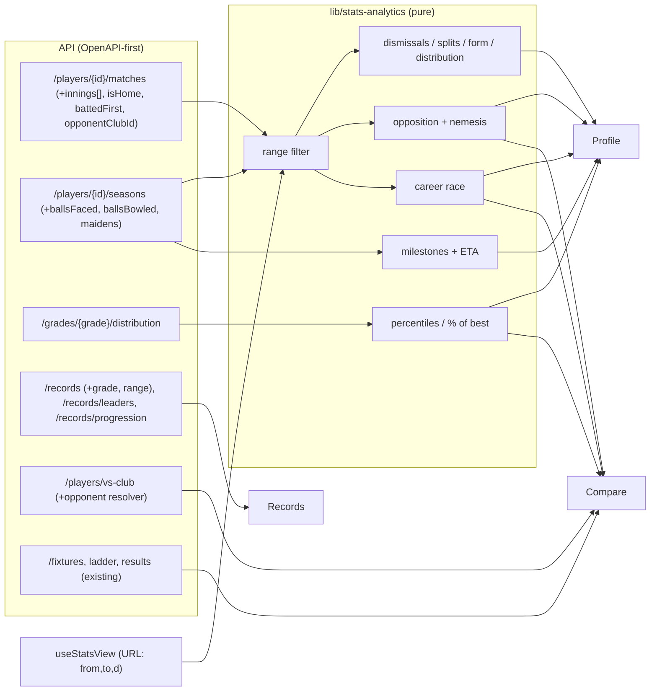

# Stats Analytics Redesign (Player profile, Compare, Records) - Plan

## Goal Capsule

- **Objective:** Rebuild the public Player profile, Compare and Records pages as chart-led analysis pages per the "Stats Analytics" design handoff. The pages share a season range and a batting/bowling switch, and every number comes from the club's real data on both the native and central read paths.
- **Product authority:** This plan. The handoff `design_handoff_stats_analytics` (Handoff.md and `Stats Analytics.dc.html`, from `Players, Records and Compare.zip`) is the visual and interaction reference. Where the handoff asks for data the club doesn't capture, this plan's data decisions (KTD3, Scope Boundaries) win.
- **Execution profile:** Three milestones:
  - S1 foundations: U1–U5.
  - S2 Player profile: U6.
  - S3 Compare and Records: U8, U7, U9, U10.

  Each unit lands as its own PR. API units come before the pages that need them.

- **Stop conditions:** Stop and surface when:
  - a per-match chart can't meet R5 (splits sum to the per-match total over the scorecard-covered span) on one of the read paths;
  - an endpoint would need a schema migration;
  - a stats page takes noticeably longer to load than the page it replaces. Measure the current page's API time in the preview before starting the unit.
- **Tail ownership:** PRs follow `CLAUDE.local.md` (auto-merge on `CLEAN`). No migrations are planned. Publishing to prod stays Ash's call.
- **Open blockers:** None.

---

## Product Contract

### Summary

The three pages move from flat tables to charts that coaches, selectors and members can analyse:

- **Profile:** hero, milestones, career arc, dismissals, form, splits, distribution, ranks, opponents and next milestones.
- **Compare:** up to three players, with a verdict, radar, tale of the tape, selection helper, opposition matrix, career race and season bars.
- **Records:** record cards, record watch, progression, leaders, partnerships, hundreds heatmap and five-fors timeline.

A sticky season bar (range and batting/bowling) drives Profile and Compare and is kept in the URL.

### Problem Frame

Today these pages are tabbed tables (see `artifacts/cricket-club/src/pages/player-detail.tsx`, `compare.tsx` and `records.tsx`). They show totals but can't answer selection questions: form, how a player gets out, who they do well against, or how two players compare over the same span. The design handoff answers those questions with charts. Several of its charts assume data the club doesn't capture, and the existing API exposes less than the database holds (dismissal type, home/away, innings order, balls and maidens).

### Requirements

- R1. A season bar offers Career, Last 3 seasons, the two most recent seasons, and a custom From–To, plus a Batting | Bowling switch (hidden on Records). Range and discipline persist in the URL (`from`, `to`, `d`), so links reproduce the view.
- R2. **Profile** renders, in order:
  - hero with range-aware stat strip (batting and bowling variants);
  - milestone timeline;
  - career arc with best season, and seasons outside the range faded;
  - dismissal donut;
  - form guide (last 10 innings);
  - splits;
  - score / wicket distribution;
  - ranks (radar or bars) against the player's grade;
  - favourite-opponents heat table;
  - next-milestone progress with an ETA.
- R3. **Compare** holds up to three players (the third optional), with swap, and renders:
  - a verdict bar;
  - a "% of club best" radar;
  - tale of the tape (lower-is-better metrics inverted);
  - the selection helper for the next three fixtures;
  - the opposition matrix, with nemesis cards;
  - the career race by games played;
  - season-by-season grouped bars.
- R4. **Records** renders, with grade tabs:
  - five record cards with holder, context and tenure badge;
  - record watch;
  - highest-score progression (the same component also serves best bowling);
  - career leaders by metric;
  - best stand per wicket;
  - hundreds heatmap;
  - five-fors timeline.
- R5. Every figure comes from the database.
  - Per-match charts (dismissals, splits, form, distribution, opposition, race) derive from the same per-innings rows, so their per-opponent and per-split totals sum to the per-match total over the scorecard-covered span.
  - Season-level figures (hero, arc, tape, season bars) come from season rows.
  - Where the two coverages differ, per-match charts carry the "Scorecard era" note (KTD3).
- R6. A chart with fewer than three data points, or with no underlying data captured, shows the existing `EmptyState` with a specific reason (e.g. "No bowling recorded in this range", "Dismissal detail not recorded"). While data loads, sections show the existing skeletons.
- R7. White-label: accent, crest and hero photo come from the tenant brand. There are no Halls Head literals and no raw hex outside tokens.
- R8. Light and dark themes, and reflow down to about 360px.
  - Every bar, dot and cell has its figure available on hover, on keyboard focus, and to screen readers.
  - Motion respects `prefers-reduced-motion`.
- R9. Existing guarantees hold:
  - OpenAPI-first;
  - juniors isolation (no junior grades or junior data on these senior pages);
  - fill-in exclusion (`playerId >= 90000`) in any new aggregate;
  - central-read identity via the crosswalk in the route (`docs/solutions/architecture-patterns/central-read-player-identity-crosswalk.md`).

### Success Criteria

- A Halls Head player's profile and a central-read tenant's profile (a PCA club and a WA club) both render every section they have data for, with no invented numbers.
- Changing the range or discipline updates every chart on Profile and Compare, and the URL round-trips the view.
- Existing player, compare and records smoke tests still pass (markup updated, not deleted).

### Scope Boundaries

- Not in scope:
  - Scoring zones and wagon wheels (removed from the design; not captured).
  - "Bowling role / spell" splits: there is no over-by-over data. Bowling splits keep home/away and match situation, as the handoff directs.
  - The Players **list** page. It was restyled in the Broadcast redesign (U8 of `2026-09-23-001`) and is untouched here.

#### Deferred to Follow-Up Work

- Junior profiles reusing these components (the handoff's "Juniors" note). This needs the juniors API (`/api/juniors/*`) and junior privacy rules. It is a separate unit, so senior and junior data never share a query.
- Partnerships for central-read tenants: central has no partnership data. The card shows its empty state there.
- Awards on central-read tenants: `getPlayer` returns them empty. The timeline omits award events until that gap is fixed.

---

## Planning Contract

### Key Technical Decisions

- **KTD1 — Derive most charts on the client from one enriched per-match series.** Dismissals, splits, form, distribution, opposition, nemesis and career race are all computed from `getPlayerMatches` rows, in a pure module (`artifacts/cricket-club/src/lib/stats-analytics/`).
  - One source of rows makes R5 hold by construction.
  - The maths becomes unit-testable.
  - The handoff's prototype logic class ports into this module.
  - Rejected: one server endpoint per chart. That would multiply endpoints and make it hard to keep the invariant across them.
- **KTD2 — Enrich `GET /players/{id}/matches` with per-innings detail.** Central already collapses two-innings matches into one row (`lib/db/src/central/players.ts`). Each match row therefore gains `innings: [{ runs, balls, notOut, dismissalType, dismissedBy, battingPos }]` (one element on native), plus `isHome`, `battedFirst` and `opponentClubId`.
  - `dismissalType` is an enum: caught, bowled, lbw, runOut, stumped, notOut, retired, other. Central maps `match_batting.dismissal_type`; native parses the free text.
  - `dismissedBy` is the bowler's surname, normalised, parsed from the text. There is no bowler id on either path, so the nemesis keys on (opponent club, normalised surname). It only shows once the count reaches 3.
  - `battedFirst` on central compares the club's and the opponent's minimum `innings` in `central.match_batting` for the same match, in one batched query over the player's match ids. Native uses `hhcc_batted_first`.
  - `opponentClubId` is always in the read path's own id space: the app clubs register on native, `central.clubs.club_id` on central.
  - `GET /players/{id}/seasons` gains nullable `ballsFaced`, `ballsBowled` and `maidens`. These are derived per (grade, season) from line tables (native `match_player_lines`; central batting and bowling lines), and are null for baseline rows.
- **KTD3 — Coverage is explicit.** Native careers include pre-scorecard baseline totals with no per-match rows.
  - Season-level charts (hero, arc, tape, season bars) use `seasons`.
  - Per-match charts use `matches` and show a "Scorecard era: from YYYY/YY" note when coverage starts after the player's debut. This includes the Compare career race next to the tape.
  - Cumulative views (milestones, next-milestone ETA, career race) are seeded with the baseline (season = null) totals, so crossings and ETAs account for the pre-scorecard career.
  - Home/away only renders where `isHome` is known.
- **KTD4 — Grade distribution endpoint for ranks and "club best".** Add `GET /grades/{grade}/distribution?fromSeason&toSeason&minInnings&minOvers`.
  - It returns qualifying players' aggregates for the grade and span, plus the club best per metric. Percentiles are computed on the client, and the same response feeds the Compare radar's "% of club best".
  - Ranks use the player's most-played senior grade in range, so the qualifier works for WA grade labels ("1st Grade") and lower grades.
  - Batting, runs, wickets and innings come from season rows. Balls, overs, maidens and the economy/strike-rate metrics come from line tables over the span.
  - A Career span includes baseline rows for counting stats only.
  - Fill-ins and junior grades are excluded, and identity is resolved via the crosswalk.
- **KTD5 — Records get filters and history server-side.**
  - `GET /records` (served from `routes/grades.ts`) gains optional `grade`, `fromSeason` and `toSeason`.
  - New `GET /records/leaders?metric&grade&fromSeason&toSeason&limit`: runs / wickets / catches / 100s / games, with `lastSeason` per row for the "still playing" dot.
  - New `GET /records/progression?kind=highScore|bestBowling&grade`: each time the record was broken, from dated match rows.
  - A curated record with a season is the progression's starting point. A curated record with no season that beats every dated row is shown as an undated final point, so the chart always ends at the record card's value.
- **KTD6 — Squad-vs-club for the selection helper.**
  - `GET /players/vs-club?opponentClubId&minInnings` returns every player's career batting and bowling against that club, across all senior grades, with fill-ins excluded. `opponentClubId` is in the read path's own id space (KTD2).
  - A resolver maps a fixture's opponent (`Fixture.opponentClubId` or the PlayHQ `orgId`) into that space. It reuses the app↔central club mapping behind `artifacts/api-server/src/lib/club-brand.ts`.
  - Upcoming fixtures, ladder position and last result reuse `listFixtures`, `getFixturesResultsLadder` and `listFixturesResults`.
- **KTD7 — Recharts behind a small themed chart kit.** Add `recharts` and wrap it in `artifacts/cricket-club/src/components/stats-charts/`: card, bar, line, radar, donut, horizontal bar list, step line and tooltip, all reading CSS tokens.
  - The heatmap, timeline and progress bars are plain elements.
  - Chart tokens use kebab-case: `--chart-a`, `--chart-b`, `--chart-c`, `--bar-mute`, `--line-b`, `--donut-1`…`--donut-6`. They are derived in `deriveThemeTokens` (`artifacts/cricket-club/src/lib/theme-tokens.ts`) from the tenant accent, and written into the `index.css` `:root` and `.dark` blocks so `theme-tokens-css-sync.test.ts` stays green.
  - Accessibility lives in the kit: marks are keyboard-focusable and show the same tooltip on focus, and every `ChartCard` renders a visually hidden data table of its figures.
- **KTD8 — One URL-state hook for range and discipline.**
  - `useStatsView()` exposes the current view and a single `setView({ from, to, d })`, which applies every change to one fresh `URLSearchParams` and navigates once. Per-param setters would overwrite each other.
  - Season labels come from the page's own season list. Picking From after To pushes To forward, and vice versa.
  - Local Batting/Bowling tabs (career arc, race, opposition) call the same `setView`.

### High-Level Technical Design

Each server read follows the existing split: the route picks native or central via `dataSource(req)`, central rows are keyed by participant GUID with NULL-participant lines excluded, junior grades are dropped by `lib/db/src/central/grades.ts`, and the route maps GUIDs to app ids through `player_id_map`.

### Assumptions

Scoping confirmation was skipped (`confirm:auto`), so these inferred bets stand unless Ash redirects:

- The Players list page is out of scope. The handoff's "Players" nav item points at the profile.
- Recharts is acceptable as a new dependency (the handoff recommends it).
- The "active player" flag means "played in the current or previous season", derived from `lastSeason`.
- The ranks qualifier is 10 innings or 50 overs over the last 5 seasons, applied to the player's most-played senior grade. It is not a setting.
- Profile milestones use the same tier ladders as the existing milestones board (`getMilestonesBoard`), so the two never disagree.

### Implementation Constraints

- Don't run `pnpm install` locally. Add `recharts` with `npx -y pnpm@10.33.0 install --lockfile-only` and keep the `packageManager` pin out of root `package.json`.
- Regenerate clients with Orval after each spec change. Never hand-edit generated files.
- Every new native aggregate filters `playerId < FILL_IN_THRESHOLD`. Every central aggregate groups by participant GUID and excludes NULL-participant lines and junior grades.
- Recharts `ResponsiveContainer` measures zero under jsdom. Component tests give charts fixed dimensions, or stub `ResizeObserver`.

---

## Implementation Units

### Milestone S1 — Foundations

### U1. Season bar and stats view state

**Goal:** A sticky season bar shared by Profile and Compare, with the range and discipline in the URL.
**Requirements:** R1, R8; KTD8.
**Dependencies:** None.
**Files:**

- Create `artifacts/cricket-club/src/lib/use-stats-view.ts` and `artifacts/cricket-club/src/components/stats-charts/season-bar.tsx`.
- Tests: `artifacts/cricket-club/src/lib/use-stats-view.test.ts`, `artifacts/cricket-club/src/components/stats-charts/__tests__/season-bar.test.tsx`.

**Approach:**

- One `setView` writes every changed param in a single navigation. Defaults are Career and batting.
- The bar is glass and sticky under the site header, with `FilterChips` for range presets, `SegmentedControl` for discipline and two selects.
- A `showDiscipline` prop hides the switch on Records. Other params (e.g. Compare's `a`/`b`/`c`) are preserved.

**Test scenarios:**

- `?from=2023&to=2025&d=bowl` reads as range 2023–2025, bowling.
- "Last 3 seasons" leaves both `from` and `to` in the URL for the three latest seasons.
- Setting From later than To pushes To forward; setting To earlier than From pulls From back.
- Career clears `from`/`to` and keeps unrelated params (`a=12`).
- The discipline switch is absent when `showDiscipline` is false.

**Verification:** Reloading a copied URL restores the same range and discipline.

### U2. Chart kit and tokens

**Goal:** Themed, accessible chart primitives every page uses.
**Requirements:** R6, R7, R8; KTD7.
**Dependencies:** None.
**Files:**

- `artifacts/cricket-club/package.json` and `pnpm-lock.yaml` (add `recharts`).
- `artifacts/cricket-club/src/index.css` (chart tokens).
- `artifacts/cricket-club/src/lib/theme-tokens.ts` (`deriveThemeTokens` chart tokens).
- Create `artifacts/cricket-club/src/components/stats-charts/{chart-card,bar-chart,line-overlay,radar,donut,hbar-list,step-line,heat-cell,chart-tooltip,index}.tsx`.
- Tests: `artifacts/cricket-club/src/components/stats-charts/__tests__/chart-kit.test.tsx`.

**Approach:**

- `ChartCard` owns:
  - the eyebrow, H2 and note;
  - the loading skeleton (existing `CardGridSkeleton`/`TableSkeleton`);
  - the "fewer than 3 points" empty state;
  - the visually hidden data table.
- Primitives read colours from CSS variables, so light, dark and the tenant accent come for free.
- Marks are focusable and show their tooltip on focus. Motion is off under reduced motion.

**Test scenarios:**

- `ChartCard` with two points renders the provided empty-state reason instead of the chart; while loading, it renders the skeleton.
- Donut legend percentages sum to 100 after largest-remainder rounding.
- `HBarList` in lower-is-better mode gives the smallest value the longest bar.
- Focusing a bar shows its tooltip text, and the hidden table lists every figure.
- A render with a purple brand uses the purple accent. `theme-tokens-css-sync.test.ts` passes with the new tokens.

**Verification:** The kit renders in both themes in the preview without hard-coded hex.

### U3. Enriched per-match and per-season rows

**Goal:** Expose the per-innings and per-season fields the charts need.
**Requirements:** R5, R9; KTD2, KTD3.
**Dependencies:** None.
**Files:**

- `lib/api-spec/openapi.yaml`, plus generated `lib/api-zod` and `lib/api-client-react`.
- `artifacts/api-server/src/routes/players.ts`.
- `lib/db/src/central/players.ts`.
- Create `artifacts/api-server/src/lib/dismissal-parse.ts`.
- Tests: `artifacts/api-server/src/lib/dismissal-parse.test.ts` and a DB integration test beside the players route.

**Approach:**

- Build the per-innings array from central `match_batting` rows (by `innings`), and from the single native line.
- The native parser handles `c X b Y`, `b Y`, `lbw b Y`, `run out`, `st X b Y`, `retired`, and `not out`. Unknown text is "other".
- Season balls and maidens come from grouped line queries.

**Test scenarios:**

- Parser cases:
  - "c Smith b Nguyen" → caught, by "nguyen";
  - "b J Nguyen" → bowled, by "nguyen";
  - "lbw b Lee" → lbw;
  - "run out (Jones)" → runOut with no bowler;
  - "st Kay b Ali" → stumped by "ali";
  - "retired hurt" → retired;
  - "not out" → notOut;
  - unknown text → other.
- A central two-innings match (out, then not out) returns two innings entries with those types.
- Central row with `home_club_id` = club → `isHome` true; native → null.
- Central `battedFirst` is true when the club's minimum innings precedes the opponent's; native follows `hhcc_batted_first`.
- Central `opponentClubId` is the central club id; native is the app club id.
- Baseline-only seasons return null `ballsFaced`/`ballsBowled`/`maidens`, not 0.
- The native path must be checked against real imported dismissal strings from the Halls Head scorecards, not only synthetic ones.

**Verification:** The existing players route tests pass, and the new fields appear in generated types.

### U4. Stats analytics module

**Goal:** Pure, tested derivations that port the handoff's prototype maths.
**Requirements:** R2, R3, R5, R6; KTD1, KTD3.
**Dependencies:** U3.
**Files:**

- Create `artifacts/cricket-club/src/lib/stats-analytics/{range,dismissals,splits,form,distribution,opposition,race,percentiles,milestones,index}.ts`.
- Tests alongside as `*.test.ts`.

**Approach:**

- Input is the enriched match series, the season rows (including the baseline row) and the range.
- Functions return chart-ready data, or a typed "insufficient" result with a reason.
- Per-innings entries drive outs, dismissals, form and opposition.
- Lower-is-better metrics (bowling average, economy, strike rate) are flagged once and honoured everywhere.
- Milestone tiers come from the milestones-board ladders. ETA = remaining ÷ average per match × matches per season.

**Test scenarios:**

- The range filter keeps seasons from–to inclusive, and Career keeps all.
- Per-opponent runs, outs and wickets sum to the per-match range totals, including a two-innings match (Covers R5).
- The dismissal donut for a player with no typed dismissals returns "insufficient: not recorded".
- The form guide returns the last 10 innings (not matches) newest-first, marks a not-out 50 as ≥50, and marks bowling ≥3 wickets.
- The career race cumulates by games played, starts from the baseline totals, and "ahead after N" uses the shortest career.
- The nemesis groups "b Nguyen" and "b J Nguyen" from the same club, needs at least 3 dismissals, and ties break by fewest innings.
- Percentile of the median player is 50. Lower-is-better inverts.
- Splits: the best row per group is flagged, and for bowling the lowest average wins.
- A player with 2,000 baseline runs and 300 scorecard runs has crossed the 2,000 tier and not a new 1,000 crossing. With 480 runs needed at 40 per match and 12 matches per season, the ETA is "1 season".

**Verification:** The module has no React or fetch imports. The full suite of its tests passes.

### U5. Grade distribution endpoint

**Goal:** Data for ranks, percentiles and "% of club best".
**Requirements:** R2, R3, R9; KTD4.
**Dependencies:** None.
**Files:**

- `lib/api-spec/openapi.yaml`, plus generated code.
- `artifacts/api-server/src/routes/grades.ts`.
- `lib/db/src/central/grade-distribution.ts` (new).
- Test: `artifacts/api-server/src/routes/grades-distribution.test.ts`.

**Approach:**

- Native: counting stats from `player_grade_season_stats` over the span; balls, overs and maidens from `match_player_lines` joined to `matches`; fill-ins excluded.
- Central: group lines by GUID over the span, map through the crosswalk, and drop junior grades.
- Return per-player metrics that pass the qualifier, plus the best value per metric.

**Test scenarios:**

- A fill-in (id ≥ 90000) never appears.
- A junior grade never appears, even when the span includes seasons where it has data.
- A player below 10 innings is excluded from batting metrics but kept for bowling if over 50 overs.
- The span filter excludes out-of-range seasons.
- A WA "1st Grade" label ranks correctly on the central path.
- The central path returns crosswalked app ids, with none left at 0.
- The best bowling average is the minimum among qualifiers.

**Verification:**

- Full-span totals match the grade leaderboard.
- Span-limited totals match the sum of `getPlayerSeasons` rows for the same seasons.

### Milestone S2 — Player profile

### U6. Player profile rebuild

**Goal:** The chart-led profile per the handoff.
**Requirements:** R2, R6, R7, R8.
**Dependencies:** U1, U2, U3, U4, U5.
**Files:**

- `artifacts/cricket-club/src/pages/player-detail.tsx`, split into `artifacts/cricket-club/src/pages/player-detail/{hero,milestones,career-arc,dismissals,form,splits,distribution,ranks,opponents,next-up}.tsx`.
- Test: `artifacts/cricket-club/src/__tests__/player-detail-analytics.test.tsx`; update the existing player-detail tests.

**Approach:**

- Keep the admin affordances already on the page (edit, delete, photo upload) and the junior–senior link.
- The hero uses the player photo, falling back to the club hero image. Brand values come from the tenant.
- Sections take `useStatsView` and the analytics module outputs.
- Milestones are derived from caps, premierships and tier crossings; award events appear where awards exist.

**Test scenarios:**

- While queries load, sections show skeletons.
- In bowling mode, a player with no wickets in range shows "No bowling recorded in this range" in the bowling charts.
- The hero stat strip switches between batting and bowling labels with `d`.
- The career arc's local Bowling tab sets `d=bowl` in the URL, and the hero switches with it.
- Seasons outside the range render faded in the career arc (asserted by attribute).
- A native player whose scorecards start after their debut shows the "Scorecard era" note on per-match charts.
- Home/away splits are hidden when every row's `isHome` is null.
- The ranks radar/bars toggle switches the view without refetching.
- No Halls Head literal renders for a non-Halls Head tenant brand.

**Verification:**

- A Halls Head profile, a PCA central profile and a WA central profile render in the preview with no console errors.
- The layout holds at 375px wide.

### Milestone S3 — Compare and Records

### U8. Squad-vs-club endpoint

**Goal:** Ranked batters and bowlers against a chosen opponent club.
**Requirements:** R3, R9; KTD6.
**Dependencies:** U3.
**Files:**

- `lib/api-spec/openapi.yaml`, plus generated code.
- `artifacts/api-server/src/routes/players.ts`.
- `lib/db/src/central/vs-club.ts` (new).
- `artifacts/api-server/src/lib/opponent-club.ts` (new resolver).
- Test: `artifacts/api-server/src/routes/players-vs-club.test.ts`.

**Approach:**

- Register the route **before** `router.get("/players/:id")`, so "vs-club" isn't coerced as an id.
- Native: `match_player_lines` joined to `matches.opponent_club_id`.
- Central: lines joined on the opposing `home_club_id`/`away_club_id`, grouped by GUID, crosswalked, with junior grades dropped.
- The response has career-long, all-senior-grade batting (innings, outs, runs, average, HS) and bowling (wickets, average, best).

**Test scenarios:**

- `GET /players/vs-club?opponentClubId=…` returns 200, not a `:id` validation error.
- A central-tenant fixture's opponent resolves to the right central club, and its figures come back end to end.
- Batters below the minimum innings are excluded from the batting list.
- Fill-ins and junior grades are excluded.
- A player's runs vs club equal the sum of their per-innings rows vs that club.
- An unresolvable opponent returns empty lists with a `resolved: false` flag, not a silent empty result.

**Verification:** Figures match the per-player opposition output from U4 for the same player and club.

### U7. Compare rebuild

**Goal:** Head-to-head for up to three players.
**Requirements:** R3, R6, R7, R8.
**Dependencies:** U1–U5, U8.
**Files:**

- `artifacts/cricket-club/src/pages/compare.tsx`, split into `artifacts/cricket-club/src/pages/compare/{player-cards,verdict,radar,tape,selection-helper,opposition,race,seasons}.tsx`.
- Test: `artifacts/cricket-club/src/__tests__/compare-analytics.test.tsx`; update the existing compare tests.

**Approach:**

- Players live in the URL (`a`, `b`, `c`). They merge into the existing params, so `from`, `to` and `d` survive.
- Keep the existing searchable player picker.
- The verdict counts category wins, with lower-is-better handled.
- The opposition matrix reuses the U4 opposition output per player. Its metric resets to outs or wickets when the discipline flips.
- The selection helper uses U8 plus existing fixtures, ladder and results.

**Test scenarios:**

- Swap exchanges `a` and `b` in the URL and keeps `from`/`to`/`d`.
- Card 3 starts as "Add a third player", and × removes it.
- Adding from the selection helper fills an empty third slot; with three players it replaces B; a player already in shows "Comparing".
- The verdict reports "Level at the top" on a tie.
- For bowling average, the lower value leads and gets the longest tape bar.
- The race x-axis is games played, and the end labels show final totals.
- The race's local Bowling tab sets `d=bowl`.
- Switching discipline with the opposition metric on `econ` resets it to `outs`; switching back resets to `wk`.
- A player chosen on one card is disabled on the others.
- The existing compare tests pass with updated markup.

**Verification:** Three central-tenant players compare with tape totals matching their season bars.

### U9. Records endpoints: filters, leaders, progression

**Goal:** Server data for the records page.
**Requirements:** R4, R9; KTD5.
**Dependencies:** None.
**Files:**

- `lib/api-spec/openapi.yaml`, plus generated code.
- `artifacts/api-server/src/routes/grades.ts` (existing `/records`, gains filters).
- `artifacts/api-server/src/routes/records.ts` (new `/records/leaders` and `/records/progression`).
- `lib/db/src/central/records.ts`.
- Test: `artifacts/api-server/src/routes/records-analytics.test.ts`.

**Approach:**

- `grade`, `fromSeason` and `toSeason` on `/records`.
- `/records/leaders` by metric, with `lastSeason` per row.
- `/records/progression` walks dated rows and emits each new record, and ends at the curated record where one beats every dated row (KTD5).
- The central path drops junior grades.

**Test scenarios:**

- A grade filter restricts every record to that grade.
- A progression over scores 120, 98, 145, 145, 187 emits 120, 145, 187 (a tie doesn't count as broken).
- The progression's final value equals the record card's value for the same grade, including an undated curated record.
- Leaders exclude fill-ins and junior grades, and `lastSeason` drives the active flag.
- The central path returns crosswalked ids.

**Verification:** `/records` without params returns exactly today's payload.

### U10. Records rebuild

**Goal:** The chart-led records page.
**Requirements:** R4, R6, R7, R8.
**Dependencies:** U1, U2, U9.
**Files:**

- `artifacts/cricket-club/src/pages/records.tsx`, split into `artifacts/cricket-club/src/pages/records/{record-cards,record-watch,progression,leaders,partnerships,hundreds-heatmap,five-fors}.tsx`.
- Test: `artifacts/cricket-club/src/__tests__/records-analytics.test.tsx`.

**Approach:**

- Grade tabs come from `listGrades`.
- Record watch applies the handoff's three rules to the leaders data.
- The hundreds heatmap and five-fors timeline are built client-side from `listCenturies` and `listFiveWicketHauls`, filtered by grade and range. Their free-text season is parsed with the same season-year helper as `useStatsView`.
- Records display settings (default tab, grades, sorts) keep applying where they map.

**Test scenarios:**

- While queries load, sections show skeletons.
- An active player within 10% of the next leaderboard place appears in record watch, and a retired player does not.
- Heatmap cells use the 4-step scale for 0, 1, 2 and 3+ centuries.
- Five-fors of 7+ wickets render solid, and 5–6 ringed.
- A central tenant shows the partnerships empty state.
- Grade tabs refetch with the `grade` param.

**Verification:** The existing records smoke tests pass with updated markup.

---

## Verification Contract

- Unit and component tests listed per unit pass in the web and API suites. DB integration tests pass in CI.
- Typecheck, lint and Prettier are clean. The OpenAPI codegen diff contains only the intended changes, and `theme-tokens-css-sync.test.ts` passes.
- The preview check covers:
  - a Halls Head player, a PCA central player and a WA central player (profile, and compare with three players);
  - records;
  - light and dark themes, at 1440px and 375px.

## Definition of Done

- U1–U10 are merged to main, each through its own PR.
- Every section in R2–R4 renders from real data, a skeleton while loading, or a specific empty state. No sample numbers remain.
- R5 is covered by U4 tests. R7 is covered by the U2 and U6 brand tests. R8's keyboard and screen-reader access is covered by U2. R9 is covered by the U3, U5, U8 and U9 tests (fill-ins, junior grades, crosswalk).

## Risks & Dependencies

| Risk                                                                      | Mitigation                                                                                                                  |
| ------------------------------------------------------------------------- | --------------------------------------------------------------------------------------------------------------------------- |
| Native dismissal text is inconsistent, so types are misparsed             | Unknown text maps to "other"; the parser is tested on real Halls Head strings; the donut shows "other" rather than guessing |
| Parsed bowler surnames merge or split real people                         | Nemesis keys on (club, normalised surname) and only shows at 3+ dismissals; the card says it is based on scorecard text     |
| Central queries for distribution and vs-club are slow across many seasons | Bound by span and grade; add indexes only if needed (none expected, since queries key on club and season)                   |
| Pre-scorecard careers make per-match charts look thin                     | KTD3: coverage note, baseline-seeded cumulative views, and season-level charts carry the career view                        |
| Central `overs` are stored as decimal overs                               | Economy and strike rate convert overs to balls (6 per over) before dividing, in U4 and U5                                   |
| A new charting dependency grows the bundle                                | Pages are already lazy routes; Recharts loads only with the stats pages                                                     |

## Open Questions

- Is central `match_batting.innings` a match-level innings number (1–4) or the side's own sequence? U3 settles this by inspecting data before fixing the `battedFirst` rule. The rule in KTD2 works for both if it compares minima within a match.

## Sources & Research

- Handoff: `design_handoff_stats_analytics/Handoff.md` and `Stats Analytics.dc.html` (in `Players, Records and Compare.zip`).
- Data availability was mapped against `artifacts/api-server/src/lib/tenant.ts` (read routing), `lib/db/src/central/players.ts` (match log collapses innings), `lib/db/src/central/grades.ts` (juniors exclusion), `artifacts/api-server/src/lib/club-brand.ts` (app↔central club ids), and the existing players, grades (`/records`), historical and fixtures routes.
- Institutional learning: `docs/solutions/architecture-patterns/central-read-player-identity-crosswalk.md` (route-owned identity, GUID grouping, NULL-participant exclusion).
- Prior plan: `docs/plans/2026-09-23-001-feat-broadcast-ui-redesign-plan.md` (Broadcast primitives; Players list already restyled).
- Document review (5 reviewers, 24 Sep): all factual corrections applied — multi-innings rows, coverage-scoped R5, club id spaces, grade-relative ranks, baseline-seeded milestones, single-navigation URL writes, route order, token naming, juniors and loading coverage.
