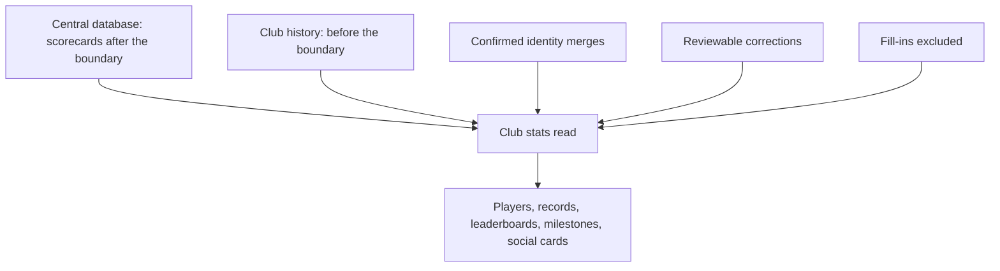
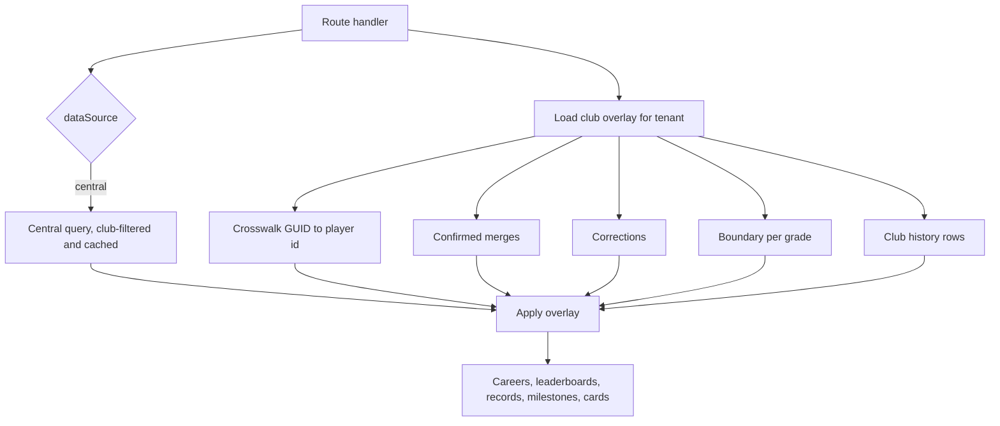
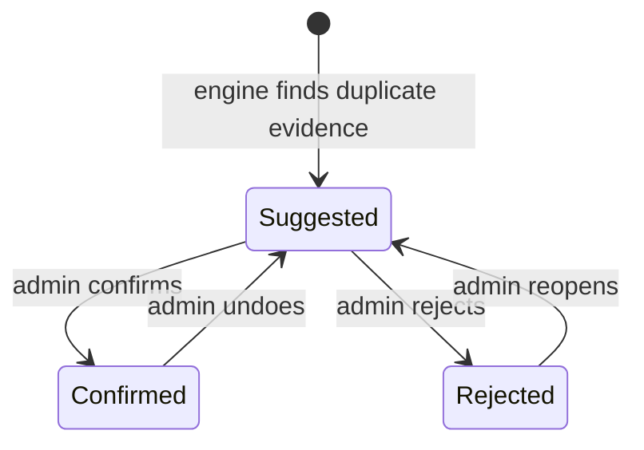
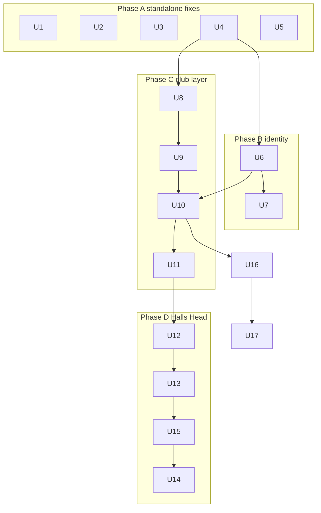

# Hybrid Stats and Club History Layer - Plan

## Goal Capsule

- **Objective:** Make the central database the primary source of match stats for every season it covers, with a per-club layer that adds pre-digital history, confirmed player identities, fill-ins and reviewable corrections; move Halls Head onto it first; ship four standalone fixes ahead of it.
- **Product authority:** Ash (owner). This Product Contract governs; the Planning Contract governs how. Production data writes, prod migrations and the Halls Head cut-over each need Ash's explicit yes, given per action.
- **Open blockers:** None for planning. The catches rule (R6) must be decided before the Halls Head cut-over (U14), not before building.
- **Stop conditions:** Stop and ask when a unit would write to the central database, change a Halls Head curated row's player link, publish the app, or apply a prod migration or data script without Ash's yes. Stop when a verification shows a career moving that the preview did not list.
- **Execution profile:** Phased. Phase A units (U1–U5) ship as independent PRs. Phases B–D follow the dependency graph in the Delivery sequence. Each PR is merged when CI is clean; prod scripts run dry-run first via the Replit agent.
- **Product Contract preservation:** changed R12, R19 — clarified that the boundary is the first season central supplies (matching AE1) and added the catches rule as a preview reason code. Deferred-to-Planning questions resolved in place by KTDs.

---

## Product Contract

### Summary

Every club's match stats come from the central database for seasons after that club's pre-digital boundary. A club layer sits on top: pre-digital history up to a boundary year (per grade, with a club default), admin-confirmed merges of duplicate identities, fill-ins, and a short list of reviewable corrections applied on read. Halls Head moves onto this model first, behind an approved preview report. Isolation fixes, the opponent repair, saving the Halls Head player link and the Ladies T20 rule ship first as standalone changes.

### Problem Frame

Halls Head reads its own native tables while every other club reads the central database, and the two are copies of the same PlayHQ history that have drifted. A read-only comparison (27 Sep 2026) found that all 2,091 native Halls Head matches carry the PlayHQ match id and exist in central, and that runs and wickets agree for all but 14 and 9 players respectively. The copies differ in ways that matter:

- **Identity.** Central splits 62 real players into two or more participant GUIDs (C Phelps 264 + 39 games, J Manuel 82 + 65). Halls Head's native players already combine them. Every other club has the same splits with nobody combining them.
- **Coverage.** Central has 139 senior Halls Head matches that native lacks (542 player appearances). Native holds 1,417 career-baseline rows, 47 fill-ins and hand corrections that central cannot supply.
- **Rules.** Central counts a game for a rostered player with no batting or bowling line (564 appearances native omits). Catches differ for almost every player. Central excludes Ladies T20, which Halls Head counts as Female B Grade.
- **Data defects.** 925 native matches store a competition name or no linked opponent ("A Grade: Wyllie Cup" appears as a club in Favourite Opponents).

The app's native/central switch is all-or-nothing per tenant. Curated tables reference native Halls Head player ids, while central tenants' crosswalk ids also start at 1, so a curated link can silently point at the wrong person. Clubs that want to import their own pre-digital history have nowhere to put it: the native stats tables carry no tenant and serve Halls Head only.

The audit also found isolation gaps: two honour-display boards read Halls Head stats for every tenant, and the native import, player-edit, merge and gallery routes accept any tenant's admin.

### Key Decisions

- **Hybrid with central as primary.** Central scorecards are the source for every season after a club's boundary. The club layer only adds or corrects, so there is one source per season and new seasons arrive automatically. Snapshotting central into per-club copies was rejected because it recreates the drift this fixes.
- **Additive plus corrections.** A club can record a correction against a specific central match and player. Corrections are applied on read, listed, reversible, and never written to central. "Additive only" was rejected because it would discard genuine hand fixes.
- **Merges are suggested, then confirmed.** The app proposes likely duplicate identities from scorecard evidence; an admin confirms. Nothing merges automatically, because a wrong merge silently joins two real people.
- **Games count team-sheet appearances.** A rostered player who did not bat, bowl or field has played the game. This matches central and common club practice and applies to every club.
- **Ladies T20 counts as senior Female B Grade** for every club (it is the predecessor of the current female grades).
- **Boundary is per grade, defaulting per club.** Central scorecard coverage starts in different seasons for different grades (Halls Head A Grade 2003/04, B and C Grade 2004/05, 2002/03 results only).
- **Concierge history import first.** The platform admin loads a club's pre-digital history with validation, preview and undo. Club-admin self-serve comes later.
- **Cut-over is gated by a preview report.** Halls Head switches only after Ash approves a report of every number that would change; the existing per-tenant switch remains the way back.

### Actors

- A1. Platform admin (Ash): imports club history, approves cut-overs, confirms Halls Head review items.
- A2. Club admin: confirms or rejects suggested identity merges, reviews and records corrections for their club.
- A3. Site visitor: sees one combined, correct career per player.

### Requirements

**Standalone fixes (ship first)**

- R1. A tenant's honour display and kiosk show only that tenant's records; the by-grade records and most-games boards never show Halls Head data to another club.
- R2. Only Halls Head's own admins can write Halls Head native stats, players, player merges and player galleries; any other tenant's admin is refused. This holds until Halls Head reads central; after cut-over, native writes are refused for every tenant.
- R3. The 925 Halls Head matches with a competition name or no linked opponent get their real opponent name and club link from the central match with the same PlayHQ id. A dry run reports what changes before the write, and only opponent fields change.
- R4. The Halls Head player-to-participant link from the crosswalk run is stored for all CLEAN players; nothing visible changes. AMBIGUOUS players are listed for review, not stored.
- R5. Ladies T20 counts as senior Female B Grade for every club reading central.

**Stats rules**

- R6. Catches follow one rule for every club, chosen by Ash after reviewing 10 sample players whose counts differ, shown against their scorecards. Halls Head keeps its current catches until the rule is chosen.
- R7. A game counts for every player named on the team sheet, whether or not they batted, bowled or fielded.
- R8. Senior-only careers, fill-in exclusion and juniors isolation hold for every read, including club history and corrections.

**Player identity**

- R9. The app suggests likely duplicate central identities within a club, from scorecard evidence (never in the same match, compatible name and seasons). Name alone is never enough.
- R10. A club admin confirms, rejects or later undoes each suggested merge; only confirmed merges combine careers.
- R11. Halls Head's existing combined identities carry over as already-confirmed merges.

**Club layer**

- R12. Each club has a pre-digital boundary season, with per-grade overrides. Club history supplies seasons before the boundary, and central supplies the boundary season and every later one.
- R13. Club history accepts any mix of career totals, season totals, full scorecards, and honours and records. Every import records which seasons and grades it covers.
- R14. A player whose career spans the boundary is suggested for linking at import and joined only when the importer confirms; unconfirmed players stay separate pre-digital players.
- R15. A club can record a correction to a central figure for a specific match and player. Corrections are applied on read, listed per club and reversible.
- R16. Curated content (awards, honour boards, caps, life members, Team of the Decade, committee, premierships, photos) links to the club's own players and can never resolve to another club's player.
- R17. Curated names and keys (honour boards, awards, Team of the Decade, club roles) are unique per club, not across all clubs.
- R18. The platform admin imports a club's history with validation, a preview of the resulting careers, and undo.

**Halls Head cut-over**

- R19. Before Halls Head switches, a preview report lists every career, record holder, milestone and cap or debut that would change, each with its reason (extra central match, games rule, Ladies T20, catches rule, correction, merge, baseline).
- R20. The preview detects career baselines that overlap seasons central already covers, so no season is counted twice.
- R21. The Halls Head players whose runs (14) or wickets (9) differ from central are reviewed once; each genuine difference becomes a correction, and the rest take the central figure.
- R22. Halls Head switches only after Ash approves the preview. The per-tenant switch stays available as an instant rollback, and curated caps and already-posted milestone cards are never renumbered or redrafted automatically.

### Acceptance Examples

- AE1. **Covers R12.** **Given** Halls Head's default boundary is 2003/04 with a B Grade override to 2004/05, **when** a visitor views a B Grade career, **then** 2003/04 and earlier come from club history and 2004/05 onward come from central.
- AE2. **Covers R9, R10.** **Given** central holds "C Phelps" under two GUIDs that never appear in the same match, **when** the admin opens duplicate suggestions, **then** the pair is listed with its evidence, and the careers combine only after the admin confirms.
- AE3. **Covers R9.** **Given** two "M Brown" GUIDs that played in the same match, **then** they are never suggested as a duplicate.
- AE4. **Covers R15, R21.** **Given** a Halls Head correction sets a player's runs in one match to 45 where central has 40, **when** the career is read, **then** it uses 45; **when** the correction is removed, **then** it reverts to 40.
- AE5. **Covers R14.** **Given** a pre-digital import row "John Smith 1995–2003" and a central "J Smith" whose first season is 2003/04, **when** the importer does not confirm the suggested link, **then** two separate players remain.
- AE6. **Covers R20.** **Given** a baseline row that includes 2003/04 runs and a boundary of 2003/04, **then** the preview flags the overlap before cut-over instead of counting 2003/04 twice.
- AE7. **Covers R22.** **Given** the cut-over moves a player's debut earlier, **then** their cap number is unchanged and the preview lists the difference for manual review.

### Success Criteria

- After cut-over, every Halls Head career matches the approved preview exactly.
- No career on any club's site is split across duplicate identities once its merges are confirmed.
- No tenant can read or write another tenant's curated or native data (verified by isolation tests).
- A second club can be given pre-digital history through the concierge import without code changes.

### Scope Boundaries

**Deferred for later**

- Self-serve history import for club admins.
- Retiring Halls Head's native tables (they remain the source of its history and the rollback path).
- Auto-detecting the boundary from central scorecard coverage (the boundary is set by the admin).
- Pushing confirmed corrections upstream into the central database builder for all clubs.

**Outside this work**

- Writing to the central database from the app.
- Combining junior and senior careers.
- Commercial use of scraped scorecard data (the data-governance constraint is unchanged).

### Dependencies / Assumptions

- The PlayHQ match id (native `source_key` = central `playhq_match_id`) remains a reliable 1:1 join for Halls Head (verified for all 2,091 matches on 27 Sep 2026).
- The crosswalk output (538 CLEAN, 61 AMBIGUOUS, 109 baseline-only, 47 fill-in) is the starting point for R4 and R11; its thresholds were a first guess and may need tuning.
- Assumption: Halls Head's career baselines are mostly pre-2002/03. This is unverified, and R20 exists to catch the cases where it's wrong.
- Assumption: the association data licence position is unchanged. Clubs' own pre-digital history is club-owned data.

### Outstanding Questions

The five questions deferred to planning are resolved in the Planning Contract: merges (KTD2), history store shape (KTD4), player id space (KTD3), games rule (KTD6) and sweep sequencing (KTD8).

### Sources / Research

- Crosswalk and comparison script: `scripts/src/hh-central-crosswalk.ts` (PR #240). Production run 27 Sep 2026: 22,733 senior lines assigned (95% on exact figures), 62 split identities, 139 central-only senior matches.
- Tenant switch: `artifacts/api-server/src/lib/tenant.ts` (`decideReadsFromCentral`); flag `tenants.reads_from_central`.
- Crosswalk table: `lib/db/src/schema/player_id_map.ts` (unique on tenant + participant and on tenant + player id; notes Halls Head is never mapped there).
- Player curation overlay (rename, merge): `lib/db/src/schema/player_curation.ts`, `artifacts/api-server/src/routes/player-curation.ts`. The API exists; there is no admin page.
- Grade classifier (Ladies T20 unmapped): `lib/db/src/central/grades.ts`.
- Honour-display leak: `artifacts/api-server/src/lib/honour-display/records.ts` (`buildRecordsByGrade`, `buildMostGames`).
- Unguarded native writes: `artifacts/api-server/src/routes/imports-csv.ts`, `imports-scorecard.ts`, `imports-batch.ts`, `players.ts`.
- Global unique keys: `lib/db/src/schema/honour_boards.ts`, `awards.ts`, `team_of_decade.ts`. Single-tenant wiping loader: `scripts/sql/master-etl.sql`.
- Glossary terms in use: Central database, Central-read model, Crosswalk, Participant GUID, Fill-in player, Player curation (`CONCEPTS.md`).

---

## Planning Contract

### Key Technical Decisions

- KTD1. **One overlay, applied in the route after the central query.** Central reads stay club-filtered and club-cached (`lib/db/src/central/*`). A new per-tenant club overlay loads once per request and is applied after the central result, never inside the cached query. Because boundaries and corrections work at season and match level, the central reads the overlay uses return (participant, app grade, season) partial aggregates, still cached by club, and the overlay does the final aggregation. Corrections are applied as deltas to the matching (participant, grade, season) bucket. Any filter pushed into a cached central query must be part of its cache key. The overlay covers the crosswalk, confirmed merges, corrections, boundary, club history and fill-ins. There is no single central chokepoint today (each handler builds its own `intByGuid`), so the overlay replaces those ad-hoc loads handler by handler. This follows `docs/solutions/architecture-patterns/central-read-player-identity-crosswalk.md` (resolve in the route, group by GUID).
- KTD2. **Merges live in player curation; the crosswalk stays 1:1.** `player_id_map` is unique on (tenant, player), and every `intByGuid` consumer assumes 1:1. For a split identity, the keeper GUID holds the crosswalk row. Every other GUID gets a `player_curation.merged_into_participant_id` pointing at the keeper. A merge status (suggested, confirmed, rejected) is added to curation, and only confirmed merges fold on read. `resolveCuration`'s `canonicalByGuid` is computed but consumed nowhere today, so wiring it into every central read is part of this work.
  - Merged-away GUIDs keep their crosswalk rows (so undo is lossless). `/players/:id` and curated lookups on a merged-away id resolve to the keeper.
  - Privacy: after folding, a keeper is private if any GUID folded into it is private. Merges, persisted merges (U4) and span links (U11) that involve a private GUID are rejected or flagged for review.
  - The curation write route validates merges: both GUIDs must have appeared for the tenant's club, neither may be private, cycles are rejected, and chain resolution is cycle-safe with a bounded depth.
- KTD3. **Per-tenant player id space, with Halls Head keeping its native ids.** Each tenant's player ids are its crosswalk ints.
  - For tenant 1, the crosswalk is seeded so each keeper GUID maps to the existing native `players.id`. Every Halls Head vote, cap, photo and honour link stays valid.
  - Pre-digital-only players are minted synthetic crosswalk entries (a club-local participant key), so they share the same id space.
  - Curated tables drop their foreign keys to native `players` and become tenant-scoped integer references, following `club_photo_players`. Every write goes through one shared tenant-space check. For tenant 1 that check accepts native player ids and tenant 1's crosswalk ids while Halls Head reads native, and crosswalk ids only after cut-over. Every other tenant is checked against its crosswalk.
  - Minting skips ids ≥ 90000 (the fill-in and cap-only ranges) and merged-away GUIDs. For tenant 1 it starts above the highest native Halls Head id.
- KTD4. **The club history store is new tenant-scoped tables; the native stats tables are untouched.** Halls Head's native tables stay as its rollback path, and as the source that seeds its club history (U12). The new store holds stats history rows at career, season or match grain. Imported honours (honour boards, awards, records, centuries lists) go into the existing curated tables, so they appear on the pages clubs already use. Each row is tagged with the seasons and grades its import covers. This avoids adding tenant_id to the high-risk native stats core.
- KTD5. **The boundary means one source per (grade, season).** The boundary is the first season central supplies for that grade. For each tenant and grade, seasons before it come only from club history; the boundary season and later seasons come only from central. This extends the existing rule of one ingestion method per (grade, season). Career-grain history (no season) counts as pre-boundary; the preview (U13) flags any that overlaps a central season.
- KTD6. **The games rule already holds on the central path.** Central counts roster ∪ batting ∪ bowling appearances (`lib/db/src/central/players.ts`), so other clubs see no change. Halls Head adopts it at cut-over rather than through a rewrite of native derivation, which avoids churning native totals twice.
- KTD7. **Corrections follow the junior corrections journal.** They go in a tenant-scoped table keyed on PlayHQ match id plus participant GUID plus field, recording the previous value and who made it. A correction is applied on read. If the central figure no longer matches the recorded previous value, it is skipped and reported. Pattern: `lib/db/src/schema/junior_stat_corrections.ts`.
- KTD8. **Rule and identity changes never auto-draft.** The Ladies T20 rule (U3), crosswalk persistence (U4), merges folding on read (U6, U7), the catches rule (U15) and the cut-over (U14) all change career totals or unlock player cards. Each ships with the draft sweep watermark advanced past existing matches for the affected tenants, and a dry-run of the sweep is checked before release. Halls Head's central sweep watermark is initialised at cut-over.
- KTD9. **Every prod data change is a dry-run-first script.** Scripts follow `scripts/src/backfill-innings-order.ts`: preview by default, `--commit` writes inside a transaction, `--tenant` is required, and reversal records are kept. They run on prod only via the Replit agent, with Ash's yes.
- KTD10. **Native writes are fenced by middleware.** A `requireNativeStatsTenant` middleware (tenant 1 and not reading central) guards every native stats, import, player and gallery write route. It throws a status-carrying error that the app error handler already maps. After cut-over, Halls Head's native writes are fenced too, so its data changes go through the club layer.

### High-Level Technical Design

Read path after cut-over (every club):

Apply-overlay order (directional):

1. Drop central rows in (grade, season) before the boundary.
2. Drop junior grades and fill-ins.
3. Apply corrections as deltas to (participant, grade, season) buckets.
4. Fold confirmed-merged GUIDs into their keeper.
5. Mark a keeper private if any folded GUID is private.
6. Map GUIDs to player ids.
7. Union club history rows for pre-boundary seasons.
8. Aggregate.

Merge lifecycle (only the Confirmed state folds careers; rejected pairs are not re-suggested unless reopened):

Delivery sequence:

### Assumptions

- The Halls Head crosswalk run (27 Sep 2026) is reproducible, so U4 re-runs the matcher rather than consuming a stale CSV.
- Central usually keeps PlayHQ match ids and participant GUIDs stable across reloads; U17 detects when it doesn't.
- CI skips the consistency suites (`CI_SKIP_DATA_TESTS`), so real-data checks run locally or on the Repl as part of verification.

### Sequencing and Landing

- Phase A units are independent. Each lands as its own PR, in any order, except that U4 must precede U6 and U8.
- Migrations are numbered on top of main at merge time. The journal `when` must exceed the prod ledger max; re-check it just before applying.
- Prod scripts (U4, U5, U12) run as a dry-run and report first. They commit only after Ash's yes.

---

## Implementation Units

| U-ID | Title | Key files | Depends on |
|---|---|---|---|
| U1 | Honour display tenant isolation | `artifacts/api-server/src/lib/honour-display/records.ts`, `assemble.ts` | none |
| U2 | Native stats write fence | `artifacts/api-server/src/middlewares/`, `routes/imports-*.ts`, `routes/players.ts` | none |
| U3 | Ladies T20 as Female B Grade | `lib/db/src/central/grades.ts` | none |
| U4 | Persist Halls Head crosswalk | `scripts/src/persist-hh-crosswalk.ts`, `lib/db/src/provision.ts` | none |
| U5 | Halls Head opponent repair | `scripts/src/repair-hh-opponents.ts` | none |
| U6 | Merges applied on every central read | `artifacts/api-server/src/lib/central-curation.ts`, central read handlers | U4 |
| U7 | Duplicate suggestions and review screen | `lib/api-spec/openapi.yaml`, `routes/player-curation.ts`, new admin page | U6 |
| U8 | Per-tenant player id space and keys | curated schema files, new migration | U4 |
| U9 | Club history, boundary and corrections store | new schema files, new migration | U8 |
| U10 | Club overlay read path | new `artifacts/api-server/src/lib/club-overlay.ts`, central read handlers | U6, U9 |
| U11 | Concierge history import | `routes/platform-admin.ts`, platform-admin pages | U10 |
| U12 | Seed Halls Head club layer | `scripts/src/seed-hh-club-layer.ts` | U11 (library only) |
| U13 | Cut-over preview and catches review | `scripts/src/hh-cutover-preview.ts` | U12 |
| U15 | Catches rule for all clubs | club overlay, sweep watermark | U13 (catches samples) |
| U14 | Halls Head cut-over | `artifacts/api-server/src/lib/tenant.ts`, sweep watermark | U13 (approved preview), U15 |
| U16 | Corrections admin API and screen | `lib/api-spec/openapi.yaml`, new corrections route and admin page | U10 |
| U17 | Identity drift check after central reloads | `scripts/src/check-identity-drift.ts`, corrections screen | U6, U16 |

### U1. Honour display tenant isolation

**Goal:** The by-grade records and most-games honour boards show only the viewing tenant's players.

**Requirements:** R1.

**Dependencies:** None.

**Files:**
- Modify `artifacts/api-server/src/lib/honour-display/records.ts` and `artifacts/api-server/src/lib/honour-display/assemble.ts`.
- Test: `artifacts/api-server/src/routes/honour-display-kiosk.test.ts` and `artifacts/api-server/src/routes/tenant-isolation.test.ts`.

**Approach:**
- Pass the `DataSource` into both builders, as `buildMilestoneBoard(source)` does.
- Native keeps today's query.
- Central builds the same boards from `centralGradeLeaderboard` and `centralPlayerCareers`, mapped through the crosswalk.

**Patterns to follow:** `buildMilestoneBoard` → `buildMilestonesForSource` in `artifacts/api-server/src/routes/milestones.ts`.

**Test scenarios:**
- A tenant-2 (central) honour display returns no Halls Head player names on the by-grade and most-games boards.
- Halls Head's boards are unchanged: the same holders and values as before, from a native fixture.
- A central tenant with no matches gets empty boards, not an error.

**Verification:** The isolation test passes against a real DB, and the kiosk test still passes for Halls Head.

### U2. Native stats write fence

**Goal:** Only Halls Head (native) admins can write native stats, imports, players, merges and galleries.

**Requirements:** R2.

**Dependencies:** None.

**Files:**
- Create `artifacts/api-server/src/middlewares/require-native-stats-tenant.ts`.
- Modify `artifacts/api-server/src/routes/imports-csv.ts`, `imports-scorecard.ts`, `imports-batch.ts` and `players.ts` (the write, merge and image routes).
- Test: `artifacts/api-server/src/routes/native-write-isolation.test.ts`.

**Approach:**
- The middleware passes only when the tenant is 1 and not reading central. Otherwise it raises the 409 `NativeStatsUnavailableError` shape, which the app error handler already maps.
- Apply it after `requireAdmin` on every listed route.
- Scope `player_images` reads to the tenant, and have the self-heal insert set `tenant_id`.

**Patterns to follow:**
- `NativeStatsUnavailableError` and `decideReadsFromCentral` in `artifacts/api-server/src/lib/tenant.ts`.
- The 403 write guard in `artifacts/api-server/src/routes/stats.ts`.

**Test scenarios:**
- A tenant-2 admin is refused on each of these, and no native row changes: scorecard import, CSV import, batch commit, player create, patch, delete, merge, image upload and image delete.
- A Halls Head admin can still do each of them.
- A tenant-2 admin can neither list nor delete Halls Head player images.
- An unauthenticated request is still refused by auth before the fence.

**Verification:** The isolation test covers every guarded route, and the existing Halls Head import tests still pass.

### U3. Ladies T20 as Female B Grade

**Goal:** Central "Ladies T20" matches count as senior Female B Grade for every central club.

**Requirements:** R5, R8.

**Dependencies:** None.

**Files:**
- Modify `lib/db/src/central/grades.ts`.
- Test: `lib/db/src/central/grades.test.ts`.

**Approach:**
- Map the Ladies T20 label to "Female B Grade", and update the header comment. The grade order lists already include Female B Grade.
- Ship with the sweep watermark advanced for central tenants (KTD8).

**Patterns to follow:** The existing female-grade branches in the classifier.

**Test scenarios:**
- "Ladies T20" maps to "Female B Grade".
- "Senior Female A Grade" and "Rio Tinto Female A Grade" are unchanged.
- Junior girls' labels such as "Under 15 Girls" still map to null.
- WA women's labels are unchanged.
- Real-data check before shipping: no club has both Ladies T20 and Female B Grade matches in the same season; any that do are listed.

**Verification:**
- The classifier tests pass.
- A real-data check shows central clubs gaining Female B Grade seasons, with junior counts unchanged.

### U4. Persist Halls Head crosswalk

**Goal:** Store the Halls Head keeper-GUID to native player id links and the split-identity merges, changing nothing visible.

**Requirements:** R4, R11.

**Dependencies:** None.

**Files:**
- Create `scripts/src/persist-hh-crosswalk.ts`, reusing `scripts/src/hh-central-crosswalk-core.ts`.
- Modify `lib/db/src/provision.ts` (mint guards) and the doc comment in `lib/db/src/schema/player_id_map.ts`.
- Test: `scripts/src/persist-hh-crosswalk.test.ts` and `lib/db/src/provision.test.ts`.

**Approach:**
- Re-run the matcher.
- For each CLEAN player, choose the keeper GUID (the one with the most lines), and upsert tenant 1's map row from the keeper to the native id.
- Every other GUID for that player gets a curation merge into the keeper (U6's migration marks existing merges confirmed).
- AMBIGUOUS players go to a review report only.
- Minting skips ids ≥ 90000, merged-away GUIDs, and ids at or below the native maximum for tenant 1.
- The script previews by default; `--commit` writes in one transaction and is idempotent.

**Execution note:** Run the dry-run against production via the Repl, and review the counts before any `--commit`.

**Patterns to follow:**
- `scripts/src/backfill-player-id-map.ts`.
- `mintPlayerIdMap` in `lib/db/src/provision.ts`.
- `scripts/src/backfill-innings-order.ts`.

**Test scenarios:**
- A CLEAN player with one GUID produces one map row with the native id.
- A player split across two GUIDs produces one keeper row plus one confirmed merge.
- An AMBIGUOUS player produces no rows and appears in the report.
- A fill-in (id ≥ 90000) is never mapped.
- A re-run is a no-op.
- Minting after persistence never issues an id ≥ 90000 or one that collides with a native id.

**Verification:**
- The prod dry-run reports about 538 map rows and about 62 merges.
- After commit, no Halls Head page changes, because Halls Head still reads native.

### U5. Halls Head opponent repair

**Goal:** The 925 Halls Head native matches get their real opponent name and club link.

**Requirements:** R3.

**Dependencies:** None.

**Files:**
- Create `scripts/src/repair-hh-opponents.ts`.
- Test: `scripts/src/repair-hh-opponents.test.ts`.

**Approach:**
- Join native `source_key` to central `playhq_match_id`, and take the opposing side's team name.
- Resolve the app clubs register id from a central-club to app-club map. The map is learned from native matches that already have `opponent_club_id`; the most frequent pairing wins.
- Where no mapping exists, set only the name.
- The preview lists counts, a per-club breakdown and any unresolved clubs.
- The script writes only `opponent` and `opponent_club_id`, and records previous values for reversal.

**Patterns to follow:**
- `scripts/src/backfill-innings-order.ts`.
- The most-frequent-id derivation in `lib/db/src/central/vs-club.ts`.

**Test scenarios:**
- A match whose opponent is a competition name gets the central opponent's name and the mapped club id.
- A central club with no learned mapping gets only the name.
- A match that already has an `opponent_club_id` is not touched.
- A match with no central counterpart is reported and skipped.
- The reversal record restores the previous values.

**Verification:** The prod dry-run lists about 925 matches. After commit, Favourite Opponents shows only clubs.

### U6. Merges applied on every central read

**Goal:** Confirmed merges combine careers everywhere central stats appear.

**Requirements:** R9, R10.

**Dependencies:** U4.

**Files:**
- Modify `artifacts/api-server/src/lib/central-curation.ts` and `lib/db/src/schema/player_curation.ts`, and add a new migration.
- Modify the central read handlers:
  - `artifacts/api-server/src/routes/players.ts`, `grades.ts`, `records.ts`, `milestones.ts` and `historical.ts`;
  - `artifacts/api-server/src/lib/grade-leaderboard.ts`, `grade-distribution.ts`, `vs-club.ts`, `match-detail.ts` and `roundup-central.ts`;
  - `artifacts/api-server/src/routes/premierships.ts`, `artifacts/api-server/src/lib/player-helpers.ts`, `club-photo-library.ts`, `central-achievements.ts`, `draft-featured-player.ts`, and the central branch of `lib/honour-display/records.ts` (from U1).
- Harden the curation write route in `artifacts/api-server/src/routes/player-curation.ts` (KTD2 validation).
- Test: `artifacts/api-server/src/lib/central-curation.test.ts` and `artifacts/api-server/src/routes/player-merge-read.test.ts`.

**Approach:**
- Add a status to curation merges; existing rows migrate to confirmed.
- Each handler folds GUIDs through `canonicalByGuid` (confirmed only) before grouping by GUID.
- This is the first slice of the overlay loader; U10 extends it.

**Patterns to follow:** `resolveCuration`, and the GUID-grouping rule in `docs/solutions/architecture-patterns/central-read-player-identity-crosswalk.md`.

**Test scenarios:**
- Two GUIDs with a confirmed merge show as one player with summed games, runs and wickets on each of these: the directory, player detail, grade leaderboard, records, milestones and head-to-head.
- A suggested or rejected merge leaves them separate.
- A merge chain A to B to C folds to C.
- A merge never crosses tenants.
- A confirmed merged pair crosses a milestone once in achievement drafts, not twice.
- An award linked to the merged-away player id shows under the keeper.
- A private GUID merged into a public keeper leaves the combined player masked.
- The curation route rejects a GUID from another club, a private GUID, and an A-to-B-to-A cycle.

**Verification:** A real-data check of a merged pair shows one career on every surface.

### U7. Duplicate suggestions and review screen

**Goal:** Club admins review app-suggested duplicate identities and confirm, reject or undo them.

**Requirements:** R9, R10.

**Dependencies:** U6.

**Files:**
- Modify `lib/api-spec/openapi.yaml`, then run codegen.
- Create `artifacts/api-server/src/lib/duplicate-suggestions.ts`, and modify `artifacts/api-server/src/routes/player-curation.ts`.
- Create `artifacts/cricket-club/src/pages/admin-player-duplicates.tsx`.
- Test: `artifacts/api-server/src/lib/duplicate-suggestions.test.ts`, `artifacts/api-server/src/routes/player-curation-isolation.test.ts` and `artifacts/cricket-club/src/pages/admin-player-duplicates.test.tsx`.

**Approach:**
- A candidate pair is two GUIDs from the same club that were never in the same match, have a compatible "Initial Surname", and are both non-private.
- Candidates are ranked by season adjacency and grade overlap. A name match alone never suggests a pair.
- Suggestions persist as suggested curation rows. Confirm, reject and undo change their status.
- The screen shows each pair's evidence: seasons, grades, and games per GUID.

**Patterns to follow:** The merge dialog in `artifacts/cricket-club/src/pages/admin-players.tsx`, and `artifacts/cricket-club/src/pages/admin-junior-players.tsx`.

**Test scenarios:**
- Covers AE2. Two "C Phelps" GUIDs that were never in the same match are suggested with their evidence.
- Covers AE3. Two "M Brown" GUIDs that shared a match are never suggested.
- Confirming folds the careers, and undo splits them again.
- A rejected pair is not re-suggested on the next run.
- A tenant-2 admin cannot see or act on tenant-1 suggestions.

**Verification:** For a PCA test club, the screen lists its splits, and confirming one changes that player's public career.

### U8. Per-tenant player id space and keys

**Goal:** Curated content links to the club's own players, and curated keys are unique per club.

**Requirements:** R16, R17.

**Dependencies:** U4.

**Files:**
- Modify the schema files for these tables: `award_winners`, award ballots, `life_members`, `team_of_decade`, `cap_register`, `club_roles`, `honour_boards` (overrides and key), `awards` (key), `player_images`, `premierships` (players) and `historical_records`.
- Add a new migration.
- Modify the write routes that accept player ids for those tables.
- Test: `artifacts/api-server/src/routes/curated-player-link-isolation.test.ts`.

**Approach:**
- Drop the foreign keys to native `players` on curated tables.
- List every route that writes a player id to these tables, and route all of them through one shared `assertPlayerInTenantSpace` check (KTD3 rules).
- Swap the global unique keys for (tenant_id, key) uniques, using the idempotent DO-block pattern.
- No Halls Head row changes value.

**Execution note:** Write the migration idempotently, because prod was push-built and baselined at 0000.

**Patterns to follow:**
- `lib/db/migrations/0001_reconcile_pushed_databases.sql` (the per-tenant unique swap).
- `club_photo_players` in `lib/db/src/schema/club_photos.ts`.

**Test scenarios:**
- A tenant-2 award winner with crosswalk id 5 resolves to tenant 2's player 5, never to Halls Head's player 5.
- Writing a player id outside the tenant's id space is rejected on every listed route.
- A tenant-1 id that exists only in tenant 1's crosswalk is accepted.
- Two tenants can each create an honour board, award or Team of the Decade with the same key.
- Every Halls Head curated row still resolves to the same player as before (snapshot comparison).

**Verification:** The migration applies cleanly twice on a prod copy, and the Halls Head curated pages are unchanged.

### U9. Club history, boundary and corrections store

**Goal:** Tenant-scoped storage for pre-digital history, the per-grade boundary and corrections.

**Requirements:** R12, R13, R15.

**Dependencies:** U8.

**Files:**
- Create `lib/db/src/schema/club_history.ts` and `lib/db/src/schema/club_corrections.ts`.
- Add the boundary settings: a club default plus per-grade overrides.
- Add a new migration.
- Test: `lib/db/src/schema/club-history.test.ts`.

**Approach:**
- History rows carry the tenant, player id (KTD3), grade, an optional season, a grain (career, season or match), the figures, and the import batch.
- Each batch records the seasons and grades it covers.
- Corrections follow KTD7.
- Every table uses `tenantIdColumn()`.

**Patterns to follow:** `lib/db/src/schema/_tenant.ts` and `lib/db/src/schema/junior_stat_corrections.ts`.

**Test scenarios:**
- A batch covering two grades records both in its coverage.
- A correction requires a PlayHQ match id, GUID, field and previous value.
- A tenant-2 scoped query never returns tenant-1 rows.

**Verification:** The migration applies idempotently, and the schema typechecks.

### U10. Club overlay read path

**Goal:** Every central stats read combines central data after the boundary with club history up to it, plus merges, corrections and fill-in exclusion.

**Requirements:** R7, R8, R12, R15.

**Dependencies:** U6, U9.

**Files:**
- Create `artifacts/api-server/src/lib/club-overlay.ts`.
- Modify the central read handlers listed in U6.
- Test: `artifacts/api-server/src/lib/club-overlay.test.ts` and `artifacts/api-server/src/routes/club-overlay-consistency.test.ts`.

**Approach:**
- Add (participant, app grade, season) partial-aggregate reads to `centralPlayerCareers`, `centralGradeLeaderboard` and the records and milestones queries, cached by club (KTD1).
- Implement the apply-overlay order from the High-Level Technical Design.
- Season-less career history is added once to career totals and never to season views.
- A correction whose previous value no longer matches central is skipped and logged.

**Execution note:** Implement test-first against small fixtures for each rule before touching the handlers.

**Patterns to follow:** `resolveCuration`, and `seniorMatchRows` in `lib/db/src/central/club-matches.ts`.

**Test scenarios:**
- Covers AE1. With a B Grade boundary of 2004/05, a 2003/04 B Grade season comes from history, and the 2004/05 and 2005/06 seasons come from central.
- Covers AE4. A correction from 40 to 45 runs applies, and removing it reverts to 40.
- A correction whose recorded previous value mismatches central is skipped and reported.
- A career-grain history row is added once to the career and appears in no season.
- No (grade, season) is ever counted from both sources.
- A rostered appearance with no batting or bowling counts as a game (R7).
- Junior grades and fill-ins are excluded from both sources (R8).
- A tenant with no history and no boundary gets exactly today's central numbers.

**Verification:** For every existing central tenant, careers are unchanged before any history, boundary or correction is added (real-data consistency check).

### U11. Concierge history import

**Goal:** The platform admin imports a club's pre-digital history, with validation, preview, span-player linking and undo.

**Requirements:** R13, R14, R18.

**Dependencies:** U10.

**Files:**
- Modify `lib/api-spec/openapi.yaml`, then run codegen.
- Modify `artifacts/api-server/src/routes/platform-admin.ts`, and create `artifacts/api-server/src/lib/history-import.ts`.
- Create `artifacts/cricket-club/src/pages/platform-admin/history-import.tsx`.
- Test: `artifacts/api-server/src/lib/history-import.test.ts` and `artifacts/api-server/src/routes/history-import-isolation.test.ts`.

**Approach:**
- Accept CSV templates for career totals, season totals, match scorecards and honours. Honours rows are written into the existing curated tables (honour boards, awards, historical records) for the tenant, and undo removes them with the batch.
- Validate grades and seasons against the boundary.
- Preview the resulting careers, plus span-player suggestions (a name match with seasons adjacent to the boundary).
- Commit only confirmed links; unconfirmed players become pre-digital-only players.
- Undo removes a whole batch.
- Routes live under `/platform/admin/tenants/:id/history-import`.

**Patterns to follow:**
- The preview, commit and undo flow in `artifacts/api-server/src/routes/imports-csv.ts`.
- `artifacts/cricket-club/src/components/admin-import/use-import-session.ts`.
- `artifacts/cricket-club/src/pages/platform-admin/tenant-detail.tsx`.

**Test scenarios:**
- Covers AE5. An unconfirmed "John Smith 1995–2003" stays separate from the central "J Smith".
- A confirmed span link joins the history rows to the central player's id.
- A row dated after the boundary is rejected, reporting its row number.
- A career-totals-only import produces career numbers and no season rows.
- Undo removes every row of the batch and nothing else.
- A non-platform-admin is refused, and one tenant's import never writes another tenant's rows.

**Verification:** A test club imported end to end shows the combined careers on its public pages.

### U12. Seed Halls Head club layer

**Goal:** Halls Head's own history, boundaries, fill-ins and corrections load into its club layer from native data.

**Requirements:** R11, R12, R20, R21.

**Dependencies:** U11's `history-import.ts` library only; U11's route and page can finish in parallel.

**Files:**
- Create `scripts/src/seed-hh-club-layer.ts`.
- Test: `scripts/src/seed-hh-club-layer.test.ts`.

**Approach:**
- Set the Halls Head boundary: a default of 2003/04, with per-grade overrides from the season-coverage report (for example B and C Grade at 2004/05).
- Load native career baselines, and any native seasons before each boundary, as history through the U11 import library.
- Load fill-ins as excluded.
- Resolve every AMBIGUOUS player from U4's review list, either into a keeper map row with its native id or into a recorded decision to leave it unmapped.
- Seed the 109 baseline-only players as synthetic crosswalk entries pinned to their existing native ids.
- Write a review list for the players whose runs or wickets differ from central. Only confirmed items become corrections.
- The script previews by default and commits only with approval.

**Patterns to follow:** The U11 import library, and the U4 dry-run conventions.

**Test scenarios:**
- Baseline rows load as career-grain history against the right player ids.
- A native season before the boundary loads as season history, and one after it is skipped.
- Fill-ins never produce history rows.
- A differing player appears in the review list, not as an automatic correction.

**Verification:** The prod dry-run reports row counts per grade, plus a review list of the 14 runs players and 9 wickets players.

### U13. Cut-over preview and catches review

**Goal:** A report of every Halls Head number that would change at cut-over, plus the catches samples Ash needs to choose the rule.

**Requirements:** R6, R19, R20, R21.

**Dependencies:** U12.

**Files:**
- Create `scripts/src/hh-cutover-preview.ts`.
- Test: `scripts/src/hh-cutover-preview.test.ts`.

**Approach:**
- Compute every Halls Head career two ways: native as today, and hybrid through the U10 overlay.
- Diff careers, record holders, milestone crossings, and debut or cap order.
- Give each change a reason code: extra central match, games rule, Ladies T20, catches rule, merge, correction or baseline overlap.
- Report curated rows (awards, caps, votes, photos, honours) that would resolve to a different or missing player.
- Runs twice. The first run outputs the 10 catches samples (native and central fielding per match) and a draft preview. The second run, after U15, is the preview Ash approves.
- The report is read-only.

**Patterns to follow:** The output files and read-only guard in `scripts/src/hh-central-crosswalk.ts`.

**Test scenarios:**
- A player gaining a central-only match shows a delta with the reason "extra central match".
- Covers AE6. A baseline that overlaps a central season is flagged as "baseline overlap".
- Covers AE7. A debut that moves earlier is listed, and its cap number is unchanged.
- The catches sample lists both counts per match.

**Verification:** The report runs read-only on prod, and Ash reviews it together with the catches samples.

### U14. Halls Head cut-over

**Goal:** Switch Halls Head to the hybrid read after Ash approves the preview, with an instant way back.

**Requirements:** R6, R19, R22.

**Dependencies:** U13 (approved preview) and U15.

**Files:**
- Modify `artifacts/api-server/src/lib/tenant.ts` (tenant-1 handling in `decideReadsFromCentral` and `dataSource`) and the draft sweep watermark initialisation.
- Extend the U2 fence to Halls Head once it reads central.
- Test: `artifacts/api-server/src/lib/tenant.test.ts` and `artifacts/api-server/src/lib/draft-sweep.test.ts`.

**Approach:**
- Initialise the Halls Head central sweep watermark to the latest match.
- Set Halls Head to read central.
- Verify the result against the approved preview.
- Rollback flips the flag back. It is lossless only until the first new match or curated link after cut-over (the native tables are untouched but stop receiving data). After that window, rollback shows native as of cut-over, and the losses are reported. The window goes in the approval checklist.
- Gate the flip on U13 reporting zero curated rows that would resolve to a different or missing player.
- Curated caps and posted cards are never modified.

**Execution note:** Cut over only after Ash approves the U13 report, and publish only with his yes.

**Patterns to follow:** The `CENTRAL_READS` kill-switch, and the sweep watermark in `docs/plans/2026-09-24-001-feat-social-studio-automation-plan.md`.

**Test scenarios:**
- After the flip, the first sweep drafts nothing for historical matches.
- Rolling back inside the window restores native reads with identical numbers.
- A rollback after a new central match and a new-player award reports what it loses.
- A curated write for a player id minted after cut-over succeeds.
- Native write routes refuse Halls Head once it reads central.
- Covers AE7. Cap numbers are unchanged after cut-over.

**Verification:** Every Halls Head career matches the approved preview, and rollback was rehearsed on a copy before the prod flip.

### U15. Catches rule for all clubs

**Goal:** Apply the catches rule Ash chooses from the U13 samples to every central club, before the approval preview.

**Requirements:** R6.

**Dependencies:** U13 (catches samples).

**Files:**
- Modify `artifacts/api-server/src/lib/club-overlay.ts` and the central fielding reads in `lib/db/src/central/`.
- Test: `artifacts/api-server/src/lib/club-overlay.test.ts`.

**Approach:**
- Implement the chosen rule in the fielding aggregation, for every central tenant.
- Advance the sweep watermark for all central tenants (KTD8).
- Run the U10 consistency check, which should show only catches changing.

**Patterns to follow:** `classifyFieldingKind` in `lib/db/src/central/scoring.ts`.

**Test scenarios:**
- A sample player's catches match the chosen rule against their per-match fielding.
- Runs, wickets and games are unchanged for every tenant.
- The sweep dry-run drafts nothing historical.

**Verification:** The consistency check shows only catches changing, and the U13 approval preview is re-run with the "catches rule" reason code.

### U16. Corrections admin API and screen

**Goal:** Club admins create, list and remove corrections to central figures for their own club.

**Requirements:** R15.

**Dependencies:** U10.

**Files:**
- Modify `lib/api-spec/openapi.yaml`, then run codegen.
- Create `artifacts/api-server/src/routes/club-corrections.ts` and `artifacts/cricket-club/src/pages/admin-corrections.tsx`.
- Test: `artifacts/api-server/src/routes/club-corrections-isolation.test.ts`.

**Approach:**
- Use `requireAdmin`, with the tenant taken from request context.
- On write, validate that the PlayHQ match involves the tenant's club, and that the GUID has a line for that club.
- Record the actor and the previous value (KTD7).
- The list shows active and stale corrections (a stale correction is one whose previous value no longer matches central).

**Patterns to follow:** `lib/db/src/schema/junior_stat_corrections.ts` and its admin route.

**Test scenarios:**
- A correction for a match not involving the club is rejected.
- A correction for a GUID with no line for the club is rejected.
- A tenant-2 admin cannot create, list or remove tenant-1 corrections.
- Removing a correction reverts the figure on read.

**Verification:** A correction made in the screen changes the public career, and removing it restores the career.

### U17. Identity drift check after central reloads

**Goal:** After each central reload, list crosswalk keeper GUIDs and merge GUIDs that no longer exist for their club, so an admin can repair them.

**Requirements:** R9, R10, R16.

**Dependencies:** U6, U16.

**Files:**
- Create `scripts/src/check-identity-drift.ts`.
- Surface the results beside stale corrections in `artifacts/cricket-club/src/pages/admin-corrections.tsx`.
- Test: `scripts/src/check-identity-drift.test.ts`.

**Approach:**
- Read-only.
- Per tenant, compare crosswalk and curation GUIDs against central participants for the tenant's club.
- Report missing GUIDs, and the curated rows that depend on them.
- Run after each central reload, and on demand.

**Patterns to follow:** The read-only guard in `scripts/src/hh-central-crosswalk.ts`, and KTD7's stale-correction reporting.

**Test scenarios:**
- A keeper GUID missing from central is reported, together with the curated rows that depend on it.
- A merge whose merged-away GUID has disappeared is reported.
- Nothing is reported when every GUID is present.

**Verification:** Running the check against prod reports zero drift today.

---

## Verification Contract

| Gate | Command or check | Applies to |
|---|---|---|
| Typecheck | `pnpm run typecheck` | all units |
| Lint and format | `pnpm run lint` and `pnpm run format:check` | all units |
| API tests | `pnpm --filter @workspace/api-server run test` (real-DB isolation suites run in CI) | U1, U2, U6–U8, U10, U11, U14–U16 |
| Library and script tests | `pnpm run test:libs` | U3–U5, U9, U12, U13 |
| OpenAPI codegen | `pnpm --filter @workspace/api-spec run codegen`, with generated files committed unedited | U7, U11, U16 |
| Migrations | Apply twice on a prod copy; journal `when` above the prod ledger max; `db-drift-check.mjs` clean | U6, U8, U9 |
| Real-data consistency | `*-consistency.test.ts` and the U10 consistency suite, run locally or on the Repl (CI skips them) | U6, U10, U14 |
| Prod scripts | Dry-run output reviewed by Ash before `--commit` | U4, U5, U12 |
| Sweep safety | A draft sweep dry-run shows no historical drafts after the change | U3, U4, U6, U7, U14, U15 |

---

## Definition of Done

- Every unit's test scenarios exist and pass, and CI is green on each PR.
- No tenant can read or write Halls Head's data: the U1, U2 and U8 isolation tests pass.
- The Halls Head crosswalk and merges are persisted, and confirmed merges combine careers on every central surface.
- A second club can be given pre-digital history end to end through the concierge import.
- Halls Head reads hybrid, every career matches the approved preview, and rollback has been rehearsed.
- No draft burst followed any rule, identity or cut-over change.
- No abandoned or experimental code remains in the diff.
- The club-overlay pattern is captured in `docs/solutions/` with ce-compound.
