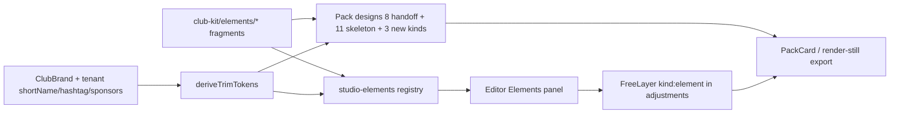

# Club Kit Design Pack and Studio Element Library - Plan

## Status (29 Sep 2026)

Implemented: U1–U10 and U3b (Club Kit pack with all 17 existing kinds plus the three new ones, Catches leaderboard, element library with 29 elements, ad-hoc starters, stacking order, sponsor lock on the sponsor-strip element). Deviations from the plan: Club Kit is authored in card cqmin with its own per-format markup rather than on the skeleton's auto-fit body (KTD1 fallback), and the three new kinds are Club Kit-only (no Broadcast Dark reference designs; `PACK_ONLY_KINDS` in `pack-lint.test.ts`). Game-day prefill from fixtures is built (pick an upcoming round; senior and junior grades are separate rounds). A trading-card prefill from career stats is not built yet (manual entry works). U11 (per-photo focal point) is not started.

## Goal Capsule

- **Objective:** Ship the "Club Colours" design handoff as the **Club Kit** pack (8 card kinds × 4 formats = 32 templates) in the Social Media Studio, and make every element of it (trim photo frames, crest watermark, monogram, kind chip, tricolour rule, hashtag block, sponsor strip, score bars, leader rows, game-day rows, XI list, trading-card frame, premiership stars and GF panel, junior highlight rows, background) insertable from the Studio editor's Elements panel when an ad-hoc design is created.
- **Product authority:** Ash (owner). The handoff (`docs/design-handoffs/club-colours-pack/Handoff.md`) is the product contract for look and behaviour. This plan governs how.
- **Open blockers:** None. D1 (Club Kit), D2 (always club colours), D3 (junior photos) and D4 (catches now) are all resolved.
- **Stop conditions:** Stop and ask before any prod migration (only U11 has one), before changing a Halls Head-parity digest for an existing pack, and if a unit would make any existing pack's "Pack's own look" render change.
- **Execution profile:** One PR per unit, each shippable. Pack PRs follow the catalogue convention (one commit per card). Element-library PRs land behind nothing: the Elements panel just gains categories.

---

## Product Contract

### Summary

A new pack where every colour comes from the tenant's brand tokens, with contrast-safe derived variables (`--pt`, `--onp`), square corners, full-colour photos in a diagonal "club-kit" frame, and Barlow Condensed / IBM Plex type. It covers result, milestone, club leaders, game day, team list, trading card, premiership and juniors in square, portrait, story and landscape. Each visual building block is also a reusable Studio element, authored once and shared by the pack templates and the editor, so an ad-hoc design can mix them freely.

### What exists today (research, 29 Sep 2026)

- **Packs** are HTML templates (`{{field}}`, `data-slot`, `data-repeat`) built with the skeleton kit (`pack-templates/skeleton-kit.ts`, `shared.ts:133 skeletonCard`, per-kind bodies in `skeleton-designs.ts`). Five packs are registered (`pack-templates/registry.ts`), and each one is mirrored by an entry in api-server `lib/design-packs.ts PACKS`. `ensurePackTemplates` creates the `card_templates` rows per tenant on first request, so no migration or seed is needed.
- **Rendering** runs in real Chromium (server harness `pages/card-render-harness.tsx` + puppeteer). `clip-path`, gradients, `color-mix()` and container units all work in both preview and export.
- **Fonts:** Barlow Condensed (500–800), IBM Plex Sans and IBM Plex Mono are already loaded (`index.html:44`). **Barlow Condensed 900 is not loaded**, and the handoff uses it heavily.
- **Ad-hoc designs:** `POST /social-drafts` creates `engine:"adhoc"` drafts. `EditorStarters` offers "Open in editor", "Blank canvas" and "Your templates". The editor document is `CardAdjustments` holding `FreeLayer[]` (`pack-render/adjustments.ts:27-69`), rendered as an absolute overlay above the pack HTML. There is no HTML-to-layers conversion (KTD12 of the 2026-09-24 plan: the editor overlays, it does not decompose).
- **Elements panel** (`studio-editor/panels.tsx:192-240`) has five hard-coded shapes; the comment reads "full element library is U17". `FreeLayer.style` has no clip-path, border, shadow or gradient controls, and there is no layer reordering.
- **Kinds:** 17 `ShareCardInput` kinds (`share-card/types.ts`, openapi enum `openapi.yaml:11093`). Handoff mapping:

| Handoff                          | Existing kind                                                   | Gap                                           |
| -------------------------------- | --------------------------------------------------------------- | --------------------------------------------- |
| result                           | `matchSummary`                                                  | none                                          |
| milestone                        | `milestone`                                                     | none                                          |
| leaders                          | `clubLeaderboard` (Runs / Wickets designs; Dismissals data)     | Catches-only category is new (U3b)            |
| team                             | `teamList` (maxRows 12)                                         | none                                          |
| premiership                      | `premiership`                                                   | may need `flagCount` / GF fields              |
| matchday (all grades this round) | **none** (`matchDay` is one fixture)                            | new kind                                      |
| trading                          | **none** in packs (a separate React trading-card system exists) | new kind                                      |
| junior                           | `junior: true` flag on 8 kinds                                  | "Juniors shine" highlights layout has no kind |

- **Name collision:** every pack already has a per-pack colour-mode switch labelled "Club colours" / "Pack's own look" (`design-packs-section.tsx:24-53`, `PackColourMode`). A pack named "Club Colours" would read "Club Colours: use club colours", and could be switched to "Pack's own look", which contradicts its purpose.
- **Photos:** `club_photos` stores no focal point; focal points exist only per draft (`adjustments.photo[size]`). **There is no junior photo-consent data.** Junior cards never get a photo today (`card_photo_rules.ts:23`).

### Requirements

- **R1** Register the pack (client registry + server `PACKS`, kept in step by `pack-coverage-parity.test.ts`) with all 32 handoff templates at the handoff's fidelity (§2–§5).
- **R2** Derive every colour from `ClubBrand` using the handoff's rules (§1): `--base`, `--base2`, `--p`, `--s`, `--onp` (WCAG pick), `--pt` (lighten in 22% steps until 4.5:1, max 6), `--glowc`, `--chalk`, `--chalk2`, `--panel`, `--line`. No Halls Head literal and no raw hex outside documented pack tokens (pack-lint).
- **R3** Cover every remaining kind (debut, century, fiveFor, record, player, gradeLeader, weekendWrap, ladder, bigMoment, newSigning, countdown) in the same look, so switching a tenant to this pack never falls back to another pack for a kind. The skeleton bodies are reused where the handoff is silent.
- **R4** Add new kinds for game day (all grades this round), trading card and juniors highlights, flowing through openapi → codegen, sample inputs, card-kind picker, prefill and auto-draft where the data exists.
- **R5** Every named element in the handoff §6 ("Photo", "Trim", "Crest", "Kind chip", "Headline", "Score bar (home/away)", "Sponsor strip", "Hashtag") and every §5 data block is a Studio element. Each can be inserted into any ad-hoc design (blank canvas or on top of any pack), recoloured through brand tokens, positioned per format, and bound to live card data where the source kind provides it.
- **R6** Elements are authored once. The pack templates and the element renderer call the same fragment functions, so they can't drift.
- **R7** Ad-hoc creation offers the 32 designs as starting points ("Start from a Club Kit design"), plus a "Club Kit background" blank canvas.
- **R8** Juniors: first name + surname initial only; the junior palette is forced; no identifiable-child photo unless consent exists (and today none does). Juniors isolation (`/api/juniors/*` only) is preserved.
- **R9** Auto-fit: long club names ellipsize, and `tenants.shortName` (already a column) feeds tight slots. With no crest, the watermark is hidden and the monogram disc is shown.
- **R10** Result states WIN / LOSS / DRAW / TIE / NO RESULT. The club always stays on the top `--p` bar.
- **R11** Existing packs' "Pack's own look" digests stay byte-identical. Empty adjustments render byte-identically (`isEmptyAdjustments`).

### Decisions needed from Ash

- **D1 — Name and id. RESOLVED (Ash, 29 Sep 2026):** display name **"Club Kit"**, `packId: "club-kit-v1"`. The handoff's "Club Colours" name stays only as the design-handoff folder name, because it collides with the per-pack "Club colours" colour-mode switch.
- **D2 — Colour mode. RESOLVED (Ash, 29 Sep 2026): Club Kit always uses the club's colours.** The per-pack "Club colours" / "Pack's own look" switch is hidden for this pack. A new optional `PackManifest.colourMode: "club-only"` makes `packColourModeFor` ignore any stored `pack` setting for it, and `design-packs-section.tsx` omits the switch. A neutral fallback palette (amber `#FBAC27` / slate `#333F48` / ink `#10151B`, with no Halls Head identity) is used **only** when a club has no usable brand colours, so a brandless club never renders a blank card. `pack-own-look-parity.test.ts` treats `club-only` packs as a documented exception: a branded render must follow the brand, and a brandless render must match the fallback digest.
- **D3 — Junior photos. RESOLVED (Ash, 29 Sep 2026): recommendation accepted.** _Recommended:_ ship with junior cards using a club action/team photo picked by an admin (never a player-tagged junior photo), and defer a consent model to its own plan. The handoff's "parent consent" rule then becomes "no player-linked junior photo until consent data exists".
- **D4 — Leaders metric. RESOLVED (Ash, 29 Sep 2026): build catches now and have it ready to go.** Club Kit ships Runs, Wickets, **Catches** and **Dismissals** leader designs. `Dismissals` (catches + stumpings, "SAFE HANDS") already exists end to end (`ClubLeaderboardCategory`, `central/leaderboards.ts` `topDismissals`). `Catches` is new (catches only; see U3b). Both read through the existing stats path, so when the catches rule in the hybrid-stats plan (U15) changes how catches are counted, the cards follow with no pack change.

### Scope boundaries

- In: the pack, three new kinds, the element library in the editor, ad-hoc starters, the Barlow 900 font, and optional per-photo focal points (U11).
- Out: converting existing packs into elements (the library structure allows it later), a junior consent model, the legacy CardLayoutLayer / canvas path (clear-only per U18c), mobile app card rendering, and billing/entitlement gating of the pack (entitlements are dormant; the pack is available to all plans until 2c goes live).

---

## Planning Contract

### Key Technical Decisions

- **KTD1 — Build on the skeleton kit with a bespoke look, not a hand-written Broadcast-Dark-style pack.** The skeleton already provides the header (crest, name, tagline, kind chip), body box, footer (rule, sponsors, hashtag), native landscape, the contract tests (`describeSkeletonPack`) and field-key parity. The handoff's anatomy maps onto it: `PackLook.vars` for tokens, `PackLook.layers(photo, deco)` for background + watermark + trim + photo frame, and `bodyStyle`/`column` for the per-format body placement (§4). Where the skeleton's fixed pieces differ from the handoff (tricolour rule 6/1/3, notched chip, solid hashtag block), add **optional hooks** to `PackLook` (`footerRule`, `chip`, `hashtag`) whose default output is byte-identical for existing packs. _U1 is a spike that proves this on `matchSummary`; if the skeleton root/body string contract can't hold the trim geometry, fall back to a pack-local frame and a local contract test._
- **KTD2 — One fragment module, two consumers.** `pack-templates/club-kit/elements/*.ts` exports pure functions `(opts) => html` for each element: `trimFrame`, `watermarkCrest`, `monogram`, `kindChip`, `tricolourRule`, `hashtagBlock`, `sponsorStrip`, `scoreBars`, `leaderRows`, `gradeRows`, `xiList`, `tradingFrame`, `premStars`, `gfPanel`, `juniorRows`, `headline`, `eyebrow` and `background`. Pack designs compose them with `{{field}}` placeholders. The element renderer calls the same functions with concrete values. This satisfies R6 and mirrors how `layer-kinds.ts` renders charts, medals and stickers.
- **KTD3 — Colour derivation lives in the renderer, not the markup.** Add `deriveTrimTokens(brand, {junior})` in `pack-render/tokens.ts` (WCAG helpers already exist there for `clubStageInk`; reuse them, and add `mix`). It emits the handoff variables as `--ck-*` CSS custom properties on the card root **only when the active pack declares them** (a new optional `PackManifest.tokens` hook), so other packs' root style is untouched (R11). Elements inserted on other packs get the same variables from the element layer's own wrapper, computed from `data.brand`, so a Club Kit score bar looks right on a Sunset card.
- **KTD4 — New FreeLayer kind `"element"` rather than new style primitives.** `{ kind:"element", elementId, props, bind? }`: the renderer looks up `elementId` in a registry and calls the fragment. This avoids widening `FreeLayer.style` with user-controlled `clip-path` / `background` CSS: element HTML is trusted repo code, and user input only arrives through `props`, which are escaped text, token names from an allow-list and numbers. The server stores adjustments opaquely (`additionalProperties:true`), so no codegen or migration is needed. `cssValue` sanitising stays as it is.
- **KTD5 — Element registry is generic, with the pack as its first contributor.** `lib/studio-elements/registry.ts` holds `ElementDef = { id, category, packId?, label, keywords, defaultBox(size), props schema, dataKinds?, fromInput?(input) , render(props, ctx) }`. The categories are **Backgrounds & frames**, **Brand**, **Headlines**, **Match data**, **Leaders & lists**, **Collectables** and **Juniors**. `ElementsPanel` renders the catalogue with search, category tabs and live thumbnails (the `renderFreeLayers` of a single element on a sample input). The five existing shapes move into the registry as `basic/*` so nothing is lost.
- **KTD6 — Data binding for composite elements.** An element with `dataKinds` (e.g. score bars → `matchSummary`) pre-fills its props from the draft's `cardInput` via `fromInput`, and stays live while `bind:true`. When the draft kind doesn't match (e.g. score bars on a blank canvas), it inserts with sample props from `sampleCardInput(kind)` as editable text, clearly marked "sample" in the layers drawer. Repeating rows (leaders, grades, XI, juniors) are props arrays, capped at the handoff maxima (5 / 5 / 12 / 3).
- **KTD7 — Sponsor lock extends to element layers.** A `sponsorStrip` element reads `data.sponsors`. While `sponsorLock` is on, it can't be hidden or deleted (`document.ts:158` gains an element check). This keeps the commercial guarantee the lock gives template slots.
- **KTD8 — New kinds are additive to the openapi enum.** `roundFixtures` (game day, all grades), `tradingCard` and `juniorHighlights`. Existing packs get a Broadcast Dark reference design for each (required by pack-lint field-key parity) and skeleton designs for the other four packs, so R3's "no fallback" holds for every pack, not only the new one. `roundFixtures` reads the `fixtures` table (PlayHQ fixtures are already projected). `tradingCard` reads player career data through `central-queries.ts` (never a new direct central read). `juniorHighlights` reads only `/api/juniors/*` data and applies first-name + initial masking server-side in prefill.
- **KTD9 — Font.** Add `900` to the Barlow Condensed Google Fonts request in `index.html` (the server harness shares it). This is cheap, and everything else is already loaded.

### High-level design

### Sequencing

U1 → U2 → (U3, U3b, U4, U5 in parallel) → U6 → U7 → U8 → U9 → U10. U11 is independent and optional.

---

## Implementation Units

### U1. Spike: tokens + trim frame on the skeleton (matchSummary only)

- **Files:** `pack-render/tokens.ts` (`deriveTrimTokens`, `mix`, contrast reuse), `pack-templates/types.ts` (optional `tokens`, `footerRule`, `chip`, `hashtag` hooks), `pack-templates/skeleton-kit.ts` (hooks with byte-identical defaults), `pack-templates/club-kit/elements/{background,trim-frame,watermark,monogram,kind-chip,tricolour-rule,hashtag,sponsor-strip}.ts`, `index.html` (Barlow 900).
- **Tests:** `deriveTrimTokens` unit tests against the handoff cases (HHCC amber → `--onp` = ink; red/navy demo; purple override; dark primary gets `--pt` lightened, each ≥ 4.5:1). Existing `pack-own-look-parity` digests unchanged.
- **Done when:** a matchSummary square + portrait + story + landscape renders in the harness matching screenshots 01/02, and all existing pack tests are green.

### U2. Register the pack with the 8 handoff designs

- **Files:** `pack-templates/club-kit/{index,fragments}.ts` + `match-result.ts`, `milestone.ts`, `club-leaderboard-runs.ts`, `club-leaderboard-wickets.ts`, `team-list.ts`, `premiership.ts`; `registry.ts`; api-server `lib/design-packs.ts` `PACKS`; `social-studio.ts` `PACK_SWATCH`; the `PACK_IDS` arrays in `pack-render.test.ts` and `admin-social-studio.test.tsx`; `pack-switch.test.ts` `PACK_MARKERS`; new `club-kit-skeleton.test.ts`; `pack-own-look-parity` club-only exception + brandless fallback digest; `colourMode: "club-only"` in the manifest and `design-packs-section.tsx` hiding the switch (with an `admin-social-studio-colour-mode.test.tsx` case).
- **Per-format rules:** side frame (square/landscape) vs top frame with the H table (story 46cqh; portrait 24cqh for list-heavy kinds, 31cqh otherwise); body max-width 52% on side formats; `--msSz`/`--premSz`/`--mdSz` per format.
- **Result states (R10)** from `matchSummary` result fields; winning-side ordering kept with the club on the `--p` bar.
- **Done when:** the pack appears in Design packs for every tenant after restart, and pack-lint, coverage parity, skeleton contract and switch tests pass. One commit per card.

### U3. Remaining kinds in the pack look (R3)

- Skeleton body builders from `skeleton-designs.ts` for debut, century, fiveFor, record, player, gradeLeader ×2, weekendWrap, ladder, bigMoment, newSigning and countdown, each wrapped in the Club Kit look (frame, chip, footer). Landscape caps from the contract (ladder 5, leaderboard 5).
- **Done when:** every one of the 17 existing kinds renders natively in all four formats.

### U3b. Catches leaderboard (D4)

- **Data:** add a catches-only aggregate beside `fieldAgg` in `lib/db/src/central/leaderboards.ts` (`topCatches`: fielding catches, excluding stumpings and fill-ins `playerId >= 90000`), exposed through `central-queries.ts` and the club season totals route. Add `topCatches` to the openapi response schema and run codegen.
- **Kind:** extend `ClubLeaderboardCategory` with `"Catches"`. Update `CLUB_LEADER_COPY` ("CLUB / CATCHERS", "Most catches in each grade"), `descriptors.ts` `LEADER_CATEGORIES`, the prefill category select, and `categoryPreset` in `pack-templates/types.ts` (`"Runs" | "Wickets" | "Catches" | "Dismissals"`).
- **Designs:** `club-kit/club-leaderboard-catches.ts` and `club-leaderboard-dismissals.ts`, plus Broadcast Dark reference designs for both presets so pack-lint field parity holds. Other packs fall back to their Dismissals/Runs design until they get their own.
- **Tests:** a central leaderboard test where a keeper's stumpings count in Dismissals and not in Catches; a fill-in never leads; prefill tenant isolation; pack-lint and coverage parity.
- **Done when:** an admin can pick Catches on the Leaders card, it prefills per grade, and it renders in all four formats.

### U4. New kind `roundFixtures` (game day, all grades)

- openapi enum + `RoundFixturesInput` schema (date, round, rows: grade, opponent, venue, start time; ≤5) → codegen; `share-card/types.ts`, `CARD_KINDS`, `sample-card-inputs.ts`, `card-kind-picker.tsx`, `create-hero.tsx`; prefill in `routes/social-prefill.ts` from `fixtures` for the tenant's round; optional auto-draft engine hook in `lib/engines/match-day.ts` (one card per round, not per grade).
- Designs: Club Kit bespoke (GAME / DAY, grade tiles) + a Broadcast Dark reference + skeleton designs for the other packs.
- **Tests:** prefill tenant isolation; pack-lint parity; an engine test that a round with 4 grades yields one draft.

### U5. New kinds `tradingCard` and `juniorHighlights`

- `tradingCard`: cap number, name, role, 4 stats, `cardPhoto` slot (headshot/action via `club_photo_players`). Prefill via `central-queries.ts` career views (respect `is_private`; exclude fill-ins `playerId >= 90000`). Inner card: 5:7, `--p` border, −3° rotation, shadow; centred in tall formats and left-aligned in square/landscape.
- `juniorHighlights`: grade, round, ≤3 rows (name, note, figure). Prefill from `/api/juniors/*` only; names masked to "First S." server-side; the junior palette is forced; privacy footnote is fixed copy; photo slot per D3.
- Plus the `junior:true` path of every Club Kit design swaps `--base`/`--s` per §1 (the flag already exists on 8 kinds).
- **Tests:** a junior prefill never returns a full surname; `tradingCard` excludes private players; parity tests.

### U6. Element registry + `FreeLayer` kind `"element"`

- **Files:** `lib/studio-elements/{registry,types,index}.ts`; `pack-render/adjustments.ts` (`FreeLayer` union + `layerInner` branch that wraps output in a `container-type:size` box carrying `--ck-*` tokens from `data.brand`); `studio-editor/document.ts` (sponsor-lock rule KTD7); move the five shapes into `basic/*`.
- **Security:** props are validated against each element's schema (text is escaped, colours come from the token allow-list `p|s|chalk|base|onp|pt` or a `#rrggbb` checked by regex, numbers are clamped). An unknown `elementId` renders nothing and logs once.
- **Tests:** round trip through `PATCH /social-drafts/:id` (opaque storage); the server harness renders an element layer identically to the client; `isEmptyAdjustments` is unchanged; a malicious prop (`
<script>`) is escaped.

### U7. Register every Club Kit element (R5)

- Backgrounds & frames: background (base gradient + glow), side trim frame, top trim frame (with photo slot + focal/zoom props), trim stripes only.
- Brand: crest, watermark crest, monogram disc, club name lockup, kind chip (editable label), tricolour rule, hashtag block, sponsor strip (live).
- Headlines: eyebrow, big headline (WIN / GAME DAY / THE XI / PREMIERS / JUNIORS SHINE with a `--pt` second line), milestone number + stat label.
- Match data: score bars (home/away, `matchSummary`), margin + top-performers line.
- Leaders & lists: leader rows with value bars (`clubLeaderboard`/`gradeLeader`), game-day grade rows (`roundFixtures`), XI list (`teamList`).
- Collectables: trading-card frame (`tradingCard`).
- Premiership: stars, "PREMIERS" lockup, GF panel.
- Juniors: highlight rows (masked names enforced in the element too), privacy footnote.
- Each element gets a `defaultBox` per format taken from the handoff geometry, so an inserted element lands where the pack puts it.
- **Done when:** a test enumerates `listElements()` and renders each one on a blank card and on a Sunset card at 4 formats with no placeholders or NaN geometry.

### U8. Elements panel UI

- `studio-editor/panels.tsx` `ElementsPanel` → catalogue: category tabs, search on label/keywords, thumbnails (cached per brand, rendered with `sampleCardInput`), a "live" badge when the element binds to the current draft kind, and click-to-insert or insert-as-group.
- Toolbar: element props editor (text fields, token colour chips, row editor for arrays), plus **Bring forward / Send backward / To front / To back** (new `reorderLayer` in `document.ts`, which the editor lacks today).
- Layers drawer shows element names from the handoff §6 vocabulary.
- **Tests:** `studio-tools.test.tsx`-style RTL tests for search, insert, reorder and sponsor-lock blocking hide.

### U9. Ad-hoc starters (R7)

- `editor-starters.tsx`: "Start from a design", a picker of all 32 Club Kit templates (kind × format thumbnails). Picking one creates the draft with `packId: club-kit-v1`, the kind's sample or prefilled `cardInput`, and the chosen format. Also a "Club Kit background" blank canvas: `BLANK_PACK_ID` + a pre-inserted background element.
- `admin-social-create.tsx` passes the selected format through.
- **Tests:** extend `editor-starters.test.tsx` and `social-drafts-adhoc.test.ts` (draft carries the packId and adjustments; tenant isolation of templates unchanged).

### U10. Editor fidelity fixes the pack depends on

- `canvas.tsx:202` / `admin-studio-editor.tsx:329` hard-code `junior={false}`; pass the draft's junior flag so junior Club Kit cards preview in the junior palette.
- Update `.agents/memory/social-studio-template-model.md` and add `.agents/memory/studio-elements.md` (registry, `kind:"element"`, single-source fragments, token wrapper).

### U11. (Optional) Per-photo focal point

- Migration: `club_photos.focal_x`, `focal_y` (nullable real). Photo library UI sets it; pack photo slots and trim-frame elements default to it when a draft has no per-format override. **Needs Ash's yes before the prod migration.**

---

## Verification Contract

- `pnpm --filter @workspace/cricket-club test` (pack-lint, registry, parity, switch, skeleton contract, element registry) and `pnpm --filter @workspace/api-server test` (coverage parity, prefill, adhoc drafts).
- `pnpm --filter @workspace/api-spec run codegen` after U4/U5, then typecheck across the workspace.
- A visual check in the harness for each of the 32 handoff templates against `docs/design-handoffs/club-colours-pack/screenshots/`, for Halls Head, a brandless tenant and a dark-primary tenant.
- Contrast assertion: for 20 random brand pairs, every `--pt` on `--base` and `--onp` on `--p` is ≥ 4.5:1.

## Definition of Done

- The pack is selectable by every tenant, renders all 17 + 3 kinds natively in 4 formats, and passes every pack contract test. Existing packs' own-look digests are unchanged.
- Every element listed in U7 can be inserted from the Elements panel into a blank or pack-based ad-hoc design, edited, reordered, saved as an editor template, and exported to PNG identically to its preview.
- Juniors: no full surname and no player-linked junior photo can reach a rendered card.
- No Halls Head literal in pack code (the handoff's sample assets stay in `docs/design-handoffs/` only).
