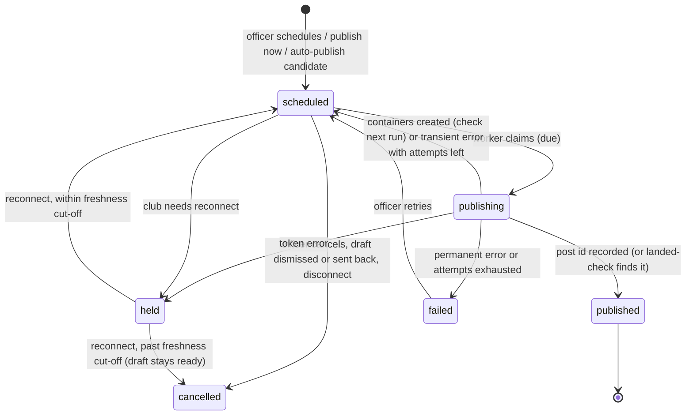

# Meta Scheduled Publishing - Plan

## Goal Capsule

- **Objective:** A club connects its Facebook Page and Instagram professional account once, and Social Studio drafts publish to both — at a time the officer sets, or automatically at the auto-post deadline — with retries, per-platform status and failure alerts.
- **Origin:** R30 of `docs/plans/2026-09-24-001-feat-social-studio-automation-plan.md` (the deferred "Meta posting" milestone), scoped in a brainstorm on 2026-10-06 and revised after document review the same day.
- **Product authority:** Ash (Ovation owner, Halls Head media officer). The Product Contract below is authoritative; the Planning Contract is the implementer's baseline and may be refined where code disagrees.
- **Execution profile:** Eleven units, each its own PR in dependency order. Prod schema changes arrive only when merged `main` is published. The Replit agent migrates the dev DB and reads prod, and prod's real tables are verified after publish. Publishing stays behind a platform kill switch until Meta grants Advanced Access.
- **Open blockers:** None for building and testing. Going live for clubs other than Halls Head waits on Meta Business Verification and App Review (external, Ash-owned).
- **Stop conditions:** Stop and ask if implementation shows the Meta app cannot use one platform-level OAuth redirect host for all tenants, or if Page tokens issued via Facebook Login for Business expire on a schedule rather than only on revocation.

---

## Product Contract

### Summary

Social Studio gains a direct Meta connection. Ready drafts publish to the club's Facebook Page and Instagram account as single images, carousels or Stories. Clubs choose per club between auto-publish at the auto-post deadline (fresh drafts only) and officer-set schedules. Ovation runs its own scheduler, and the publish step sits behind one destination boundary so a posting aggregator can stand in if Meta review stalls.

### Problem Frame

Social Studio now drafts a round's cards automatically and hands the officer a post pack, but the last step is still manual: download or share-sheet each image, open Instagram and Facebook, paste captions, every round. The auto-post window shipped in September only flips drafts to "ready" and emails the officer — R30 promised that it would post for real once Meta posting existed. For a volunteer media officer, the weekend posting chore is the part that still costs evenings.

### Actors

- A1. Club admin (any tenant admin, typically the media officer) — connects the club's Meta accounts, schedules or lets drafts auto-publish, handles failures.
- A2. Meta (Facebook Pages API, Instagram Content Publishing API) — accepts or rejects posts; can revoke access at any time.
- A3. Ovation platform owner (Ash) — owns the Meta app, its review, the kill switch and the scheduled jobs.

### Requirements

**Connection**

- R1. Any club admin can connect one Facebook Page and its linked Instagram professional account, or disconnect them at any time. Replacing an existing connection needs an explicit confirmation.
- R2. The connection's health is checked daily and shown. When Meta revokes access, the club sees "reconnect needed" in-app and by email, and nothing publishes until it reconnects.
- R16. While a club needs to reconnect, its scheduled posts are held rather than failed. After reconnect they publish on the next run, except those now past the freshness cut-off, which return to ready.

**Scheduling modes**

- R3. The officer can schedule a ready draft for a date and time in club time, or publish it now, and can reschedule or cancel until publishing starts.
- R4. A club setting turns on auto-publish (needs a connection and auto-post on): drafts reaching their auto-post deadline publish instead of only becoming ready.
- R5. Auto-publish applies only to drafts first imported within a club-set freshness cut-off. A later corrective re-import does not restart that clock. Older drafts become ready as today, and this also holds at the moment auto-publish is switched on.
- R6. Junior drafts and ad-hoc drafts never auto-publish; the officer can still schedule them.

**Post types and destinations**

- R7. A draft publishes as a single image to both feeds, a multi-image pack as an Instagram carousel and a Facebook multi-photo post, and story-size images as Instagram and Facebook Stories.
- R8. Each draft goes to the Page and the Instagram account by default; the officer can untick either, and each platform succeeds or fails on its own with its own status.
- R17. The officer can schedule one draft as a feed post, a Story or both. Auto-publish posts the feed version only.
- R9. What publishes is the draft's latest content at publish time, with a caption per platform.

**Failures and lifecycle**

- R10. Transient failures retry automatically; after the last attempt the platform shows failed with a reason, A1 gets an in-app and email notice, and a one-click retry is available.
- R11. A retry never produces a duplicate post.
- R12. A draft becomes posted once everything it was scheduled for has published. Posted drafts keep the existing "data changed since posting" notice, and Ovation does not edit or delete live Meta posts.
- R18. A draft where something published and something failed for good stays ready and is listed on the admin hub's needs-attention panel until the officer retries, cancels the failed part or marks it posted.
- R13. Dismissing or sending back a draft cancels its pending publications.

**Boundary and governance**

- R14. The publish step sits behind one destination boundary so a posting aggregator can replace the Meta adapter without touching scheduling.
- R15. Clubs publishing their own results to their own accounts is not treated as commercialising scraped data; project governance text is updated to say so.
- R19. Meta publishing is its own plan feature, separate from Social Studio, so it can be priced independently later.

### Acceptance Examples

- AE1. **Covers R4, R5.** Given auto-post on with a 12-hour window, auto-publish on and a 24-hour freshness cut-off, when a Saturday 6pm import's drafts go unreviewed, then around 6am Sunday each publishes to both platforms and A1 gets one "published" notice for the batch.
- AE2. **Covers R5.** Given auto-post is on and drafts first imported 3 days ago and 6 hours ago are both already ready past their deadline, when A1 turns auto-publish on, the 6-hour-old drafts publish on the next run and the 3-day-old drafts stay ready without publishing.
- AE3. **Covers R8, R10, R18.** Given a draft for both platforms, when Facebook publishes and Instagram fails transiently on every attempt, then Facebook shows published, Instagram shows failed with its reason, the draft is ready (not posted), it appears on needs-attention, A1 gets one notice, and retry publishes to Instagram only.
- AE4. **Covers R2, R16.** Given the Page token is revoked, when the next publication runs, the connection flips to "reconnect needed" and that publication is held along with the club's other due posts, with no Meta calls. After reconnect, held posts within the freshness cut-off publish on the next run and older ones return to ready.
- AE5. **Covers R6.** Given auto-publish on, when a junior team-list draft reaches its deadline, it becomes ready and is not published.
- AE6. **Covers R9.** Given a draft scheduled for 7pm, when a re-import corrects its score at 5pm, the 7pm post shows the corrected score.
- AE7. **Covers R11.** Given a publish call times out after Meta has published, on Instagram or Facebook, when the retry runs, it records the existing post as published and makes no second post.
- AE8. **Covers R5.** Given a draft first imported 3 days ago, when a re-import corrects it today with auto-publish on, it does not auto-publish.
- AE9. **Covers R12, R17.** Given a draft scheduled as both feed and Story to both platforms, when all four publish, the draft is posted; when only the feed posts have published, it is not yet posted.

### Success Criteria

- With auto-publish on, a round's fresh drafts reach both platforms with no officer action.
- A scheduled post goes out within the publish cadence (five minutes) of its time; if the fallback trigger is used, typically within 15 minutes.
- No duplicate posts in pilot use; every failure leaves a visible reason and a working retry.
- A revoked connection is visible to the club within a day, before the next scheduled post fails.

### Scope Boundaries

**Deferred for later**

- Video and Reels publishing; the MP4 export stays a manual share.
- X, TikTok, LinkedIn and the clubroom TV feed.
- Editing, deleting or re-posting a live Meta post; post analytics and insights.
- Batch scheduling across many drafts at once, and weekly posting slots.
- More than one Page or Instagram account per club.
- Per-admin publisher roles; any club admin can connect and publish.
- Auto-publishing Stories.

### Dependencies / Assumptions

- Meta Business Verification and App Review (Advanced Access for `pages_manage_posts`, `pages_read_engagement`, `pages_show_list`, `instagram_basic`, `instagram_content_publish`) gate every club whose admins hold no role on the Ovation Meta app. Before that, only app-role users (Ash for Halls Head) can connect — enough for the pilot.
- Instagram allows 100 API-published posts per account per rolling 24 hours; club volumes sit far below this.
- Private-player handling is inherited from drafting: the drafters already carry each player's private flag (`artifacts/api-server/src/lib/match-summary-drafter.ts`), so publishing adds no separate privacy filter.

### Sources

- Meta Instagram content publishing: https://developers.facebook.com/docs/instagram-platform/content-publishing
- Meta Pages posts and photos: https://developers.facebook.com/docs/pages-api/posts, https://developers.facebook.com/docs/graph-api/reference/page/photos
- Page Stories: https://developers.facebook.com/docs/page-stories-api
- Facebook Login for Business: https://developers.facebook.com/docs/facebook-login/facebook-login-for-business
- Long-lived and Page tokens: https://developers.facebook.com/docs/facebook-login/guides/access-tokens/get-long-lived
- Graph API error handling: https://developers.facebook.com/docs/graph-api/guides/error-handling
- Data deletion callback: https://developers.facebook.com/docs/development/create-an-app/app-dashboard/data-deletion-callback

---

## Planning Contract

Product Contract preservation: changed R1, R2, R5, R12 and AE2–AE4, AE7, and added R16–R19, AE8 and AE9. These record the product decisions Ash made while resolving the document review on 2026-10-06.

### Key Technical Decisions

- KTD1. **Facebook Login for Business, Page token stored, user token discarded.** One connection covers the Page and its linked Instagram account; Instagram publishing uses the Page token. The long-lived user token is exchanged once to list Pages and is never persisted. Between the callback and the admin's Page choice, only the candidate Pages' tokens are held, encrypted, in a pending-choice record. That record is bound to tenant and admin, expires after about 10 minutes and is deleted on use. The chosen Page's token (no expiry, dies only on revocation) is then stored.
- KTD2. **Tokens encrypted at rest with a managed app-level key.** AES-256-GCM. The key is 32 random bytes held only in Replit Secrets, separate from the Meta app secret, and never logged or present in dev or CI fixtures. The DB holds ciphertext, IV and key version. Rotation re-encrypts all rows under a new version while the old key stays loadable for decryption. Startup fails closed when publishing is enabled and the key is missing.
- KTD3. **One platform-level OAuth callback host, hardened state.** Meta needs registered redirect URIs, and tenants live on subdomains and custom domains. The connect flow redirects through a single callback on the platform host. The signed, expiring `state` carries tenant, admin, return URL and a nonce, and the nonce is also set in a short-lived HttpOnly cookie and consumed on first use. The return URL must be one of the tenant's known hosts. On both callback and Page choice, the admin is re-checked as a current admin of that tenant.
- KTD4. **Publications are their own rows, one per draft, platform and post type.** A row carries platform, post type (`feed` or `story`), scheduled time, status, attempt count, next attempt time, last error, Meta container and photo ids, and the external post id. Statuses are `scheduled`, `held`, `publishing`, `published`, `failed` and `cancelled`. Draft status stays `awaiting_review | ready | posted | dismissed`. A draft becomes `posted` when all its non-cancelled publications are `published`. A draft with a final `failed` row and at least one `published` row stays ready and surfaces on needs-attention (R18).
- KTD5. **Ovation's own publish worker, every five minutes.** Instagram has no API scheduling, so Facebook's native scheduling is not used either — one model for both. A new internal endpoint uses its own secret, distinct from the draft-sweep secret, with a constant-time comparison. It fails closed when the secret is unset. It runs single-flight with a per-run cap on rows and renders. A Replit Scheduled Deployment calls it every five minutes, and the scheduled draft sweep calls it at its end. Autoscale scales to zero, so there is no in-process timer.
- KTD6. **Claim with a guarded update; persist an id before anything goes live.** The worker claims a publication with a conditional update: either `scheduled` and due, or `publishing` with a stale lease. The lease is longer than one render plus one Meta call. Every post type persists a Meta id before the step that makes it live:
  - Instagram persists container ids.
  - Facebook uploads every photo unpublished and persists the photo ids, then publishes. A single photo uses `/{page}/feed` with one `attached_media`, and a Story uses `photo_stories`.
  - Before re-running a publish step, the worker runs the adapter's landed-check: Instagram container `status_code`, Page feed posts, or Page stories, matched on the stored ids.
  - The external post id is the done marker (R11, AE7).
- KTD6a. **Instagram container status is checked across runs, not polled inside one.** After creating containers, the worker persists their ids and returns the row to `scheduled` with `next_attempt_at` about a minute ahead. Later runs check status once each and publish on FINISHED. Five minutes after the container was created, the attempt counts as transient. A retry for R9 re-renders and creates new containers rather than reusing expired ones.
- KTD7. **Render at publish time, as JPEG, at an unguessable public URL, then clean up.** The worker renders through the existing post-pack path (`renderCardStill` via the Puppeteer harness). It converts each image to sRGB JPEG under 8 MB with `sharp` and stores it under a tenant-scoped prefix with a random 128-bit key. Absolute URLs come from a new public-origin env var. The images are deleted a short grace after the publication reaches `published`, final `failed` or `cancelled`. Feed posts use the club's portrait size if enabled, else square; Stories use the story size; landscape is not published.
- KTD8. **Carousels follow the post-pack card-set split, capped at ten.** Multi-page drafts publish as one carousel or album. A set larger than ten images fails up front with a clear reason. Stories publish each page as its own story in order, also capped at ten.
- KTD9. **Captions per platform at publish time.** If the officer has edited the draft (`editedAt` set), its caption is used on both platforms. Otherwise the Facebook caption is rendered from the club's Facebook template with the same tokens, and Instagram uses the stored caption. Stories carry no caption.
- KTD10. **Error classes decide retries.**
  - Transient (`is_transient`, codes 1, 2, 4, 17, 32, 341, 613, 80001, 5xx, network, Instagram quota reached) retries with backoff at 5, 15 and 45 minutes, then fails.
  - Token errors (190 and subcodes) flip the connection to `needs_reconnect` and move the row and the club's other due rows to `held`, without calling Meta (R16).
  - Duplicate (506) runs the landed-check: it records published if the post is found, else fails as permanent.
  - Permission and validation errors fail at once.
- KTD11. **Auto-publish candidates come from stored state on every scheduled sweep.** After `persistDueDrafts`, the sweep selects candidates. A candidate is ready, still has `auto_ready_at` set (manual actions clear it, so this marks "auto-promoted, untouched"), and has no publication rows of any status. Its `source_imported_at` must fall within the freshness cut-off, and it must be neither junior nor ad-hoc. Candidates get feed publications for each connected platform, scheduled now. `notifyDraftsReady` covers only promoted drafts that are not candidates. This covers turning auto-publish on (AE2) and recovery from a crash between promotion and publication creation. `source_imported_at` is set only when a draft is first created (`artifacts/api-server/src/lib/draft-upsert.ts`), which gives R5's first-import rule.
- KTD12. **A destination adapter is the swap point (R14).** Scheduling, claiming, retries and status live in the worker. The adapter exposes three operations, each returning normalised error classes:
  - publish a post type with images and caption to a platform;
  - check whether a prior attempt landed;
  - check connection health.

  The Meta adapter is the only implementation in this plan.

- KTD13. **New `socialPublishing` entitlement plus platform kill switch.** The feature is on for club and pro today, like `socialStudio`, and can be re-tiered when billing wakes (R19). A platform env flag disables connect and publish everywhere and stays off in prod until Ash enables the pilot.
- KTD14. **Pinned Graph API version in config.** Default to v26.0 via config so a version bump is a config change. v26.0 is current; v25.0 runs to July 2028.
- KTD15. **Tokens never travel in URLs or text.** The Graph client sends tokens in the Authorization header or POST body, never logs request URLs or bodies, and redacts token-shaped values and `appsecret_proof` from stored `last_error` and thrown errors.
- KTD16. **Meta callbacks are strict.** Deauthorize and data-deletion handlers accept only `algorithm == HMAC-SHA256` with a constant-time signature compare. They reject stale `issued_at` and are rate-limited. They act only on connections whose stored connector Meta user id matches, across every tenant that user connected. The deletion status endpoint returns a generic status keyed by an opaque code.

### High-Level Technical Design

Publication lifecycle (one row per draft, platform and post type):



Publish run, end to end:

```mermaid
sequenceDiagram
  participant Cron as Replit schedule (5 min)
  participant W as Publish worker
  participant DB as Postgres
  participant R as Render harness
  participant S as Object storage
  participant M as Meta Graph API
  Cron->>W: POST internal publish sweep (own secret)
  W->>DB: claim due publications (guarded update, lease)
  W->>M: landed-check on stored ids (retries only)
  W->>R: render draft pages at post-type size
  R-->>W: PNGs
  W->>S: store JPEGs under random keys, build absolute URLs
  W->>M: create IG containers / upload unpublished FB photos
  W->>DB: persist container and photo ids
  W->>M: publish (IG media_publish when FINISHED; FB feed attached_media or photo_stories)
  M-->>W: post id or error
  W->>DB: published | scheduled (retry/check) | held | failed; draft posted when all done
  W->>DB: notifications (published batch, failure, reconnect)
```

Instagram steps: create a child container per image, then a carousel parent (or one image or story container), check `status_code` on later runs until FINISHED, then `media_publish`. Facebook steps: upload each photo with `published=false`, persist the ids, then post to `/{page}/feed` with `attached_media` (feed, one or many photos) or call `/{page}/photo_stories` per photo (Stories).

### Assumptions

- The freshness cut-off defaults to 24 hours after first import and must be at least the auto-post window; the API enforces this as well as the UI.
- Scheduled times are honoured to within the five-minute cadence; the UI says "around" for auto-publish times.
- Only one Page and Instagram account per club; a club with several Pages picks one during connect.
- A Replit Scheduled Deployment can run every five minutes. If not, the GitHub Actions pattern from `playhq-sync.yml` is the fallback. It is best-effort, so the cadence wording becomes "typically within 15 minutes".

### Sequencing

U1 and U2 in parallel, then U3 and U4 in parallel, then U5, U6, U7 and U8. U9 and U10 (UI) follow once their APIs land, and U11 comes last. Connect (U3) and media (U4) can ship dark behind the kill switch before the worker exists.

---

## Implementation Units

### U1. Schema: connections, pending choices, publications and settings

- **Goal:** Add the tables and settings columns the feature needs.
- **Requirements:** R1, R2, R4, R5, R8, R10, R16, R17.
- **Dependencies:** none.
- **Files:**
  - `lib/db/src/schema/social_publishing.ts` (new)
  - `lib/db/src/schema/social_cards.ts` (settings columns)
  - `lib/db/src/schema/index.ts`
  - `lib/db/migrations/0030_social_publishing.sql` (+ `meta/_journal.json`, snapshot)
  - `lib/db/src/schema/notifications.ts` (kind comment)
- **Approach:**
  - `social_connections` holds one row per tenant and provider:
    - the connector's Meta user id
    - the Page id and name, and the Instagram user id and username
    - the encrypted Page token (ciphertext, IV, key version) and granted scopes
    - status (`connected`, `needs_reconnect`, `disconnected`), the last health check and the connecting admin
  - `social_connection_pending` holds tenant id, admin id, the candidate Page list with encrypted tokens, and `expires_at`.
  - `social_publications` follows KTD4. A partial unique index allows one active publication per (draft, platform, post type), and an index on (status, next_attempt_at) serves the worker.
  - `social_settings` gains `auto_publish_enabled` (default false) and `auto_publish_freshness_hours` (default 24).
  - New notification kinds: `published`, `publish_failed` and `reconnect_needed`.
  - Every table carries a tenant id like its neighbours.
- **Patterns to follow:** `lib/db/src/schema/social_cards.ts` (tenant id column, partial indexes, check constraints); migration naming in `lib/db/migrations/`.
- **Test scenarios:** Test expectation: none -- schema and migration only; behaviour is proven by U3, U5–U7 integration tests running against the migrated schema in CI.
- **Verification:** The migration applies cleanly on a fresh CI Postgres and on the dev DB via the Replit agent. After publish, a read-only check confirms prod's tables, columns and indexes match 0030, checking the schema itself rather than the migration ledger.

### U2. Token crypto and Meta Graph client

- **Goal:** Encrypt tokens and wrap Graph API calls with normalised errors behind the destination adapter (KTD2, KTD10, KTD12, KTD14, KTD15).
- **Requirements:** R11, R14.
- **Dependencies:** none.
- **Files:**
  - `artifacts/api-server/src/lib/secret-box.ts` (new)
  - `artifacts/api-server/src/lib/publishing/destination.ts` (adapter contract)
  - `artifacts/api-server/src/lib/publishing/meta-client.ts`
  - `artifacts/api-server/src/lib/publishing/meta-adapter.ts`
  - `artifacts/api-server/src/config.ts`: new env vars for the Meta app id, app secret, login config id, token key(s), Graph version, public origin, publish-sweep secret and the publishing-enabled flag
  - Tests: `artifacts/api-server/src/lib/secret-box.test.ts`, `artifacts/api-server/src/lib/publishing/meta-adapter.test.ts`
- **Approach:**
  - `secret-box` encrypts and decrypts with a key version, loading current and previous keys.
  - The Meta client is a thin `fetch` wrapper. It pins the version, sends `appsecret_proof`, keeps tokens in headers or bodies, and redacts per KTD15.
  - Error parsing returns `transient | token | duplicate | permanent`, keeping Meta's code and message.
  - The adapter implements publish for each post type and platform using KTD6's unpublished-first Facebook flow, the landed-check per post type, the Instagram container status check, and health via `debug_token`.
  - A test seam swaps the HTTP layer, like `setEmailTransport`.
- **Patterns to follow:** `artifacts/api-server/src/lib/integrations/email.ts` (fetch client and test seam), `config.ts` lazy `optional()` getters.
- **Test scenarios:**
  - Encrypt then decrypt round-trips. A tampered ciphertext throws, and so does an unknown key version. Data encrypted under the previous key still decrypts after rotation.
  - Code 190 maps to `token`. Code 2 or `is_transient: true` maps to `transient`. 506 maps to `duplicate`. 100 maps to `permanent`.
  - An Instagram carousel creates child containers then the parent and returns their ids without publishing. Publishing a FINISHED container returns the post id.
  - A container `ERROR` returns permanent with Meta's message.
  - A Facebook single photo uploads unpublished, then makes one feed post with one `attached_media`.
  - Covers AE7: the landed-check finds a published Instagram container, a feed post holding the stored photo id, and a Page story for the stored photo id. In each case it returns the post id without publishing.
  - A failing call's thrown error and its redacted message contain no token and no `appsecret_proof`.
- **Verification:** Adapter tests pass against a stubbed HTTP layer, and no token appears in logs, URLs or error text.

### U3. Connect, disconnect and Meta callbacks

- **Goal:** Let any club admin connect and disconnect the club's Meta accounts, and satisfy Meta's app-review callbacks (KTD1, KTD3, KTD16).
- **Requirements:** R1, R2, R19.
- **Dependencies:** U1, U2.
- **Files:**
  - `lib/api-spec/openapi.yaml` (connection status, start connect, choose Page, disconnect), with generated clients via codegen
  - `artifacts/api-server/src/routes/social-connections.ts` (new)
  - `artifacts/api-server/src/routes/meta-callbacks.ts` (OAuth callback, deauthorize, data deletion; mounted before tenant context)
  - `artifacts/api-server/src/app.ts`
  - Tests: `artifacts/api-server/src/routes/social-connections.test.ts`, `artifacts/api-server/src/routes/meta-callbacks.test.ts`
- **Approach:**
  - **Start connect.** It requires an admin, the `socialPublishing` entitlement and the kill switch on. It refuses to replace an existing `connected` connection unless the request carries an explicit replace confirmation. It sets the nonce cookie and returns the Meta login URL with KTD3's signed state.
  - **Callback.** It verifies state, the nonce and the return host, and re-checks the admin. It exchanges the code for a long-lived user token and lists the Pages with their linked Instagram accounts. It writes the pending-choice record and drops the user token. Then it returns to the tenant admin to pick a Page, or auto-picks when there is only one.
  - **Choose Page.** It re-checks tenant and admin against the pending record, stores the encrypted token, marks the connection `connected`, deletes the pending record, and releases `held` publications per R16.
  - **Disconnect.** It cancels the tenant's scheduled and held publications and clears the token.
  - **Deauthorize and data deletion.** These follow KTD16.
  - Expired pending records are purged by the scheduled sweep.
- **Patterns to follow:** secret-checked internal routes in `routes/internal-draft-sweep.ts` (mounting before tenant context), `requireAdmin` / `requireEntitlement` in `routes/social-drafts.ts`.
- **Test scenarios:**
  - Connect start returns 403 without the entitlement or with the kill switch off, and 401 for a non-admin. It returns 409 when already connected and no replace confirmation is sent.
  - A callback is rejected and stores nothing when its state is expired, tampered, replayed or for another tenant. The same goes for a missing or mismatched nonce cookie and for a return URL outside the tenant's hosts.
  - A callback for an admin removed since starting is rejected.
  - With one Page and a linked Instagram account, the callback stores the connection, and status shows both names. No user token is stored anywhere.
  - With several Pages, a pending record is created. Choosing a Page consumes the record, and a second choose call fails. An expired record fails.
  - A Page with no linked Instagram account connects to Facebook only, and status says Instagram is unavailable.
  - Covers AE4 (release half): reconnecting moves held rows within the cut-off to `scheduled`, cancels older ones and leaves their drafts ready.
  - Tenant isolation: tenant A's admin cannot read, choose or disconnect for tenant B.
  - Disconnect cancels scheduled and held publications, and status reads `disconnected`.
  - Data deletion with a valid `signed_request` clears the token for every tenant that Meta user connected and returns an opaque code. A bad signature, a wrong algorithm or a stale `issued_at` returns 400.
- **Verification:** A Halls Head admin with an app role completes connect against the real Meta app in the dev environment, and the status endpoint shows the Page and Instagram account.

### U4. Publish-ready media

- **Goal:** Turn a draft into the per-post-type JPEG set and captions the adapter needs, and clean up afterwards (KTD7, KTD8, KTD9).
- **Requirements:** R7, R9, R17.
- **Dependencies:** U2.
- **Files:**
  - `artifacts/api-server/src/lib/publishing/prepare-media.ts` (new)
  - `artifacts/api-server/src/routes/post-pack.ts` (extract the shared render loop so both use it)
  - `artifacts/api-server/src/lib/draft-enrich.ts` (platform-aware caption render)
  - Tests: `artifacts/api-server/src/lib/publishing/prepare-media.test.ts`; the existing `artifacts/api-server/src/routes/post-pack.test.ts` must stay green
- **Approach:**
  - Reuse the post-pack render loop, which already handles brand, sponsors, pack colour modes, the card-set split and dropping junior photos.
  - Render at the feed size (portrait if enabled, else square) or the story size.
  - Convert to sRGB JPEG with `sharp`, store each image under a tenant-scoped random key, and return absolute URLs built from the public-origin config.
  - Provide a cleanup function the worker calls once a publication is terminal.
  - Headless runs need the render harness origin, so fail fast with a clear error when it is unset.
  - Render the Facebook caption from the Facebook template unless the draft is edited.
- **Patterns to follow:** `routes/post-pack.ts` (`serialised` render loop, `setStillRenderer`, `setPhotoStore` seams); `lib/scorecard/src/captions.ts` (`renderCaption`, `truncateForPlatform`).
- **Test scenarios:**
  - A single-card draft gives one JPEG at the portrait size when portrait is enabled, else square.
  - A list draft that splits into three pages gives three ordered JPEGs. A split over ten pages returns a "too many images" error, for both feed and Story.
  - Story preparation uses the story size and returns no caption.
  - Covers AE6: when the draft's card input changes between two prepare calls, the second render reflects the change.
  - An edited draft uses its own caption on both platforms. An unedited one uses the Facebook template text for Facebook.
  - Stored keys are tenant-prefixed and random. Output URLs are absolute HTTPS on the configured origin. A missing origin, or a missing harness origin, raises a configuration error.
  - Cleanup deletes every image stored for a publication.
- **Verification:** Prepared JPEGs open, are under 8 MB, and match post-pack output visually for the same draft.

### U5. Scheduling API and draft transition hooks

- **Goal:** Let the officer schedule, publish now, reschedule, cancel and retry per platform and post type, and keep publications consistent with draft actions.
- **Requirements:** R3, R6, R8, R10, R13, R17, R18.
- **Dependencies:** U1, U3.
- **Files:**
  - `lib/api-spec/openapi.yaml` (publications on draft responses; schedule, cancel and retry endpoints), with codegen output
  - `artifacts/api-server/src/routes/social-publications.ts` (new)
  - `artifacts/api-server/src/routes/social-drafts.ts`: dismiss and send-back cancel publications; `presentDraft` includes publications and a needs-attention flag; Mark posted cancels failed rows
  - Tests: `artifacts/api-server/src/routes/social-publications.test.ts`
- **Approach:**
  - **Schedule.** Takes a club-time datetime (interpreted with `CLUB_TIME_ZONE`), the platforms (both by default) and the post types (feed, story or both). It creates one publication per platform and post type.
  - Scheduling is refused when the draft isn't ready, the connection isn't `connected`, or the time is in the past beyond a small grace.
  - **Publish now** is a schedule at now.
  - **Reschedule and cancel** apply only to `scheduled` rows. **Retry** applies only to `failed` rows and resets attempts.
  - **Dismiss and send-back** cancel scheduled and held rows.
  - Junior and ad-hoc drafts can be scheduled by hand.
  - Every lookup is constrained by tenant id.
- **Patterns to follow:** status guards and 409s in `routes/social-drafts.ts`; `effectiveDraftStatus` for the ready check; Perth time helpers in `lib/round-schedules.ts`.
- **Test scenarios:**
  - Scheduling a ready draft for both platforms creates two `scheduled` feed publications at the converted UTC time.
  - Covers AE9: feed plus story for both platforms creates four rows.
  - Scheduling an awaiting-review draft returns 409. Scheduling without a connection returns 409 with a "connect first" reason.
  - With Facebook unticked, only Instagram rows are created.
  - Reschedule moves `scheduled_for`. Cancelling a `publishing` row returns 409.
  - Covers R13: dismissing or sending back a draft leaves its scheduled and held rows `cancelled`.
  - Retry on a failed Instagram row returns it to `scheduled` and leaves the published Facebook row untouched.
  - Covers R18: a draft with one published and one final failed row reads as ready with needs-attention set. Mark posted cancels the failed row and posts the draft.
  - Tenant isolation: tenant B cannot schedule, cancel or retry tenant A's publications.
- **Verification:** Draft responses list per-platform, per-post-type status, and all transitions match the lifecycle diagram.

### U6. Publish worker and internal endpoint

- **Goal:** Process due publications safely, with retries, holds, notifications and draft completion (KTD5, KTD6, KTD6a, KTD10).
- **Requirements:** R2, R7, R10, R11, R12, R16, R18.
- **Dependencies:** U4, U5.
- **Files:**
  - `artifacts/api-server/src/lib/publishing/publish-worker.ts` (new)
  - `artifacts/api-server/src/routes/internal-publish-sweep.ts` (new, own secret)
  - `artifacts/api-server/src/app.ts`
  - `artifacts/api-server/src/lib/draft-sweep.ts` (call the worker at the end of scheduled runs)
  - `artifacts/api-server/src/lib/draft-notifications.ts` (published and failure notices)
  - `lib/api-spec/openapi.yaml` (internal endpoint)
  - Tests: `artifacts/api-server/src/lib/publishing/publish-worker.test.ts`, `artifacts/api-server/src/routes/internal-publish-sweep.test.ts`
- **Approach:**
  - Run single-flight, and claim due rows per KTD6 up to the per-run cap.
  - For each claimed row:
    1. If the club is not `connected`, move it to `held` with no Meta call.
    2. On a retry, run the landed-check first.
    3. Otherwise, prepare media (U4), create containers or unpublished photos, and persist their ids.
    4. Publish Facebook straight away. For Instagram, publish only once the container is FINISHED, otherwise release the row per KTD6a.
  - Apply KTD10 to errors. A token error holds the club's other due rows too.
  - When a row reaches a terminal state, call media cleanup.
  - A draft becomes `posted` when all its non-cancelled rows are published, via the existing posted transition, so milestone events get `postedAt`.
  - Batch notices per run per tenant.
- **Patterns to follow:** `persistDueDrafts` guarded update in `lib/effective-draft-state.ts`; `notifyDraftsReady` batching in `lib/draft-notifications.ts`; secret check in `routes/internal-draft-sweep.ts`.
- **Test scenarios:**
  - A due Facebook feed row publishes, stores the post id, and posts its draft when it is the only row.
  - An Instagram row creates its container on the first run and is released. On the next run it reads FINISHED and publishes.
  - A container still IN_PROGRESS five minutes after creation counts as a transient attempt.
  - Two concurrent runs process a due row exactly once. A second invocation while one is running exits without claiming.
  - Covers AE3: Instagram transient-fails on every attempt while Facebook publishes. After the last attempt Instagram is failed, the draft stays ready with needs-attention set, and exactly one failure notice exists.
  - Covers AE4 (hold half): a token error flips the connection, holds the row and the club's other due rows, and makes no further Meta calls.
  - Covers AE7: on a retry whose stored ids have already landed, the row is recorded published with no publish call. The same applies to a 506 whose landed-check finds the post.
  - A stale lease is reclaimed, but a fresh lease is not.
  - Terminal rows have their stored images deleted.
  - The endpoint returns 401 without its secret, with the draft-sweep secret, or when the secret is unset.
  - A future-dated scheduled row is not touched.
- **Verification:** End-to-end against the stub adapter, a scheduled draft moves scheduled → publishing → published and the draft is posted. Repeated calls to the internal endpoint are idempotent.

### U7. Auto-publish at the deadline

- **Goal:** Make the auto-post window publish fresh drafts for clubs that opt in (KTD11).
- **Requirements:** R4, R5, R6, R17.
- **Dependencies:** U6.
- **Files:**
  - `artifacts/api-server/src/lib/draft-sweep.ts`
  - `artifacts/api-server/src/lib/effective-draft-state.ts`: a candidate query, plus a shared junior predicate `sourceMatchIsJunior || cardInput.junior === true`, taken from `routes/post-pack.ts`
  - `artifacts/api-server/src/routes/social-cards.ts`: the settings PATCH requires auto-post on and a connection for auto-publish, freshness of at least the window, and turning auto-post off also stops auto-publish
  - `lib/api-spec/openapi.yaml` (`SocialSettings` fields)
  - Tests: `artifacts/api-server/src/lib/auto-publish.test.ts`; the existing `artifacts/api-server/src/lib/auto-post.test.ts` must stay green
- **Approach:**
  - Run KTD11's candidate selection after `persistDueDrafts` on every scheduled sweep while auto-publish is on and the club is connected.
  - Create feed publications for each connected platform, scheduled now.
  - Exclude candidates from the "drafts ready" notice. Every other promoted draft keeps today's notice path.
- **Patterns to follow:** existing auto-post promotion block in `lib/draft-sweep.ts`; AE5/AE6 handling in `lib/auto-post.test.ts`.
- **Test scenarios:**
  - Covers AE1: a draft imported 12 hours ago, with a 12-hour window, a 24-hour cut-off and auto-publish on, gets feed publications for both platforms. No "drafts ready" notice is sent for it.
  - Covers AE2: with auto-post on, drafts already stored as ready from imports 6 hours and 3 days ago behave differently when auto-publish is turned on. The next sweep publishes the 6-hour one and leaves the 3-day one ready with no publications.
  - Covers AE8: a draft first imported 3 days ago and corrected by today's re-import gets no publication.
  - A ready draft with `auto_ready_at` set and no publications, left by a prior sweep that crashed after promotion, is picked up on the next sweep.
  - A draft the officer touched (`auto_ready_at` cleared), or one already holding any publication row, is not picked up.
  - Covers AE5: a junior draft, by either junior marker, becomes ready and gets no publication.
  - With auto-publish off, behaviour is unchanged (the existing auto-post tests).
  - With a connection needing reconnect, promoted drafts become ready with a notice and get no publications.
  - Saving auto-publish without a connection, or with freshness below the window, returns 400.
- **Verification:** The existing auto-post suite passes unchanged, and the new suite proves the freshness, junior and recovery boundaries.

### U8. Connection health

- **Goal:** Detect revoked access within a day, before posts fail (R2).
- **Requirements:** R2.
- **Dependencies:** U6.
- **Files:**
  - `artifacts/api-server/src/lib/publishing/connection-health.ts` (new)
  - `artifacts/api-server/src/lib/draft-sweep.ts` (daily check per tenant, plus the pending-record purge)
  - `artifacts/api-server/src/lib/draft-notifications.ts` (reconnect notice)
  - Tests: `artifacts/api-server/src/lib/publishing/connection-health.test.ts`
- **Approach:**
  - At most once per 24 hours per connected tenant, the scheduled sweep calls the adapter's health check.
  - An invalid token, or a missing publish scope, flips the connection to `needs_reconnect` and holds scheduled rows.
  - It sends one `reconnect_needed` in-app and email notice.
- **Patterns to follow:** `lastSweepAt` bookkeeping in `lib/draft-sweep.ts`.
- **Test scenarios:**
  - A valid token updates the last health check and leaves the status `connected`.
  - An invalid token flips to `needs_reconnect`, holds scheduled rows and sends one notice. A second sweep the same day sends no second notice.
  - A token missing `instagram_content_publish` flips to `needs_reconnect` with a "permission removed" reason.
  - Expired pending-choice records are purged.
- **Verification:** After the app is revoked in Meta's settings for the Halls Head test Page, "reconnect needed" shows in the admin within a day, without needing a failed post to surface it.

### U9. Admin UI: connection, auto-publish settings and needs-attention

- **Goal:** Give A1 the connect flow, the auto-publish controls, and needs-attention entries for reconnects and partly failed drafts.
- **Requirements:** R1, R2, R4, R5, R18.
- **Dependencies:** U3, U7.
- **Files:**
  - `artifacts/cricket-club/src/components/social-queue/meta-connection-card.tsx` (new)
  - `artifacts/cricket-club/src/components/social-queue/auto-post-card.tsx` (auto-publish toggle and freshness hours)
  - `artifacts/cricket-club/src/pages/admin-social.tsx`
  - `artifacts/cricket-club/src/components/admin-hub/needs-attention.tsx`
  - Tests: `artifacts/cricket-club/src/components/social-queue/meta-connection-card.test.tsx`, `artifacts/cricket-club/src/components/social-queue/auto-post-card.test.tsx`, `artifacts/cricket-club/src/components/admin-hub/needs-attention.test.tsx`
- **Approach:**
  - The connection card covers five states: not connected, connected (Page and Instagram names), needs reconnect, and kill switch off. It also shows a Page picker after a multi-Page callback.
  - Connecting over an existing connection asks for "replace" confirmation.
  - The auto-post card adds "Publish automatically to Facebook and Instagram", disabled with a hint when not connected, plus the freshness hours.
  - Needs-attention lists "Reconnect Meta" and drafts with a final failed publication.
  - Copy follows the Broadcast admin patterns, using the existing form-card and save-bar components.
- **Patterns to follow:** `components/social-queue/auto-post-card.tsx`; form cards and save bar from the M4 admin redesign; `useEntitlements()`.
- **Test scenarios:**
  - The not-connected state shows Connect, which calls start-connect and navigates to the returned URL.
  - The connected state shows both account names. Disconnect asks for confirmation and then calls the endpoint. Connecting again asks for replace confirmation.
  - The needs-reconnect state shows a warning and Reconnect.
  - The auto-publish toggle is disabled with a hint when not connected. A freshness value below the window shows a validation message.
  - Covers AE3 / R18: needs-attention lists a partly failed draft and "Reconnect Meta", each linking to the right place.
- **Verification:** In the browser preview, the full connect, toggle and disconnect loop works against the dev Meta app, with screenshots captured.

### U10. Admin UI: scheduling in the draft drawer and queue

- **Goal:** Let A1 schedule, publish now, reschedule, cancel and retry, and see per-platform and per-post-type status.
- **Requirements:** R3, R6, R8, R10, R12, R17, R18.
- **Dependencies:** U5, U6.
- **Files:**
  - `artifacts/cricket-club/src/components/social-queue/draft-drawer.tsx`
  - `artifacts/cricket-club/src/components/social-queue/schedule-panel.tsx` (new)
  - `artifacts/cricket-club/src/components/social-queue/draft-meta.ts` (status badges)
  - `artifacts/cricket-club/src/pages/admin-social-queue.tsx` (scheduled and needs-attention filters)
  - Tests: `artifacts/cricket-club/src/components/social-queue/schedule-panel.test.tsx`, `artifacts/cricket-club/src/components/social-queue/draft-meta.test.ts`
- **Approach:**
  - A ready draft's drawer shows a schedule panel with Facebook and Instagram checkboxes (both ticked), Feed and Story checkboxes (Feed ticked), and "Publish now" or a date and time in club time.
  - Scheduled and held rows show their time and state, with Cancel and Reschedule. Failed rows show Meta's reason and Retry.
  - The post-pack button and "Mark posted" stay for manual sharing.
  - Queue cards get per-platform badges.
  - When the club is not connected, the panel is replaced by a connect prompt.
- **Patterns to follow:** `components/social-queue/draft-drawer.tsx` action layout; `components/post-pack/post-pack-button.tsx`.
- **Test scenarios:**
  - A ready draft shows the panel with both platforms and Feed ticked. Unticking Instagram sends only Facebook. Ticking Story sends both post types.
  - Picking 7pm Saturday sends the matching club-time value. A past time is rejected inline.
  - A scheduled row shows its time and Cancel, and cancelling updates it. A held row shows "waiting for reconnect".
  - A failed row shows the reason and Retry, and Retry calls the endpoint.
  - An awaiting-review draft shows no panel. A junior draft shows the panel with a "never auto-publishes" hint.
  - Badges render published, scheduled, held, failed and cancelled for each platform and post type.
- **Verification:** In the preview, a draft is scheduled, then published by a manual worker run (stub adapter in dev), and shows posted with all badges.

### U11. Governance, operations and Meta review materials

- **Goal:** Record the governance decision, document operations, and prepare the App Review submission (R15).
- **Requirements:** R15.
- **Dependencies:** U3 (callbacks exist), U10 (screens to record).
- **Files:** `CLAUDE.md` (Data governance section), `AGENTS.md` (current-state map), `docs/runbooks/meta-publishing.md` (new), `artifacts/cricket-club/src/pages/privacy.tsx` or the existing privacy page (Meta data use and deletion instructions), `replit.md` (env vars, scheduled job).
- **Approach:** CLAUDE.md states that clubs publishing their own results to their own accounts is not treated as commercialising scraped data (decision of 2026-10-06), while the licence work still stands for association-level or resale uses. The runbook covers:
  - the env vars and the kill switch
  - generating the encryption key and rotating it under KTD2
  - the five-minute Replit Scheduled Deployment and the GitHub Actions fallback
  - the dev-migrate, publish and verify-prod migration flow
  - turning the pilot on
  - Graph version bumps
  - reading failure reasons
  - the App Review checklist: permissions, screencast script, test user and privacy URL
- **Patterns to follow:** existing runbook-style notes in `replit.md`.
- **Test scenarios:** Test expectation: none -- documentation and copy only.
- **Verification:** Ash can configure the Meta app, set the env vars and enable the pilot by following the runbook alone.

---

## System-Wide Impact

- **Security:** First stored third-party credential in the app. Tokens are encrypted under a managed key (KTD2) and never sent in URLs, logged or returned by any API (KTD15). They are cleared on disconnect, deauthorize and data deletion. OAuth state is signed, nonce-bound, single-use and limited to the tenant's own hosts (KTD3).
- **Tenant isolation:** Connections, pending choices and publications carry a tenant id. Every route is tenant-scoped, and the U3 and U5 tests include isolation cases.
- **Juniors:** Junior drafts never auto-publish (R6), and junior cards already render without photos (`post-pack.ts`).
- **Public content:** Publishing makes stats public on club accounts at volume. Data corrections after posting surface only as the existing stale notice (R12). Images awaiting Meta's fetch live at unguessable URLs and are deleted afterwards (KTD7).
- **Shared infrastructure:** The render harness now runs from cron as well as from admin requests. So `RENDER_HARNESS_ORIGIN` must be set in prod and must serve `/__card-render` for every tenant, because it also overrides the per-request origin for existing renders. The scheduled sweep also gains the worker call and the daily health check, so it runs longer.

---

## Risks & Dependencies

| Risk                                        | Mitigation                                                                                                    |
| ------------------------------------------- | ------------------------------------------------------------------------------------------------------------- |
| Meta review or Business Verification stalls | Kill switch keeps it dark; Halls Head pilots with an app role; KTD12 lets an aggregator adapter replace Meta. |
| Duplicate posts after timeouts              | Ids persisted before anything goes live, plus a landed-check on every retry and on 506 (KTD6, KTD10, AE7).    |
| Page token silently revoked                 | Daily health check plus 190 handling; scheduled posts are held, not lost (U8, R16, AE4).                      |
| Login CSRF attaches a stranger's Page       | Nonce-bound single-use state, host-checked return URL, admin re-check and replace confirmation (KTD3, R1).    |
| Encryption key leak or loss                 | Secrets-only storage, versioned rotation, fail-closed startup (KTD2).                                         |
| Puppeteer render unavailable from cron      | Fail fast on missing harness origin; transient retry for render errors.                                       |
| Graph API version retirement                | Version pinned in config (KTD14); runbook covers the bump.                                                    |
| Officer surprise at automatic public posts  | Auto-publish is opt-in, needs auto-post on, and is fenced by first-import freshness and junior rules.         |

---

## Verification Contract

| Gate                | Command                                                                                                                                           | Applies to     |
| ------------------- | ------------------------------------------------------------------------------------------------------------------------------------------------- | -------------- |
| Codegen in sync     | `pnpm --filter @workspace/api-spec run codegen` then a clean `git diff`                                                                           | U3, U5, U6, U7 |
| Typecheck           | `pnpm run typecheck`                                                                                                                              | all            |
| Lint                | `pnpm run lint`                                                                                                                                   | all            |
| Format              | `npx prettier@3.9.6 --check .`                                                                                                                    | all            |
| API tests (real DB) | `pnpm --filter @workspace/api-server run test`                                                                                                    | U2–U8          |
| Web tests           | `pnpm --filter @workspace/cricket-club run test`                                                                                                  | U9, U10        |
| Lib tests           | `pnpm run test:libs`                                                                                                                              | U1, U4         |
| CI                  | `.github/workflows/ci.yml` green on the PR                                                                                                        | all            |
| Prod schema         | After U1 merges: Replit agent migrates dev and verifies; Ash publishes; read-only check that prod's actual 0030 tables, columns and indexes exist | U1             |
| Live smoke          | Halls Head connect, then one scheduled single image, one carousel and one story to the real Page and Instagram account                            | after U10      |

---

## Definition of Done

- U1–U11 are merged with CI green, and 0030 is verified present in prod's schema.
- Every scenario AE1–AE9 has a passing test linked with `Covers AE<N>`.
- The live smoke posts once each to the Halls Head Page and Instagram account as a single image, a carousel and a story, with no duplicates.
- The kill switch stays off in prod until Ash enables the pilot.
- No token appears in logs, URLs, API responses or error text.
- The CLAUDE.md governance text and the runbook are updated.
- No abandoned-attempt code, unused adapter stubs or dead flags remain in the diff.
