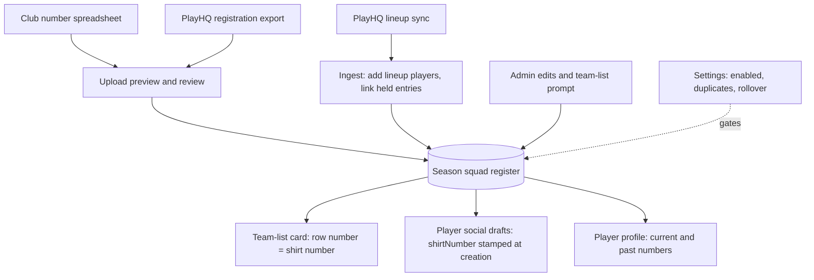
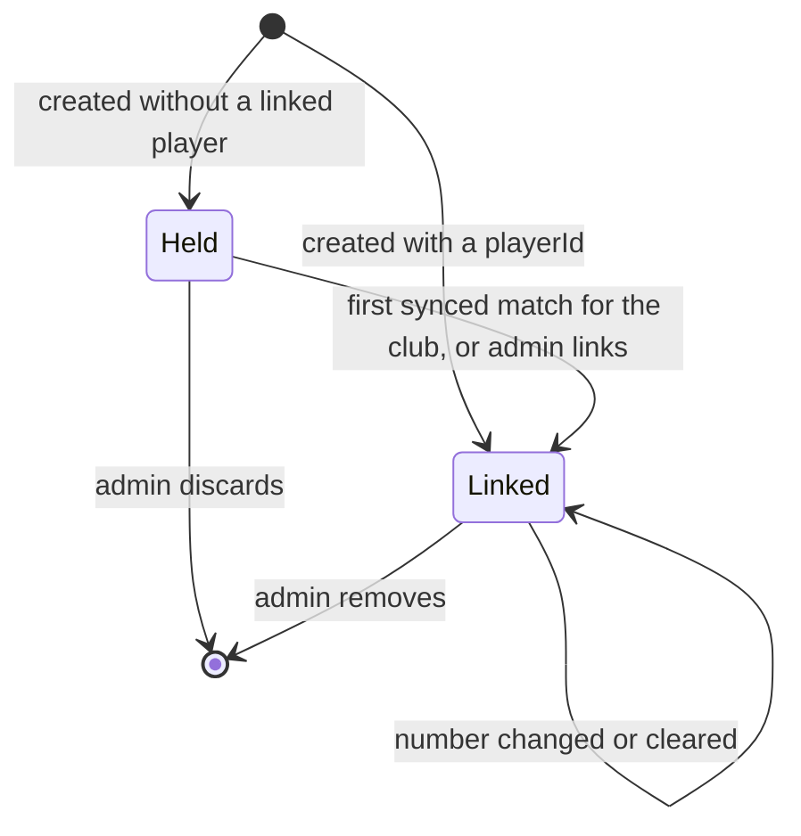

# Season Shirt Numbers - Plan

## Goal Capsule

- **Objective:** Let a club opt in to per-season playing shirt numbers, loaded in bulk and maintained by admins, and shown on the team-list card, individual player social assets, and the player profile.
- **Product authority:** Ash (Ovation), on behalf of a prospective client club that requested the feature. Product Contract wins over Planning Contract; Planning Contract wins over implementer preference.
- **Open blockers:** None.
- **Execution profile:** Standard-to-deep feature across `lib/db`, `lib/api-spec`, `artifacts/api-server` and `artifacts/cricket-club`; units run in dependency order U1 → U10.
- **Stop conditions:** Stop and surface if a change would write to the central database, blend junior and senior data, or alter A Grade cap numbers or the cap (debut) card.
- **Tail ownership:** The executor owns tests, codegen output and the committed SQL migration; shipping (PR, CI) follows the caller's pipeline.

---

## Product Contract

### Summary

An opt-in tenant feature that keeps a per-season squad register of shirt numbers.
The register is seeded by a bulk spreadsheet upload, can also be populated from a PlayHQ registration export or from synced PlayHQ lineups, and is maintained by admins as players join — including a prompt to assign a number when an unnumbered player is selected.
Numbers appear on the team-list card, individual player social assets, and the player profile; A Grade cap cards are unchanged, and juniors keep a separate register.

### Problem Frame

A prospective client already issues playing shirt numbers and keeps them in a spreadsheet.
They want those numbers on the content Ovation produces for them — match-day team lists, per-player social posts, and profile pages — so the app matches what players wear.

Ovation has no concept of a shirt number today.
The only number on player content is the A Grade cap number, a permanent heritage sequence used on cap cards.
Ovation also has no notion of a season squad: the PlayHQ data it syncs describes who was selected for each match, not who is registered with the club.
Shirt numbers are per-season, can be duplicated, and belong to people who may not have played yet, so they don't fit onto the existing player record or the cap register.

### Key Decisions

- **Season squad register, with the number as one attribute.** Each tenant has one register per season listing people, their shirt number, and — once matched — their player profile. Attaching numbers directly to players was rejected because it cannot hold numbers for people who haven't played, and the club needs those held.
- **Opt-in per tenant.** The feature is off by default; clubs that don't use shirt numbers see no change anywhere.
- **Per-season numbers, duplicates allowed by default.** Two active players, even in the same team, may share a number. A club setting chooses whether a duplicate warns or is blocked.
- **Season rollover is a club setting.** A club chooses whether returning players carry their previous number into a new season (editable) or each season starts blank. Past seasons are kept as history either way.
- **Hold until first game.** A register entry that isn't linked to a player who has played appears on no profile or individual player asset. It becomes visible once the player's first synced match links it. The only exception is the team-list card for a fixture they are selected for (R16).
- **Cap number and shirt number stay separate.** A Grade cap cards keep showing the cap number and nothing else changes for that asset. Shirt numbers appear only on the other surfaces listed in R12–R14.
- **Juniors get their own register.** Junior shirt numbers are managed and shown only within the juniors area, never on senior lists or cards, following the existing juniors isolation rule.
- **Curated tenant content, not central stats.** The register is tenant-owned, like the cap register and honour boards, and never written to the shared central database.

### Actors

- A1. Club admin — enables the feature, uploads spreadsheets and exports, resolves review items, assigns and edits numbers.
- A2. PlayHQ sync — supplies match lineups that link held register entries to players and surface unnumbered selected players.
- A3. Public visitor / social audience — sees numbers on team lists, social assets, and profiles.

### Requirements

**Enablement and settings**

- R1. A tenant can turn shirt numbers on or off; when off, no shirt number appears on any surface and admin screens hide the feature.
- R2. A tenant chooses duplicate handling: warn (default) or block.
- R3. A tenant chooses season rollover: carry forward previous numbers (editable) or start each season blank.

**Building the register**

- R4. An admin can bulk-upload a shirt-number spreadsheet for a season, creating or updating register entries with names and numbers.
- R5. An admin can upload a PlayHQ registered-participants export for a season, adding registered players to that season's register without numbers.
- R6. Players who appear in a synced PlayHQ lineup for the season are added to that season's register automatically if not already present.
- R7. Each upload shows a preview before it is applied: matched entries, new entries, number changes, duplicates, and rows that couldn't be matched.
- R8. Rows that can't be confidently matched to a player go to a review list where an admin links, creates as held, or discards them.

**Maintaining numbers**

- R9. An admin can add a person to the current season's register and assign, change, or clear a number at any time.
- R10. When a team list is created from a PlayHQ lineup and a selected player has no shirt number this season, the admin is prompted to assign one from the team-list screen.
- R11. Duplicate numbers trigger a warning or a block according to R2.

**Display**

- R12. The team-list card shows each selected player's shirt number for that season when one exists.
- R13. Individual player social assets (other than A Grade cap cards) show the player's shirt number for the season the asset relates to.
- R14. The player profile shows the current season's shirt number, plus the numbers worn in past seasons.
- R15. A player with no number for a season shows no number. Nothing displays a placeholder or a cap number in its place.
- R16. Held entries (not yet linked to a player who has played) appear in no profile or individual player asset. The one exception: a held entry for a player named on a team list may show its number on that fixture's team-list card.

**Juniors**

- R17. Junior shirt numbers live in a separate juniors register with the same capabilities, managed and displayed only within the juniors area.

### Key Flows

- F1. Preseason seed
  - **Trigger:** Admin enables shirt numbers and uploads the club's number spreadsheet for the new season.
  - **Actors:** A1
  - **Steps:** Upload; review the preview of matches, new entries, duplicates and unmatched rows; apply; resolve the review list.
  - **Outcome:** Returning players show their numbers immediately; new or unplayed players are held.
  - **Covered by:** R4, R7, R8, R11, R16
- F2. Held player debuts
  - **Trigger:** PlayHQ sync brings in a finished match in which a held register entry's player appears for the club.
  - **Actors:** A2
  - **Steps:** The synced match links the entry to the player; the number now shows on the team list, profile and assets.
  - **Covered by:** R6, R12, R14, R16
- F3. Mid-season join at selection
  - **Trigger:** A synced team list includes a player with no number this season.
  - **Actors:** A1, A2
  - **Steps:** Team-list screen prompts the admin; admin assigns a number; the card renders with it.
  - **Covered by:** R6, R10, R11, R12
- F4. Season rollover
  - **Trigger:** A new season begins.
  - **Actors:** A1
  - **Steps:** Under carry-forward, returning players inherit last season's number as an editable entry; under start-blank, the new register is empty until uploaded or assigned.
  - **Covered by:** R3, R14

### Acceptance Examples

- AE1. **Covers R2, R11.** Given duplicate handling is "warn", when an admin gives #7 to a second A Grade player, the save succeeds with a visible warning naming the other #7. Under "block", the save is refused.
- AE2. **Covers R16, F2.** Given a registered player is held with #23 and has never played, their number appears on no profile or individual player asset, and on no team-list card except one for a fixture they are selected for. After their first synced match, #23 shows everywhere.
- AE3. **Covers R3.** Given carry-forward is on and a player wore #12 last season, the new season starts with them on #12; an admin change to #4 affects only the new season, and the profile still shows #12 for last season.
- AE4. **Covers R13, cap separation.** Given a player has cap #142 and shirt #9, their A Grade cap card shows #142 only, and their milestone asset shows #9.
- AE5. **Covers R1.** Given the feature is off, a tenant's team lists, assets, and profiles render exactly as they do today.

### Scope Boundaries

- A Grade cap numbers and the cap card are unchanged.
- No writing numbers back to PlayHQ.
- No live pull of registrations from PlayHQ; registrations arrive as a club-uploaded export.
- No stub public profiles for players who haven't played.
- No combined junior-and-senior register or display.

### Dependencies / Assumptions

- Team lists are pre-filled from PlayHQ match lineups and linked to tenant players through the existing PlayHQ-to-player identity map, so held entries can be linked when a lineup arrives.
- Lineup entries the identity map can't resolve are stored with their PlayHQ participant id, so they can be numbered from the team-list prompt; the number reaches their profile once they have played and are linked. Team-list rows typed in by hand with no PlayHQ id must be linked to a player before they can be numbered.
- A club's PlayHQ registration export carries enough identity (name at minimum, PlayHQ participant id if present) to match most rows; the rest go to review.
- "Season" for the register aligns with the season the club's PlayHQ competitions run in.

### Outstanding Questions

**Deferred to Implementation**

- Exact header aliases in a real PlayHQ registered-participants export — confirm against a sample file from the client and extend the alias list; the parser reports unrecognised headers rather than guessing.
- Exact placement of the shirt-number badge in each pack's player-centric templates (see U8) — a visual judgement per pack.

### Sources / Research

- `lib/db/src/schema/cap_register.ts` — the closest analogue: tenant-curated numbered register with pending/confirmed review states.
- `artifacts/cricket-club/src/lib/trading-card.ts` — the trading card's number slot is the A Grade cap number.
- `lib/db/src/playhq-ingest/team-lists.ts` and `lib/db/src/schema/fixtures.ts` — team lists pre-filled from PlayHQ lineups.
- `lib/db/src/schema/player_id_map.ts` — PlayHQ participant GUID to tenant player crosswalk.
- `artifacts/cricket-club/src/pages/admin-import` and `artifacts/api-server/src/routes/imports.ts` — the existing admin upload, preview and commit pattern for CSV imports.
- `docs/plans/2026-10-01-001-feat-playhq-scheduled-sync-plan.md` — the scheduled PlayHQ sync that supplies lineups.
- `docs/solutions/architecture-patterns/central-read-player-identity-crosswalk.md` — resolving PlayHQ GUIDs to tenant player ids on central-read tenants.

**Product Contract preservation:** changed R16 — a held entry's number may show on the team-list card for a fixture the player is selected for, because F3 promises the card renders with a number assigned at selection, and the player is already named on that public card. Outstanding Questions are resolved in place by the Planning Contract below.

---

## Planning Contract

### Key Technical Decisions

- KTD1. **One tenant-curated register table per side.** Senior entries live in a new `shirt_numbers` table and junior entries in `junior_shirt_numbers`, both tenant-scoped with `tenantIdColumn()`. Each entry carries `season` (integer start year, matching `matches.season`), a display `name`, an optional PlayHQ `participantId`, a `number`, and a `source` (`upload` | `registration` | `lineup` | `admin` | `rollover`). Senior entries add an optional `playerId` in the tenant's player space with no foreign key, guarded by `assertPlayerInTenantSpace` exactly like `cap_register.playerId`. Junior entries key on `participantId` against `junior_participants` and never carry a senior `playerId` (juniors isolation).
- KTD2. **"Held" is derived, not stored.** A senior entry is held while `playerId` is null and becomes public once linked. No status column means no state to drift.
- KTD3. **Numbers are short digit strings.** Store `number` as text validated to 1–3 digits so "00" and "07" survive verbatim; a null number means "on the register, unnumbered". Duplicate detection compares exact strings within (tenant, season).
- KTD4. **Uniqueness is per person, not per number.** Partial unique indexes on (tenant, season, participantId) and (tenant, season, playerId) where not null stop the same person appearing twice in a season. Numbers are never unique in the schema; the club's duplicate policy is enforced in the service layer. Because `drizzle-kit push` can't see multi-column partial uniques, also add them to `scripts/src/ensure-constraints.ts` (the cap-register precedent).
- KTD5. **Settings follow the singleton-settings pattern.** A `shirt_number_settings` table (one row per tenant via `getOrCreateSettings` in `artifacts/api-server/src/lib/settings.ts`) holds `enabled` (default false), `duplicatePolicy` (`warn` | `block`, default `warn`) and `rolloverPolicy` (`carry` | `blank`, default `carry`). Tenants have no generic feature-settings column, and every other display feature uses this pattern.
- KTD6. **Carry-forward applies at entry creation.** Under `carry`, any new entry created without a number for a person who had one last season inherits it, whatever the source. An explicit "Start season" admin action materialises the whole previous season at once (idempotent; skips people already present). Under `blank` neither happens.
- KTD7. **Season is derived from dates by one shared helper.** Add `seasonStartYearFor(date)` in `lib/db` (Australian July–June season) and use it for fixtures (which have only `startAt`, no season column), lineup ingest, and the admin default season.
- KTD8. **Uploads get their own tenant-scoped preview store.** Previews live in a new `shirt_number_uploads` table (`tenantIdColumn()`, `side` = senior | junior, `kind`, `season`, `status`, jsonb `payload`), not in `importsTable`, which has no tenant column, a `kind` check constraint and native-only commit routes. Every preview, commit and discard lookup filters on `getTenantId(req)` and returns 404 on a mismatch. Files are parsed server-side with the existing `multer` + `csv-parse` + `exceljs` stack through a dedicated multer instance capped at 2 MB and one file, `.csv`/`.xlsx` only, with a parsed-row cap of 1,000. Upload, commit and discard run behind `requireAdmin`, `requireEntitlement("curation")` and `adminWriteRateLimiter`, and deliberately not `requireNativeStatsTenant`, because the register is tenant-curated content that central-read tenants also use. Matching order: PlayHQ participant id via `player_id_map`, then exact normalised name, then suggestions from `buildNameMatcher` (`artifacts/api-server/src/lib/name-match.ts`). Suggestions are never auto-applied because central display names are "Initial Surname" and collide; unresolved rows go to the preview's review list. Discarded and committed previews have their payload cleared.
- KTD9. **Lineups and played matches feed the register inside the PlayHQ ingest.** The register rules shared by the ingest and the API (enabled-settings read, carry-forward lookup, held-entry link) live in `lib/db/src/shirt-numbers.ts` so both packages use one implementation. `lineupToTeamList` keeps the PlayHQ `participantId` on each `TeamListPlayer` (new optional field), and `sameTeamList` compares it so existing PlayHQ lists gain it on the next sync. After team lists are projected, tenants with the feature enabled get missing lineup players added to the fixture's season register. After the central projection, a held entry is linked once its participant has a scorecard or roster row for the tenant's club; if the crosswalk has no row for that participant yet, the ingest mints one with the shared minting helper first. That keeps "linked" equal to "has played", so no stub profiles appear. Every sync read and write takes an explicit tenant id, PlayHQ GUIDs are lowercased before storage and comparison, and lineup names are trimmed and length-capped. Under the `block` duplicate policy, the sync skips a carried-forward number that would create a duplicate and leaves the entry unnumbered. This is the only automatic write path, and it is wired into `ingestPlayhqDump` in `artifacts/api-server/src/lib/playhq-ingest.ts`, where a failure is reported as a warning rather than failing the ingest.
- KTD10. **Team-list cards reuse the existing row number slot.** The team-list templates already print `{{row.number}}`, currently the batting order. When the feature is on, the caller loads a number map for the fixture's season and passes it to `teamListToCardInput`, keeping that function synchronous and pure for both the per-fixture and round-set builders. Each row's number is found by `playerId`, or by `participantId` for a held selected player (the R16 exception), and the card input carries `numbering: "shirt"`. `bind.ts` then binds `row.number` to the shirt number (empty when unnumbered) while rows stay in batting order. No team-list template changes.
- KTD11. **Player-centric social cards get the number at draft upsert.** `upsertDraftByKey` (`artifacts/api-server/src/lib/draft-upsert.ts`) is the single choke point for auto drafts and already receives `playerId`. On every call, before the `sameCardInput` comparison, it stamps `shirtNumber` into the card input for kinds `century`, `fiveFor`, `milestone`, `player` and `tradingCard` when the feature is on and the player has a linked, non-private number for the draft's season. Stamping on every call means an unposted draft picks up the current number on its next sweep, and a posted draft gets the existing stale-revision treatment, rather than the number vanishing on refresh. `DraftUpsert` gains an optional `season` that each player-centric caller sets from its match; `seasonStartYearFor(now)` is used only when a caller has no match context. `debut` is excluded because it is the A Grade cap card.
- KTD12. **One shared badge fragment across packs.** Add a shirt-number badge fragment to the shared skeleton kit and insert it into each pack's player-centric templates. A `dropEmptyShirtNumber` pass, mirroring `dropEmptyCapNumber` in `artifacts/cricket-club/src/lib/pack-render/render.ts`, strips it when `shirtNumber` is empty. Bind `shirtNumber` explicitly (empty string, never via `set()`) for the same reason `capNumber` is: an absent key falls through to the template sample.
- KTD13. **Profiles read the register server-side.** `GET /players/{id}` adds `shirtNumber` (current season) and `shirtNumbers` (history) to `PlayerDetail` only when the feature is on and the entry is linked. `GET /juniors/players/{id}` does the same from the junior register.
- KTD14. **Writes need admin plus the curation entitlement.** Register writes use `requireAdmin` and `requireEntitlement("curation")`, like the cap register. Junior routes live under `/api/juniors/*` only.

### High-Level Technical Design

Data flow from the three sources into the register and out to the three surfaces:

Entry lifecycle (senior register):

### Assumptions

- A PlayHQ registered-participants export carries first and last names and usually a participant or profile id; without an id column, matching falls back to names and review.
- Team lists exist only for senior fixtures, so the juniors register has no lineup-derived source and no selection prompt.
- Player-centric drafts created before a number is assigned keep their original card input; the admin can regenerate them.
- Settings are shared: one feature switch and one set of policies per tenant cover both registers.
- Junior numbers need native junior data. Central-read tenants have no `junior_participants`, so the juniors register follows the existing juniors gating and is hidden for them.
- Shirt numbers follow the same `is_private` suppression as other player fields on public responses and drafts.

### Scope Boundaries (planning)

**Deferred to Follow-Up Work**

- Showing shirt numbers on the mobile player screen (`artifacts/cricket-mobile/app/players/[id].tsx`). It uses the same `PlayerDetail` response, so it is a small follow-up once the field exists.
- Juniors display beyond the junior player profile (junior team lists and junior social assets).
- U10 (juniors register) is sequenced last and can ship separately if the senior work needs to land first.

---

## Implementation Units

### U1. Register schema, settings table, season helper and migration

**Goal:** Create storage for both registers, the settings and the upload previews, plus the shared season helper and register rules.

**Requirements:** R1–R3, R16, R17; KTD1–KTD5, KTD7, KTD8, KTD9.

**Dependencies:** None.

**Files:**
- `lib/db/src/schema/shirt_numbers.ts` (new: `shirt_numbers`, `junior_shirt_numbers`, `shirt_number_settings`, `shirt_number_uploads`)
- `lib/db/src/shirt-numbers.ts` (new: shared register rules — settings read, carry-forward lookup, held-entry link)
- `lib/db/src/schema/index.ts`
- `lib/db/src/schema/_tenant.ts` (INVENTORY comment)
- `lib/db/src/schema/fixtures.ts` (`TeamListPlayer.participantId?`)
- `lib/db/src/seasons.ts` (new: `seasonStartYearFor`) and its package export
- `lib/db/src/seasons.test.ts` (new)
- `lib/db/migrations/0030_shirt_numbers.sql` plus generated `meta/` snapshot and journal
- `scripts/src/ensure-constraints.ts`

**Approach:** Model on `lib/db/src/schema/cap_register.ts`: `tenantIdColumn()`, a tenant index, a player index on the senior table, and the partial uniques from KTD4. Add a check constraint for the digit pattern on `number`, and store `participantId` lowercased. Generate the migration with the `generate` script and keep it idempotent (`IF NOT EXISTS`) like recent migrations.

**Patterns to follow:** `lib/db/src/schema/cap_register.ts`; the settings tables read by `getOrCreateSettings`; `lib/db/migrations/0028_cap_status.sql`.

**Test scenarios:**
- `seasonStartYearFor` returns 2026 for 2026-07-01, 2025 for 2026-06-30, and 2025 for 2026-01-15.
- A Perth fixture starting 2026-07-01T00:30+08:00 maps to 2026 (timezone edge).
- Carry-forward lookup returns last season's number for a person, and nothing under `blank` or when the person had no number.
- The held-entry link helper links only within the given tenant: two tenants with the same participant mapped to different players each link their own.

**Verification:** The migration applies cleanly on a fresh database and on one at 0029; CI's migration-drift check shows no diff after `generate`.

### U2. OpenAPI contract and codegen

**Goal:** Define every endpoint and schema the feature needs, then regenerate the clients.

**Requirements:** R1–R17; KTD13, KTD14.

**Dependencies:** U1.

**Files:**
- `lib/api-spec/openapi.yaml`
- `lib/api-client-react/src/**`, `lib/api-zod/src/**` (generated; never hand-edit)

**Approach:** Add a `shirt-numbers` tag with:
- `GET` and `PATCH /shirt-numbers/settings`
- `GET /shirt-numbers?season=` (admin; includes held entries and duplicate flags)
- `POST /shirt-numbers`, `PATCH /shirt-numbers/{id}`, `DELETE /shirt-numbers/{id}`
- `POST /shirt-numbers/seasons/{season}/start`
- `POST /shirt-numbers/uploads` (multipart: `file`, `kind` = `numbers` | `registration`, `season`), returning a preview
- `POST /shirt-numbers/uploads/{id}/commit` (per-row resolutions) and `DELETE /shirt-numbers/uploads/{id}`

Mirror the register, upload and season-start routes under `/juniors/shirt-numbers`. Write responses carry a `warnings` array of duplicate notices; a block-policy duplicate returns 409. Add optional `shirtNumber` and `shirtNumbers` (`{season, number}[]`) to `PlayerDetail` and to the junior player detail schema, and optional `participantId` to `TeamListPlayer`. Run `pnpm --filter @workspace/api-spec run codegen` and commit the output.

**Patterns to follow:** the `caps` tag (`listCaps`, `createCap`, `updateCap`, `deleteCap`) and the playcricket-csv upload operation.

**Test expectation:** none -- contract and generated code; behaviour is covered by U3–U10. CI's codegen-drift check must pass.

**Verification:** `pnpm run typecheck` passes with the new generated types.

### U3. Senior register service and routes

**Goal:** CRUD, settings, duplicate policy, carry-forward and season start for the senior register.

**Requirements:** R1–R3, R9, R11, R16; F4; AE1, AE3, AE5.

**Dependencies:** U1, U2.

**Files:**
- `artifacts/api-server/src/lib/shirt-numbers.ts` (new: duplicate check and season start, built on the shared rules in `lib/db/src/shirt-numbers.ts`)
- `artifacts/api-server/src/routes/shirt-numbers.ts` (new) and `artifacts/api-server/src/routes/index.ts`
- `artifacts/api-server/src/lib/curated-player-detach.ts`, `artifacts/api-server/src/lib/history-import.ts` (`PLAYER_REFERENCE_TABLES`), `artifacts/api-server/src/lib/identity-drift.ts`
- `artifacts/api-server/src/routes/shirt-numbers.test.ts` (new)
- `artifacts/api-server/src/routes/curated-isolation.test.ts`, `artifacts/api-server/src/routes/curated-player-link-isolation.test.ts`, `artifacts/api-server/src/routes/settings-isolation.test.ts`

**Approach:** Writes run behind `requireAdmin`, `requireEntitlement("curation")` and `adminWriteRateLimiter`, not `requireNativeStatsTenant`. Every read and write filters on `getTenantId(req)`, and writes validate `playerId` with `assertPlayerInTenantSpace`. With the feature off, write routes refuse with a clear error; the settings route still works so admins can turn the feature on. The duplicate policy runs on create, update, upload commit and season start. Register the new player-linked table in every hand-maintained list (detach, player references, identity drift).

**Patterns to follow:** `artifacts/api-server/src/routes/caps.ts`; `artifacts/api-server/src/routes/caps-review.test.ts` (real Postgres, supertest, a `Date.now()` tenant, an `encodeSession` cookie).

**Test scenarios:**
- Covers AE1. With policy `warn`, giving #7 to a second player in the same season succeeds and returns a warning naming the other player; with `block` it returns 409 and nothing changes.
- The same #7 in different seasons raises no warning.
- Covers AE3. Under `carry`, creating a 2026 entry without a number for a player who wore #12 in 2025 stores #12; changing it to #4 leaves the 2025 entry at #12.
- Under `blank`, the same creation stores no number.
- Season start under `carry` copies every 2025 entry into 2026 once; a second call adds nothing. Under `blank` it creates nothing.
- A second entry for the same `playerId` in the same season is rejected.
- A `playerId` outside the tenant's player space is rejected (new write cases in `curated-player-link-isolation.test.ts`).
- Tenant A cannot list, edit or delete tenant B's entries (`curated-isolation.test.ts`); settings are isolated per tenant (`settings-isolation.test.ts`).
- Covers AE5. With the feature off, write routes refuse and `GET /shirt-numbers/settings` reports `enabled: false`.
- Requests without an admin session get 401.
- An admin of a central-read tenant can create and edit entries.
- "1000" and "7a" are rejected; "00" is stored as "00".

**Verification:** All listed tests pass against the CI Postgres, and the existing isolation suites still pass.

### U4. Spreadsheet and registration-export upload

**Goal:** Bulk-load a season from the club's number sheet or a PlayHQ registration export, with a preview and review before anything is written.

**Requirements:** R4, R5, R7, R8, R11; F1.

**Dependencies:** U3.

**Files:**
- `artifacts/api-server/src/lib/shirt-number-upload.ts` (new: CSV/XLSX parsing, header aliases, row matching, preview build, commit apply)
- `artifacts/api-server/src/lib/shirt-number-upload.test.ts` (new; pure parsing and matching)
- `artifacts/api-server/src/lib/import-upload.ts` (a multer instance for these uploads: 2 MB, one file, `.csv`/`.xlsx`)
- `artifacts/api-server/src/routes/shirt-numbers.ts` (upload, commit, discard routes)
- `artifacts/api-server/src/routes/shirt-numbers-upload.test.ts` (new)

**Approach:** Accept `.csv` and `.xlsx`. Normalise headers case- and space-insensitively against alias lists for name, first name, last name, participant or profile id, and number; a `registration` upload ignores any number column. Build the tenant's roster from its player space (native players for native tenants; crosswalk plus central names for central-read tenants). Classify each row as `matched`, `suggested`, `new` or `invalid`. Cap parsed rows at 1,000. Store the preview as a pending `shirt_number_uploads` row (KTD8). Commit takes per-row resolutions (link to player, keep as held, discard), applies the duplicate policy, and is idempotent per import.

**Patterns to follow:** `artifacts/api-server/src/routes/imports-csv.ts` (preview, then commit with resolutions — but with tenant-scoped lookups); `buildNameMatcher` in `artifacts/api-server/src/lib/name-match.ts`.

**Test scenarios:**
- A CSV with `Name,Number` rows parses; an XLSX with `First Name,Surname,Shirt No.` parses to the same rows.
- An unknown header set returns a preview error listing the headers found.
- A row whose participant id is in `player_id_map` is `matched` to that player.
- A row whose normalised name matches exactly one roster player is `matched`; one matching two players is `suggested` with both candidates.
- A row with no match is `new` and appears in the review list.
- A row with number "abc" is `invalid` and never written.
- A registration upload adds entries without numbers and ignores a number column.
- Covers F1. Committing "keep as held" for an unmatched row creates a held entry; "discard" writes nothing for it.
- Under `block`, a commit containing a duplicate number is rejected with the conflicting rows listed; under `warn` it applies and returns warnings.
- Committing the same import twice creates no duplicates.
- Tenant B cannot read, commit or discard tenant A's pending upload; each attempt returns 404.
- A file over 2 MB, another file type, or more than 1,000 rows is rejected with 413 or 400.
- An admin of a central-read tenant can upload and commit.
- Upper-case participant ids in a file match lowercase ids already in the register.

**Verification:** A real sample of the client's spreadsheet previews with sensible match counts, and the tests pass.

### U5. PlayHQ lineup integration

**Goal:** Keep participant ids on team lists, add lineup players to the register, and link held entries automatically.

**Requirements:** R6, R16; F2; AE2; KTD9.

**Dependencies:** U1, U3.

**Files:**
- `lib/db/src/playhq-ingest/team-lists.ts` (`lineupToTeamList`, `sameTeamList`)
- `lib/db/src/playhq-ingest/shirt-number-sync.ts` (new)
- `artifacts/api-server/src/lib/playhq-ingest.ts` (wire the sync into `ingestPlayhqDump`)
- `lib/db/src/playhq-ingest/team-lists.test.ts`
- `lib/db/src/playhq-ingest/shirt-number-sync.test.ts` (new)

**Approach:** `lineupToTeamList` sets `participantId` on every row it builds, including rows it can't resolve to a `playerId`; fill-in exclusion is unchanged. `sameTeamList` includes `participantId`, so existing PlayHQ lists are rewritten once. After `projectTeamLists`, for each tenant with the feature enabled, insert register entries for lineup participants missing from that fixture's season (with `playerId` when resolvable, applying carry-forward and the block-policy skip). After `projectDumpToCentral`, link held entries whose participant has a scorecard or roster row for the tenant's club, minting a crosswalk row with the shared minting helper when none exists. Every step takes an explicit tenant id, and all writes are idempotent so hourly re-runs are no-ops. `ingestPlayhqDump` calls the sync after the projections and reports a failure as a warning.

**Patterns to follow:** the existing `projectTeamLists` structure and `lib/db/src/playhq-ingest/team-lists.test.ts`.

**Test scenarios:**
- A lineup row with an unmapped participant keeps its `participantId` and has no `playerId`.
- A fill-in id (90000 or above) still gets no `playerId`.
- Covers F2 / AE2. A held entry with participant P and number #23 is linked once P has a scorecard row for the club, keeps #23, and gains a crosswalk row if it had none.
- A held entry whose participant was only selected (no scorecard or roster row yet) stays held.
- Two enabled tenants with the same participant link only their own entries.
- Under `block`, a carried-forward number that would duplicate another player's is left off and the entry is created unnumbered.
- A PlayHQ list saved before this change gains `participantId` on the next sync.
- A lineup player missing from the register is added for the fixture's season and inherits last season's number under `carry`.
- A tenant with the feature disabled gets no register writes.
- Running the sync twice produces no extra rows or changes.
- A lineup for a September 2026 fixture writes to season 2026, not 2025.

**Verification:** `pnpm run test:libs` passes, and a sync on a seeded tenant links a held entry end to end.

### U6. Admin register UI and settings

**Goal:** Give admins one place to enable the feature, choose policies, manage a season's register, upload files and resolve held or unmatched entries.

**Requirements:** R1–R5, R7–R9, R11, R16; F1, F4; AE1.

**Dependencies:** U3, U4.

**Files:**
- `artifacts/cricket-club/src/pages/admin-shirt-numbers.tsx` (new)
- `artifacts/cricket-club/src/components/shirt-numbers/` (new: register table, upload preview and review, settings panel)
- `artifacts/cricket-club/src/pages/admin-groups.tsx`, `artifacts/cricket-club/src/lib/admin-nav.ts`
- `artifacts/cricket-club/src/components/shirt-numbers/__tests__/register-table.test.tsx` (new)

**Approach:** Place the page in the honours/curation admin group next to the cap register, gated by the `curation` feature like caps. With the feature off, show only the settings panel and its enable switch. The register table has a season picker (defaulting to the current season), Linked and Held filters, inline number editing, duplicate badges, and a "Start season" action labelled by the rollover policy. The upload flow mirrors the import steps: choose file and kind, review the preview, resolve rows, commit. Its states:
- parsing;
- a parse error that lists the headers found;
- a preview grouped into matched, suggested, new, invalid and duplicate rows, with a candidate picker on suggested rows and bulk actions ("keep all new as held", "discard all invalid");
- committing;
- a block-policy rejection that lists the conflicting rows.

"Start season" opens a confirmation naming the source and target seasons and the number of entries it will create. Turning the feature off shows a note that the register is kept. Inline number edits are keyboard-operable (Enter saves, Escape cancels), duplicate badges carry text as well as colour, and the table stacks into rows on narrow screens.

**Patterns to follow:** `artifacts/cricket-club/src/pages/admin-caps.tsx`; `artifacts/cricket-club/src/components/admin-import/`; `artifacts/cricket-club/src/pages/admin-branding.tsx` for the settings form.

**Test scenarios:**
- With the feature off, only the settings panel renders.
- Entries sharing a number in a season show a duplicate badge on both rows.
- Held entries appear under the Held filter and offer "Link to player".
- A 409 from a block-policy save shows the conflict message and keeps the edited value for correction.

**Verification:** In the browser preview: enable the feature, upload a sample sheet, resolve review rows, edit a number, and start a new season under both policies.

### U7. Team-list numbers and selection prompt

**Goal:** Show shirt numbers on the team-list card and prompt for a number when a selected player has none.

**Requirements:** R10, R12, R15; F3; KTD10.

**Dependencies:** U3, U5.

**Files:**
- `artifacts/api-server/src/lib/engines/team-list.ts` and `artifacts/api-server/src/lib/engines/round-sets.ts` (shared input builder)
- `artifacts/api-server/src/lib/engines/team-list.test.ts` (new)
- `artifacts/cricket-club/src/lib/share-card/types.ts` (`TeamListPlayer.shirtNumber?`, `numbering?`)
- `artifacts/cricket-club/src/lib/pack-render/bind.ts`
- `artifacts/cricket-club/src/lib/pack-render.test.ts`
- `artifacts/cricket-club/src/pages/admin-fixtures.tsx` (`TeamListEditor`, `TeamListRowState`, `rowsFromPlayers`, save builder)
- the callers of `teamListToCardInput`, which load the season number map

**Approach:** `teamListToCardInput` derives the fixture's season with `seasonStartYearFor(startAt)` and, when the feature is on, attaches each kept player's linked number and sets `numbering: "shirt"`. `bind.ts` binds `row.number` to the shirt number (empty when unnumbered) only when `numbering === "shirt"`; otherwise it stays the batting order, so tenants without the feature are unchanged. In `TeamListEditor`, `participantId` is carried through row state, `rowsFromPlayers` and the save builder so admin edits keep it. When the feature is on, the editor shows a non-blocking banner ("N selected players have no shirt number") that jumps to the first unnumbered row. Each row shows its season number. Unnumbered rows with a `playerId` or `participantId` get an inline "Assign #" control with saving, saved, duplicate-warning and conflict states; assigning updates the card preview in place. When a held entry's normalised name matches the row, offer to link that entry instead of creating a new one. Rows typed in by hand with neither id show no control, only the hint "Link this player to number them". Saving a list with unnumbered players is allowed.

**Patterns to follow:** the existing `rowsFromPlayers` and save builder in `admin-fixtures.tsx`; the explicit `capNumber` binding comment in `bind.ts`.

**Test scenarios:**
- With the feature on, a team-list card input carries each player's season number and `numbering: "shirt"`; a player with no number carries none.
- With the feature off, the input is unchanged from today.
- Fill-ins are still dropped.
- `bind` with `numbering: "shirt"` binds `row.number` to "23" for a numbered player and "" for an unnumbered one, never the batting order.
- `bind` without `numbering` still binds `row.number` to the batting order.
- Covers F3. Assigning #31 from the editor to an unnumbered selected player creates a register entry for the fixture's season, and the regenerated draft shows 31 — including for an unmapped player whose entry is held (R16 exception).
- That held player's number still appears on no profile or individual player card.
- Saving an edited team list keeps every row's `participantId`.

**Verification:** A team-list card in the browser preview shows shirt numbers in batting order, and a tenant with the feature off renders as before.

### U8. Player-centric social cards and trading cards

**Goal:** Put the shirt number on individual player social assets, excluding the A Grade cap card.

**Requirements:** R13, R15; AE4; KTD11, KTD12.

**Dependencies:** U3.

**Files:**
- `artifacts/api-server/src/lib/draft-upsert.ts` (`DraftUpsert.season`, stamping) and `artifacts/api-server/src/lib/draft-upsert.test.ts` (new or extended)
- player-centric callers that pass `season`: `artifacts/api-server/src/lib/match-milestone-detector.ts`, `artifacts/api-server/src/lib/central-achievements.ts`, `artifacts/api-server/src/lib/post-commit-social.ts`, `artifacts/api-server/src/lib/roundup.ts`
- `artifacts/cricket-club/src/lib/share-card/types.ts` (`shirtNumber?` on player-centric kinds)
- `artifacts/cricket-club/src/lib/pack-render/bind.ts`, `artifacts/cricket-club/src/lib/pack-render/render.ts`
- `artifacts/cricket-club/src/lib/pack-templates/skeleton-kit.ts` (badge fragment) and the player-centric templates in each pack under `artifacts/cricket-club/src/lib/pack-templates/`
- `artifacts/cricket-club/src/lib/pack-templates/pack-lint.test.ts`, `artifacts/cricket-club/src/lib/pack-render.test.ts`
- `artifacts/cricket-club/src/lib/trading-card.ts` and `artifacts/cricket-club/src/pages/player-detail.tsx` (profile share card and trading card modal)

**Approach:** On every draft upsert, before the change comparison, when the feature is on and the kind is `century`, `fiveFor`, `milestone`, `player` or `tradingCard`, stamp `shirtNumber` from the player's linked, non-private entry for the season the caller passes (KTD11). Bind `shirtNumber` explicitly for those kinds, add the badge fragment to every pack's player-centric templates, and strip it with `dropEmptyShirtNumber` when empty. Leave `debut` untouched. The badge renders as a bare `#N`, never reuses the cap pill style, keeps a minimum legible size on a contrasting plate, and sits in one fixed position per template family. `trading-card.ts` gains an optional `shirtNumber` drawn separately from the cap-number slot, and the profile's share and trading cards pass the current-season number from U9.

**Execution note:** Extend `pack-lint.test.ts` first so it fails until every pack's player-centric templates include the badge token; that keeps all packs in step.

**Patterns to follow:** `dropEmptyCapNumber` and the explicit `capNumber` binding; `pack-own-look-parity.test.ts`.

**Test scenarios:**
- Covers AE4. A `debut` draft for a player with cap #142 and shirt #9 has no `shirtNumber` and renders "CAP 142" only; that player's `milestone` draft carries `shirtNumber: "9"`.
- A `century` draft for a player with no number this season has no `shirtNumber`, and the rendered card contains no badge and no template sample number.
- With the feature off, no draft gains `shirtNumber`.
- A second upsert of an unchanged event keeps `shirtNumber` and does not mark the draft changed.
- Assigning a number refreshes an unposted draft on its next upsert; a posted draft is marked stale, not rewritten.
- A June match processed in August uses the match's season number, not the new season's.
- A private player's drafts carry no `shirtNumber`.
- Every pack's `century`, `fiveFor`, `milestone`, `player` and `tradingCard` templates contain the badge token (lint).
- A trading card with cap #142 and shirt #9 shows both, each in its own place; one with only a shirt number shows no cap.

**Verification:** In the Social Studio preview, a milestone card for a numbered player shows the badge in each pack, and an unnumbered player's card shows none.

### U9. Player profile display

**Goal:** Show the current season's number and past numbers on the player profile.

**Requirements:** R14, R15, R16; AE2, AE3, AE5; KTD13.

**Dependencies:** U2, U3.

**Files:**
- the `getPlayer` (`GET /players/:id`) handler under `artifacts/api-server/src/routes/` (find it by its `getPlayer` operation)
- `artifacts/api-server/src/routes/player-shirt-numbers.test.ts` (new)
- `artifacts/cricket-club/src/pages/player-detail/hero.tsx`, `artifacts/cricket-club/src/pages/player-detail.tsx`

**Approach:** When the feature is on and the player is not private, the handler reads the player's linked entries in the tenant and returns `shirtNumber` for the current season and `shirtNumbers` newest-first. `ProfileHero` shows a jersey-style number beside the name, separate from the existing "Cap N" pill, plus a short past-seasons line when more than one season exists.

**Patterns to follow:** how `ProfileHero` renders the `capNumber` pill.

**Test scenarios:**
- Covers AE3. A player with 2025 #12 and 2026 #4 gets `shirtNumber: "4"` and history 2026 #4, 2025 #12.
- Covers AE2. A held entry never appears on any player's profile.
- Covers AE5. With the feature off, the response has no `shirtNumber` fields.
- Tenant B's entry for the same player id is never returned for tenant A.
- A private player's response carries no shirt-number fields.
- A past season with no number is left out of the history.

**Verification:** The profile in the browser preview shows the number and history, and a tenant with the feature off is unchanged.

### U10. Juniors register

**Goal:** A separate juniors register with the same management features, shown only in the juniors area.

**Requirements:** R17, applying R4, R5, R7–R9, R11, R14, R15 and R16 to juniors; KTD1, KTD8, KTD14.

**Dependencies:** U1–U4.

**Files:**
- `artifacts/api-server/src/routes/juniors-shirt-numbers.ts` (new) and `artifacts/api-server/src/routes/index.ts`
- `artifacts/api-server/src/routes/juniors-shirt-numbers.test.ts` (new)
- the junior player detail handler (`GET /juniors/players/{id}`)
- `artifacts/cricket-club/src/pages/admin-junior-shirt-numbers.tsx` (new, reusing `components/shirt-numbers/`) and its juniors admin nav entry
- `artifacts/cricket-club/src/pages/juniors-player-detail.tsx`

**Approach:** Reuse the U3 and U4 service functions, parameterised by register side, while keeping routes, tables and identity separate. Junior matching resolves participant ids and names against `junior_participants` only. There is no lineup source and no selection prompt, and junior numbers show only on the junior player profile and the juniors admin page. Routes follow the existing juniors gating for central-read tenants (empty or 404, like `juniors-players.ts`), and the juniors admin page hides the register for them. The juniors page reuses the senior components without "Link to player" or any team-list control, and shows the active season prominently.

**Patterns to follow:** `artifacts/api-server/src/routes/juniors-admin-participants.ts`; `artifacts/cricket-club/src/pages/admin-junior-players.tsx`; the juniors checks in `artifacts/api-server/src/routes/tenant-isolation.test.ts`.

**Test scenarios:**
- A junior upload matches rows to `junior_participants` by participant id, then by name.
- Junior entries never appear in `GET /shirt-numbers` or on senior profiles, and senior entries never appear under `/juniors/shirt-numbers`.
- A junior player's detail shows the current number and history when enabled.
- Tenant B cannot read or write tenant A's junior entries.
- A central-read tenant gets empty or 404 responses from the junior register routes.
- Calls through the shared service with the junior side never touch `shirt_numbers`, and the senior side never touches `junior_shirt_numbers`.
- Duplicate and rollover policies apply to the junior register exactly as to the senior one.

**Verification:** The juniors admin page manages a season end to end in the browser preview, and the isolation tests pass.

---

## Verification Contract

| Gate | Command | Applies to |
|---|---|---|
| Types | `pnpm run typecheck` | All units |
| Codegen drift | `pnpm --filter @workspace/api-spec run codegen`, then no diff in `lib/api-client-react/src` and `lib/api-zod/src` | U2 |
| Migration drift | `pnpm --filter @workspace/db run generate`, then no diff in `lib/db/migrations` | U1 |
| Library tests | `pnpm run test:libs` | U1, U5 |
| Web tests | `pnpm --filter @workspace/cricket-club test` | U6–U10 |
| API tests (real Postgres) | `pnpm --filter @workspace/api-server test` | U3, U4, U7–U10 |
| Lint and format | `pnpm run lint`; `npx prettier@3.9.6 --check .` (CI's Prettier version) | All units |

On Windows, vitest needs the hand-installed win32 binaries; failures from missing native binaries are environment noise, while assertion failures are real.

Browser checks in the web preview cover U6–U10: enable the feature, upload, review, assign from a team list, then confirm the team-list card, a milestone card and the profile.

---

## Definition of Done

- Every requirement R1–R17 is satisfied, and each of AE1–AE5 is covered by a passing test named in its unit.
- A tenant with the feature off renders team lists, social cards and profiles exactly as before.
- No write path touches the central database, and junior and senior registers never share rows, routes or display.
- A Grade cap numbers and the debut (cap) card are unchanged.
- The SQL migration, snapshot, journal and generated API clients are committed, and both CI drift checks pass.
- All Verification Contract gates pass.
- Code from abandoned approaches is removed from the diff.

**Operational note:** Production is a Replit-managed database updated by publish. After publishing, confirm the new tables exist in production before enabling the feature for a tenant.
