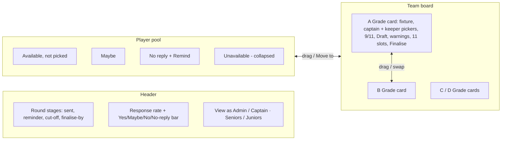
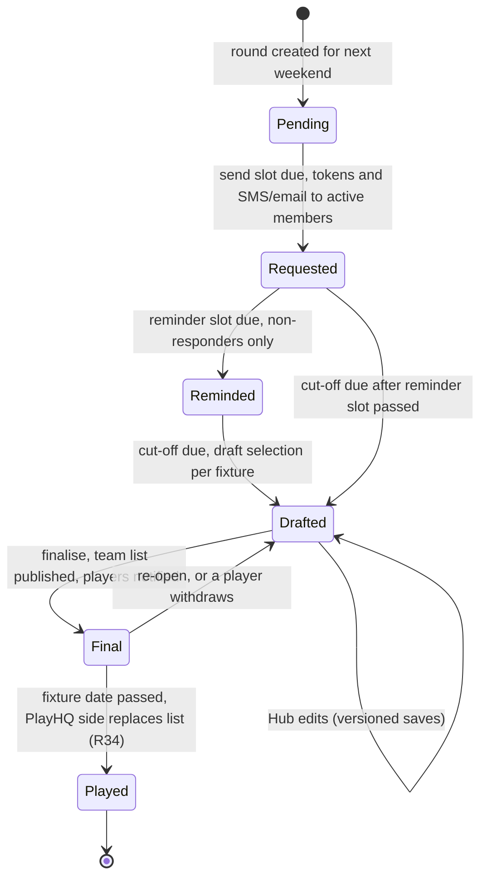
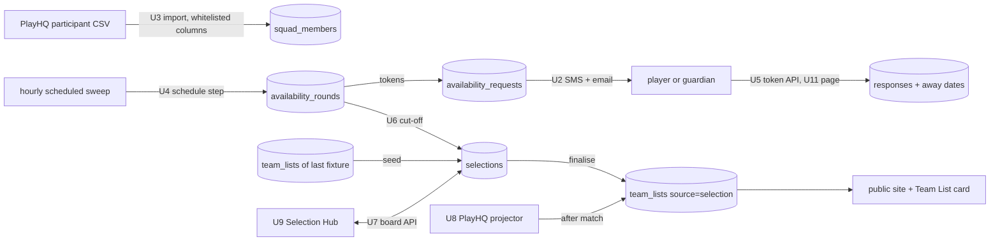

# Player Availability and Selection Hub - Plan

## Goal Capsule

- **Objective:** Replace the club Messenger poll with a personal weekly availability request (SMS + email, one-tap link) for every active player or junior's parent, and a Selection Hub where captains and admins turn drafted sides into finalised, published teams.
- **Product authority:** Ash (Ovation owner); Halls Head is the pilot tenant.
- **Authority hierarchy:** Product Contract (R/A/F/AE IDs) → Planning Contract KTDs → unit Approach notes → repo conventions in `CLAUDE.md` / `replit.md` / `AGENTS.md`. The Product Contract wins on behavior; repo invariants (OpenAPI-first, tenant scoping, fill-in exclusion, juniors stats isolation) win on mechanics.
- **Open blockers:** None. Remaining questions are deferred to implementation (see Open Questions under Planning Contract).
- **Stop conditions:** Stop and surface rather than guess if implementation would (a) send real SMS/email outside a test seam, (b) write to `central.*`, (c) blend junior stats into senior reads, or (d) require changing a Product Contract requirement.
- **Execution profile:** Deep, 11 units, sequenced schema → services → APIs → web. Ships behind a per-club `enabled` switch that defaults off, so nothing is sent until an admin turns a club on.
- **Product Contract preservation:** changed: R4 (wording only — "become active squad members"), R8 (adds a display-only finalise-by day/time that R20 already shows) — both clarifications from document review, no scope change.

## Product Contract

### Summary

Each club sets a weekly schedule: on send day, every active player (or, for juniors, their parent/guardians) gets an SMS and email with a personal link to answer Yes / No / Maybe for each day their grade plays, and to mark dates they'll be away.
At cut-off Ovation drafts every grade's side from that side's last game, leaving gaps where players are unavailable or silent.
Captains and admins edit the drafts in the Selection Hub by drag and drop, then finalise each side, which locks it, publishes it as the team list, and notifies the selected players.

### Problem Frame

Halls Head collects availability through a Facebook Messenger group poll.
The group chat "runs hot", so many players mute it and never see the poll.
Captains then chase non-responders one by one, collate answers scattered across votes and comments into A–D grade sides, and rebuild teams from scratch each week with late changes tracked nowhere.
The single success signal Ash named: a higher share of players answering before teams are selected.

### Actors

- A1. Player — senior (or a junior aged up to play seniors) who receives the request and answers it.
- A2. Parent/guardian — receives and answers on behalf of a junior player.
- A3. Captain — existing captain login, scoped to grades by the club's selection rules; edits and finalises sides.
- A4. Club admin — sets the schedule and selection rules, manages the player list, edits any grade, settles clashes.
- A5. Ovation scheduler — sends requests and reminders, builds drafts at cut-off.

### Key Decisions

- **SMS + email, not WhatsApp/Messenger/push.** A personal message reaches players who muted the group chat, needs no Meta business approval or Page opt-in, and needs no app install. Email is free; SMS carries a per-message cost.
- **Hold gaps, no cascade.** Drafts keep each player in the grade of their last game. An unavailable or silent player leaves an open slot labelled with who was there and why; nobody is auto-promoted. Moving players between grades stays a human decision.
- **Silence means not available.** Non-responders are left out of drafts at cut-off and flagged in the pool. Picking one keeps a "not confirmed" flag until they reply.
- **Selection rules are a club setting.** The admin chooses who may edit and finalise (for example: captains own their grade, admins edit all). Captain access reuses the existing captain login and per-grade permissions.
- **Contact by age, select by grade.** A junior playing a senior grade appears in senior selection, but their requests go to their parent/guardians. Junior data stays on the junior side and is never blended into senior stats.
- **PlayHQ wins after the match.** Ovation's finalised side is the plan; once the match is played, the side recorded in PlayHQ replaces it as the record of who played, and next week's draft starts from that. This relaxes today's rule that the PlayHQ sync never overwrites an admin-saved team list, only for fixtures already played.
- **Player list from the PlayHQ participant export.** The admin uploads the export; Ovation keeps only the columns needed for identity, eligibility, starting grade and contact, and discards the rest at import.
- **Thin player page, not a full profile.** The response link opens a small personal page with this weekend's question, away dates, selection status once finalised, and next game details. A stats-rich player page is deferred.

### Requirements

**Player list (import and upkeep)**

- R1. An admin can upload the PlayHQ participant export; re-uploading updates existing players by PlayHQ `Profile ID` instead of duplicating them.
- R2. Import keeps only these columns: `Profile ID`, `First Name`, `Last Name`, `Preferred Name`, `Date of Birth`, `Role`, `Status`, `Season`, `Club`, `Host Organisation ID`, `Grade`, `Team`, `Age Group`, `Competition`, `Format`, `Privacy Setting`, `Account Holder`, `Account Holder Mobile`, `Account Holder Email`, and Parent/Guardian 1 and 2 first name, last name, mobile and email.
- R3. All other columns are discarded at import and never stored, including Indigenous status, country of birth, disability, Working With Children Check, addresses, school, gender, emergency contacts and marketing/video consent.
- R4. Only rows with `Role` = player and an active `Status` for the current season become active squad members; the admin can also mark a player active or inactive by hand.
- R5. Players under 18 (from `Date of Birth`) are contacted through Parent/Guardian 1 and 2; adults through the account holder.
- R6. A player or guardian can correct their own mobile and email from the personal link; contact details are visible to club admins only and never appear on public pages.
- R7. Imported players are matched to existing Ovation player records where possible, so draft sides and last-game history line up with the club's register. Fill-in records (`playerId >= 90000`) are never matched or selected.

**Availability round**

- R8. The admin sets a weekly send day/time, one reminder day/time for non-responders, a cut-off day/time, and a finalise-by day/time shown to captains; Perth time.
- R9. On send day, each active player (or both guardians of a junior) gets one SMS and one email with a personal link that needs no login.
- R10. The personal page asks Yes / No / Maybe for each day the player's grade has a fixture that weekend (Saturday and Sunday rows when both apply), with an optional note.
- R11. A player can mark future dates they'll be away; they are recorded as unavailable for those weekends and not asked again for them.
- R12. Answers can be changed until the side is finalised; for juniors, either guardian may answer and the latest answer wins.
- R13. Every SMS includes a STOP opt-out. An opted-out recipient keeps getting email.
- R14. Each club can switch SMS off and run email-only.
- R15. Answers after cut-off are accepted and shown as late in the Selection Hub.

**Drafting at cut-off**

- R16. At cut-off, each grade with a fixture gets a draft side seeded from that side's last played game.
- R17. Players who answered Yes keep their slot; players who answered No or Maybe, or did not reply, leave an open slot labelled "was <name> · <reason>".
- R18. Available players not in a draft side go to the pool. No player is promoted or demoted automatically.
- R19. Captains and admins are told when drafts are ready.

**Selection Hub (dashboard)**

- R20. The Hub shows the round header (send, reminder, cut-off and finalise-by times), the response rate for the round with a Yes / Maybe / No / No-reply breakdown, and a Seniors / Juniors switch.
- R21. Each grade card shows the fixture (opponent, day/time, venue), filled count out of 11, Draft or Final state, and warnings for open slots, unconfirmed players, players who said No, a missing captain and a missing keeper.
- R22. Each player chip shows availability as colour and symbol, captain/wicketkeeper badges, a junior tag for juniors in senior grades, the grade they last played when it differs, and a marker when they left a note.
- R23. The pool groups unselected players into Available, Maybe, No reply and Unavailable (collapsed by default), searchable across all players.
- R24. Users drag a player from the pool onto a team, between teams, within a team, or back to the pool. Dropping on an open slot fills it; dropping on a player swaps them; dropping on a team card fills its first open slot; dropping on a full team without a target player is refused with a message.
- R25. Every drag action has a non-drag alternative: tapping or pressing Enter on a player opens their details with a "Move to" control. On touch screens, dragging starts from the grip so lists still scroll.
- R26. Picking a player who said No, said Maybe or hasn't replied is allowed and warns the user; the player stays flagged in the side.
- R27. Edit rights follow the club's selection rules. Read-only grades show why, and players in a side the user can't edit can't be taken from it.
- R28. The No-reply group offers a one-tap reminder to those players.
- R29. Every change is logged with who made it and when.

**Captain and keeper**

- R35. Each side has a captain and a wicketkeeper chosen from the players in that side; one player may hold both (shown as C/WK, matching the existing team list role values).
- R36. Users with edit rights on a side set or change its captain and keeper from the grade card, or from a player's details ("Make captain", "Make keeper", and the matching remove actions).
- R37. Drafts carry over last game's captain and keeper when that player is still in the side; otherwise the role starts unset.
- R38. When a captain or keeper leaves the side (moved, sent to the pool, or withdrawn), the role clears, the change is logged, and the card warns until a new one is picked.
- R39. Finalising without a captain or keeper is allowed but called out in the confirmation; the published team list and player notifications include the roles.

**Finalising**

- R30. Finalising a side asks for confirmation, stating player count and any open slots or unconfirmed players.
- R31. On finalise, the side locks, is published as the fixture's team list (feeding the public site and Team List social card), and each selected player (or junior's guardians) gets an SMS and email with match details and a "can't make it" link.
- R32. A finalised side can only change after it is re-opened; re-opening is logged, and players affected by a later re-finalise are notified of the change.
- R33. A "can't make it" from a selected player re-opens their slot as a gap and alerts the captain and admins.

**After the match**

- R34. Once a fixture is played, the side recorded in PlayHQ replaces the finalised list as the record of who played, and the next draft for that grade starts from it.

### Key Flows

- F1. **Weekly round.**
  **Trigger:** club send time (e.g. Mon 6pm).
  Requests go out (R9) → players answer (R10–R12) → reminder to non-responders (R8) → cut-off builds drafts (R16–R18) → captains/admins alerted (R19).
  **Covers R8–R19.**
- F2. **Selection.**
  **Trigger:** drafts ready.
  Captain opens their grade → fills gaps from the pool or swaps players between grades (R24–R27) → chases a non-responder if needed (R28) → finalises (R30–R31).
  **Covers R20–R31.**
- F3. **Late withdrawal.**
  **Trigger:** a selected player taps "can't make it".
  Slot re-opens (R33) → captain picks a replacement (R24) → re-finalises → the new player is notified (R32).

### Selection Hub prototype

An interactive prototype of the Hub, with example data, lives at https://claude.ai/artifact/DXeQ2bSyrobW8pVyiivmL7.
It demonstrates R20–R30, R32 and R35–R39: drafted sides, captain and keeper pickers on each card with labelled gaps, the grouped pool, drag and drop between pool and teams and between teams, swaps, the tap-to-move dialog, the Admin vs B Grade captain view, and finalise/lock/re-open.
Nothing in it sends messages.

### Acceptance Examples

- AE1. **Covers R17.** Given J. Hale played A Grade last week and did not reply, when cut-off runs, then A Grade's draft shows an open slot "was J. Hale · no reply" and J. Hale appears under No reply in the pool.
- AE2. **Covers R24.** Given B Grade has 11 players, when a user drops a pool player on the B Grade card but not on a player, then the move is refused with "B Grade already has 11. Drop onto a player to swap them out."
- AE3. **Covers R24.** Given A Grade has an open slot, when a user drags a C Grade player onto it, then the player moves to A Grade and their C Grade slot becomes an open slot.
- AE4. **Covers R26.** Given R. Pike said No, when a captain drops R. Pike into a side, then the move succeeds, a warning says R. Pike said they're unavailable, and the card counts "1 said unavailable".
- AE5. **Covers R27.** Given the rule "captains edit their own grade", when the B Grade captain drags a player out of A Grade, then the move is refused and A Grade shows as read-only to them.
- AE6. **Covers R5, R12.** Given a 15-year-old plays D Grade, when the request is sent, then both guardians receive it, either can answer, and the later answer stands.
- AE7. **Covers R32, R33.** Given C Grade is finalised and a selected player taps "can't make it", then their slot re-opens as a gap, the captain is alerted, and after a replacement is picked and the side re-finalised, the replacement is notified.
- AE8. **Covers R38.** Given T. Brooks is A Grade captain, when an admin moves T. Brooks to B Grade, then A Grade's captain clears, the card shows "No captain", and the log records it; B Grade's captain is unchanged.
- AE9. **Covers R35, R36.** Given J. Kerr keeps wicket and is named captain from the card, then the chip shows C/WK and the published team list carries the C/WK role.

### Success Criteria

- More players answer before cut-off than voted in the Messenger poll. Ash has no baseline figure yet; the Hub's response rate for the first rounds sets one.

### Scope Boundaries

- Deferred: WhatsApp, Messenger and app push channels; a stats-rich player page; automatic cascade or promotion between grades; per-club SMS billing; captains or coaches imported from `Management Access`.
- Not in scope: writing teams back into PlayHQ (still entered by hand there); using any discarded export column (R3).

### Dependencies / Assumptions

- The platform pays SMS costs during the pilot.
- An SMS provider is needed; none is integrated today. Transactional email exists through Resend.
- Fixtures per grade arrive from the PlayHQ sync and drive which grades get drafts and which days players are asked about.
- PlayHQ `Profile ID` in the export is assumed, but not verified, to match the participant GUID in the central PlayHQ data, which would let last-game history link without name matching.
- For seniors, the account holder is usually but not always the player; R6 lets the player correct it.

### Outstanding Questions

The brainstorm's planning questions are resolved in the Planning Contract: SMS provider and STOP handling (KTD3), scheduling (KTD4), link security (KTD5), player matching (KTD7), junior storage (KTD2). Remaining implementation-time questions are listed under Planning Contract → Open Questions.

### Sources / Research

- `lib/db/src/schema/fixtures.ts` — `fixtures` (per-grade, PlayHQ-sourced) and `team_lists` (one per fixture, `source` admin|playhq, `is_published`).
- `lib/db/src/playhq-ingest/team-lists.ts` — the sync only replaces `source = 'playhq'` lists; R34 changes this for played fixtures.
- `lib/db/src/schema/captains.ts` — captain login role with per-grade permissions (used today for award voting).
- `lib/db/src/schema/players.ts` — no contact fields today.
- `artifacts/api-server/src/lib/integrations/email.ts` — Resend transactional email.
- `lib/db/src/playhq-ingest/cadence.ts` — scheduled plan mechanism in Perth time.
- PlayHQ participant export (blank template supplied by Ash, 6 Oct 2026) — source of the R2 column list.

---

## Planning Contract

### Key Technical Decisions

- KTD1. **A club squad register separate from `players`.** New tenant-scoped `squad_members` rows hold imported participants: identity, section (senior/junior), active flag, grade hint and contacts. `players` has no `tenant_id` and is Halls Head's stats register, so contacts never go there. A member optionally links to an app player id (via `player_id_map`) for team-list `playerId`s; unlinked members still work because team-list entries allow a name without a `playerId`.
- KTD2. **One register for seniors and juniors, distinguished by `section`.** The juniors isolation invariant governs _stats_ (`junior_*` tables, `/api/juniors/*`). Availability and selection write no stats, so one register keeps the Hub, scheduler and messaging single-path. Section comes from the export's `Age Group`/`Grade`; contact routing comes from age (R5). Nothing in this feature reads or writes `junior_*` tables or senior stats.
- KTD3. **SMS through a Twilio adapter that mirrors the email adapter.** Add `artifacts/api-server/src/lib/integrations/sms.ts`: a REST call, off when credentials are missing, one retry, and a test transport seam like `setEmailTransport`. STOP is handled by Twilio's built-in opt-out; a send to an opted-out number fails with Twilio error 21610, which marks that contact opted out so later rounds go email-only for it (R13). No inbound webhook. This only works with a two-way-capable Australian number (directly or in a Messaging Service pool) with Advanced Opt-Out on; alphanumeric sender IDs are one-way and are not used. The adapter and its callers log member id, recipient slot and result kind only — never a number or email — and pass Twilio error text through a redact helper modelled on `redact()` in `artifacts/api-server/src/lib/publishing/meta-client.ts`.
- KTD4. **The schedule runs inside the hourly scheduled sweep.** Add an isolated try/catch step to the `scope.kind === "scheduled"` block of `runDraftSweep` (`artifacts/api-server/src/lib/draft-sweep.ts`). Each tick computes the club's due slots (send, reminder, cut-off) in Perth time, mirroring the "slot ≤ now and not yet run" idempotency in `lib/db/src/playhq-ingest/cadence.ts`. A step is claimed atomically _before_ any message goes out (a conditional update that sets the step's started-at only when it is null), so an overlapping "Run now" or a retry after a crash never re-sends the round. Delivery is tracked per recipient: sends are paced below provider rate limits, and each later tick before cut-off re-attempts only recipients whose last delivery failed and who haven't answered. A missed hour heals on the next tick. Admins also get "Run now" actions per step, using the same claim.
- KTD5. **Per-recipient, per-round random tokens, stored hashed, minted per message.** Reuse `generateResetToken` / `hashResetToken` (`artifacts/api-server/src/lib/auth.ts`). Because only hashes are stored, every outbound message (request, reminder, selected, deselected) mints a fresh token for its recipient; a recipient may hold several live tokens for the same round, all valid until the day after the round's last fixture. A request row is created on demand when a member without one is selected. A forwarded link exposes only that member's answers for that round; contact details on the page are masked (e.g. `04xx xxx 678`, `j***@gmail.com`). Changing a contact sends a change notice to the previous mobile and email, flags the contact for admins, and revokes the recipient's other live tokens. The token path segment is redacted in the request logger (`artifacts/api-server/src/app.ts` pino-http `req` serializer). Token endpoints are rate-limited.
- KTD6. **Selection state lives in its own table and publishes into `team_lists` on finalise.** One `selections` row per fixture holds slots, captain, keeper, state (`draft`/`final`) and a version. Finalising upserts the fixture's `team_lists` row with `source: "selection"` and `is_published: true`. The PlayHQ projector already skips any source other than `"playhq"`, which protects the list before the match; U8 relaxes that only for played fixtures (R34). When a selected player withdraws, their entry is removed from the published list immediately and the rest stays published; re-opening a side leaves the published list as last finalised until the next finalise. Every reader and writer of `team_lists.source` is audited for the new value, and the documented values in `lib/db/src/schema/fixtures.ts` gain `selection`.
- KTD7. **Seeding and matching rules.** A grade's draft seeds from the `team_lists` row of that grade's most recent fixture before the round. Each entry matches a member by linked `playerId` first, then by normalised display name (preferred or first name plus last name). An unmatched entry leaves a gap "was <name> · not on register". On import, a member links to an app player when `player_id_map.participantId` equals the export's `Profile ID`, else by a unique normalised-name match in the club's team-list history. Fill-in ids (`>= 90000`) are never linked (R7).
- KTD8. **Board saves are whole-selection writes with optimistic concurrency.** The Hub sends the changed selections in one request, each with its last-seen version. The server checks permissions, locks, and that no member appears twice in the round, then applies all changes in one transaction or returns 409. One drag between two teams is one atomic save, and two captains editing at once cannot silently overwrite each other.
- KTD9. **Edit rights come from a club selection rule.** Modes: `captains_own_grade` (default), `captains_all_grades`, `admins_only`. A captain's grades come from `captain_grade_permissions`, matched to `fixtures.grade`. A new `requireAdminOrCaptain` middleware composes the existing `resolveAdmin` and `resolveCaptain`. Captains never receive member contact fields (R6).
- KTD10. **Drag and drop without a new dependency.** Port the prototype's pointer-events drag (mouse, pen, touch-from-grip, edge auto-scroll, Escape to cancel) into a small React hook. Every drag has a "Move to" dialog equivalent (R25). The repo has no DnD library, and native HTML5 drag events don't work on touch.
- KTD11. **Per-club switch, off by default.** `availability_settings.enabled` defaults to false and the scheduler skips disabled clubs, so merging and publishing change nothing for any club until an admin opts in.
- KTD12. **Days come from the member's grade.** A member's grade is the grade of the most recent team list they appear in, else their imported grade hint when it matches a club fixture grade. They are asked about each Perth date in the round window on which that grade has a fixture (R10). A member with no known grade is asked about every date with a fixture in their section. A fixture's section is senior when `isSeniorAppGrade(fixture.grade)` (`lib/db/src/central/grades.ts`) is true, else junior; U4–U7 all use this one helper. So a 15-year-old who last played D Grade is asked about D Grade's date and contacted through their guardians.

### High-Level Technical Design

Weekly lifecycle of a round, driven by the hourly scheduled sweep:

Component flow:

### Assumptions

- `captain_grade_permissions.grade` uses the same labels as `fixtures.grade` (e.g. "A Grade"). If not, U7 normalises both before comparing.
- Junior fixtures exist in `fixtures` only when a club enters them by hand or PlayHQ projects them. Without them the Juniors tab shows an empty state; projecting junior fixtures is out of scope.
- `tenantUrl()` (`artifacts/api-server/src/lib/tenant-url.ts`) builds the club's public base URL for links in messages.
- During the pilot one platform Twilio account sends for every club.

### Open Questions

**Deferred to implementation**

- Twilio sender setup (a two-way Australian number or a Messaging Service pool of them, never an alphanumeric sender) depends on the account Ash creates; the adapter accepts either a from-number or a messaging service SID.
- Whether `playhq.match_lineups` is refreshed after play. U8 replaces the list only for matches PlayHQ reports as completed; if lineups turn out to be pre-match only, U8 should read the played side from `central.match_rosters` instead.
- Whether a member with `Privacy Setting` = private should be abbreviated on the published team list. U7 stores the flag and shows it in the Hub; the published list follows the existing team-list privacy handling.
- Exact SMS and email wording; the request SMS stays within 160 GSM characters including the link.

### Deferred to Follow-Up Work

- Mobile app (`artifacts/cricket-mobile`) screens for the Hub or player page.
- Projecting PlayHQ junior fixtures into `fixtures`.
- Per-club SMS billing, entitlement gating and usage caps.
- Inbound SMS replies (answering "Y" by text).
- Automatic clearing of contact details for members inactive for more than a season.
- Moving the bulk send out of the sweep request into a queue, if more clubs enabling the feature makes the sweep run long.

---

## Implementation Units

| U-ID | Title                                        | Key files                                                                                       | Depends on |
| ---- | -------------------------------------------- | ----------------------------------------------------------------------------------------------- | ---------- |
| U1   | Schema and migration                         | `lib/db/src/schema/availability.ts`, `lib/db/migrations/0032_*.sql`                             | —          |
| U2   | SMS adapter and member messaging             | `api-server/src/lib/integrations/sms.ts`, `api-server/src/lib/availability-messaging.ts`        | U1         |
| U3   | Squad import and register API                | `api-server/src/routes/squad.ts`, `api-server/src/lib/squad-import.ts`                          | U1         |
| U4   | Settings and round scheduler                 | `api-server/src/routes/availability-settings.ts`, `api-server/src/lib/availability-schedule.ts` | U1, U2, U6 |
| U5   | Player response API                          | `api-server/src/routes/availability-respond.ts`                                                 | U1, U4     |
| U6   | Draft builder at cut-off                     | `api-server/src/lib/selection-drafts.ts`                                                        | U1         |
| U7   | Selection board API, finalise, notifications | `api-server/src/routes/selection.ts`, `api-server/src/middlewares/require-admin-or-captain.ts`  | U2, U6     |
| U8   | PlayHQ wins after the match                  | `lib/db/src/playhq-ingest/team-lists.ts`                                                        | U7         |
| U9   | Selection Hub web page                       | `cricket-club/src/pages/selection-hub.tsx`                                                      | U7         |
| U10  | Admin availability and squad page            | `cricket-club/src/pages/admin-availability.tsx`                                                 | U3, U4     |
| U11  | Player availability page                     | `cricket-club/src/pages/availability-respond.tsx`                                               | U5         |

`api-server/` and `cricket-club/` above are short for `artifacts/api-server/` and `artifacts/cricket-club/`. Every API-bearing unit adds its paths and schemas to `lib/api-spec/openapi.yaml` first and regenerates with `pnpm --filter @workspace/api-spec run codegen`; generated files are never hand-edited.

### U1. Schema and migration

**Goal:** Tables for the squad register, settings, rounds, requests, responses, away periods, selections and the selection event log.

**Requirements:** R1–R4, R8, R11, R16, R29, R35; KTD1, KTD2, KTD6, KTD8, KTD11.

**Dependencies:** None.

**Files:**

- `lib/db/src/schema/availability.ts` (new); `lib/db/src/schema/index.ts` (export)
- `lib/db/migrations/0032_availability_selection.sql` and `lib/db/migrations/meta/*` (generated)
- `artifacts/api-server/src/lib/tenant-purge.test-helpers.ts` (purge the new tables if they don't cascade from tenants)
- `lib/db/src/schema/fixtures.ts` (document `selection` as a `team_lists.source` value)

**Approach:**

- `squad_members`: tenant, PlayHQ profile id (unique per tenant when present), names, date of birth, section, active, grade hint, private flag, linked app player id, account-holder name/mobile/email, guardian 1 and 2 name/mobile/email, and an SMS opt-out flag per contact slot.
- `availability_settings`: one row per tenant: `enabled` (default false), SMS on/off, Perth day and time for send, reminder, cut-off and finalise-by (display only), and the selection rule.
- `availability_rounds`: tenant, weekend Saturday date, started-at and completed-at for send, reminder and cut-off (the started-at columns are the atomic claim, KTD4); unique on (tenant, weekend).
- `availability_requests`: round, member, recipient slot (account / guardian1 / guardian2), last delivery result and time per channel, last manual reminder time; unique on (round, member, slot).
- `availability_tokens`: request, token hash (unique), expiry, revoked-at. Several live tokens per request (KTD5).
- `availability_responses`: round, member, Perth date, status (yes/no/maybe), note, responded-at, late flag; unique on (round, member, date).
- `availability_away`: member, from date, to date.
- `selections`: tenant, round, fixture (unique), slots (jsonb array of 11 `{memberId|null, gap?}`), captain and keeper member ids, state, version, finalised-at/by, notified member ids.
- `selection_events`: tenant, selection, actor kind/id/name, action, detail jsonb, timestamp.
- Use `tenantIdColumn()`. FKs cascade round → requests/responses/selections and fixture → selection. The migration is idempotent (`IF NOT EXISTS`) so it can be pasted into the production SQL runner.

**Patterns to follow:** `lib/db/src/schema/fixtures.ts` (invariant comments, unique indexes), `lib/db/src/schema/captains.ts`, migration `lib/db/migrations/0030_social_publishing.sql`.

**Test scenarios:**

- The migration applies on a fresh database and is a no-op when re-applied.
- A second selection for the same fixture violates the unique index.
- A second response for the same (round, member, date) violates the unique index.
- Deleting a fixture removes its selection.

**Verification:** `pnpm --filter @workspace/db run migrate` succeeds on CI Postgres; `pnpm run typecheck:libs` passes.

### U2. SMS adapter and member messaging

**Goal:** Send SMS and email to a member's right contacts, honour opt-outs and record delivery.

**Requirements:** R5, R9, R13, R14; KTD3.

**Dependencies:** U1.

**Files:**

- `artifacts/api-server/src/lib/integrations/sms.ts` (new) and `sms.test.ts`
- `artifacts/api-server/src/lib/availability-messaging.ts` (new) and `availability-messaging.test.ts`
- `artifacts/api-server/src/config.ts` (optional `TWILIO_ACCOUNT_SID`, `TWILIO_AUTH_TOKEN`, `TWILIO_FROM`, `TWILIO_MESSAGING_SERVICE_SID`)

**Approach:**

- `sendSms({to, body})` mirrors `sendEmail` and returns sent, disabled, failed or opted_out; Twilio error 21610 maps to opted_out. Numbers normalise to E.164 with an Australian default.
- `recipientsFor(member)`: account holder for adults; guardians 1 and 2 for members under 18 at send time. Recipients without mobile or email are skipped and counted.
- `messageMember(member, kind, context)` builds `request`, `reminder`, `selected`, `deselected` text and sends SMS (when the club has SMS on and the contact hasn't opted out) plus email. Every SMS ends with "Reply STOP to opt out." Each message mints a fresh token for its recipient (KTD5).
- `notifyStaff(tenant, kind, context)` covers drafts-ready and slot-reopened alerts through the `notifications` table plus the club notification email.
- An opted_out result sets the contact's opt-out flag. Messaging is best-effort and never blocks the state change that triggered it.

**Patterns to follow:** `artifacts/api-server/src/lib/integrations/email.ts`; `artifacts/api-server/src/lib/draft-notifications.ts`.

**Test scenarios:**

- Adult with mobile and email, SMS on → one SMS to the account-holder mobile and one email.
- Member aged 15 with two guardians → both guardians get SMS and email; the account holder gets nothing (Covers AE6).
- Club SMS off → email only, SMS transport never called (R14).
- SMS transport reports error 21610 → result opted_out, flag set, and the next message to that contact skips SMS but still emails (R13).
- Twilio env vars missing → disabled, no throw.
- A failed SMS send (transport error carrying the number in its message) → captured log output contains neither the mobile nor the email.
- "0412 345 678" normalises to "+61412345678"; an unparseable number is skipped and reported.
- A request SMS includes the token link and the STOP line and stays within 160 GSM characters for a typical club name.

**Verification:** Unit tests pass with fake transports and make no network calls.

### U3. Squad import and register API

**Goal:** Admins upload the PlayHQ participant CSV and manage the register.

**Requirements:** R1–R4, R6, R7; KTD1, KTD7.

**Dependencies:** U1.

**Files:**

- `artifacts/api-server/src/lib/squad-import.ts` (new) and `squad-import.test.ts`
- `artifacts/api-server/src/routes/squad.ts` (new) and `squad.test.ts`; `artifacts/api-server/src/routes/index.ts`
- `lib/api-spec/openapi.yaml` (regenerates `lib/api-zod`, `lib/api-client-react`)

**Approach:**

- `POST /squad/import` (admin, multipart via `artifacts/api-server/src/lib/import-upload.ts`) parses with `csv-parse/sync`. Only the R2 whitelist is read, by header name; every other column is dropped before anything is stored or logged (R3).
- Rows need `Role` = player, an active `Status` and the current `Season`. Rows whose `Host Organisation ID` differs from the file's majority are rejected and counted.
- Upsert by (tenant, profile id). The response reports created, updated and skipped counts with reasons. Members absent from a later file are not deleted. A re-import never overrides an admin's manual inactive flag.
- Section is junior when `Age Group` or `Grade` names an under-age group, else senior.
- Link to app players per KTD7; never link fill-in ids.
- `GET /squad` lists members with contact _presence_ flags (has mobile, has email, opted out), not values. `GET /squad/:id` returns full contacts to admins. `PATCH /squad/:id` edits active, section, grade hint, linked player and contacts. `DELETE /squad/:id` removes a member on a guardian's request: contacts and date of birth are hard-deleted, and history keeps only the name.

**Patterns to follow:** `artifacts/api-server/src/routes/imports-csv.ts`; `artifacts/api-server/src/lib/playcricket-csv.ts`.

**Test scenarios:**

- The export header row plus one filled row imports one member; `Disability`, `WWC Number` and `Emergency Contact Mobile Number` values appear nowhere in the stored row (R3).
- Re-importing the same file creates 0 and updates every row; a changed mobile number updates (R1).
- `Role` = Coach and `Status` = Cancelled rows are skipped with reasons (R4).
- A 15-year-old stores guardian contacts and section junior from `Age Group` (R5).
- A profile id matching `player_id_map.participantId` links the member; a fill-in id is never linked (R7).
- No session or a captain session → 401; another tenant's admin can't list or patch this tenant's members.
- A file without a `Profile ID` header → 400 naming the missing column.

**Verification:** Route tests pass on CI Postgres; the spec-drift check passes.

### U6. Draft builder at cut-off

**Goal:** One draft selection per fixture in the round, seeded from each grade's last side.

**Requirements:** R16–R18, R37; KTD7.

**Dependencies:** U1.

**Files:** `artifacts/api-server/src/lib/selection-drafts.ts` (new) and `selection-drafts.test.ts`

**Approach:**

- For each fixture in the round window without a selection:
  1. Find the grade's most recent earlier fixture with a `team_lists` row.
  2. Map its entries to members per KTD7.
  3. Keep members whose answer for the fixture's date is Yes; the rest become gaps with a reason (no / maybe / no reply / not on register).
  4. Carry captain and keeper when that member stays in the side.
- With no earlier list the draft is 11 open slots.
- If a grade has two fixtures that weekend, the first gets the seeded side and the second starts empty.
- Re-running never overwrites an existing selection. Fill-in ids are never placed; inactive members count as not on register.

**Execution note:** Implement test-first; these seeding rules carry R16–R18.

**Test scenarios:**

- Last A Grade list of 11 with 8 Yes, 1 No, 1 Maybe, 1 no reply → 8 filled and 3 gaps labelled no / maybe / no reply in their original positions (Covers AE1).
- Last captain answered Yes → carried; keeper answered No → unset (R37).
- An entry with `playerId` 90012 → gap "not on register".
- Entry "Tom Brooks" with no playerId matches a member with preferred name "Tom" and last name "Brooks".
- A grade with no earlier list → 11 open slots.
- Running twice creates nothing the second time.
- A member answering Yes who wasn't in any previous side stays in the pool (R18).

**Verification:** Unit tests pass against seeded fixtures and team lists on CI Postgres.

### U4. Settings and round scheduler

**Goal:** Clubs set the weekly rhythm, and the hourly sweep sends requests, reminders and runs cut-off on time.

**Requirements:** R8, R9, R11, R13–R15, R19; KTD4, KTD11, KTD12; F1.

**Dependencies:** U1, U2, U6.

**Files:**

- `artifacts/api-server/src/routes/availability-settings.ts` (new) and `availability-settings.test.ts`
- `artifacts/api-server/src/lib/availability-schedule.ts` (new) and `availability-schedule.test.ts`
- `artifacts/api-server/src/lib/draft-sweep.ts` (new scheduled step)
- A shared Perth-time helper (export the private helpers in `lib/db/src/playhq-ingest/cadence.ts` or add a small module beside it)
- `lib/api-spec/openapi.yaml`

**Approach:**

- `GET/PUT /availability/settings` (admin): enabled, SMS on/off, send/reminder/cut-off day and time, selection rule. Cut-off must fall after send.
- `runAvailabilitySchedule(tenantId, now)`:
  1. Pick the round for the weekend after the send slot and create it if missing.
  2. Send, when due: claim the step atomically, create request rows for each active member's recipients, skip members whose away dates cover the whole weekend (recording No for them), message the rest at a paced rate, then stamp completion.
  3. Reminder, when due: claim, then message members with no response.
  - Every tick before cut-off also re-attempts recipients whose last delivery failed and who haven't answered.
  4. Cut-off, when due: run the U6 builder, stamp it, and call `notifyStaff` (R19).
- Each step is idempotent on its timestamp and isolated by try/catch. Disabled clubs are skipped.
- `POST /availability/rounds/current/{send|remind|cutoff}` lets admins run a step now through the same claim; a step already claimed returns 409. Manual reminders (here and in U7) send at most once per recipient per 12 hours, enforced from the request's last manual reminder time, and are logged with the actor.

**Execution note:** Build the due-slot calculation as a pure function with fixed-clock tests before wiring it into the sweep.

**Patterns to follow:** `duePlans` in `lib/db/src/playhq-ingest/cadence.ts`; step isolation in `runDraftSweep`.

**Test scenarios:**

- Settings Mon 18:00 / Wed 18:00 / Thu 18:00 Perth: at Mon 17:59 nothing is due; at Mon 18:05 send runs; at Mon 19:05 send doesn't repeat.
- Club enabled on Thursday after cut-off time → send and cut-off both run, in that order.
- Disabled club → no round, no messages (KTD11).
- Away period covering the weekend → no request, and the member's answers record No (R11).
- Reminder goes only to members without any response.
- One member's transport throws → the others are messaged and the round is stamped sent; on the next tick only the failed recipient is re-attempted, and once delivered it is not sent again.
- Two concurrent send calls for the same round (sweep plus "Run now") → exactly one sends; the other returns without messaging.
- A second manual remind within 12 hours sends nothing.
- An answer after cut-off stores `late = true` (R15).
- PUT settings with cut-off before send → 400.

**Verification:** Schedule tests pass with a fake clock and transports; the existing draft-sweep tests still pass.

### U5. Player response API

**Goal:** Token-authenticated endpoints behind the player page.

**Requirements:** R6, R10–R12, R15, R31, R33; KTD5, KTD12; F3.

**Dependencies:** U1, U4.

**Files:**

- `artifacts/api-server/src/routes/availability-respond.ts` (new) and `availability-respond.test.ts`
- `artifacts/api-server/src/routes/index.ts`; `lib/api-spec/openapi.yaml`

**Approach:**

- `GET /availability/respond/:token` returns:
  - the club name and the member's first name;
  - the dates to answer, with current answers;
  - away periods;
  - the recipient's own mobile and email;
  - once finalised, the selection: grade, opponent, venue, start and role.
- `PUT .../:token` saves answers and notes per date. `POST`/`DELETE .../:token/away` manage away periods. `PATCH .../:token/contact` updates only the recipient slot the token belongs to, then follows KTD5 (change notice to the previous contact, admin flag, other tokens revoked). Contacts are returned masked.
- The pino-http `req` serializer in `artifacts/api-server/src/app.ts` replaces the token path segment with `[token]`.
- `POST .../:token/withdraw` ("can't make it"):
  - removes the member from a finalised selection and leaves a gap "withdrew";
  - removes their entry from the published team list, keeping the rest published (KTD6);
  - returns the selection to draft and logs the event;
  - calls `notifyStaff` (R33).
- Unknown or expired token → 404 without detail; rate-limit by IP.
- Answers change freely until the member's selection is final. After that only withdraw is allowed (R12).

**Patterns to follow:** kiosk-token checks in `artifacts/api-server/src/routes/honour-display.ts`; hashed tokens in `artifacts/api-server/src/lib/auth.ts`.

**Test scenarios:**

- A valid token returns the section's dates and no other member's data.
- Guardian 1 answers Yes, then guardian 2 answers No → stored answer is No (Covers AE6).
- PATCH contact with guardian 2's token changes only guardian 2's mobile, sends a change notice to the old mobile and email, and revokes guardian 2's other tokens (R6).
- GET returns the recipient's contact masked, never in full.
- A request carrying a known token → captured request-log output does not contain the token.
- Withdraw → the published team list no longer contains the member and is still published.
- Expired token → 404; a valid token sent to another tenant's host → 404.
- Answering after the member's selection is final → 409. Withdraw → gap, state draft, event logged, staff notified (Covers AE7).
- An away period covering a future weekend makes U4 skip the member for that weekend (R11).

**Verification:** Route tests pass; token values never appear in logs.

### U7. Selection board API, finalise and notifications

**Goal:** The API behind the Hub: permissions, versioned saves, finalise and reopen, and player notifications.

**Requirements:** R19–R39; KTD6, KTD8, KTD9; F2, F3; AE2–AE5, AE7–AE9.

**Dependencies:** U2, U6.

**Files:**

- `artifacts/api-server/src/middlewares/require-admin-or-captain.ts` (new)
- `artifacts/api-server/src/routes/selection.ts` (new), `selection.test.ts`, `selection-isolation.test.ts`
- `artifacts/api-server/src/routes/index.ts`; `lib/api-spec/openapi.yaml`

**Approach:**

- `GET /selection/board?section=senior|junior` returns:
  - the round summary (stage times; response counts by status, R20);
  - selections with fixture details, slots, roles, state, version and the caller's `canEdit`;
  - the pool of active unplaced members, grouped by status, each with last grade, note, junior/private tags and replied-at.
    The response never includes contact values.
- `PUT /selection/board` accepts `[{selectionId, version, slots, captainId, keeperId}]`. It applies everything in one transaction or returns 403/409/400. It checks:
  - edit rights and not final;
  - matching versions;
  - no member twice in the round;
  - captain and keeper inside their side;
  - at most 11 slots.
    It then clears roles whose holders left the side (R38), bumps versions, and writes one `selection_events` row per change with the actor (R29).
- `POST /selection/:id/finalise`:
  - checks edit rights and sets state final;
  - upserts `team_lists` (`source: "selection"`, published) with `TeamListPlayer` entries: playerId when linked, display name, role `C`, `WK` or `C/WK`;
  - messages newly selected members, and on re-finalise also members dropped since the last finalise;
  - stores the notified member ids (R31, R32, R39).
- `POST /selection/:id/reopen` returns to draft and logs it; the published list stays as last finalised (KTD6). `POST /selection/rounds/current/remind` messages the section's non-responders (R28), throttled as in U4.
- Audit every reader and writer of `team_lists.source` (fixtures routes, projector, public reads, Team List card drafting) for the `selection` value. The existing fixtures team-list PUT rejects edits to a list whose source is `selection`, pointing the admin to the Hub, so the two never diverge.
- Admins can edit any non-final selection. Captains follow KTD9.

**Patterns to follow:** team-list PUT validation in `artifacts/api-server/src/routes/fixtures.ts`; `artifacts/api-server/src/middlewares/require-captain.ts`; `artifacts/api-server/src/routes/captains-isolation.test.ts`.

**Test scenarios:**

- A PUT whose slots hold more than 11 entries, or the same member in two places, → 400 and nothing written. (AE2's refusal message is client-side; see U9.)
- Moving a member from a C Grade slot into an open A Grade slot in one PUT updates both selections atomically (Covers AE3).
- A member who said No can be placed and is reported flagged (Covers AE4).
- A captain holding "B Grade" under `captains_own_grade`:
  - a PUT changing A Grade → 403;
  - a B Grade change pulling a member out of A Grade → 403 (Covers AE5).
- Under `captains_all_grades` both writes succeed; under `admins_only` every captain write → 403.
- Stale version → 409, nothing written.
- A save that moves A Grade's captain into B Grade clears A Grade's captain and logs it (Covers AE8).
- The same member as captain and keeper → finalise writes role `C/WK` (Covers AE9).
- Finalise → `team_lists` source `selection`, published, selected members messaged once; finalising without a captain succeeds (R39).
- Re-open, swap one player, re-finalise → only the added and dropped players are messaged (R32).
- A captain's GET payload contains no mobile or email fields (R6).
- Tenant B's admin can't read or write tenant A's board; tenant B's captain session is rejected on tenant A's host.
- The fixtures team-list PUT on a `selection`-sourced list → 409 with a pointer to the Hub.
- A second remind within 12 hours sends nothing.

**Verification:** Route and isolation tests pass; the spec-drift check passes.

### U8. PlayHQ wins after the match

**Goal:** After a fixture is played, the PlayHQ side replaces a selection-sourced team list.

**Requirements:** R34.

**Dependencies:** U7.

**Files:** `lib/db/src/playhq-ingest/team-lists.ts`; extend `artifacts/api-server/src/routes/playhq-team-lists.test.ts`.

**Approach:** The projector today only loads fixtures starting in the future, so widening the skip check alone does nothing. Add a second, bounded pass in `projectTeamLists` over fixtures that started in the last 7 days, whose team list has source `selection`, and whose PlayHQ match is completed. Replace those rows from the PlayHQ lineup, writing `source: "playhq"` in the conflict update and widening the race guard to `source = 'playhq' OR (source = 'selection' AND fixture started)`. The future-fixture pass is unchanged and `admin` rows stay protected. Next week's draft then seeds from the PlayHQ side through U6.

**Test scenarios:**

- The second pass selects a fixture that started yesterday with a `selection` list (the query itself is exercised, not just the skip check).
- Selection list for a fixture that started yesterday + a completed PlayHQ match side → replaced, source `playhq`.
- Selection list for tomorrow's fixture → kept.
- Admin list for a past fixture → kept.

**Verification:** Existing PlayHQ team-list tests still pass alongside the new cases.

### U9. Selection Hub web page

**Goal:** The prototype's Hub, built into the app for admins and captains.

**Requirements:** R20–R30, R32, R35–R39; KTD8, KTD10; AE2–AE5, AE8, AE9.

**Dependencies:** U7.

**Files:**

- `artifacts/cricket-club/src/pages/selection-hub.tsx` (new)
- `artifacts/cricket-club/src/components/selection/` (team card, player chip, pool, move dialog, `use-pointer-drag` hook, pure `apply-move` module) with tests beside them
- `artifacts/cricket-club/src/App.tsx` (admin route `/admin/selection` and a captain route) and the admin nav (`artifacts/cricket-club/src/pages/admin-groups.tsx` or the shell nav)

**Approach:**

- Layout follows the prototype (https://claude.ai/artifact/DXeQ2bSyrobW8pVyiivmL7) using the app's tokens and `@/components/ui/*`:
  - header with stages and the response bar;
  - Seniors/Juniors switch;
  - grade cards with captain and keeper pickers;
  - grouped, searchable pool;
  - change log.
- A drag computes the next board state with `apply-move` and sends one `PUT /selection/board` for the touched selections. On 403/409 the page reverts, toasts the reason and refetches.
- The Move dialog offers the same moves plus "Make captain" / "Make keeper". Moves are announced in a live region.

**Execution note:** Keep `apply-move` pure and test it apart from the DOM; port the prototype's pointer logic into the hook.

**Patterns to follow:** `artifacts/cricket-club/src/pages/admin-fixtures.tsx` (generated hooks, invalidation, `handleAdminMutationError`); `artifacts/cricket-club/src/pages/captain.tsx`.

**Test scenarios:**

- `apply-move` covers four cases (the last is AE2's refusal, with the message "<Grade> already has 11. Drop onto a player to swap them out."):
  - pool → open slot fills it;
  - team → filled slot swaps the two;
  - pool → filled slot returns the occupant to the pool;
  - a full card without a slot target is refused.
- `apply-move` moving a captain out of their side clears that side's captain.
- The Move dialog lists only editable destinations and disables full or final ones.
- A final card is read-only and shows "Re-open" only to users who can edit it.
- Keyboard: Enter on a chip opens the dialog; choosing a destination and submitting moves the player.

**Verification:** `pnpm --filter @workspace/cricket-club test` passes. Check in the browser against the dev server:

- drag on desktop;
- grip-drag and tap-to-move at phone width;
- finalise publishes the fixture's team list.

### U10. Admin availability and squad page

**Goal:** Admins import the export, manage the register, set the schedule and run steps by hand.

**Requirements:** R1–R4, R6, R8, R14; KTD9, KTD11.

**Dependencies:** U3, U4.

**Files:** `artifacts/cricket-club/src/pages/admin-availability.tsx` (new) and test; admin route and nav in `artifacts/cricket-club/src/App.tsx` / `artifacts/cricket-club/src/pages/admin-groups.tsx`.

**Approach:** Three sections:

- **Settings:** enabled switch, SMS switch, three day/time pickers, selection-rule radio with plain descriptions.
- **Squad:** CSV upload with the import summary, then a table: name, section, grade hint, active toggle, contact-presence badges including "SMS opted out", linked player. Full contacts appear only in the edit drawer.
- **This round:** stage status with confirm-guarded "Run now" buttons.

**Patterns to follow:** `artifacts/cricket-club/src/pages/admin-fixtures.tsx` and the existing admin import page.

**Test scenarios:**

- Saving cut-off before send shows the server's validation message.
- The import summary shows created, updated and skipped counts with reasons.
- The squad table renders no contact values outside the edit drawer.

**Verification:** Web tests pass; browser check of upload, table and settings save.

### U11. Player availability page

**Goal:** The public page a player or guardian opens from the message.

**Requirements:** R6, R10–R12, R15, R31, R33.

**Dependencies:** U5.

**Files:** `artifacts/cricket-club/src/pages/availability-respond.tsx` (new) and test; public route `/availability/:token` in `artifacts/cricket-club/src/App.tsx`, declared before the admin gate.

**Approach:** A mobile-first single column in club branding:

- one row per date with Yes / No / Maybe and a note;
- an away-dates list with add and remove;
- "Your contact details" showing only the recipient's own mobile and email;
- once selected: grade, opponent, venue, start, role, and a "Can't make it" button with an in-page confirm;
- an expired link shows a message to contact the club.

**Patterns to follow:** the public `/tv/:token` page and `artifacts/cricket-club/src/pages/admin-reset.tsx`.

**Test scenarios:**

- One answer row renders per date from the API; tapping Yes saves and shows "Saved".
- A selected player sees match details; confirming "Can't make it" calls withdraw and shows the withdrawn state.
- A 404 from the API shows the expired-link message.

**Verification:** Web tests pass; browser check at phone width.

---

## Verification Contract

- `pnpm --filter @workspace/api-spec run codegen` leaves no diff after the last spec change (CI spec-drift job).
- `pnpm run typecheck` passes.
- `pnpm run lint` passes.
- `npx prettier@3.9.6 --check .` passes (CI's Prettier; the local install may be older).
- `pnpm run test:libs` and `pnpm --filter @workspace/cricket-club test` pass.
- `pnpm --filter @workspace/api-server test` passes on CI Postgres. Local Windows runs need the hand-installed vitest win32 binaries; when blocked locally, CI is the source of truth.
- No test sends real SMS or email; every test that reaches a transport uses a fake.
- Browser check in the dev server:
  - Hub drag and drop on desktop and at phone width;
  - tap-to-move;
  - captain and keeper pickers;
  - finalise publishes the fixture's team list;
  - player page at phone width.

## Definition of Done

- U1–U11 implemented with their test scenarios, passing in CI.
- Migration `0032` is idempotent, and the PR says production needs it applied before republishing (per `CLAUDE.md` STATUS).
- The PR documents the new optional `TWILIO_*` env vars; without them the feature sends email only.
- With `availability_settings.enabled` false (the default) the scheduled sweep creates no rounds and sends nothing.
- No contact value reaches captain payloads, logs or public assets.
- Nothing in this feature reads or writes `junior_*` tables or senior stats.
- Abandoned experimental code is removed from the diff.
- Before a club is enabled in production: a manual check that replying STOP from a test handset makes the next send return Twilio error 21610 (KTD3).
- `AGENTS.md` gains a short section on the availability round, the Selection Hub and the `selection` team-list source.
