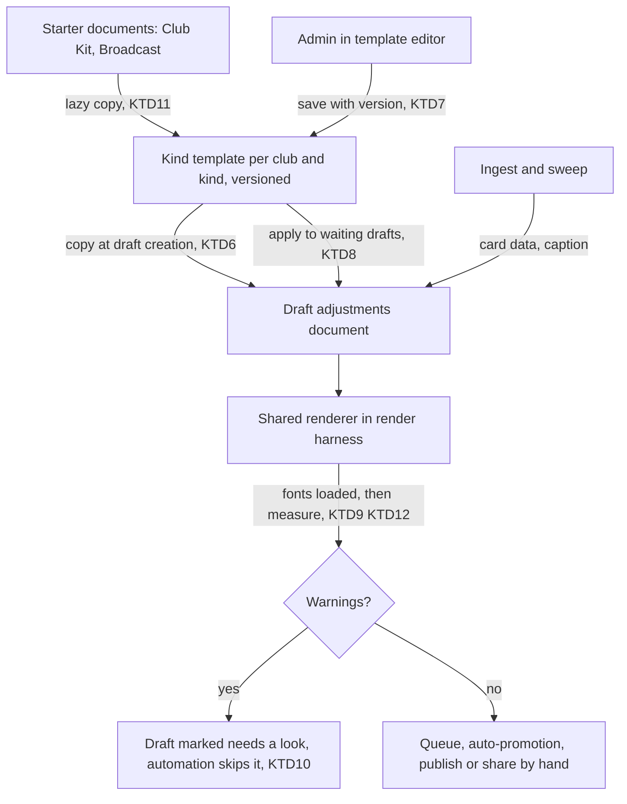
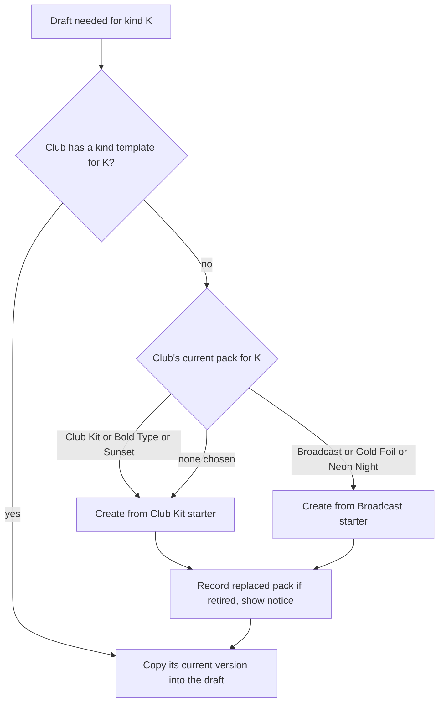

# Card Kind Templates - Plan

## Goal Capsule

- **Objective:** Let a club design each card kind once, Canva-style, and have every automatically drafted card of that kind use the club's design.
- **Product authority:** Ash (owner, Halls Head media officer). Decisions below were made with him on 2026-10-07. The Product Contract governs product behaviour; the Planning Contract governs how it is built. Where they appear to conflict, the Product Contract wins and the conflict is raised, not resolved silently.
- **Execution profile:** Deep, ten units across four phases (model and rendering, storage and starters, automation, editor and Studio surfaces). One release: nothing is switched on for clubs until U6's starters cover all 21 kinds × 4 sizes.
- **Stop conditions:** Stop and ask if a unit would change product behaviour beyond the Product Contract, if juniors isolation or private-player redaction would be weakened, or if the migration cannot be written idempotently.
- **Tail ownership:** Ash runs `lib/db/migrations/0035_kind_templates.sql` in Replit's Production SQL runner before republishing. Starter design (U6 content) is a design task done in the new editor by Ash or a designer.
- **Open blockers:** None.

---

## Product Contract

Product Contract preservation: unchanged, except that the four questions deferred to planning are now answered in the Planning Contract (KTD4, KTD6, KTD9, KTD12) and the retired-pack mapping assumption is answered in KTD11.

### Summary

Every card kind gets one club template made of editable elements: the pack's own parts and anything the admin adds, each movable, resizable, restylable, deletable, layerable and lockable. Text boxes can carry live data fields. Each size is designed on its own canvas. Automated drafts render from the club's template. Club Kit and Broadcast become the two editable starter designs; the other four packs retire.

### Problem Frame

Card designs come from six code-built packs. An admin can hide or override parts of a pack card and lay extra elements on top in the Studio editor, but cannot reformat the pack's own elements: their position, size, font and font size are fixed. Edits apply to one draft only. "Save as template" stores a copy that is never used as the default for its kind, so every automated card arrives in the stock pack design and a club's changes are lost week to week.

The owner wants templates broken into elements the way Canva works, with the freedom to change any part and add text boxes and other elements anywhere. Limited template editing is one of his five complaints about Social Studio.

### Key Decisions

- **One element-based template model for both the editor and automation.** What the admin designs is exactly what automated drafts render. The fixed pack layer and the "layers on top" split go away.
- **Club Kit and Broadcast are the only starter designs.** Picking a starter copies it into the club's template for that kind; the copy is fully editable and has no live link back to the starter. Bold Type, Gold Foil, Neon Night and Sunset retire.
- **One template per card kind.** No alternates and no per-grade variants; automation always uses it.
- **Each size is designed by hand.** Square, portrait, Story and landscape are separate canvases. Adding an element on one size offers to add it to the others; placement on each is the admin's.
- **Live data shrinks, then flags.** A data-filled text box keeps its position and steps its font size down to a minimum; if the text still doesn't fit, the card is marked "needs a look" instead of being cut silently.
- **Lists repeat one styled row.** For results, ladders and leaderboards the admin styles a single row; it repeats for every row that week and spills onto extra carousel slides when the card is full.
- **Saving a template asks before touching waiting drafts.** On save the admin is asked whether to apply the new design to that kind's drafts awaiting review or ready. If yes, all of them change, including drafts that had one-off tweaks. Posted cards never change.
- **Any Google Font, no font upload.**
- **All card kinds ship together.** Both starters are rebuilt for all 21 card kinds and 4 sizes before release.

### Actors

- A1. Club volunteer admin: designs templates and makes one-off tweaks to single drafts.
- A2. Automated drafting: creates drafts that render from the club's template for that kind.

### Key Flows

- F1. Make a kind your own
  - **Trigger:** The admin opens the template for a card kind (e.g. Milestone).
  - **Actors:** A1
  - **Steps:** Choose a starter (Club Kit or Broadcast) if the kind has no template yet. Select any element to move, resize, restyle, delete, layer or lock it. Add text boxes, insert live data fields, add images and shapes. Switch to each other size and arrange it. Save. Answer whether waiting drafts of this kind should take the new design.
  - **Outcome:** Every future draft of that kind renders from this template.
  - **Covered by:** R1–R12, R16
- F2. Weekly automation
  - **Trigger:** The sweep drafts a card after an ingest.
  - **Actors:** A2, A1
  - **Steps:** The draft renders from the club's template for its kind and size; data fields fill in; oversized text shrinks; if it still doesn't fit the draft is marked "needs a look" in the queue.
  - **Covered by:** R9, R13–R15

### Requirements

**Element editing**

- R1. Every visible part of a template, including the starter's own score, names, headings, panels, photo frame and logo, is a selectable element.
- R2. Any element can be moved and resized.
- R3. Any text element's font family, size, weight, colour, alignment and letter spacing can be changed.
- R4. Any element can be deleted, moved forward or back in the layer order, and locked.
- R5. The admin can add text boxes, images (including the club logo and photo-library images), and shapes anywhere on the card.
- R6. Text boxes can include live data fields for the card kind (e.g. player name, runs, opponent, grade, round) alongside typed text.
- R7. Any Google Font can be used.

**Templates per kind and size**

- R8. Each card kind has exactly one club template.
- R9. Each size (square, portrait, Story, landscape) is its own canvas within the template.
- R10. Adding an element on one size offers to add it to the other sizes.
- R11. A kind without a template starts from a copy of Club Kit or Broadcast, chosen by the admin.
- R12. Templates are edited for the card kind directly, not by opening a particular draft.

**Rendering real data**

- R13. Automated drafts of a kind render from the club's template for that kind.
- R14. A text element whose data is too long steps its font size down to a minimum, then marks the card "needs a look" if it still doesn't fit.
- R15. A list element repeats one styled row for each row of data and continues onto additional carousel slides when the card is full.

**Changes and existing content**

- R16. Saving a template asks whether to apply it to that kind's unposted drafts; applying replaces their design, including one-off tweaks.
- R17. A single draft can still be tweaked in the editor without changing the kind's template.
- R18. Posted cards never change when a template changes.
- R19. A club whose current pack for a kind is retired is moved to the closest starter for that kind, and the admin is told.
- R20. The canvas template builder on the Cards tab and the per-draft "Save as template" are retired.

**Rules that must hold**

- R21. Junior cards never show a photo, whatever the template contains.
- R22. Private players' details stay hidden in data fields exactly as they are today.

### Acceptance Examples

- AE1. **Covers R2, R3, R13.** Given the admin moves the player name above the photo and changes it to a 64pt Google Font on the Milestone square canvas, when next week's milestone draft is created, then its square image shows the name in that place, font and size.
- AE2. **Covers R14.** Given a name box sized for "J. SMITH", when the player is "CHRISTOPHER VAN DER MERWE", then the name shrinks to fit; when the name cannot fit even at the minimum size, then the draft is marked "needs a look" in the queue.
- AE3. **Covers R15.** Given a results template with one styled row and room for five rows, when a round has nine results, then the carousel has a second slide carrying the remaining four rows in the same row style.
- AE4. **Covers R16, R17, R18.** Given three waiting Milestone drafts, one with a hand-moved photo, and one posted Milestone card, when the admin saves a new Milestone template and chooses to apply it, then all three waiting drafts take the new design (the hand-moved photo is reset) and the posted card is unchanged.
- AE5. **Covers R9, R10.** Given the admin adds a sponsor logo on the square canvas and accepts "add to other sizes", then the logo appears on the portrait, Story and landscape canvases where the admin can reposition it independently.
- AE6. **Covers R21.** Given a junior results template that contains a photo frame, when a junior card is drafted, then no photo is shown.
- AE7. **Covers R19.** Given a club using Gold Foil for team lists, when Gold Foil retires, then the club's team-list template becomes a copy of the closest starter and the admin sees a notice saying so.

### Scope Boundaries

**Deferred for later**

- Uploading club font files.
- Per-grade or alternate designs for one card kind.
- Packaging changes in the queue and the Posting Plan's Design column (separate plans).

**Outside this work**

- Changing which card kinds exist or what data each kind carries.
- Animation and video design (motion settings carry over unchanged).

**Deferred to Follow-Up Work**

- Deleting the four retired packs' code, once no unposted draft references them (KTD10).
- Removing the `editor` and `background` template endpoints and the `card_layouts` table after their surfaces are retired.
- Collaborative (simultaneous) template editing; this plan only prevents silent overwrites (KTD7).

### Dependencies / Assumptions

- About 168 starter layouts (2 starters × 21 kinds × 4 sizes) must be designed and checked against real data before release.
- Meta carousels allow at most 10 images, which caps how many slides a spilled list can produce.

### Sources / Research

- docs/plans/2026-10-01-001-feat-balanced-card-sets-plan.md: list cards splitting into cover-plus-detail slides.
- Current editor and templates: `artifacts/cricket-club/src/lib/pack-render/adjustments.ts`, `artifacts/cricket-club/src/components/studio-editor/`, `artifacts/cricket-club/src/pages/admin-social-studio.tsx`, `artifacts/cricket-club/src/components/card-template-builder.tsx`, `lib/db/src/schema/social_cards.ts` (card_templates).
- Automated drafting and rendering: `lib/scorecard/src/pack-resolve.ts`, `artifacts/api-server/src/lib/draft-upsert.ts`, `artifacts/api-server/src/lib/draft-render.ts`.
- Packs: `artifacts/cricket-club/src/lib/pack-templates/` (club-kit, broadcast-dark and the four retiring packs).

---

## Planning Contract

### Key Technical Decisions

- KTD1. **A template is the editor's existing layer document on the blank base, not a new renderer.** The blank pack branch (`BLANK_PACK_ID`, `artifacts/cricket-club/src/lib/pack-render/render.ts`) already renders a card made only of free layers, the editor already moves, resizes, rotates, layers and locks any layer, and the render harness mounts the same `PackCard` as the editor. Extending that model gives one renderer for editor, preview and server render, which is the property that caused past drift when broken.
- KTD2. **The document gains four capabilities:** a `photo` layer (the draft photo, with per-size focal point and zoom), a `rows` layer (one styled row of cells bound to a repeat such as `rows`, `matches`, `leaders`, `players`), `{{field}}` tokens inside text content alongside typed text, and per-size presence so an element can exist on some sizes only. Style (font, colour, weight, alignment, letter spacing) stays shared across sizes, matching the current model; font size is a percentage of artboard width, so it scales with each canvas.
- KTD3. **Starters are authored in the new editor, not converted by code.** Club Kit and Broadcast Dark are flowing HTML built by TypeScript functions; mechanical conversion to positioned elements would be lossy. A platform-admin "Export as starter" action in template mode writes the document as JSON into the repo, so the editor is the authoring tool. Existing Club Kit parts in the element registry (`artifacts/cricket-club/src/lib/studio-elements/registry.ts`) are reused as starter elements where they fit.
- KTD4. **The live-field catalogue per kind is Broadcast Dark's field and repeat list.** `pack-lint.test.ts` already enforces Broadcast Dark as the reference field set for every pack, and `bindInput` produces those keys. The catalogue drives the editor's field picker and the starter contract test, and it fixes the blank-base gap where `packTextFields` returns nothing.
- KTD5. **Templates live in `card_templates` with `source = 'kind'`, one per tenant per kind.** `defaultForKinds` holds the single kind and `clearDefaultKinds` keeps it exclusive; a partial unique index on (tenant, base kind) where `source = 'kind'` makes lazy creation race-safe (insert-or-ignore). No new table.
- KTD6. **Each draft holds its own copy of its kind's template, made at draft creation.** The copy lives in `social_drafts.adjustments` with `packId = blank`, so per-draft tweaks (R17), revisions and the existing render path work unchanged. A data refresh on re-ingest updates card data and caption only and never re-copies the document; only "apply template" replaces it. This answers how the per-draft editor carries over.
- KTD7. **Template saves are versioned.** Each save sends the version it was based on; a stale version is rejected with a "someone else changed this template" message rather than overwriting. Applying to drafts copies a specific saved version.
- KTD8. **"Apply to waiting drafts" is one server action over a status-checked set.** It snapshots each affected draft into `social_draft_revisions` first, re-reads status inside the transaction so a draft posted meanwhile is skipped (R18), converts pack-based legacy drafts to the template document, and reports how many drafts changed and were skipped.
- KTD9. **Shrink-to-fit is measured in the browser renderer; the floor is 60% of the designed size for every text element.** After fonts load, an overflowing text element steps its font size down to `MIN_FIT` (0.6, from `name-fit.ts`); if it still overflows, the render reports a warning naming the element and size. Measuring the real layout replaces the character-count estimate `fitFor` uses for pack templates, which cannot see custom boxes and fonts.
- KTD10. **"Needs a look" is persisted on the draft and blocks automation.** Server render stores layout warnings on the draft; a draft with warnings is skipped by auto-promotion and auto-publish, shows a reason in the queue, and clears when a re-render produces no warnings. An admin can still mark it ready by hand. This answers whether the mark blocks or only warns.
- KTD11. **Templates are created lazily from the club's current pack choice.** The first time a kind's template is needed (a sweep drafts it, or an admin opens it), it is copied from the starter the club's current pack maps to: Club Kit → Club Kit, Broadcast Dark → Broadcast, Gold Foil and Neon Night (dark grounds) → Broadcast, Bold Type and Sunset (light grounds) → Club Kit. A template created from a retired pack records which pack it replaced, and the Studio shows that notice until dismissed. Pack-based legacy drafts keep rendering with their pack until applied or posted, so the retired packs' code stays until a follow-up removes it.
- KTD12. **Any Google Font, from a committed catalogue snapshot.** The picker searches a JSON snapshot of Google Fonts family names regenerated by a script, so no runtime API key is needed. Renders load only the families a document uses, through the Google Fonts CSS API, and the harness explicitly loads each family before measuring. A family that fails to load falls back to the template's fallback stack and adds a "needs a look" warning, so a server image never silently differs from the preview.
- KTD13. **List spill uses the template's row capacity.** A `rows` layer's capacity per size is how many rows fit its box at its row height. The set planner (`lib/scorecard/src/card-sets.ts`) splits rows evenly by that capacity instead of `SET_CAPS` for templated drafts, every slide renders the same template with its slice of rows, and more than 10 slides adds a "needs a look" warning (rows past slide 10 are not posted). The existing cover-plus-detail behaviour applies only to legacy pack drafts.
- KTD14. **Juniors and private players are enforced at render, not in the template.** For a junior slide the renderer drops `photo` layers and any image bound to a player photo, whatever the document contains, and junior rows keep printing first name and initial. Token substitution reads the same redacted values the packs use today, so a free text box cannot reintroduce a private player's details.
- KTD15. **Empty data and empty sizes have fixed rules.** A field with no value renders empty and an element whose only content is empty fields is not drawn. A size with no elements cannot be saved. Removing the element for a kind's key field (e.g. the score on a result card) is allowed but warned in the editor.
- KTD16. **"Add to other sizes" places the element proportionally.** The new element takes the same position and size as fractions of each canvas, clamped inside it, as one undo step. If the element already exists on a size it is left alone there.
- KTD17. **The template editor previews real and stress data.** Preview uses the kind's most recent real draft data when one exists, otherwise a canned sample per kind; a "stress test" toggle swaps in a long name, empty optional fields and a nine-row list so overflow and spill show before saving.

### High-Level Technical Design

Data flow from template to posted image:



How a draft finds its design:



Template document shape, as directional guidance rather than an implementation specification:

```text
KindTemplateDocument
  sizes: which of square, portrait, story, landscape have elements
  layers: ordered list (back to front) of
    common: id, kind, sizes present, geometry per size {x, y, w, h, rotate}, locked, hidden, group
    text:    content with {{field}} tokens, style {font family, size %, weight, colour, align, letter spacing}
    photo:   photo slot, focal point and zoom per size
    rows:    repeat key, row height, gap, cells [{field, x, w, style}]
    image | shape | element (registry element with props)
  sponsorLock
```

### Assumptions

- The Chromium render harness can reach the Google Fonts CSS API in every environment where drafts render; KTD12's fallback warning covers a failure.
- Retired-pack drafts age out of the queue within weeks, so keeping the retired packs' code for them is short-lived.

### Sequencing

Phase A (model and rendering): U1, U2, U3, U4. Phase B (storage and starters): U5, U6, U10. Phase C (automation): U7. Phase D (surfaces): U8, U9. U6's starter content needs U8's editor to author it, so U6 is split: contract and loader first, content after U8. Nothing is switched on for clubs until U6's contract test passes for all 21 kinds × 4 sizes and both starters.

---

## Implementation Units

| U-ID | Title | Key files | Depends on |
|---|---|---|---|
| U1 | Template document model and layer rendering | `artifacts/cricket-club/src/lib/pack-render/adjustments.ts` | — |
| U2 | Shrink-to-fit and layout warnings | `artifacts/cricket-club/src/lib/pack-render/layer-fit.ts` | U1 |
| U3 | Live-field catalogue and preview samples | `artifacts/cricket-club/src/lib/kind-templates/fields.ts` | U1 |
| U4 | Google Fonts catalogue and loading | `artifacts/cricket-club/src/lib/card-fonts.ts` | U1 |
| U5 | Storage, migration and API | `lib/db/src/schema/social_cards.ts`, `artifacts/api-server/src/routes/kind-templates.ts` | U1 |
| U6 | Starter library and contract | `lib/scorecard/src/kind-templates/` | U1, U3, U5, U8 (content) |
| U7 | Automated drafts use kind templates | `artifacts/api-server/src/lib/kind-templates.ts`, `draft-upsert.ts`, `draft-render.ts` | U2, U5, U6 |
| U8 | Template editor mode | `artifacts/cricket-club/src/pages/admin-kind-template-editor.tsx` | U1–U5 |
| U9 | Studio surfaces and retirements | `artifacts/cricket-club/src/pages/admin-social-studio.tsx` | U5, U7, U8 |
| U10 | Leak and parity guards for templates | `artifacts/cricket-club/src/lib/kind-templates/*.test.ts` | U1, U3, U6 |

### U1. Template document model and layer rendering

**Goal:** Extend the editor's layer document so a whole card can be described and rendered as layers on the blank base.

**Requirements:** R1–R6, R9, R21, R22; KTD1, KTD2, KTD14, KTD15

**Dependencies:** None

**Files:**
- Modify: `artifacts/cricket-club/src/lib/pack-render/adjustments.ts` (layer kinds, per-size presence, token substitution, render branches)
- Modify: `artifacts/cricket-club/src/lib/pack-render/render.ts` (blank branch passes images, photo and rows context)
- Modify: `artifacts/cricket-club/src/lib/pack-render/types.ts`
- Create: `artifacts/cricket-club/src/lib/kind-templates/document.ts` (document helpers: sizes present, layers for a size, add-to-sizes placement)
- Test: `artifacts/cricket-club/src/lib/pack-render/adjustments.test.ts`, `artifacts/cricket-club/src/lib/kind-templates/document.test.ts`

**Approach:**
- Add `photo` and `rows` layer kinds and an optional per-layer set of sizes; a layer with no set is on every size (keeps existing drafts valid).
- Text content resolves `{{key}}` tokens from the same `values` map `bind` uses, escaped; `bind` keeps working for existing layers.
- The `rows` layer renders one row per entry of `ctx.rows[repeat]`, positioning cells inside each row by fraction of the layer width, honouring a row `variant` the way `expandRepeats` does.
- The `photo` layer draws `data.photoUrl` with the per-size focal point and zoom; it renders nothing when there is no photo or the slide is junior.
- Elements whose content resolves to empty are not drawn (KTD15).
- Keep pack-based drafts byte-identical: none of these branches run unless the new kinds or tokens are present.

**Patterns to follow:** `renderFreeLayers` and `layerInner` in `adjustments.ts`; `liveRows` in `artifacts/cricket-club/src/lib/studio-elements/registry.ts`; `expandRepeats` in `artifacts/cricket-club/src/lib/pack-render/html-utils.ts`.

**Test scenarios:**
- Happy path: a text layer with content `"{{playerName}} – {{runs}}*"` renders the bound values with the typed punctuation.
- Happy path: a `rows` layer bound to `rows` with three cells renders one row per ladder entry with cells at their fractional positions; a `club` variant row picks its variant style.
- Happy path: a layer present only on `square` renders on square and is absent on story.
- Edge case: a token whose value is empty renders empty; a layer containing only empty tokens is not drawn.
- Edge case: a token value containing `<script>` renders escaped.
- Covers AE6. A junior slide with a `photo` layer and a player-photo `image` layer renders neither.
- Edge case: a private player's value resolves to the same redacted text the packs show today.
- Integration: an existing pack draft with legacy free layers renders byte-identical before and after this unit.

**Verification:** A card described entirely by layers renders the same in the editor preview and the render harness, and existing drafts are unchanged.

### U2. Shrink-to-fit and layout warnings

**Goal:** Text that does not fit shrinks to the floor, then the render reports a warning that the editor shows and the server stores.

**Requirements:** R14; KTD9, KTD12, KTD13

**Dependencies:** U1

**Files:**
- Create: `artifacts/cricket-club/src/lib/pack-render/layer-fit.ts`
- Modify: `artifacts/cricket-club/src/pages/card-render-harness.tsx` (run fit after fonts and images load; return warnings with the still)
- Modify: `artifacts/api-server/src/lib/card-video-renderer.ts` (carry warnings back from `renderStill`)
- Test: `artifacts/cricket-club/src/lib/pack-render/layer-fit.test.ts`, `artifacts/api-server/src/lib/card-video-renderer.test.ts`

**Approach:**
- After fonts load, measure each text layer's content against its box; step the font size down in small increments to 60% of its designed size; if it still overflows, keep the floor size and record `{ layerId, size, reason: "overflow" }`.
- Font-load failures and slide counts over 10 add warnings of their own reasons.
- The harness returns warnings alongside the image; the editor runs the same function live.

**Patterns to follow:** `MIN_FIT` and `fitFor` in `artifacts/cricket-club/src/lib/pack-render/name-fit.ts`; `mountPack` and `waitForImages` in `card-render-harness.tsx`.

**Test scenarios:**
- Covers AE2. A box sized for "J. SMITH" renders "CHRISTOPHER VAN DER MERWE" smaller with no warning.
- Covers AE2. A name too long even at 60% produces one overflow warning naming the layer and size.
- Edge case: text that fits produces no font change and no warning.
- Error path: a font that fails to load produces a font warning and the card still renders with the fallback stack.
- Integration: the server renderer returns the harness's warnings with the still (behind the existing smoke-test switch).

**Verification:** Overflowing text never renders cut off silently; every overflow appears as a warning.

### U3. Live-field catalogue and preview samples

**Goal:** Each kind exposes its live fields to the editor, and the template editor has real-looking sample data, including stress samples.

**Requirements:** R6, R12; KTD4, KTD17

**Dependencies:** U1

**Files:**
- Create: `artifacts/cricket-club/src/lib/kind-templates/fields.ts` (field and repeat catalogue per kind, labels for the picker)
- Create: `artifacts/cricket-club/src/lib/kind-templates/samples.ts` (sample input per kind plus stress variant)
- Modify: `artifacts/cricket-club/src/lib/pack-render/render.ts` (`packTextFields` on the blank base reads the catalogue)
- Test: `artifacts/cricket-club/src/lib/kind-templates/fields.test.ts`

**Approach:**
- Derive the catalogue from Broadcast Dark's design fields and repeats via `resolveTemplate`, with human labels.
- Samples reuse each kind's existing sample input; the stress variant swaps in a long name, blanks optional fields and makes lists nine rows.

**Patterns to follow:** `resolveTemplate` in `artifacts/cricket-club/src/lib/pack-render/templates.ts`; field parity checks in `artifacts/cricket-club/src/lib/pack-templates/pack-lint.test.ts`.

**Test scenarios:**
- Happy path: every one of the 21 kinds returns a non-empty field list, and every key is one `bindInput` produces for that kind.
- Happy path: list kinds expose their repeat key and row cell fields.
- Edge case: the stress sample for a list kind has nine rows and a name longer than 25 characters.
- Integration: the Live stats picker on a blank-base draft lists the kind's fields (previously empty).

**Verification:** The editor can insert any of a kind's data fields, and template mode has something to preview for every kind.

### U4. Google Fonts catalogue and loading

**Goal:** Any Google Font can be picked and renders identically in the editor and on the server.

**Requirements:** R3, R7; KTD12

**Dependencies:** U1

**Files:**
- Create: `artifacts/cricket-club/src/lib/google-fonts-catalogue.json`
- Create: `scripts/src/build-google-fonts-catalogue.ts`
- Modify: `artifacts/cricket-club/src/lib/card-fonts.ts` (load the families a document uses; explicit `document.fonts.load` per family)
- Modify: `artifacts/cricket-club/src/pages/card-render-harness.tsx`
- Test: `artifacts/cricket-club/src/lib/card-fonts.test.ts`

**Approach:**
- The script writes family names and available weights; commit its output.
- A loader collects families from a document's text styles, requests them from the Google Fonts CSS API with only the weights used, and resolves after each family loads or fails.
- Existing curated fonts keep loading as today so legacy drafts are unchanged.

**Patterns to follow:** `ensureCardFontsLoaded` in `artifacts/cricket-club/src/lib/card-fonts.ts`; the explicit-load lesson in `.agents/memory/canvas-share-card-fonts.md`.

**Test scenarios:**
- Happy path: a document using two families requests both, with only the weights in use.
- Edge case: a family with spaces in its name is requested correctly encoded.
- Error path: a load failure resolves and reports the failed family instead of hanging.
- Edge case: a document using no custom families makes no extra request.

**Verification:** A template using a non-curated Google Font renders that font in the server image.

### U5. Storage, migration and API

**Goal:** Store one versioned template per club and kind, expose it through the API, and apply a template to waiting drafts safely.

**Requirements:** R8, R11, R16, R18, R19; KTD5, KTD7, KTD8, KTD10, KTD11

**Dependencies:** U1

**Files:**
- Modify: `lib/db/src/schema/social_cards.ts` (`card_templates`: version, replaced pack, notice dismissed; partial unique index; `social_drafts`: layout warnings, template version)
- Create: `lib/db/migrations/0035_kind_templates.sql` and its `meta` snapshot and journal entry
- Modify: `lib/api-spec/openapi.yaml` (kind template schemas and paths), then regenerate clients
- Create: `artifacts/api-server/src/routes/kind-templates.ts`
- Create: `artifacts/api-server/src/lib/kind-templates.ts` (get-or-create, save with version check, apply to drafts)
- Test: `artifacts/api-server/src/routes/kind-templates.test.ts`, `artifacts/api-server/src/lib/kind-templates.test.ts`

**Approach:**
- Endpoints: list kind templates (kind, version, updated, replaced-pack notice), get one kind's template (creating it lazily), save with base version, start from a starter, dismiss notice, and apply a version to waiting drafts (returns changed and skipped counts).
- Lazy creation uses insert-or-ignore on the partial unique index, then reads back the row.
- Apply runs in one transaction: select unposted drafts of the kind, snapshot each into revisions, re-check status per row, write the copied document with `packId = blank`, clear `editedAt`, and clear stale warnings so the next render recomputes them.
- Migration is idempotent (`IF NOT EXISTS`), following `0012_card_template_adjustments.sql`.

**Patterns to follow:** `clearDefaultKinds` in `artifacts/api-server/src/lib/social-cards-helpers.ts`; revision snapshots in `artifacts/api-server/src/lib/draft-revisions.ts`; route test style in `artifacts/api-server/src/routes/social-drafts-edit.test.ts`.

**Test scenarios:**
- Happy path: getting a kind with no template creates one from the mapped starter and returns version 1.
- Edge case: two concurrent gets for the same kind create exactly one row.
- Error path: saving with a stale version returns a conflict and leaves the stored template unchanged.
- Covers AE4. Applying to three waiting drafts (one hand-tweaked) replaces all three documents and snapshots each into revisions; the posted draft is untouched.
- Edge case: a draft that becomes posted between listing and applying is skipped and counted as skipped.
- Covers AE7. A club whose team-list pack is Gold Foil gets a Broadcast-based template with a replaced-pack notice; dismissing clears it.
- Error path: another tenant's kind template is never readable or writable (tenant isolation).
- Integration: the migration applies twice without error on a database already at 0034.

**Verification:** Templates persist per club and kind, concurrent editors cannot overwrite each other silently, and applying is reversible per draft through revisions.

### U6. Starter library and contract

**Goal:** Ship Club Kit and Broadcast starter documents for all 21 kinds and 4 sizes, readable by both web and server, with a contract test that keeps them complete.

**Requirements:** R1, R9, R11, R19; KTD3, KTD11

**Dependencies:** U1, U3, U5; content authoring depends on U8

**Files:**
- Create: `lib/scorecard/src/kind-templates/starters.ts` (loader and the pack-to-starter map)
- Create: `lib/scorecard/src/kind-templates/starters/club-kit/<kind>.json`, `lib/scorecard/src/kind-templates/starters/broadcast/<kind>.json`
- Modify: `artifacts/cricket-club/src/pages/admin-kind-template-editor.tsx` (platform-admin "Export as starter")
- Test: `lib/scorecard/src/kind-templates/starters.test.ts`

**Approach:**
- Starter documents use the U1 document shape; the map sends retired packs to a starter per KTD11.
- "Export as starter" is visible to platform admins only and downloads the current document as the starter JSON for that kind; committing it is a normal code change.
- Author by opening each kind in template mode on a stock club, rebuilding the pack's look with layers and registry elements, checking stress samples, and exporting.

**Execution note:** Land the loader, map and contract test first with the test expecting full coverage but skipped for missing files; author content after U8 and remove the skip when coverage is complete.

**Patterns to follow:** Club Kit parts already registered as elements in `artifacts/cricket-club/src/lib/studio-elements/registry.ts`; `skeleton-contract.ts` in `artifacts/cricket-club/src/lib/pack-templates/`.

**Test scenarios:**
- Happy path: both starters have a document for every one of the 21 kinds, and each document has elements on all four sizes.
- Edge case: every `{{field}}` token, `bind` key and `rows` repeat in a starter exists in that kind's field catalogue.
- Edge case: no starter contains a club-identity literal (e.g. "HALLS HEAD", sample hashtags) or a hard-coded photo URL.
- Happy path: every retired pack id maps to a starter.

**Verification:** The contract test passes with no skips for both starters across all kinds and sizes.

### U7. Automated drafts use kind templates

**Goal:** The sweep and ad-hoc creation copy the club's kind template into each new draft, server renders record warnings, and automation respects them.

**Requirements:** R13–R15, R17, R18, R21; KTD6, KTD10, KTD11, KTD13, KTD14

**Dependencies:** U2, U5, U6

**Files:**
- Modify: `artifacts/api-server/src/lib/draft-upsert.ts` (new drafts: blank base plus template copy and version; refresh keeps the document)
- Modify: `artifacts/api-server/src/lib/draft-enrich.ts` (stop resolving packs for templated kinds)
- Modify: `artifacts/api-server/src/lib/draft-render.ts` (store warnings; slide planning from template capacity)
- Modify: `lib/scorecard/src/card-sets.ts` (capacity-driven split for templated drafts; over-10 detection)
- Modify: `artifacts/api-server/src/lib/draft-sweep.ts` and `artifacts/api-server/src/lib/publishing/auto-publish.ts` (skip drafts with warnings)
- Modify: `artifacts/api-server/src/routes/social-drafts.ts` (ad-hoc drafts start from the kind template)
- Test: `artifacts/api-server/src/lib/draft-upsert.test.ts`, `artifacts/api-server/src/lib/draft-render.test.ts`, `lib/scorecard/src/card-sets.test.ts`, `artifacts/api-server/src/lib/publishing/auto-publish.test.ts`

**Approach:**
- New drafts call get-or-create for the kind and copy that version's document.
- Re-ingest refresh updates card data and caption as today and leaves the document alone.
- After each server render, write the harness warnings to the draft; an empty list clears it.
- Auto-promotion and auto-publish exclude drafts with warnings.
- For templated list drafts, the planner reads the `rows` layer capacity for the size and splits evenly; slide 11 onward is dropped from posting and flagged.

**Patterns to follow:** the existing insert and refresh paths in `draft-upsert.ts`; the injectable still renderer in `draft-render.ts` for tests; `planCardSet` and `evenSizes` in `card-sets.ts`.

**Test scenarios:**
- Covers AE1. A milestone drafted after the template was edited carries that template version's document.
- Happy path: a re-ingest refresh of an untouched draft updates the score and keeps the document.
- Covers AE3. A results template with capacity five and nine results plans two slides of five and four.
- Edge case: 55 rows at capacity five plans 10 slides and adds an over-10 warning.
- Integration: a server render returning an overflow warning stores it, and auto-promotion and auto-publish both skip that draft.
- Integration: a later render with no warnings clears the mark and the draft becomes eligible again.
- Covers AE6. A junior list draft renders with no photo and first-name-initial rows.
- Edge case: a legacy pack draft still renders with its pack and is not converted by refresh.

**Verification:** Every newly drafted card renders from its club's template, and no flagged card reaches auto-post or auto-publish.

### U8. Template editor mode

**Goal:** Admins edit a kind's template directly, Canva-style, with every element selectable, any font, field tokens, the rows element, size canvases and save-then-apply.

**Requirements:** R1–R12, R16; KTD7, KTD15, KTD16, KTD17

**Dependencies:** U1–U5

**Files:**
- Create: `artifacts/cricket-club/src/pages/admin-kind-template-editor.tsx` (route `/admin/social/templates/:kind`)
- Modify: `artifacts/cricket-club/src/App.tsx` (route)
- Modify: `artifacts/cricket-club/src/components/studio-editor/toolbar.tsx` (text style controls including letter spacing for every text layer)
- Modify: `artifacts/cricket-club/src/components/studio-editor/content-panels.tsx` (field token insert; font picker search)
- Create: `artifacts/cricket-club/src/components/studio-editor/rows-panel.tsx`
- Create: `artifacts/cricket-club/src/components/studio-editor/apply-template-dialog.tsx`
- Modify: `artifacts/cricket-club/src/components/studio-editor/document.ts` (add-to-other-sizes, per-size presence)
- Test: `artifacts/cricket-club/src/components/studio-editor/__tests__/template-mode.test.tsx`, `artifacts/cricket-club/src/components/studio-editor/__tests__/editor-core.test.ts`

**Approach:**
- Reuse the editor shell, canvas, layers drawer and history; template mode loads and saves the kind template instead of a draft.
- First open of a kind without a template shows a starter choice (Club Kit or Broadcast).
- Size tabs switch canvases; adding an element prompts "Add to other sizes?" and places it per KTD16 as one undo step.
- Preview data comes from the latest real draft of the kind or the sample, with a stress toggle; warnings from U2 show inline on the canvas.
- Save sends the base version; on conflict, show who-changed messaging and offer reload. After save, the apply dialog lists the count of waiting drafts and applies on confirm, reporting changed and skipped counts. Saving resets undo history.
- Saving is blocked when a size has no elements; removing a kind's key field shows a warning.

**Patterns to follow:** `artifacts/cricket-club/src/pages/admin-studio-editor.tsx`; editor tests in `artifacts/cricket-club/src/components/studio-editor/__tests__/`.

**Test scenarios:**
- Covers AE5. Adding a logo on square and accepting "add to other sizes" creates it on the other three sizes at proportional positions; undo removes all four.
- Happy path: changing a text layer's font, size, weight, colour, alignment and letter spacing persists through save and reload.
- Happy path: inserting a `{{runs}}` field into a text box renders the sample value.
- Edge case: saving with an empty Story canvas is blocked with a message naming the size.
- Error path: saving after another admin saved shows the conflict message and does not overwrite.
- Covers AE4. Confirming the apply dialog calls apply with the saved version and shows the changed and skipped counts.
- Edge case: the stress toggle shows the overflow warning on a narrow name box.

**Verification:** An admin can make, save and apply a full template for a kind without opening a draft.

### U9. Studio surfaces and retirements

**Goal:** The Studio lists every kind's template, shows notices and "needs a look", and the retired design surfaces are gone.

**Requirements:** R12, R14, R19, R20; KTD10, KTD11

**Dependencies:** U5, U7, U8

**Files:**
- Modify: `artifacts/cricket-club/src/pages/admin-social-studio.tsx` (Templates section: one row per kind with thumbnail, starter origin, Edit; replaces `PackPerTypeSection` and colour modes)
- Modify: `artifacts/cricket-club/src/pages/admin-social.tsx` (remove `TemplatesCard`)
- Modify: `artifacts/cricket-club/src/pages/admin-studio-editor.tsx` (remove `SaveTemplateButton`)
- Modify: `artifacts/cricket-club/src/components/social-studio/editor-starters.tsx` (remove the saved-template list)
- Modify: `artifacts/cricket-club/src/pages/admin-social-queue.tsx` and `artifacts/cricket-club/src/components/social-queue/draft-drawer.tsx` ("Needs a look" badge, reason and element)
- Test: `artifacts/cricket-club/src/pages/__tests__/admin-social-studio-templates.test.tsx`, `artifacts/cricket-club/src/components/social-queue/__tests__/needs-a-look.test.tsx`

**Approach:**
- The Templates section reads the kind template list; a replaced-pack notice shows on affected kinds with a dismiss action.
- The queue badge reads draft warnings and links to the editor.
- Retire UI only; the old endpoints stay until the follow-up.

**Patterns to follow:** existing Studio section cards in `admin-social-studio.tsx`; queue filters and drawer in `components/social-queue/`.

**Test scenarios:**
- Happy path: the Templates section lists all 21 kinds with their starter origin and an Edit link.
- Covers AE7. A kind created from Gold Foil shows the replaced-pack notice; dismissing hides it.
- Covers AE2. A draft with an overflow warning shows "Needs a look" with the reason in the queue and drawer.
- Happy path: the Cards tab no longer shows the canvas template builder, and the editor no longer shows Save as template.

**Verification:** No surface still offers pack choice, colour modes, background templates or saved editor templates.

### U10. Leak and parity guards for templates

**Goal:** The safeguards that stop sample text and missing tenant data reaching real cards also cover templates, before any pack is retired.

**Requirements:** R13, R21, R22; KTD1, KTD14

**Dependencies:** U1, U3, U6

**Files:**
- Create: `artifacts/cricket-club/src/lib/kind-templates/template-lint.test.ts`
- Modify: `artifacts/cricket-club/src/lib/pack-card-mounts.test.ts` (template mounts must pass tenant data)
- Create: `scripts/src/render-starter-proofs.ts` (renders every starter × kind × size with sample, stress and junior data to PNGs for review)

**Approach:**
- Template lint renders each starter document with a non-Halls-Head tenant and asserts no sample literal, no unresolved `{{` token and no photo on junior slides.
- The proof script writes images under `scripts/exports/` (git-ignored) for a human contact-sheet review.

**Patterns to follow:** `artifacts/cricket-club/src/lib/pack-templates/pack-lint.test.ts`; `artifacts/api-server/src/lib/pack-coverage-parity.test.ts`; the "render a real PNG" learning in the pack renderer memory.

**Test scenarios:**
- Happy path: every starter document renders for a second tenant with that tenant's name and no "HALLS HEAD" text.
- Edge case: a starter with a misspelled field token fails lint naming the kind, size and token.
- Covers AE6. Every starter's junior render contains no photo.

**Verification:** Template lint passes for both starters, and the proof script produces a full contact sheet with no visibly broken cards.

---

## Verification Contract

| Gate | Command or check | Applies to |
|---|---|---|
| Codegen | `pnpm --filter @workspace/api-spec run codegen` after OpenAPI edits; no hand edits to generated files | U5 |
| Typecheck | `pnpm run typecheck` | All |
| Web tests | `pnpm --filter @workspace/cricket-club run test` (on Windows: `NODE_ENV=test ./node_modules/.bin/vitest run` from `artifacts/cricket-club`) | U1–U4, U8–U10 |
| API tests | `pnpm --filter @workspace/api-server run test` | U5, U7 |
| Library tests | `pnpm run test:libs` | U6, U7 |
| Lint and format | `pnpm run lint`; `npx -y prettier@3.9.6 --check .` | All |
| Migration | `0035_kind_templates.sql` applies twice cleanly; drizzle generate produces nothing new | U5 |
| Real render | `scripts/src/render-starter-proofs.ts` contact sheet reviewed for both starters, all kinds and sizes, with sample, stress and junior data | U6, U10 |
| Server render smoke | the render harness smoke test with a non-curated Google Font and an overflow case | U2, U4, U7 |

---

## Definition of Done

- Every requirement R1–R22 and acceptance example AE1–AE7 is covered by a passing test or the reviewed contact sheet.
- Both starters cover all 21 kinds × 4 sizes and pass the contract test and template lint with no skips.
- Newly drafted cards for every kind render from the club's kind template; drafts with layout warnings never auto-post or auto-publish.
- Legacy pack drafts still render, and posted cards are unchanged by any template action.
- The retired design surfaces are gone from the UI.
- `0035_kind_templates.sql` is idempotent, and its SQL is handed to Ash for the Production SQL runner.
- All Verification Contract gates pass.
- No abandoned-attempt or experimental code remains in the diff.
